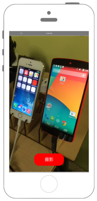

# カメラの起動と画像の保存



## Swift 3.0

```swift
```

## Swift 2.3

```swift
```

## 2.xと3.xの差分

## Reference

* AV Foundation Framework
    * https://developer.apple.com/library/ios/documentation/AVFoundation/Reference/AVFoundationFramework/
