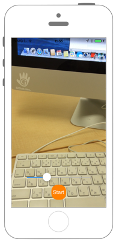

# 動画の再生



## Swift 3.0

```swift
//
//  ViewController.swift
//  avfoundation006
//
//  Created by akimach on 2016/08/28.
//  Copyright © 2016年 akimacho. All rights reserved.
//

import UIKit
import AVFoundation
import CoreMedia


// MARK:- レイヤーをAVPlayerLayerにする為のラッパークラス.

class AVPlayerView: UIView {
    
    required init(coder aDecoder: NSCoder) {
        super.init(coder: aDecoder)!
    }
    
    override init(frame: CGRect) {
        super.init(frame: frame)
    }
    
    override class var layerClass: AnyClass {
        return AVPlayerLayer.self
    }
}


class ViewController: UIViewController {
    
    // 再生用のアイテム.
    var playerItem : AVPlayerItem!
    
    // AVPlayer.
    var videoPlayer : AVPlayer!
    
    // シークバー.
    var seekBar : UISlider!
    
    override func viewDidLoad() {
        
        // パスからassetを生成.
        let path = Bundle.main.path(forResource: "test", ofType: "mov")
        let fileURL = URL(fileURLWithPath: path!)
        let avAsset = AVURLAsset(url: fileURL)
        
        // AVPlayerに再生させるアイテムを生成.
        playerItem = AVPlayerItem(asset: avAsset)
        
        // AVPlayerを生成.
        videoPlayer = AVPlayer(playerItem: playerItem)
        
        // Viewを生成.
        let videoPlayerView = AVPlayerView(frame:  self.view.bounds)
        
        // UIViewのレイヤーをAVPlayerLayerにする.
        let layer = videoPlayerView.layer as! AVPlayerLayer
        layer.videoGravity = AVLayerVideoGravityResizeAspect
        layer.player = videoPlayer
        
        // レイヤーを追加する.
        self.view.layer.addSublayer(layer)
        
        // 動画のシークバーとなるUISliderを生成.
        seekBar = UISlider(frame: CGRect(x: 0, y: 0, width: self.view.bounds.maxX - 100, height: 50))
        seekBar.layer.position = CGPoint(x: self.view.bounds.midX, y: self.view.bounds.maxY - 100)
        seekBar.minimumValue = 0
        seekBar.maximumValue = Float(CMTimeGetSeconds(avAsset.duration))
        seekBar.addTarget(self, action: #selector(onSliderValueChange(sender:)), for: UIControlEvents.valueChanged)
        self.view.addSubview(seekBar)
        
        /*
         シークバーを動画とシンクロさせる為の処理.
         */
        
        // 0.5分割で動かす事が出来る様にインターバルを指定.
        let interval : Double = Double(0.5 * seekBar.maximumValue) / Double(seekBar.bounds.maxX)
        
        // CMTimeに変換する.
        let time : CMTime = CMTimeMakeWithSeconds(interval, Int32(NSEC_PER_SEC))
        
        // time毎に呼び出される.
        videoPlayer.addPeriodicTimeObserver(forInterval: time, queue: nil, using: {time in
            // 総再生時間を取得.
            let duration = CMTimeGetSeconds(self.videoPlayer.currentItem!.duration)
            
            // 現在の時間を取得.
            let time = CMTimeGetSeconds(self.videoPlayer.currentTime())
            
            // シークバーの位置を変更.
            let value = Float(self.seekBar.maximumValue - self.seekBar.minimumValue) * Float(time) / Float(duration) + Float(self.seekBar.minimumValue)
            self.seekBar.value = value
        })

        // 動画の再生ボタンを生成.
        let startButton = UIButton(frame: CGRect(x: 0, y: 0, width: 50, height: 50))
        startButton.layer.position = CGPoint(x: self.view.bounds.midX, y: self.view.bounds.maxY - 50)
        startButton.layer.masksToBounds = true
        startButton.layer.cornerRadius = 20.0
        startButton.backgroundColor = UIColor.orange
        startButton.setTitle("Start", for: UIControlState.normal)
        startButton.addTarget(self, action: #selector(onButtonClick(sender:)), for: UIControlEvents.touchUpInside)
        self.view.addSubview(startButton)
    }
    
    // 再生ボタンが押された時に呼ばれるメソッド.
    func onButtonClick(sender : UIButton){

        // 再生時間を最初に戻して再生.
        videoPlayer.seek(to: CMTimeMakeWithSeconds(0, Int32(NSEC_PER_SEC)))
        videoPlayer.play()
    }
    
    // シークバーの値が変わった時に呼ばれるメソッド.
    func onSliderValueChange(sender : UISlider){

        // 動画の再生時間をシークバーとシンクロさせる.
        videoPlayer.seek(to: CMTimeMakeWithSeconds(Float64(seekBar.value), Int32(NSEC_PER_SEC)))
    }
}
```

## Swift 2.3

```swift
//
//  ViewController.swift
//  avfoundation006
//
//  Created by akimach on 2016/08/28.
//  Copyright © 2016年 akimacho. All rights reserved.
//

import UIKit
import AVFoundation
import CoreMedia


// MARK:- レイヤーをAVPlayerLayerにする為のラッパークラス.

class AVPlayerView: UIView {
    
    required init(coder aDecoder: NSCoder) {
        super.init(coder: aDecoder)!
    }
    
    override init(frame: CGRect) {
        super.init(frame: frame)
    }
    
    override class func layerClass() -> AnyClass {
        return AVPlayerLayer.self
    }
}


class ViewController: UIViewController {
    
    // 再生用のアイテム.
    var playerItem : AVPlayerItem!
    
    // AVPlayer.
    var videoPlayer : AVPlayer!
    
    // シークバー.
    var seekBar : UISlider!
    
    override func viewDidLoad() {
        
        // パスからassetを生成.
        let path = NSBundle.mainBundle().pathForResource("test", ofType: "mov")
        let fileURL = NSURL(fileURLWithPath: path!)
        let avAsset = AVURLAsset(URL: fileURL)
        
        // AVPlayerに再生させるアイテムを生成.
        playerItem = AVPlayerItem(asset: avAsset)
        
        // AVPlayerを生成.
        videoPlayer = AVPlayer(playerItem: playerItem)
        
        // Viewを生成.
        let videoPlayerView = AVPlayerView(frame:  self.view.bounds)
        
        // UIViewのレイヤーをAVPlayerLayerにする.
        let layer = videoPlayerView.layer as! AVPlayerLayer
        layer.videoGravity = AVLayerVideoGravityResizeAspect
        layer.player = videoPlayer
        
        // レイヤーを追加する.
        self.view.layer.addSublayer(layer)
        
        // 動画のシークバーとなるUISliderを生成.
        seekBar = UISlider(frame: CGRectMake(0, 0, self.view.bounds.maxX - 100, 50))
        seekBar.layer.position = CGPointMake(self.view.bounds.midX, self.view.bounds.maxY - 100)
        seekBar.minimumValue = 0
        seekBar.maximumValue = Float(CMTimeGetSeconds(avAsset.duration))
        seekBar.addTarget(self, action: #selector(ViewController.onSliderValueChange(_:)), forControlEvents: UIControlEvents.ValueChanged)
        self.view.addSubview(seekBar)
        
        
        /*
         シークバーを動画とシンクロさせる為の処理.
         */
        
        // 0.5分割で動かす事が出来る様にインターバルを指定.
        let interval : Double = Double(0.5 * seekBar.maximumValue) / Double(seekBar.bounds.maxX)
        
        // CMTimeに変換する.
        let time : CMTime = CMTimeMakeWithSeconds(interval, Int32(NSEC_PER_SEC))
        
        // time毎に呼び出される.
        videoPlayer.addPeriodicTimeObserverForInterval(time, queue: nil) { time in
            
            // 総再生時間を取得.
            let duration = CMTimeGetSeconds(self.videoPlayer.currentItem!.duration)
            
            // 現在の時間を取得.
            let time = CMTimeGetSeconds(self.videoPlayer.currentTime())
            
            // シークバーの位置を変更.
            let value = Float(self.seekBar.maximumValue - self.seekBar.minimumValue) * Float(time) / Float(duration) + Float(self.seekBar.minimumValue)
            self.seekBar.value = value
        }
        
        // 動画の再生ボタンを生成.
        let startButton = UIButton(frame: CGRectMake(0, 0, 50, 50))
        startButton.layer.position = CGPointMake(self.view.bounds.midX, self.view.bounds.maxY - 50)
        startButton.layer.masksToBounds = true
        startButton.layer.cornerRadius = 20.0
        startButton.backgroundColor = UIColor.orangeColor()
        startButton.setTitle("Start", forState: UIControlState.Normal)
        startButton.addTarget(self, action: #selector(ViewController.onButtonClick(_:)), forControlEvents: UIControlEvents.TouchUpInside)
        self.view.addSubview(startButton)
    }
    
    // 再生ボタンが押された時に呼ばれるメソッド.
    func onButtonClick(sender : UIButton){
        
        // 再生時間を最初に戻して再生.
        videoPlayer.seekToTime(CMTimeMakeWithSeconds(0, Int32(NSEC_PER_SEC)))
        videoPlayer.play()
        
    }
    
    // シークバーの値が変わった時に呼ばれるメソッド.
    func onSliderValueChange(sender : UISlider){
        
        // 動画の再生時間をシークバーとシンクロさせる.
        videoPlayer.seekToTime(CMTimeMakeWithSeconds(Float64(seekBar.value), Int32(NSEC_PER_SEC)))
        
    }
}
```

## 2.xと3.xの差分

* UIViewのクラスメソッド`func layerClass() -> AnyClass`がプロパティ`class var layerClass: AnyClass`に変更
* `NSURL`から`URL`に変更
* `AVURLAsset(URL: NSURL)`に`AVURLAsset(url: URL)`に変更
* `CGRectMake(CGFloat, CGFloat, CGFloat, CGFloat)`から`CGRect(x: CGFloat, y: CGFloat, width: CGFloat, height: CGFloat)`に変更
* `UISlider.addTarget(AnyObject?, action: Selector, forControlEvents: UIControlEvents)`から`UISlider.addTarget(AnyObject?, action: Selector, for: UIControlEvents)`に変更
* `AVPlayer.addPeriodicTimeObserverForInterval(CMTime, queue: dispatch_queue_t?, usingBlock: (CMTime) -> Void)`から`AVPlayer.addPeriodicTimeObserver(forInterval: CMTime, queue: DispatchQueue?, using: (CMTime) -> Void)`に変更

## Reference

* AV Foundation Framework
    * https://developer.apple.com/library/ios/documentation/AVFoundation/Reference/AVFoundationFramework/
* NSBundle
    * https://developer.apple.com/library/mac/documentation/Cocoa/Reference/Foundation/Classes/NSBundle_Class/
    * https://developer.apple.com/reference/foundation/nsbundle
* AssetsLibrary
    * https://developer.apple.com/library/ios/documentation/AssetsLibrary/Reference/AssetsLibraryFramework/
* UIView
    * https://developer.apple.com/reference/uikit/uiview
