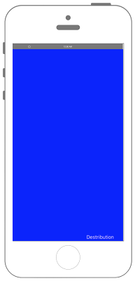

# ProvisioningからDevloperかDistributionかを判定する　




## Swift 3.0

```swift
//
//  ViewController.swift
//  config002
//
//  Copyright © 2016年 FaBo, Inc. All rights reserved.
//

import UIKit

class ViewController: UIViewController {
    
    override func viewDidLoad() {
        super.viewDidLoad()
        
        
        // 背景を青に.
        self.view.backgroundColor = UIColor.blue
        
        // 画面右下に表示.
        let myLabel: UILabel = UILabel()
        let labelWidth: CGFloat = 120
        let labelHeight: CGFloat = 20
        let posX: CGFloat = self.view.bounds.width - labelWidth
        let posY: CGFloat = self.view.bounds.height - labelHeight
        myLabel.frame = CGRect(x: posX, y: posY, width: labelWidth, height: labelHeight)
        myLabel.textColor = UIColor.white
        self.view.addSubview(myLabel)
        
        // embedded.mobileprovision のパスを指定.
        let provisioningPath: String = Bundle.main.path(forResource: "embedded", ofType: "mobileprovision")!
        print("provisioningPath\(provisioningPath)")
        
        // Dataを読み込み.
        do {
            let binaryData: String = try NSString(contentsOfFile: provisioningPath,
                                                  encoding: String.Encoding.isoLatin1.rawValue) as String
            print("Data:\(binaryData)")
            
            do {
                
                // <key>get-task-allow</key><true/>が含まれるならDeveloperと判定.
                let myPattern: String = "<key>get-task-allow</key>\n\\s*<true/>"
                let myRegex = try NSRegularExpression(pattern: myPattern,
                                                      options: [.dotMatchesLineSeparators,
                                                                .caseInsensitive])
                
                if let size: Int = myRegex.numberOfMatches(in: binaryData,
                                                                   options: NSRegularExpression.MatchingOptions(),
                                                                   range: NSMakeRange(0, binaryData.characters.count)) {
                    if size > 0 {
                        print("Developer")
                        myLabel.text = "Developer"
                    } else {
                        print("Destribution")
                        myLabel.text = "Destribution"
                    }
                }
            } catch let error as NSError {
                print(error.localizedDescription)
            }
            
            
        } catch {
            print("error")
        }
        
        
    }
    
    override func didReceiveMemoryWarning() {
        super.didReceiveMemoryWarning()
        // Dispose of any resources that can be recreated.
    }
}


```

## Swift 2.3

```swift
//
//  ViewController.swift
//  config002
//
//  Copyright © 2016年 FaBo, Inc. All rights reserved.
//

import UIKit

class ViewController: UIViewController {

    override func viewDidLoad() {
        super.viewDidLoad()

        
        // 背景を青に.
        self.view.backgroundColor = UIColor.blueColor()
        
        // 画面右下に表示.
        let myLabel: UILabel = UILabel()
        let labelWidth: CGFloat = 120
        let labelHeight: CGFloat = 20
        let posX: CGFloat = self.view.bounds.width - labelWidth
        let posY: CGFloat = self.view.bounds.height - labelHeight
        myLabel.frame = CGRectMake(posX, posY, labelWidth, labelHeight)
        myLabel.textColor = UIColor.whiteColor()
        self.view.addSubview(myLabel)
        
        // embedded.mobileprovision のパスを指定.
        let provisioningPath: String = NSBundle.mainBundle().pathForResource("embedded", ofType: "mobileprovision")!
        print("provisioningPath\(provisioningPath)")
        
        // Dataを読み込み.
        do {
            let binaryData: String = try NSString(contentsOfFile: provisioningPath,
                                                  encoding: NSISOLatin1StringEncoding) as String
            print("Data:\(binaryData)")
           
            do {
                
                // <key>get-task-allow</key><true/>が含まれるならDeveloperと判定.
                let myPattern: String = "<key>get-task-allow</key>\n\\s*<true/>"
                let myRegex = try NSRegularExpression(pattern: myPattern,
                                                    options: [.DotMatchesLineSeparators,
                                                            .CaseInsensitive])
                
                if let size: Int = myRegex.numberOfMatchesInString(binaryData,
                                                                options: NSMatchingOptions(),
                                                                range: NSMakeRange(0, binaryData.characters.count)) {
                    if size > 0 {
                            print("Developer")
                            myLabel.text = "Developer"
                    } else {
                            print("Destribution")
                            myLabel.text = "Destribution"
                    }
                }
            } catch let error as NSError {
                print(error.localizedDescription)
            }
 
            
        } catch {
            print("error")
        }

        
    }

    override func didReceiveMemoryWarning() {
        super.didReceiveMemoryWarning()
        // Dispose of any resources that can be recreated.
    }
}


```

## 2.xと3.xの差分

* ```NSBundle.mainBundle().pathForResource()```が```Bundle.main.path()```に変更

## Reference

* NSBundle
    * [https://developer.apple.com/reference/foundation/nsbundle](https://developer.apple.com/reference/foundation/nsbundle)

