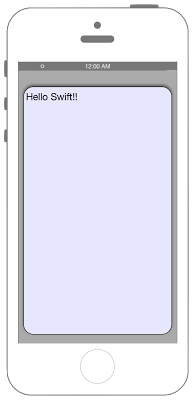

# NSURLConnectionを用いたHTTP通信(非同期)



### iOS9からリクエスト先によってはATSを無効化・対処する必要があります

## Swift 3.0

```swift
//
//  ViewController.swift
//  Connection001
//
//  Created by Misato Morino on 2016/08/15.
//  Copyright © 2016年 Misato Morino. All rights reserved.
//

import UIKit

class ViewController: UIViewController {
    
    override func viewDidLoad() {
        super.viewDidLoad()
        
        self.view.backgroundColor = UIColor.lightGray
        
        // 表示用のTextViewを用意.
        //let myTextView = UITextView(frame: CGRectMake(10, 50, self.view.frame.width - 20, 500))
        let myTextView = UITextView(frame: CGRect(x: 10, y: 50, width: self.view.frame.width - 20, height: 500))
        myTextView.backgroundColor = UIColor(red: 0.9, green: 0.9, blue: 1, alpha: 1.0)
        myTextView.layer.masksToBounds = true
        myTextView.layer.cornerRadius = 20.0
        myTextView.layer.borderWidth = 1
        myTextView.layer.borderColor = UIColor.black.cgColor
        myTextView.font = UIFont.systemFont(ofSize: CGFloat(20))
        myTextView.textColor = UIColor.black
        myTextView.textAlignment = NSTextAlignment.left
        myTextView.dataDetectorTypes = UIDataDetectorTypes.all
        myTextView.layer.shadowOpacity = 0.5
        myTextView.layer.masksToBounds = false
        myTextView.isEditable = false
        self.view.addSubview(myTextView)
        
        // 通信先のURLを生成.
        let url: NSURL = NSURL(string:"http://xxx/hello.php")!
        // リクエストを生成.
        let request: NSURLRequest  = NSURLRequest(url: url as URL)
        // 送信処理を始める.
        NSURLConnection.sendAsynchronousRequest(request as URLRequest, queue: OperationQueue.main) { (response, data, erroe) in
            
            // 受け取ったデータのnil判定.
            if let _data = data {
                
                // 帰ってきたデータを文字列に変換.
                let getData: NSString = NSString(data: _data, encoding: String.Encoding.utf8.rawValue)!
                // TextViewにセット.
                myTextView.text = getData as String
            }
        }
    }
    
    override func didReceiveMemoryWarning() {
        super.didReceiveMemoryWarning()
        // Dispose of any resources that can be recreated.
    } 
} 

```

# Swift 2.3

```swift
//
//  ViewController.swift
//  Connection001
//
//  Created by Misato Morino on 2016/08/15.
//  Copyright © 2016年 Misato Morino. All rights reserved.
//

import UIKit

class ViewController: UIViewController {

    override func viewDidLoad() {
        super.viewDidLoad()
        
        self.view.backgroundColor = UIColor.lightGrayColor()
        
        // 表示用のTextViewを用意.
        let myTextView = UITextView(frame: CGRectMake(10, 50, self.view.frame.width - 20, 500))
        myTextView.backgroundColor = UIColor(red: 0.9, green: 0.9, blue: 1, alpha: 1.0)
        myTextView.layer.masksToBounds = true
        myTextView.layer.cornerRadius = 20.0
        myTextView.layer.borderWidth = 1
        myTextView.layer.borderColor = UIColor.blackColor().CGColor
        myTextView.font = UIFont.systemFontOfSize(CGFloat(20))
        myTextView.textColor = UIColor.blackColor()
        myTextView.textAlignment = NSTextAlignment.Left
        myTextView.dataDetectorTypes = UIDataDetectorTypes.All
        myTextView.layer.shadowOpacity = 0.5
        myTextView.layer.masksToBounds = false
        myTextView.editable = false
        self.view.addSubview(myTextView)
        
        // 通信先のURLを生成.
        let url: NSURL = NSURL(string:"http://xxx/hello.php")!
        // リクエストを生成.
        let request: NSURLRequest  = NSURLRequest(URL: url)
        // 送信処理を始める.
        NSURLConnection.sendAsynchronousRequest(request, queue: NSOperationQueue.mainQueue()) { (response, data, erroe) in
            
            // 受け取ったデータのnil判定.
            if let _data = data {
                
                // 帰ってきたデータを文字列に変換.
                let getData: NSString = NSString(data: _data, encoding: NSUTF8StringEncoding)!
                // TextViewにセット.
                myTextView.text = getData as String
            }
        }
    }

    override func didReceiveMemoryWarning() {
        super.didReceiveMemoryWarning()
        // Dispose of any resources that can be recreated.
    } 
} 
```

## 2.xと3.xの差分

* NSOperationQueue.mainQueue()からOperationQueue.mainに変更
* NSUTF8StringEncodingからString.Encoding.utf8.rawValueに変更
* UITextViewのinit(frame: )ではCGRectMakeが使用不可

## Reference

* NSURLConnection
	* [https://developer.apple.com/reference/foundation/nsurlconnection](https://developer.apple.com/reference/foundation/nsurlconnection)
* UITextView
	* [https://developer.apple.com/reference/uikit/uitextview](https://developer.apple.com/reference/uikit/uitextview)
