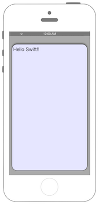

# NSURLSessionを用いたHTTP通信(Delegateを用いた処理)



### iOS9からリクエスト先によってはATSを無効化・対処する必要があります

## Swift 3.0

```swift
//
//  ViewController.swift
//  Connection003
//
//  Created by Misato Morino on 2016/08/15.
//  Copyright © 2016年 Misato Morino. All rights reserved.
//

import UIKit

class ViewController: UIViewController, URLSessionDelegate, URLSessionDataDelegate {
    
    var myTextView : UITextView!
    
    override func viewDidLoad() {
        super.viewDidLoad()
        
        self.view.backgroundColor = UIColor.lightGray
        
        // 表示用のTextViewを用意.
        myTextView = UITextView(frame: CGRect(x: 10, y: 50, width: self.view.frame.width - 20, height: 500))
        
        myTextView.backgroundColor = UIColor(red: 0.9, green: 0.9, blue: 1, alpha: 1.0)
        myTextView.layer.masksToBounds = true
        myTextView.layer.cornerRadius = 20.0
        myTextView.layer.borderWidth = 1
        myTextView.layer.borderColor = UIColor.black.cgColor
        myTextView.font = UIFont.systemFont(ofSize: CGFloat(20))
        myTextView.textColor = UIColor.black
        myTextView.textAlignment = NSTextAlignment.left
        myTextView.dataDetectorTypes = UIDataDetectorTypes.all
        myTextView.layer.shadowOpacity = 0.5
        myTextView.layer.masksToBounds = false
        myTextView.isEditable = false
        
        self.view.addSubview(myTextView)
        
        
        // 通信用のConfigを生成.
        let config: URLSessionConfiguration = URLSessionConfiguration.background(withIdentifier: "backgroundTask")
        // Sessionを生成.
        let session: URLSession = URLSession(configuration: config, delegate: self, delegateQueue: nil)
        // 通信先のURLを生成.
        let url: NSURL = NSURL(string: "http://xxx/hello.php")!
        // タスクの生成.
        let task: URLSessionDataTask = session.dataTask(with: url as URL)
        // タスクの実行.
        task.resume()
    }
    
    /*
     通信が終了したときに呼び出されるデリゲート.
     */
    func urlSession(_ session: URLSession, dataTask: URLSessionDataTask, didReceive data: Data) {
        print("NSURLSessionDataTask")
        
        // 帰ってきたデータを文字列に変換.
        let getData: NSString = NSString(data: data, encoding: String.Encoding.utf8.rawValue)!
        
        // バックグラウンドだとUIの処理が出来ないので、メインスレッドでUIの処理を行わせる.
        DispatchQueue.main.async(execute: {
            self.myTextView.text = getData as String
        })
    }
    
    override func didReceiveMemoryWarning() {
        super.didReceiveMemoryWarning()
        // Dispose of any resources that can be recreated.
    } 
} 
```

## Swift 2.3

```swift
//
//  ViewController.swift
//  Connection003
//
//  Created by Misato Morino on 2016/08/15.
//  Copyright © 2016年 Misato Morino. All rights reserved.
//

import UIKit

class ViewController: UIViewController, NSURLSessionDelegate, NSURLSessionDataDelegate {
    
    var myTextView : UITextView!
    
    override func viewDidLoad() {
        super.viewDidLoad()
        
        self.view.backgroundColor = UIColor.lightGrayColor()
        
        // 表示用のTextViewを用意.
        myTextView = UITextView(frame: CGRectMake(10, 50, self.view.frame.width - 20, 500))
        
        myTextView.backgroundColor = UIColor(red: 0.9, green: 0.9, blue: 1, alpha: 1.0)
        myTextView.layer.masksToBounds = true
        myTextView.layer.cornerRadius = 20.0
        myTextView.layer.borderWidth = 1
        myTextView.layer.borderColor = UIColor.blackColor().CGColor
        myTextView.font = UIFont.systemFontOfSize(CGFloat(20))
        myTextView.textColor = UIColor.blackColor()
        myTextView.textAlignment = NSTextAlignment.Left
        myTextView.dataDetectorTypes = UIDataDetectorTypes.All
        myTextView.layer.shadowOpacity = 0.5
        myTextView.layer.masksToBounds = false
        myTextView.editable = false
        
        self.view.addSubview(myTextView)
        
        
        // 通信用のConfigを生成.
        let config: NSURLSessionConfiguration = NSURLSessionConfiguration.backgroundSessionConfigurationWithIdentifier("backgroundTask")
        // Sessionを生成.
        let session: NSURLSession = NSURLSession(configuration: config, delegate: self, delegateQueue: nil)
        // 通信先のURLを生成.
        let url: NSURL = NSURL(string: "http://xxx/hello.php")!
        // タスクの生成.
        let task: NSURLSessionDataTask = session.dataTaskWithURL(url)
        // タスクの実行.
        task.resume() 
    }
    
    /*
     通信が終了したときに呼び出されるデリゲート.
     */
    func URLSession(session: NSURLSession, dataTask: NSURLSessionDataTask, didReceiveData data: NSData) {
        print("NSURLSessionDataTask")
        
        // 帰ってきたデータを文字列に変換.
        let getData: NSString = NSString(data: data, encoding: NSUTF8StringEncoding)!
        
        // バックグラウンドだとUIの処理が出来ないので、メインスレッドでUIの処理を行わせる.
        dispatch_async(dispatch_get_main_queue(), {
            self.myTextView.text = getData as String
        })
    }
    
    override func didReceiveMemoryWarning() {
        super.didReceiveMemoryWarning()
        // Dispose of any resources that can be recreated.
    } 
} 
```

## 2.xと3.xの差分

* NSURLSessionからURLSessionに変更（他も同じく）
* ```dispatch_async(dispatch_get_main_queue(), {``` から```DispatchQueue.main.async(execute: {```に変更
* ```dataTaskWithURL(url)``` から ```dataTask(with: url as URL)``` に変更
* ```func URLSession(session: NSURLSession, dataTask: NSURLSessionDataTask, didReceiveData data: NSData)``` から ``` func urlSession(_ session: URLSession, dataTask: URLSessionDataTask, didReceive data: Data)```
 

## Reference

* URLSession
	* [https://developer.apple.com/reference/foundation/urlsession](https://developer.apple.com/reference/foundation/urlsession)
* URLSessionConfiguration
    * [https://developer.apple.com/reference/foundation/urlsessionconfiguration](https://developer.apple.com/reference/foundation/urlsessionconfiguration)
* URLSessionDataTask
    * [https://developer.apple.com/reference/foundation/urlsessiondatatask](https://developer.apple.com/reference/foundation/urlsessiondatatask)
* NSURL
    * [https://developer.apple.com/reference/foundation/nsurl](https://developer.apple.com/reference/foundation/nsurl)
* DispatchQueue
    * [https://developer.apple.com/reference/dispatch/dispatchqueue](https://developer.apple.com/reference/dispatch/dispatchqueue)
* UITextView
	* [https://developer.apple.com/reference/uikit/uitextview](https://developer.apple.com/reference/uikit/uitextview)
