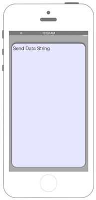

# POSTを送信する



### iOS9からリクエスト先によってはATSを無効化・対処する必要があります

## Swift 3.0

```swift
//
//  ViewController.swift
//  Connection007
//
//  Created by Misato Morino on 2016/08/15.
//  Copyright © 2016年 Misato Morino. All rights reserved.
//

import UIKit

class ViewController: UIViewController, URLSessionDelegate, URLSessionDataDelegate{
    
    var myTextView: UITextView!
    
    override func viewDidLoad() {
        super.viewDidLoad()
        
        self.view.backgroundColor = UIColor.lightGray
        
        //表示用のTextViewを用意
        myTextView = UITextView(frame: CGRect(x: 10, y: 50, width: self.view.frame.width - 20, height: 500))
        
        myTextView.backgroundColor = UIColor(red: 0.9, green: 0.9, blue: 1, alpha: 1.0)
        myTextView.layer.masksToBounds = true
        myTextView.layer.cornerRadius = 20.0
        myTextView.layer.borderWidth = 1
        myTextView.layer.borderColor = UIColor.black.cgColor
        myTextView.font = UIFont.systemFont(ofSize: CGFloat(20))
        myTextView.textColor = UIColor.black
        myTextView.textAlignment = NSTextAlignment.left
        myTextView.dataDetectorTypes = UIDataDetectorTypes.all
        myTextView.layer.shadowOpacity = 0.5
        myTextView.layer.masksToBounds = false
        
        self.view.addSubview(myTextView)
        
        // 通信用のConfigを生成.
        let config:URLSessionConfiguration = URLSessionConfiguration.background(withIdentifier: "backgroundTask")
        // Sessionを生成.
        let session: URLSession = URLSession(configuration: config, delegate: self, delegateQueue: nil)
        // 通信先のURLを生成.
        let url: NSURL = NSURL(string: "http://localhost/swift/post.php")!
        
        // POST用のリクエストを生成.
        let request: NSMutableURLRequest = NSMutableURLRequest(url: url as URL)
        // POSTのメソッドを指定.
        request.httpMethod = "POST"
        
        // 送信するデータを生成・リクエストにセット.
        let str: NSString = "data=Send Data String"
        let myData: NSData = str.data(using: String.Encoding.utf8.rawValue)!
        request.httpBody = myData as Data
        
        // タスクの生成.
        let task: URLSessionDataTask = session.dataTask(with: request as URLRequest)
        
        // タスクの実行.
        task.resume()
    }
    
    /*
     通信が終了したときに呼び出されるデリゲート.
     */
    func urlSession(_ session: URLSession, dataTask: URLSessionDataTask, didReceive data: Data) {
        // 帰ってきたデータを文字列に変換.
        let getData:NSString = NSString(data: data, encoding: String.Encoding.utf8.rawValue)!
        
        // バックグラウンドだとUIの処理が出来ないので、メインスレッドでUIの処理を行わせる.
        DispatchQueue.main.async(execute: {
            self.myTextView.text = getData as String
        })
    }
    
    /*
     バックグラウンドからフォアグラウンドの復帰時に呼び出されるデリゲート.
     */
    func urlSessionDidFinishEvents(forBackgroundURLSession session: URLSession) {
        print("URLSessionDidFinishEventsForBackgroundURLSession")
    } 

    override func didReceiveMemoryWarning() {
        super.didReceiveMemoryWarning()
    }
}
```

## Swift 2.3

```swift
//
//  ViewController.swift
//  Connection007
//
//  Created by Misato Morino on 2016/08/15.
//  Copyright © 2016年 Misato Morino. All rights reserved.
//

import UIKit

class ViewController: UIViewController, NSURLSessionDelegate, NSURLSessionDataDelegate{
    
    var myTextView: UITextView!
    
    override func viewDidLoad() {
        super.viewDidLoad()
        
        self.view.backgroundColor = UIColor.lightGrayColor()
        
        //表示用のTextViewを用意
        myTextView = UITextView(frame: CGRectMake(10, 50, self.view.frame.width - 20, 500))
        
        myTextView.backgroundColor = UIColor(red: 0.9, green: 0.9, blue: 1, alpha: 1.0)
        myTextView.layer.masksToBounds = true
        myTextView.layer.cornerRadius = 20.0
        myTextView.layer.borderWidth = 1
        myTextView.layer.borderColor = UIColor.blackColor().CGColor
        myTextView.font = UIFont.systemFontOfSize(CGFloat(20))
        myTextView.textColor = UIColor.blackColor()
        myTextView.textAlignment = NSTextAlignment.Left
        myTextView.dataDetectorTypes = UIDataDetectorTypes.All
        myTextView.layer.shadowOpacity = 0.5
        myTextView.layer.masksToBounds = false
        
        self.view.addSubview(myTextView)
        
        // 通信用のConfigを生成.
        let config:NSURLSessionConfiguration = NSURLSessionConfiguration.backgroundSessionConfigurationWithIdentifier("backgroundTask")
        // Sessionを生成.
        let session: NSURLSession = NSURLSession(configuration: config, delegate: self, delegateQueue: nil)
        // 通信先のURLを生成.
        let url: NSURL = NSURL(string: "http://xxx/post.php")!
        
        // POST用のリクエストを生成.
        let request: NSMutableURLRequest = NSMutableURLRequest(URL: url)
        // POSTのメソッドを指定.
        request.HTTPMethod = "POST"
        
        // 送信するデータを生成・リクエストにセット.
        let str:NSString = "data=Send Data String"
        let myData:NSData = str.dataUsingEncoding(NSUTF8StringEncoding)!
        request.HTTPBody = myData
        
        // タスクの生成.
        let task: NSURLSessionDataTask = session.dataTaskWithRequest(request)
        
        // タスクの実行.
        task.resume()
    }
    
    /*
     通信が終了したときに呼び出されるデリゲート.
     */
    func URLSession(session: NSURLSession, dataTask: NSURLSessionDataTask, didReceiveData data: NSData) {
        
        // 帰ってきたデータを文字列に変換.
        let getData:NSString = NSString(data: data, encoding: NSUTF8StringEncoding)!
        
        // バックグラウンドだとUIの処理が出来ないので、メインスレッドでUIの処理を行わせる.
        dispatch_async(dispatch_get_main_queue(), {
            self.myTextView.text = getData as String
        })
        
    }
    
    /*
    バックグラウンドからフォアグラウンドの復帰時に呼び出されるデリゲート.
     */
    func URLSessionDidFinishEventsForBackgroundURLSession(session: NSURLSession) {
        print("URLSessionDidFinishEventsForBackgroundURLSession")
        
    }
    override func didReceiveMemoryWarning() {
        super.didReceiveMemoryWarning()
    }
} 
```

## 2.xと3.xの差分

* NSURLSessionからURLSessionに変更（他も同じく）
* ```dispatch_async(dispatch_get_main_queue(), {``` から```DispatchQueue.main.async(execute: {```に変更
``` から ```Foundation.URLSession(configuration: config, delegate: self, delegateQueue: OperationQueue.main)
```に変更
* デリゲートメソッドの接頭語が```URLSession``` から ```urlSession``` に変更

## Reference

* URLSession
	* [https://developer.apple.com/reference/foundation/urlsession](https://developer.apple.com/reference/foundation/urlsession)
* URLSessionConfiguration
    * [https://developer.apple.com/reference/foundation/urlsessionconfiguration](https://developer.apple.com/reference/foundation/urlsessionconfiguration)
* NSURL
    * [https://developer.apple.com/reference/foundation/nsurl](https://developer.apple.com/reference/foundation/nsurl)
* NSMutableURLRequest
    * [https://developer.apple.com/reference/foundation/nsmutableurlrequest](https://developer.apple.com/reference/foundation/nsmutableurlrequest)
