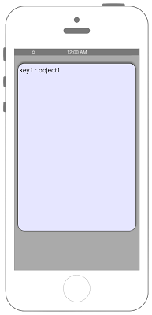

# JSONデータのPOST



### iOS9からリクエスト先によってはATSを無効化・対処する必要があります

## Swift 3.0

```swift
//
//  ViewController.swift
//  Connection010
//
//  Created by Misato Morino on 2016/08/15.
//  Copyright © 2016年 Misato Morino. All rights reserved.
//

import UIKit

class ViewController: UIViewController {
    
    
    override func viewDidLoad() {
        super.viewDidLoad()
        
        self.view.backgroundColor = UIColor.lightGray
    
        // 結果表示用のTextViewを用意.
        let myTextView = UITextView(frame: CGRect(x: 10, y: 50, width: self.view.frame.width - 20, height: 500))
        
        myTextView.backgroundColor = UIColor(red: 0.9, green: 0.9, blue: 1, alpha: 1.0)
        myTextView.layer.masksToBounds = true
        myTextView.layer.cornerRadius = 20.0
        myTextView.layer.borderWidth = 1
        myTextView.layer.borderColor = UIColor.black.cgColor
        myTextView.font = UIFont.systemFont(ofSize: CGFloat(20))
        myTextView.textColor = UIColor.black
        myTextView.textAlignment = NSTextAlignment.left
        myTextView.dataDetectorTypes = UIDataDetectorTypes.all
        myTextView.layer.shadowOpacity = 0.5
        myTextView.layer.masksToBounds = false
        myTextView.isEditable = false
        
        self.view.addSubview(myTextView)
        
        var json: NSData!
        
        // dictionaryで送信するJSONデータを生成.
        let myDict:NSMutableDictionary = NSMutableDictionary()
        myDict.setObject("object1", forKey: "key1")
        myDict.setObject("object2", forKey: "key2")
        myDict.setObject("object3", forKey: "key3")
        myDict.setObject("object4", forKey: "key4")
        
        // 作成したdictionaryがJSONに変換可能かチェック.
        if JSONSerialization.isValidJSONObject(myDict){
            
            do {
                
                // DictionaryからJSON(NSData)へ変換.
                json = try JSONSerialization.data(withJSONObject: myDict, options: JSONSerialization.WritingOptions.prettyPrinted)
                
                // 生成したJSONデータの確認.
                print(NSString(data: json as Data, encoding: String.Encoding.utf8.rawValue)!)
                
            } catch {
                print(error)
            }
            
        }
        
        // Http通信のリクエスト生成.
        let config:URLSessionConfiguration = URLSessionConfiguration.default
        let url:NSURL = NSURL(string: "http:/xxx/json_decode.php")!
        let request:NSMutableURLRequest = NSMutableURLRequest(url: url as URL)
        let session:URLSession = URLSession(configuration: config)
        
        request.httpMethod = "POST"
        
        // jsonのデータを一度文字列にして、キーと合わせる.
        let data:NSString = "json=\(NSString(data: json as Data, encoding: String.Encoding.utf8.rawValue)!)"
        
        // jsonデータのセット.
        request.httpBody = data.data(using: String.Encoding.utf8.rawValue)
        
        let task:URLSessionDataTask = session.dataTask(with: request as URLRequest, completionHandler: { (_data, response, err) -> Void in
            
            // バックグラウンドだとUIの処理が出来ないので、メインスレッドでUIの処理を行わせる.
            DispatchQueue.main.async(execute: {
                myTextView.text = NSString(data: _data!, encoding: String.Encoding.utf8.rawValue)! as String
            })
        })
        
        task.resume()
    }
    
    override func didReceiveMemoryWarning() {
        super.didReceiveMemoryWarning()
        
    }
}
```

## Swift 2.3

```swift
//
//  ViewController.swift
//  Connection010
//
//  Created by Misato Morino on 2016/08/15.
//  Copyright © 2016年 Misato Morino. All rights reserved.
//

import UIKit

class ViewController: UIViewController{
    
    
    override func viewDidLoad() {
        super.viewDidLoad()
        
        self.view.backgroundColor = UIColor.lightGrayColor()
        
        // 結果表示用のTextViewを用意.
        let myTextView = UITextView(frame: CGRectMake(10, 50, self.view.frame.width - 20, 500))
        
        myTextView.backgroundColor = UIColor(red: 0.9, green: 0.9, blue: 1, alpha: 1.0)
        myTextView.layer.masksToBounds = true
        myTextView.layer.cornerRadius = 20.0
        myTextView.layer.borderWidth = 1
        myTextView.layer.borderColor = UIColor.blackColor().CGColor
        myTextView.font = UIFont.systemFontOfSize(CGFloat(20))
        myTextView.textColor = UIColor.blackColor()
        myTextView.textAlignment = NSTextAlignment.Left
        myTextView.dataDetectorTypes = UIDataDetectorTypes.All
        myTextView.layer.shadowOpacity = 0.5
        myTextView.layer.masksToBounds = false
        myTextView.editable = false
        
        self.view.addSubview(myTextView)
        
        var json: NSData!
        
        // dictionaryで送信するJSONデータを生成.
        let myDict:NSMutableDictionary = NSMutableDictionary()
        myDict.setObject("object1", forKey: "key1")
        myDict.setObject("object2", forKey: "key2")
        myDict.setObject("object3", forKey: "key3")
        myDict.setObject("object4", forKey: "key4")
        
        // 作成したdictionaryがJSONに変換可能かチェック.
        if NSJSONSerialization.isValidJSONObject(myDict){
            
            do {
                
                // DictionaryからJSON(NSData)へ変換.
                json = try NSJSONSerialization.dataWithJSONObject(myDict, options: NSJSONWritingOptions.PrettyPrinted)
                
                // 生成したJSONデータの確認.
                print(NSString(data: json, encoding: NSUTF8StringEncoding)!)
                
            } catch {
                print(error)
            }
            
        }
        
        // Http通信のリクエスト生成.
        let config:NSURLSessionConfiguration = NSURLSessionConfiguration.defaultSessionConfiguration()
        let url:NSURL = NSURL(string: "http:/xxx/json_decode.php")!
        let request:NSMutableURLRequest = NSMutableURLRequest(URL: url)
        let session:NSURLSession = NSURLSession(configuration: config)
        
        request.HTTPMethod = "POST"
        
        // jsonのデータを一度文字列にして、キーと合わせる.
        let data:NSString = "json=\(NSString(data: json, encoding: NSUTF8StringEncoding)!)"
        
        // jsonデータのセット.
        request.HTTPBody = data.dataUsingEncoding(NSUTF8StringEncoding)
        
        let task:NSURLSessionDataTask = session.dataTaskWithRequest(request, completionHandler: { (_data, response, err) -> Void in
            
            // バックグラウンドだとUIの処理が出来ないので、メインスレッドでUIの処理を行わせる.
            dispatch_async(dispatch_get_main_queue(), {
                myTextView.text = NSString(data: _data!, encoding: NSUTF8StringEncoding)! as String
            })
        })
        
        task.resume()
    }
    
    override func didReceiveMemoryWarning() {
        super.didReceiveMemoryWarning()
        
    }
}
```

## 2.xと3.xの差分

* NSURLSessionからURLSessionに変更（他も同じく）
* デリゲートメソッドの接頭語が```URLSession``` から ```urlSession``` に変更
* NSJSONSerialization から JSONSerialization に変更
* ```dataUsingEncoding(NSUTF8StringEncoding)``` から ```data(using: String.Encoding.utf8.rawValue)``` に変更

## Reference

* URLSession
	* [https://developer.apple.com/reference/foundation/urlsession](https://developer.apple.com/reference/foundation/urlsession)
* URLSessionConfiguration
    * [https://developer.apple.com/reference/foundation/urlsessionconfiguration](https://developer.apple.com/reference/foundation/urlsessionconfiguration)
* NSURL
    * [https://developer.apple.com/reference/foundation/nsurl](https://developer.apple.com/reference/foundation/nsurl)
* JSONSerialization
    * [https://developer.apple.com/reference/foundation/jsonserialization](https://developer.apple.com/reference/foundation/jsonserialization)
