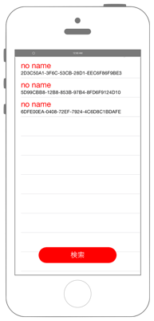

# Bluetooth機器の検出



## Swift 4.0
```swift
//
//  ViewController.swift
//  corebluetooth001
//
//  Copyright © 2018年 FaBo, Inc. All rights reserved.
//
import UIKit
import CoreBluetooth

class ViewController: UIViewController {
    
    var myTableView: UITableView!
    var myUuids: [String] = []
    var myNames: [String] = []
    var myPeripheral: [CBPeripheral] = []
    var myCentralManager: CBCentralManager!
    let myButton = UIButton()
    
    override func viewDidLoad() {
        super.viewDidLoad()
        
        // Status Barの高さを取得.
        let barHeight = UIApplication.shared.statusBarFrame.size.height
        
        // Viewの高さと幅を取得.
        let displayWidth = self.view.frame.width
        let displayHeight = self.view.frame.height
        
        // TableViewの生成( status barの高さ分ずらして表示 ).
        myTableView = UITableView(frame: CGRect(x: 0, y: barHeight, width: displayWidth, height: displayHeight - barHeight))
        
        // Cellの登録.
        myTableView.register(UITableViewCell.self, forCellReuseIdentifier: "MyCell")
        
        // DataSourceの設定.
        myTableView.dataSource = self
        
        // Delegateを設定.
        myTableView.delegate = self
        
        // Viewに追加する.
        self.view.addSubview(myTableView)
        
        // サイズ
        myButton.frame = CGRect(x: 0, y: 0, width: 200, height: 40)
        myButton.backgroundColor = UIColor.red
        myButton.layer.masksToBounds = true
        myButton.setTitle("検索", for: UIControlState.normal)
        myButton.setTitleColor(UIColor.white, for: UIControlState.normal)
        myButton.layer.cornerRadius = 20.0
        myButton.layer.position = CGPoint(x: self.view.frame.width/2, y:self.view.frame.height-50)
        myButton.tag = 1
        myButton.addTarget(self, action: #selector(onClickMyButton(sender:)), for: .touchUpInside)
        
        // UIボタンをViewに追加.
        self.view.addSubview(myButton);
    }
    
    override func didReceiveMemoryWarning() {
        super.didReceiveMemoryWarning()
    }
    
    /// ボタンが押されたときに呼び出される。
    ///
    /// - Parameter sender: <#sender description#>
    @objc func onClickMyButton(sender: UIButton){
        
        // 配列をリセット.
        myNames = []
        myUuids = []
        myPeripheral = []
        
        // CoreBluetoothを初期化および始動.
        myCentralManager = CBCentralManager(delegate: self, queue: nil, options: nil)
    }
}
extension ViewController: UITableViewDataSource{
    /// Cellの総数を返す。
    ///
    /// - Parameters:
    ///   - tableView: <#tableView description#>
    ///   - section: <#section description#>
    /// - Returns: <#return value description#>
    func tableView(_ tableView: UITableView, numberOfRowsInSection section: Int) -> Int {
        return myUuids.count
    }
}
extension ViewController: UITableViewDelegate{
    
    /// Cellが選択されたときに呼び出される。
    ///
    /// - Parameters:
    ///   - tableView: <#tableView description#>
    ///   - indexPath: <#indexPath description#>
    func tableView(_ tableView: UITableView, didSelectRowAt indexPath: IndexPath) {
        print("Num: \(indexPath.row)")
        print("Uuid: \(myUuids[indexPath.row])")
        print("Name: \(myNames[indexPath.row])")
    }
    
    /// Cellに値を設定する。
    ///
    /// - Parameters:
    ///   - tableView: <#tableView description#>
    ///   - indexPath: <#indexPath description#>
    /// - Returns: <#return value description#>
    func tableView(_ tableView: UITableView, cellForRowAt indexPath: IndexPath) -> UITableViewCell {
        let cell = UITableViewCell(style: UITableViewCellStyle.subtitle, reuseIdentifier:"MyCell" )
        
        // Cellに値を設定.
        cell.textLabel!.sizeToFit()
        cell.textLabel!.textColor = UIColor.red
        cell.textLabel!.text = "\(myNames[indexPath.row])"
        cell.textLabel!.font = UIFont.systemFont(ofSize: 20)
        // Cellに値を設定(下).
        cell.detailTextLabel!.text = "\(myUuids[indexPath.row])"
        cell.detailTextLabel!.font = UIFont.systemFont(ofSize: 12)
        return cell
    }
}
extension ViewController: CBCentralManagerDelegate{
    
    /// Central Managerの状態がかわったら呼び出される。
    ///
    /// - Parameter central: Central manager
    func centralManagerDidUpdateState(_ central: CBCentralManager) {
        print("state \(central.state)")
        
        switch central.state {
        case .poweredOff:
            print("Bluetoothの電源がOff")
        case .poweredOn:
            print("Bluetoothの電源はOn")
            // BLEデバイスの検出を開始.
            myCentralManager.scanForPeripherals(withServices: nil)
        case .resetting:
            print("レスティング状態")
        case .unauthorized:
            print("非認証状態")
        case .unknown:
            print("不明")
        case .unsupported:
            print("非対応")
        }
    }
    
    /// PheripheralのScanが成功したら呼び出される。
    ///
    /// - Parameters:
    ///   - central: <#central description#>
    ///   - peripheral: <#peripheral description#>
    ///   - advertisementData: <#advertisementData description#>
    ///   - RSSI: <#RSSI description#>
    func centralManager(_ central: CBCentralManager, didDiscover peripheral: CBPeripheral,
                        advertisementData: [String: Any], rssi RSSI: NSNumber) {
        print("pheripheral.name: \(String(describing: peripheral.name))")
        print("advertisementData:\(advertisementData)")
        print("RSSI: \(RSSI)")
        print("peripheral.identifier.uuidString: \(peripheral.identifier.uuidString)")
        
        let kCBAdvDataLocalName = advertisementData["kCBAdvDataLocalName"] as? String
        if let name = kCBAdvDataLocalName {
            myNames.append(name)
        } else {
            myNames.append("no name")
        }
        
        myPeripheral.append(peripheral)
        myUuids.append(peripheral.identifier.uuidString)
        
        myTableView.reloadData()
    }
}

```

## Reference

* CoreBluetooth
    * https://developer.apple.com/library/ios/documentation/CoreBluetooth/Reference/CoreBluetooth_Framework/
* UITableViewDataSource
    * https://developer.apple.com/library/ios/documentation/UIKit/Reference/UITableViewDataSource_Protocol/
