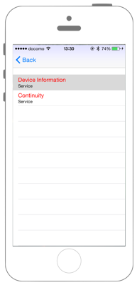
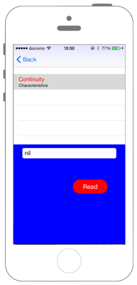

# Peripheralへの接続とServiceの検索

  

### AppDelegate.swift

```swift
//
//  AppDelegate.swift
//  CoreBluetooth002
//
//  Copyright © 2018年 FaBo, Inc. All rights reserved.
//

import UIKit
import CoreData

@UIApplicationMain
class AppDelegate: UIResponder, UIApplicationDelegate {

    var window: UIWindow?


    func application(_ application: UIApplication, didFinishLaunchingWithOptions launchOptions: [UIApplicationLaunchOptionsKey: Any]?) -> Bool {
        // Override point for customization after application launch.
        //ViewControllerのインスタンス化
        let viewController = ViewController()
        //UINavigationControllerのインスタンス化とrootViewControllerの指定
        let navigationController = UINavigationController(rootViewController: viewController)
        //UIWindowのインスタンス化
        self.window = UIWindow(frame: UIScreen.main.bounds)
        //UIWindowのrootViewControllerにnavigationControllerを指定
        self.window?.rootViewController = navigationController
        //UIWindowの表示
        self.window?.makeKeyAndVisible()
        
        return true
    }

    func applicationWillResignActive(_ application: UIApplication) {
        // Sent when the application is about to move from active to inactive state. This can occur for certain types of temporary interruptions (such as an incoming phone call or SMS message) or when the user quits the application and it begins the transition to the background state.
        // Use this method to pause ongoing tasks, disable timers, and invalidate graphics rendering callbacks. Games should use this method to pause the game.
    }

    func applicationDidEnterBackground(_ application: UIApplication) {
        // Use this method to release shared resources, save user data, invalidate timers, and store enough application state information to restore your application to its current state in case it is terminated later.
        // If your application supports background execution, this method is called instead of applicationWillTerminate: when the user quits.
    }

    func applicationWillEnterForeground(_ application: UIApplication) {
        // Called as part of the transition from the background to the active state; here you can undo many of the changes made on entering the background.
    }

    func applicationDidBecomeActive(_ application: UIApplication) {
        // Restart any tasks that were paused (or not yet started) while the application was inactive. If the application was previously in the background, optionally refresh the user interface.
    }

    func applicationWillTerminate(_ application: UIApplication) {
        // Called when the application is about to terminate. Save data if appropriate. See also applicationDidEnterBackground:.
        // Saves changes in the application's managed object context before the application terminates.
        self.saveContext()
    }

    // MARK: - Core Data stack

    lazy var persistentContainer: NSPersistentContainer = {
        /*
         The persistent container for the application. This implementation
         creates and returns a container, having loaded the store for the
         application to it. This property is optional since there are legitimate
         error conditions that could cause the creation of the store to fail.
        */
        let container = NSPersistentContainer(name: "SwiftBLE")
        container.loadPersistentStores(completionHandler: { (storeDescription, error) in
            if let error = error as NSError? {
                // Replace this implementation with code to handle the error appropriately.
                // fatalError() causes the application to generate a crash log and terminate. You should not use this function in a shipping application, although it may be useful during development.
                 
                /*
                 Typical reasons for an error here include:
                 * The parent directory does not exist, cannot be created, or disallows writing.
                 * The persistent store is not accessible, due to permissions or data protection when the device is locked.
                 * The device is out of space.
                 * The store could not be migrated to the current model version.
                 Check the error message to determine what the actual problem was.
                 */
                fatalError("Unresolved error \(error), \(error.userInfo)")
            }
        })
        return container
    }()

    // MARK: - Core Data Saving support

    func saveContext () {
        let context = persistentContainer.viewContext
        if context.hasChanges {
            do {
                try context.save()
            } catch {
                // Replace this implementation with code to handle the error appropriately.
                // fatalError() causes the application to generate a crash log and terminate. You should not use this function in a shipping application, although it may be useful during development.
                let nserror = error as NSError
                fatalError("Unresolved error \(nserror), \(nserror.userInfo)")
            }
        }
    }

}


```

### ViewController.swift

```swift
//
//  ViewController.swift
//  CoreBluetooth002
//
//  Copyright © 2018年 FaBo, Inc. All rights reserved.
//
import UIKit
import CoreBluetooth

class ViewController: UIViewController {
    
    var tableView: UITableView!
    var uuids = Array<UUID>()
    var names = [UUID : String]()
    var peripherals = [UUID : CBPeripheral]()
    var targetPeripheral: CBPeripheral!
    var centralManager: CBCentralManager!
    let button = UIButton()
    
    override func viewDidLoad() {
        super.viewDidLoad()
        
        // Status Barの高さを取得.
        let barHeight = UIApplication.shared.statusBarFrame.size.height
        
        // Viewの高さと幅を取得.
        let displayWidth = self.view.frame.width
        let displayHeight = self.view.frame.height
        
        // TableViewの生成( status barの高さ分ずらして表示 ).
        tableView = UITableView(frame: CGRect(x: 0, y: barHeight, width: displayWidth, height: displayHeight - barHeight))
        
        // Cellの登録.
        tableView.register(UITableViewCell.self, forCellReuseIdentifier: "MyCell")
        
        // DataSourceの設定.
        tableView.dataSource = self
        
        // Delegateを設定.
        tableView.delegate = self
        
        // Viewに追加する.
        self.view.addSubview(tableView)
        
        // サイズ
        button.frame = CGRect(x: 0, y: 0, width: 200, height: 40)
        button.backgroundColor = UIColor.red
        button.layer.masksToBounds = true
        button.setTitle("検索", for: UIControlState.normal)
        button.setTitleColor(UIColor.white, for: UIControlState.normal)
        button.layer.cornerRadius = 20.0
        button.layer.position = CGPoint(x: self.view.frame.width/2, y:self.view.frame.height-50)
        button.tag = 1
        button.addTarget(self, action: #selector(onClickMyButton(sender:)), for: .touchUpInside)
        
        // UIボタンをViewに追加.
        self.view.addSubview(button);
    }
    
    override func didReceiveMemoryWarning() {
        super.didReceiveMemoryWarning()
    }
    
    /// ボタンが押されたときに呼び出される。
    ///
    /// - Parameter sender: <#sender description#>
    @objc func onClickMyButton(sender: UIButton){
        
        // 配列をリセット.
        self.uuids = []
        self.names = [:]
        self.peripherals = [:]
        
        // CoreBluetoothを初期化および始動.
        centralManager = CBCentralManager(delegate: self, queue: nil, options: nil)
    }
}
extension ViewController: UITableViewDataSource{
    /// Cellの総数を返す。
    ///
    /// - Parameters:
    ///   - tableView: <#tableView description#>
    ///   - section: <#section description#>
    /// - Returns: <#return value description#>
    func tableView(_ tableView: UITableView, numberOfRowsInSection section: Int) -> Int {
        return self.names.count
    }
}
extension ViewController: UITableViewDelegate{
    
    /// Cellが選択されたときに呼び出される。
    ///
    /// - Parameters:
    ///   - tableView: <#tableView description#>
    ///   - indexPath: <#indexPath description#>
    func tableView(_ tableView: UITableView, didSelectRowAt indexPath: IndexPath) {
        let uuid = self.uuids[indexPath.row]
        print("Num: \(indexPath.row)")
        print("uuid: \(uuid.description)")
        print("Name: \(String(describing: self.names[uuid]?.description))")
        
        self.targetPeripheral = self.peripherals[uuid]
        self.centralManager.connect(self.targetPeripheral, options: nil)
    }
    
    /// Cellに値を設定する。
    ///
    /// - Parameters:
    ///   - tableView: <#tableView description#>
    ///   - indexPath: <#indexPath description#>
    /// - Returns: <#return value description#>
    func tableView(_ tableView: UITableView, cellForRowAt indexPath: IndexPath) -> UITableViewCell {
        let cell = UITableViewCell(style: UITableViewCellStyle.subtitle, reuseIdentifier:"MyCell" )
        
        let uuid = self.uuids[indexPath.row]
        // Cellに値を設定.
        cell.textLabel!.sizeToFit()
        cell.textLabel!.textColor = UIColor.red
        cell.textLabel!.text = self.names[uuid]
        cell.textLabel!.font = UIFont.systemFont(ofSize: 20)
        // Cellに値を設定(下).
        cell.detailTextLabel!.text = uuid.description
        cell.detailTextLabel!.font = UIFont.systemFont(ofSize: 12)
        return cell
    }
}
extension ViewController: CBCentralManagerDelegate{
    
    /// Central Managerの状態がかわったら呼び出される。
    ///
    /// - Parameter central: Central manager
    func centralManagerDidUpdateState(_ central: CBCentralManager) {
        print("state \(central.state)")
        
        switch central.state {
        case .poweredOff:
            print("Bluetoothの電源がOff")
        case .poweredOn:
            print("Bluetoothの電源はOn")
            // BLEデバイスの検出を開始.
            centralManager.scanForPeripherals(withServices: nil)
        case .resetting:
            print("レスティング状態")
        case .unauthorized:
            print("非認証状態")
        case .unknown:
            print("不明")
        case .unsupported:
            print("非対応")
        }
    }
    
    /// PheripheralのScanが成功したら呼び出される。
    ///
    /// - Parameters:
    ///   - central: <#central description#>
    ///   - peripheral: <#peripheral description#>
    ///   - advertisementData: <#advertisementData description#>
    ///   - RSSI: <#RSSI description#>
    func centralManager(_ central: CBCentralManager, didDiscover peripheral: CBPeripheral,
                        advertisementData: [String: Any], rssi RSSI: NSNumber) {
        print("pheripheral.name: \(String(describing: peripheral.name))")
        print("advertisementData:\(advertisementData)")
        print("RSSI: \(RSSI)")
        print("peripheral.identifier.uuidString: \(peripheral.identifier.uuidString)")
        let uuid = UUID(uuid: peripheral.identifier.uuid)
        self.uuids.append(uuid)
        let kCBAdvDataLocalName = advertisementData["kCBAdvDataLocalName"] as? String
        if let name = kCBAdvDataLocalName {
            self.names[uuid] = name.description
        } else {
            self.names[uuid] = "no name"
        }
        self.peripherals[uuid] = peripheral

        tableView.reloadData()
    }
    
    /// Pheripheralに接続した時に呼ばれる。
    ///
    /// - Parameters:
    ///   - central: <#central description#>
    ///   - peripheral: <#peripheral description#>
    func centralManager(_ central: CBCentralManager, didConnect peripheral: CBPeripheral) {
        print("connect")
        
        // 遷移するViewを定義する.
        let secondViewController: SecondViewController = SecondViewController()
        secondViewController.setPeripheral(target: self.targetPeripheral)
        secondViewController.setCentralManager(manager: self.centralManager)
        secondViewController.searchService()
        
        // アニメーションを設定する.
        secondViewController.modalTransitionStyle = UIModalTransitionStyle.partialCurl
        
        // Viewの移動する.
        self.navigationController?.pushViewController(secondViewController, animated: true)
        
        // Scanを停止する.
        self.centralManager.stopScan()
    }
    
    /// Pheripheralの接続に失敗した時に呼ばれる。
    ///
    /// - Parameters:
    ///   - central: <#central description#>
    ///   - peripheral: <#peripheral description#>
    ///   - error: <#error description#>
    func centralManager(_ central: CBCentralManager, didFailToConnect peripheral: CBPeripheral, error: Error?) {
        if let e = error {
            print("Error: \(e.localizedDescription)")
            return
        }
        print("not connnect")
    }
}

```

### SecondViewController.swift

```swift
//
//  SecondViewController.swift
//  CoreBluetooth002
//
//  Copyright © 2018年 FaBo, Inc. All rights reserved.
//
import Foundation
import UIKit
import CoreBluetooth

class SecondViewController: UIViewController {
    
    var tableView: UITableView!
    var serviceUuids: [String] = []
    var services: [CBService] = []
    var buttonBefore: UIButton!
    var targetPeriperal: CBPeripheral!
    var centralManager: CBCentralManager!
    
    override func viewDidLoad() {
        super.viewDidLoad()
        
        self.view.backgroundColor = UIColor.blue
        let barHeight: CGFloat = UIApplication.shared.statusBarFrame.size.height
        let displayWidth: CGFloat = self.view.frame.width
        let displayHeight: CGFloat = self.view.frame.height
        // TableViewの生成( status barの高さ分ずらして表示 ).
        tableView = UITableView(frame: CGRect(x: 0, y: barHeight, width: displayWidth, height: displayHeight - barHeight))
        // Cellの登録.
        tableView.register(UITableViewCell.self, forCellReuseIdentifier: "MyCell")
        // DataSourceの設定.
        tableView.dataSource = self
        // Delegateを設定.
        tableView.delegate = self
        // Viewに追加する.
        self.view.addSubview(tableView)
    }
    
    override func didMove(toParentViewController parent: UIViewController?) {
        if parent == nil {
            self.centralManager.cancelPeripheralConnection(self.targetPeriperal)
        }
    }
}
extension SecondViewController: CBPeripheralDelegate{
    /// 接続先のPeripheralを設定
    ///
    /// - Parameter target: <#target description#>
    func setPeripheral(target: CBPeripheral) {
        self.targetPeriperal = target
    }
   
    /// CentralManagerを設定
    ///
    /// - Parameter manager: <#manager description#>
    func setCentralManager(manager: CBCentralManager) {
        self.centralManager = manager
    }
    
    /// Serviceの検索
    func searchService() {
        print("searchService")
        self.targetPeriperal.delegate = self
        self.targetPeriperal.discoverServices(nil)
    }
    
    
    /// Serviceの検索が終わったら呼び出される
    ///
    /// - Parameters:
    ///   - peripheral: <#peripheral description#>
    ///   - error: <#error description#>
    func peripheral(_ peripheral: CBPeripheral, didDiscoverServices error: Error?) {
        if let e = error {
            print("Error: \(e.localizedDescription)")
            return
        }
        
        print("didDiscoverServices")
        for service in peripheral.services! {
            serviceUuids.append(service.uuid.uuidString)
            services.append(service)
            print("P: \(String(describing: peripheral.name)) - Discovered service S:'\(service.uuid)'")
        }
        
        tableView.reloadData()
    }
    
}
extension SecondViewController: UITableViewDelegate{
 
    /// Cellが選択された際に呼び出される.
    ///
    /// - Parameters:
    ///   - tableView: <#tableView description#>
    ///   - indexPath: <#indexPath description#>
    func tableView(_ tableView: UITableView, didSelectRowAt indexPath: IndexPath) {
        print("ServiceUuid: \(serviceUuids[indexPath.row])")
    }
}
extension SecondViewController: UITableViewDataSource{

    /// Cellの総数を返す.
    ///
    /// - Parameters:
    ///   - tableView: <#tableView description#>
    ///   - section: <#section description#>
    /// - Returns: <#return value description#>
    func tableView(_ tableView: UITableView, numberOfRowsInSection section: Int) -> Int {
        return serviceUuids.count
    }
    
    /// Cellに値を設定する.
    ///
    /// - Parameters:
    ///   - tableView: <#tableView description#>
    ///   - indexPath: <#indexPath description#>
    /// - Returns: <#return value description#>
    func tableView(_ tableView: UITableView, cellForRowAt indexPath: IndexPath) -> UITableViewCell {
        let cell = UITableViewCell(style: UITableViewCellStyle.subtitle, reuseIdentifier:"MyCell" )
        
        // Cellに値を設定.
        cell.textLabel!.sizeToFit()
        cell.textLabel!.textColor = UIColor.red
        cell.textLabel!.text = "\(serviceUuids[indexPath.row])"
        cell.textLabel!.font = UIFont.systemFont(ofSize: 16)
        // Cellに値を設定(下).
        cell.detailTextLabel!.text = "Service"
        cell.detailTextLabel!.font = UIFont.systemFont(ofSize: 12)
        
        return cell
    }
}
```

## Reference

* CoreBluetooth
    * https://developer.apple.com/library/ios/documentation/CoreBluetooth/Reference/CoreBluetooth_Framework/
* UITableViewDataSource
    * https://developer.apple.com/library/ios/documentation/UIKit/Reference/UITableViewDataSource_Protocol/
