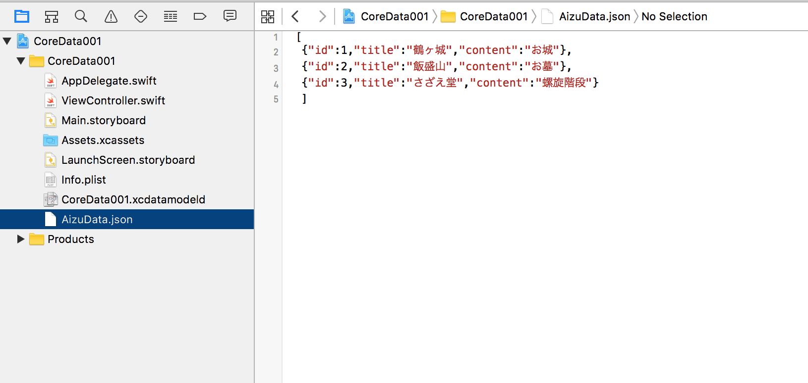
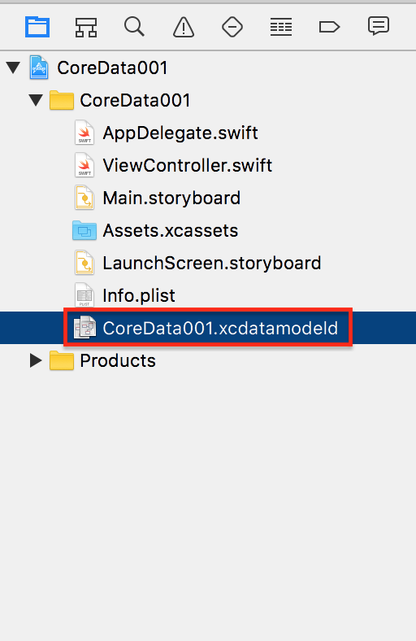
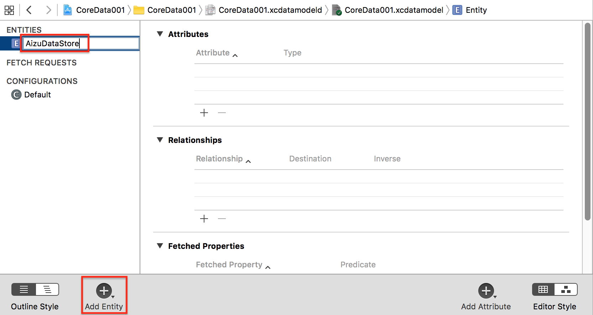
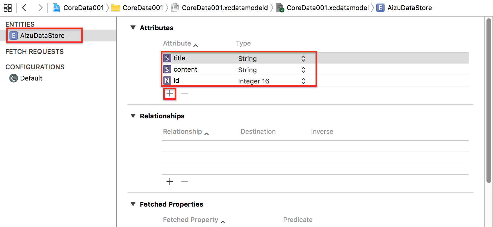
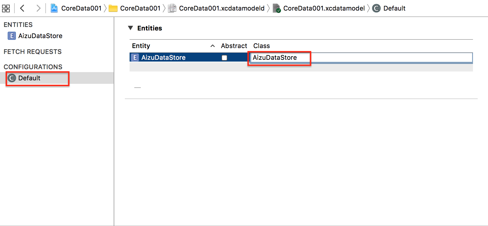

# JSONデータをCoreDataに格納


## 共通

### 使用するJSONデータ

AizuData.json
```json
[
 {"id":1,"title":"鶴ヶ城","content":"お城"},
 {"id":2,"title":"飯盛山","content":"お墓"},
 {"id":3,"title":"さざえ堂","content":"螺旋階段"}
]
```



### CoreDataのEntityの作成と設定






## Swift 3.0

```swift
//
//  ViewController.swift
//  uikit001
//
//  Copyright © 2016年 FaBo, Inc. All rights reserved.
//

import UIKit

class ViewController: UIViewController {

    override func viewDidLoad() {
        super.viewDidLoad()

        // ボタンのサイズを定義.
        let bWidth: CGFloat = 200
        let bHeight: CGFloat = 50

        // 配置する座標を定義(画面の中心).
        let posX: CGFloat = self.view.bounds.width/2 - bWidth/2
        let posY: CGFloat = self.view.bounds.height/2 - bHeight/2

        // Labelを作成.
        let label: UILabel = UILabel(frame: CGRect(x: posX, y: posY, width: bWidth, height: bHeight))

        // UILabelの背景をオレンジ色に.
        label.backgroundColor = UIColor.orange

        // UILabelの枠を丸くする.
        label.layer.masksToBounds = true

        // 丸くするコーナーの半径.
        label.layer.cornerRadius = 20.0

        // 文字の色を白に定義.
        label.textColor = UIColor.white

        // UILabelに文字を代入.
        label.text = "Hello Swift!!"

        // 文字の影をグレーに定義.
        label.shadowColor = UIColor.gray

        // Textを中央寄せにする.
        label.textAlignment = NSTextAlignment.center

        // Viewの背景を青にする.
        self.view.backgroundColor = UIColor.cyan

        // ViewにLabelを追加.
        self.view.addSubview(label)

    }

    override func didReceiveMemoryWarning() {
        super.didReceiveMemoryWarning()
        // Dispose of any resources that can be recreated.
    }


}
```

# Swift 2.3

### ViewController.swift

```swift
//
//  ViewController.swift
//  CoreData001
//
//  Copyright © 2016年 FaBo, Inc. All rights reserved.
//

import UIKit
import CoreData

class ViewController: UIViewController {

    override func viewDidLoad() {
        super.viewDidLoad()
        // Do any additional setup after loading the view, typically from a nib.
        insertDataFromJson()
    }

    override func didReceiveMemoryWarning() {
        super.didReceiveMemoryWarning()
        // Dispose of any resources that can be recreated.
    }
    
    /*
     JSONファイルを読み込みCoreDataにInsert.
     */
    private func insertDataFromJson() {
        
        // Path.
        let jsonDataPath: NSString = NSBundle.mainBundle().pathForResource("AizuData", ofType: "json")!
        // Data.
        let jsonRawData: NSData! = NSData(contentsOfFile: jsonDataPath as String)
        print("jsonRawData:\(jsonRawData)")
        
        // JSONのパース.
        let jsonDictionary: [[String: AnyObject]]
        do {
            jsonDictionary = try NSJSONSerialization.JSONObjectWithData(jsonRawData, options: []) as! [[String: AnyObject]]
        }
        catch {
            print(error)
            return
        }
        
        let appDel: AppDelegate = UIApplication.sharedApplication().delegate as! AppDelegate
        let localContext: NSManagedObjectContext = appDel.managedObjectContext
        
        let localEntity: NSEntityDescription! = NSEntityDescription.entityForName("AizuDataStore", inManagedObjectContext: localContext)
        
        // JSONデータを配列分、CoreDataに格納.
        for jsonData: AnyObject in jsonDictionary {
            print("jsonData:\(jsonData)")
            
            let aizuDataStore: AizuDataStore = AizuDataStore(entity: localEntity, insertIntoManagedObjectContext: localContext)
            
            do {
                try aizuDataStore.updateFromDictionary(jsonData as! [String : AnyObject])
            } catch {
                print("Error:)")
            }
            
            do {
                try localContext.save()
            }
            catch {
                return
            }
        }
    }


}


```

### AizuDataStore.swift

```swift
//
//  AizuDataStore.swift
//
//  Copyright © 2016年 FaBo, Inc. All rights reserved.
//

import UIKit
import CoreData

@objc(AizuDataStore)
class AizuDataStore: NSManagedObject {
    let errorCode = 999
    let errroDomain = "TestDataErrorDomain"
    
    @NSManaged var id: NSNumber
    @NSManaged var title: String
    @NSManaged var content: String
    
    func updateFromDictionary(dataDictionary: [String: AnyObject]) throws {
        
        // バリデーション.
        guard let tmp_id: NSNumber  = dataDictionary["id"] as? NSNumber,
            tmp_title: String       = dataDictionary["title"] as? String,
            tmp_content: String     = dataDictionary["content"] as? String
            
            else{
                let localizedDescription = NSLocalizedString("Could not interpret data.", comment: "")
                
                throw NSError(domain: errroDomain, code: errorCode, userInfo: [
                    NSLocalizedDescriptionKey: localizedDescription
                    ])
        }
        
        // データを反映.
        id = tmp_id
        title = tmp_title
        content = tmp_content
    }
}
```


## 2.xと3.xの差分

* UIColor.grayColor()がUIColor.grayに変更
* NSTextAlignment.Centerが、NSTextAlignment.centerに変更

## Reference

* UIColor
	* [https://developer.apple.com/reference/uikit/uicolor](https://developer.apple.com/reference/uikit/uicolor)
* UILabel
	* [https://developer.apple.com/reference/uikit/uilabel](https://developer.apple.com/reference/uikit/uilabel)
