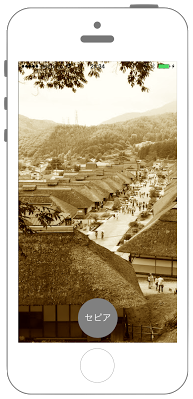

# セピア処理



## Swift 3.0 
```swift
//
//  ViewController.swift
//  CoreImage001
//
//  Created by Misato Morino on 2016/08/15.
//  Copyright © 2016年 Misato Morino. All rights reserved.
//

import UIKit
import CoreImage

class ViewController: UIViewController {
    
    // ベース画像.
    let myInputImage = CIImage(image: UIImage(named: "sample1")!)
    
    // ImageView.
    var myImageView: UIImageView!
    
    // ボタン.
    let myButton: UIButton = UIButton()
    
    override func viewDidLoad() {
        super.viewDidLoad()
        
        // UIImageViewの生成.
        myImageView = UIImageView(frame: CGRect(x: 0, y: 0, width: self.view.frame.size.width, height: self.view.frame.size.height))
        myImageView.image = UIImage(ciImage: myInputImage!)
        self.view.addSubview(myImageView)
        
        // ボタン.
        myButton.frame = CGRect(x: 0, y: 0, width: 80, height: 80)
        myButton.backgroundColor = UIColor.gray
        myButton.layer.masksToBounds = true
        myButton.setTitle("セピア", for: UIControlState.normal)
        myButton.setTitleColor(UIColor.white, for: UIControlState.normal)
        myButton.layer.cornerRadius = 40.0
        myButton.layer.position = CGPoint(x: self.view.frame.width/2, y:self.view.frame.height - 50)
        myButton.tag = 1
        myButton.addTarget(self, action: #selector(ViewController.onClickMyButton(sender:)), for: .touchUpInside)
        
        // 背景色を黒.
        self.view.backgroundColor = UIColor.black
        
        // UIボタンをViewに追加
        self.view.addSubview(myButton);
    }
    
    // ボタンイベント..
    func onClickMyButton(sender: UIButton){
        
        // カラーエフェクトを指定してCIFilterをインスタンス化.
        let mySepiaFilter = CIFilter(name: "CISepiaTone")
        
        // イメージのセット.
        mySepiaFilter!.setValue(myInputImage, forKey: kCIInputImageKey)
        
        // 加工の度合い.
        mySepiaFilter!.setValue(1.0, forKey: kCIInputIntensityKey)
        
        // フィルターを通した画像をアウトプット.
        let myOutputImage : CIImage = mySepiaFilter!.outputImage!
        
        // 再びUIViewにセット.
        myImageView.image = UIImage(ciImage: myOutputImage)
        
        // 再描画.
        myImageView.setNeedsDisplay()
        
    }
    
} 
```

# Swift 2.3 
```swift
//
//  ViewController.swift
//  CoreImage001
//
//  Created by Misato Morino on 2016/08/15.
//  Copyright © 2016年 Misato Morino. All rights reserved.
//

import UIKit
import CoreImage

class ViewController: UIViewController {
    
    // ベース画像.
    let myInputImage = CIImage(image: UIImage(named: "sample1")!)
    
    // ImageView.
    var myImageView: UIImageView!
    
    // ボタン.
    let myButton: UIButton = UIButton()
    
    override func viewDidLoad() {
        super.viewDidLoad()
        
        // UIImageViewの生成.
        myImageView = UIImageView(frame: CGRectMake(0, 0, self.view.frame.size.width, self.view.frame.size.height))
        myImageView.image = UIImage(CIImage: myInputImage!)
        self.view.addSubview(myImageView)
        
        // ボタン.
        myButton.frame = CGRectMake(0,0,80,80)
        myButton.backgroundColor = UIColor.grayColor();
        myButton.layer.masksToBounds = true
        myButton.setTitle("セピア", forState: UIControlState.Normal)
        myButton.setTitleColor(UIColor.whiteColor(), forState: UIControlState.Normal)
        myButton.layer.cornerRadius = 40.0
        myButton.layer.position = CGPoint(x: self.view.frame.width/2, y:self.view.frame.height - 50)
        myButton.tag = 1
        myButton.addTarget(self, action: #selector(ViewController.onClickMyButton(_:)), forControlEvents: .TouchUpInside)
        
        // 背景色を黒.
        self.view.backgroundColor = UIColor.blackColor()
        
        // UIボタンをViewに追加
        self.view.addSubview(myButton);
    }
    
    // ボタンイベント..
    func onClickMyButton(sender: UIButton){
        
        // カラーエフェクトを指定してCIFilterをインスタンス化.
        let mySepiaFilter = CIFilter(name: "CISepiaTone")
        
        // イメージのセット.
        mySepiaFilter!.setValue(myInputImage, forKey: kCIInputImageKey)
        
        // 加工の度合い.
        mySepiaFilter!.setValue(1.0, forKey: kCIInputIntensityKey)
        
        // フィルターを通した画像をアウトプット.
        let myOutputImage : CIImage = mySepiaFilter!.outputImage!
        
        // 再びUIViewにセット.
        myImageView.image = UIImage(CIImage: myOutputImage)
        
        // 再描画.
        myImageView.setNeedsDisplay()
        
    } 
}
```

## 2.xと3.xの差分
* ```init(CIImage:)``` から ```init(ciImage:)``` に変更

## Reference

* CIFilter
    * [https://developer.apple.com/reference/coreimage/cifilter](https://developer.apple.com/reference/coreimage/cifilter)
* CIImage
    * [https://developer.apple.com/reference/coreimage/ciimage](https://developer.apple.com/reference/coreimage/ciimage)
