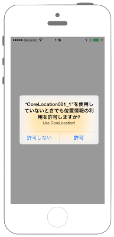
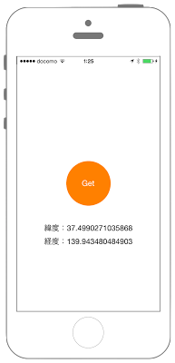

# 現在の位置情報の取得




## カスタマイズ
* このアプリの使用中のみ許可(NSLocationWhenInUseUsageDescription)
* 常に許可(NSLocationAlwaysUsageDescription)

info.plist

```json
<key>NSLocationWhenInUseUsageDescription</key>
<string>位置情報の取得を、このアプリ使用時のみ許可しますか？</string>
```

プログラムの変更点
```swift
        // セキュリティ認証のステータスを取得.
        let status = CLLocationManager.authorizationStatus()
        print("authorizationStatus:\(status)");
   
        // まだ認証が得られていない場合は、認証ダイアログを表示
        // (このAppの使用中のみ許可の設定)
        if(status == notDetermined) {
           self.myLocationManager.requestWhenInUseAuthorization()
        }
```

```json
<key>NSLocationAlwaysUsageDescription</key>
<string>位置情報の取得を、常に許可しますか？</string>
```

プログラムの変更点
```swift
        // セキュリティ認証のステータスを取得.
        let status = CLLocationManager.authorizationStatus()
        print("authorizationStatus:\(status)");
   
        // まだ認証が得られていない場合は、認証ダイアログを表示
        // (このAppの使用中のみ許可の設定)
        if(status == notDetermined) {
           self.myLocationManager.requestAlwaysAuthorization()
        }

```

## Swift 3.0

```swift
//
//
//  ViewController.swift
//  CoreLocation001
//
//  Copyright © 2016年 FaBo, Inc. All rights reserved.
//

import UIKit
import CoreLocation

class ViewController: UIViewController , CLLocationManagerDelegate{
    
    var myLocationManager: CLLocationManager!
    
    // 緯度表示用のラベル.
    var myLatitudeLabel: UILabel!
    
    // 経度表示用のラベル.
    var myLongitudeLabel: UILabel!
    
    override func viewDidLoad() {
        super.viewDidLoad()
        
        // ボタンの生成.
        let buttonWidth: CGFloat = 100
        let buttonHeight: CGFloat = 100
        let posX: CGFloat = (self.view.bounds.width - buttonWidth)/2
        let posY: CGFloat = (self.view.bounds.height - buttonWidth)/2
        let myButton = UIButton(frame: CGRect(x: posX, y: posY, width: buttonWidth, height: buttonHeight))
        myButton.backgroundColor = UIColor.orange
        myButton.layer.masksToBounds = true
        myButton.layer.cornerRadius = 50.0
        myButton.setTitle("Get", for: .normal)
        myButton.addTarget(self, action: #selector(ViewController.onClickMyButton(sender:)), for: .touchDown)

        // 緯度表示用のラベルを生成.
        myLatitudeLabel = UILabel(frame: CGRect(x: 0, y: 0, width: self.view.bounds.width, height: 30))
        myLatitudeLabel.layer.position = CGPoint(x: self.view.bounds.width/2, y:self.view.bounds.height/2+100)
        
        // 軽度表示用のラベルを生成.
        myLongitudeLabel = UILabel(frame: CGRect(x: 0, y: 0, width: self.view.bounds.width, height: 30))
        myLongitudeLabel.layer.position = CGPoint(x: self.view.bounds.width/2, y:self.view.bounds.height/2+130)
        
        
        // 現在地の取得.
        myLocationManager = CLLocationManager()
        
        myLocationManager.delegate = self
        
        // セキュリティ認証のステータスを取得.
        let status = CLLocationManager.authorizationStatus()
        print("authorizationStatus:\(status.rawValue)");
        
        // まだ認証が得られていない場合は、認証ダイアログを表示
        // (このAppの使用中のみ許可の設定) 説明を共通の項目を参照
        if(status == .notDetermined) {
            self.myLocationManager.requestWhenInUseAuthorization()
        }
        
        // 取得精度の設定.
        myLocationManager.desiredAccuracy = kCLLocationAccuracyBest
        // 取得頻度の設定.
        myLocationManager.distanceFilter = 100
        
        self.view.addSubview(myButton)
    }
    
    /*
     認証に変化があった際に呼ばれる
     */
    private func locationManager(manager: CLLocationManager, didChangeAuthorizationStatus status: CLAuthorizationStatus) {
        
        print("didChangeAuthorizationStatus");
        
        // 認証のステータスをログで表示.
        var statusStr: String = "";
        switch (status) {
        case .notDetermined:
            statusStr = "未認証の状態"
        case .restricted:
            statusStr = "Restricted"
        case .denied:
            statusStr = "許可しない"
        case .authorizedAlways:
            statusStr = "常に使用を許可"
        case .authorizedWhenInUse:
            statusStr = "このAppの使用中のみ許可"
        }
        print(" CLAuthorizationStatus: \(statusStr)")
    }
    
    /*
     ボタンイベントのセット.
     */
    func onClickMyButton(sender: UIButton){
        // 現在位置の取得を開始.
        myLocationManager.startUpdatingLocation()
    }
    
    /*
     位置情報取得に成功したときに呼び出されるデリゲート.
     */
    private func locationManager(manager: CLLocationManager, didUpdateLocations locations: [CLLocation]) {
        // 緯度・経度の表示.
        myLatitudeLabel.text = "緯度：\(manager.location!.coordinate.latitude)"
        myLatitudeLabel.textAlignment = .center
        
        myLongitudeLabel.text = "経度：\(manager.location!.coordinate.longitude)"
        myLongitudeLabel.textAlignment = .center
        
        
        self.view.addSubview(myLatitudeLabel)
        self.view.addSubview(myLongitudeLabel)
        
    }
    
    /*
     位置情報取得に失敗した時に呼び出されるデリゲート.
     */
    func locationManager(_ manager: CLLocationManager,didFailWithError error: Error){
        print("error")
    }
    
}
```

# Swift 2.3

```swift
//
//
//  ViewController.swift
//  CoreLocation001
//
//  Copyright © 2016年 FaBo, Inc. All rights reserved.
//

import UIKit
import CoreLocation

class ViewController: UIViewController , CLLocationManagerDelegate{
    
    var myLocationManager: CLLocationManager!
    
    // 緯度表示用のラベル.
    var myLatitudeLabel: UILabel!
    
    // 経度表示用のラベル.
    var myLongitudeLabel: UILabel!
    
    override func viewDidLoad() {
        super.viewDidLoad()
        
        // ボタンの生成.
        let buttonWidth: CGFloat = 100
        let buttonHeight: CGFloat = 100
        let posX: CGFloat = (self.view.bounds.width - buttonWidth)/2
        let posY: CGFloat = (self.view.bounds.height - buttonWidth)/2
        let myButton = UIButton(frame: CGRect(x: posX, y: posY, width: buttonWidth, height: buttonHeight))
        myButton.backgroundColor = UIColor.orangeColor()
        myButton.layer.masksToBounds = true
        myButton.layer.cornerRadius = 50.0
        myButton.setTitle("Get", forState: .Normal)
        myButton.addTarget(self, action: #selector(onClickMyButton(_:)), forControlEvents: .TouchUpInside)
        
        // 緯度表示用のラベルを生成.
        myLatitudeLabel = UILabel(frame: CGRect(x: 0, y: 0, width: self.view.bounds.width, height: 30))
        myLatitudeLabel.layer.position = CGPoint(x: self.view.bounds.width/2, y:self.view.bounds.height/2+100)
        
        // 軽度表示用のラベルを生成.
        myLongitudeLabel = UILabel(frame: CGRect(x: 0, y: 0, width: self.view.bounds.width, height: 30))
        myLongitudeLabel.layer.position = CGPoint(x: self.view.bounds.width/2, y:self.view.bounds.height/2+130)
        
        
        // 現在地の取得.
        myLocationManager = CLLocationManager()
        
        myLocationManager.delegate = self
        
        // セキュリティ認証のステータスを取得.
        let status = CLLocationManager.authorizationStatus()
        print("authorizationStatus:\(status)");
   
        // まだ認証が得られていない場合は、認証ダイアログを表示
        // (このAppの使用中のみ許可の設定) 説明を共通の項目を参照
        if(status == .NotDetermined) {
           self.myLocationManager.requestWhenInUseAuthorization()
        }
        
        // 取得精度の設定.
        myLocationManager.desiredAccuracy = kCLLocationAccuracyBest
        // 取得頻度の設定.
        myLocationManager.distanceFilter = 100
        
        self.view.addSubview(myButton)
    }
    
    /*
     認証に変化があった際に呼ばれる
     */
    func locationManager(manager: CLLocationManager, didChangeAuthorizationStatus status: CLAuthorizationStatus) {
        
        print("didChangeAuthorizationStatus");
        
        // 認証のステータスをログで表示.
        var statusStr: String = "";
        switch (status) {
        case .NotDetermined:
            statusStr = "未認証の状態"
        case .Restricted:
            statusStr = "Restricted"
        case .Denied:
            statusStr = "許可しない"
        case .AuthorizedAlways:
            statusStr = "AuthorizedAlways"
        case .AuthorizedWhenInUse:
            statusStr = "このAppの使用中のみ許可"
        }
        print(" CLAuthorizationStatus: \(statusStr)")
    }
    
    /*
     ボタンイベントのセット.
    */
    func onClickMyButton(sender: UIButton){
        // 現在位置の取得を開始.
        myLocationManager.startUpdatingLocation()
    }
    
    /*
     位置情報取得に成功したときに呼び出されるデリゲート.
    */
    func locationManager(manager: CLLocationManager, didUpdateLocations locations: [CLLocation]) {
        // 緯度・経度の表示.
        myLatitudeLabel.text = "緯度：\(manager.location!.coordinate.latitude)"
        myLatitudeLabel.textAlignment = .Center
        
        myLongitudeLabel.text = "経度：\(manager.location!.coordinate.longitude)"
        myLongitudeLabel.textAlignment = .Center
        
        
        self.view.addSubview(myLatitudeLabel)
        self.view.addSubview(myLongitudeLabel)
        
    }
        
    /*
     位置情報取得に失敗した時に呼び出されるデリゲート.
    */
    func locationManager(manager: CLLocationManager,didFailWithError error: NSError){
        print("error")
    }
    
}

```

## 2.xと3.xの差分

* 大きな修正はなし

## Reference

* CoreLocation
	* [https://developer.apple.com/reference/corelocation](https://developer.apple.com/reference/corelocation)