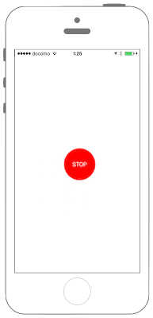

# iBeaconをアドバタイジング




## カスタマイズ


## Swift 3.0

```swift
//
//  ViewController.swift
//  CoreLocation002
//
//  Copyright © 2016年 FaBo, Inc. All rights reserved.
//

import UIKit
import CoreLocation
import CoreBluetooth

class ViewController: UIViewController, CBPeripheralManagerDelegate {
    
    // PheripheralManager.
    var myPheripheralManager:CBPeripheralManager!
    
    // Button.
    var myButton: UIButton!
    
    // Flag.
    var isAdvertising: Bool!
    
    override func viewDidLoad() {
        super.viewDidLoad()
        
        // PeripheralManagerを定義.
        myPheripheralManager = CBPeripheralManager()
        myPheripheralManager.delegate = self
        
        // ボタンの生成.
        let buttonWidth: CGFloat = 100
        let buttonHeight: CGFloat = 100
        let posX: CGFloat = (self.view.bounds.width - buttonWidth)/2
        let posY: CGFloat = (self.view.bounds.height - buttonWidth)/2
        myButton = UIButton(frame: CGRect(x: posX, y: posY, width: buttonWidth, height: buttonHeight))
        myButton.backgroundColor = UIColor.orange
        myButton.layer.masksToBounds = true
        myButton.layer.cornerRadius = 50.0
        myButton.setTitle("Advertising", for: .normal)
        myButton.addTarget(self, action: #selector(onClickMyButton(sender:)), for: .touchDown)
        
        isAdvertising = false
        
        self.view.addSubview(myButton)
    }
    
    /*
     Peripheralの準備ができたら呼び出される.
     */
    func peripheralManagerDidUpdateState(_ peripheral: CBPeripheralManager) {
        print("peripheralManagerDidUpdateState")
    }
    
    /*
     ボタンイベントのセット.
     */
    func onClickMyButton(sender: UIButton){
        
        if(!isAdvertising) {
            // iBeaconのUUID.
            let myProximityUUID = NSUUID(uuidString: "9EDFA660-204E-4066-8644-A432AE2B6EC2")
            
            // iBeaconのIdentifier.
            let myIdentifier = "fabo2"
            
            // Major.
            let myMajor : CLBeaconMajorValue = 1
            
            // Minor.
            let myMinor : CLBeaconMinorValue = 2
            
            // BeaconRegionを定義.
            let myBeaconRegion = CLBeaconRegion(proximityUUID: myProximityUUID! as UUID, major: myMajor, minor: myMinor, identifier: myIdentifier)
            
            // Advertisingのフォーマットを作成.
            let myBeaconPeripheralData = NSDictionary(dictionary: myBeaconRegion.peripheralData(withMeasuredPower: nil))
            
            
            // Advertisingを発信.
            myPheripheralManager.startAdvertising(myBeaconPeripheralData as? [String : AnyObject])
        } else {
            
            myPheripheralManager.stopAdvertising()
            
            isAdvertising = false
            myButton.setTitle("Advertising", for: .normal)
            myButton.backgroundColor = UIColor.orange
        }
    }
    
    /*
     Advertisingが始まると呼ばれる.
     */
    func peripheralManagerDidStartAdvertising(_ peripheral: CBPeripheralManager, error: Error?) {
        print("peripheralManagerDidStartAdvertising")
        
        isAdvertising = true
        myButton.setTitle("STOP", for: .normal)
        myButton.backgroundColor = UIColor.red
    }
    
    
}
```

# Swift 2.3

```swift
//
//  ViewController.swift
//  CoreLocation002
//
//  Copyright © 2016年 FaBo, Inc. All rights reserved.
//

import UIKit
import CoreLocation
import CoreBluetooth

class ViewController: UIViewController, CBPeripheralManagerDelegate {
    
    // PheripheralManager.
    var myPheripheralManager:CBPeripheralManager!
    
    // Button.
    var myButton: UIButton!
    
    // Flag.
    var isAdvertising: Bool!
    
    override func viewDidLoad() {
        super.viewDidLoad()
        
        // PeripheralManagerを定義.
        myPheripheralManager = CBPeripheralManager()
        myPheripheralManager.delegate = self
        
        // ボタンの生成.
        let buttonWidth: CGFloat = 100
        let buttonHeight: CGFloat = 100
        let posX: CGFloat = (self.view.bounds.width - buttonWidth)/2
        let posY: CGFloat = (self.view.bounds.height - buttonWidth)/2
        myButton = UIButton(frame: CGRect(x: posX, y: posY, width: buttonWidth, height: buttonHeight))
        myButton.backgroundColor = UIColor.orangeColor()
        myButton.layer.masksToBounds = true
        myButton.layer.cornerRadius = 50.0
        myButton.setTitle("Advertising", forState: .Normal)
        myButton.addTarget(self, action: #selector(onClickMyButton(_:)), forControlEvents: .TouchUpInside)
        
        isAdvertising = false
        
        self.view.addSubview(myButton)
    }
    
    /*
     Peripheralの準備ができたら呼び出される.
    */
    func peripheralManagerDidUpdateState(peripheral: CBPeripheralManager) {
        print("peripheralManagerDidUpdateState")
    }
    
    /*
     ボタンイベントのセット.
     */
    func onClickMyButton(sender: UIButton){
        
        if(!isAdvertising) {
            // iBeaconのUUID.
            let myProximityUUID = NSUUID(UUIDString: "9EDFA660-204E-4066-8644-A432AE2B6EC2")
        
            // iBeaconのIdentifier.
            let myIdentifier = "fabo2"
        
            // Major.
            let myMajor : CLBeaconMajorValue = 1
        
            // Minor.
            let myMinor : CLBeaconMinorValue = 2
        
            // BeaconRegionを定義.
            let myBeaconRegion = CLBeaconRegion(proximityUUID: myProximityUUID!, major: myMajor, minor: myMinor, identifier: myIdentifier)
        
            // Advertisingのフォーマットを作成.
            let myBeaconPeripheralData = NSDictionary(dictionary: myBeaconRegion.peripheralDataWithMeasuredPower(nil))
        
        
            // Advertisingを発信.
            myPheripheralManager.startAdvertising(myBeaconPeripheralData as? [String : AnyObject])
        } else {
            
            myPheripheralManager.stopAdvertising()
            
            isAdvertising = false
            myButton.setTitle("Advertising", forState: .Normal)
            myButton.backgroundColor = UIColor.orangeColor()
        }
    }
    
    /*
     Advertisingが始まると呼ばれる.
    */
    func peripheralManagerDidStartAdvertising(peripheral: CBPeripheralManager, error: NSError?) {
        print("peripheralManagerDidStartAdvertising")

        isAdvertising = true
        myButton.setTitle("STOP", forState: .Normal)
        myButton.backgroundColor = UIColor.redColor()
    }

    
}
```

## 2.xと3.xの差分

* `peripheralManagerDidUpdateState(peripheral:...`が`peripheralManagerDidUpdateState(_ peripheral:...`に変更.
* `peripheralManagerDidStartAdvertising(peripheral:...`が`peripheralManagerDidUpdateState(_ peripheral:...`に変更.

## Reference

* CoreLocation
	* [https://developer.apple.com/reference/corelocation](https://developer.apple.com/reference/corelocation)
    * [https://developer.apple.com/reference/corebluetooth](https://developer.apple.com/reference/corebluetooth)