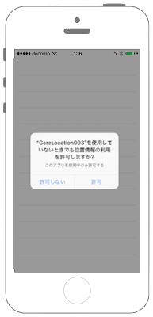

# iBeaconをモニタリングする




## 事前準備


## カスタマイズ

iBeaconをモニタリングする場合は、

* 常に許可(NSLocationAlwaysUsageDescription)

に設定する必要がある。

```json
<key>NSLocationAlwaysUsageDescription</key>
<string>位置情報の取得を、常に許可しますか？</string>
```

プログラムの変更点
```swift
        // セキュリティ認証のステータスを取得.
        let status = CLLocationManager.authorizationStatus()
        print("authorizationStatus:\(status)");
   
        // まだ認証が得られていない場合は、認証ダイアログを表示
        // (このAppの使用中のみ許可の設定)
        if(status == notDetermined) {
           self.myLocationManager.requestAlwaysAuthorization()
        }

```

## Swift 3.0

```swift
//
//
//  ViewController.swift
//  CoreLocation002
//
//  Copyright © 2016年 FaBo, Inc. All rights reserved.
//

import UIKit
import CoreLocation

class ViewController: UIViewController, CLLocationManagerDelegate, UITableViewDelegate, UITableViewDataSource {
    
    var myLocationManager:CLLocationManager!
    var myBeaconRegion:CLBeaconRegion!
    var beaconUuids: NSMutableArray!
    var beaconDetails: NSMutableArray!
    var myTableView: UITableView!
    
    // 今回の検知対象は3つのUUID。(OS等のバージョンで検出可能な上限数は20個程度が目安)
    let UUIDList = [
        "9EDFA660-204E-4066-8644-A432AE2B6EC1",
        "9EDFA660-204E-4066-8644-A432AE2B6EC2",
        "9EDFA660-204E-4066-8644-A432AE2B6EC3"
    ]
    
    override func viewDidLoad() {
        super.viewDidLoad()
        
        // Table View.
        let barHeight: CGFloat = UIApplication.shared.statusBarFrame.size.height
        let displayWidth: CGFloat = self.view.frame.width
        let displayHeight: CGFloat = self.view.frame.height
        myTableView = UITableView(frame: CGRect(x: 0, y: barHeight, width: displayWidth, height: displayHeight))
        myTableView.register(UITableViewCell.self, forCellReuseIdentifier: "MyCell")
        myTableView.dataSource = self
        myTableView.delegate = self
        myTableView.rowHeight = 50
        self.view.addSubview(myTableView)
        
        // ロケーションマネージャの作成.
        myLocationManager = CLLocationManager()
        
        // デリゲートを自身に設定.
        myLocationManager.delegate = self
        
        // 取得精度の設定.
        myLocationManager.desiredAccuracy = kCLLocationAccuracyBest
        
        // 取得頻度の設定.(1mごとに位置情報取得)
        myLocationManager.distanceFilter = 1
        
        // セキュリティ認証のステータスを取得
        let status = CLLocationManager.authorizationStatus()
        print("CLAuthorizedStatus: \(status.rawValue)");
        
        // まだ認証が得られていない場合は、認証ダイアログを表示
        if(status == .notDetermined) {
            // [認証手順1] まだ承認が得られていない場合は、認証ダイアログを表示.
            // [認証手順2] が呼び出される
            myLocationManager.requestAlwaysAuthorization()
        }
        
        // 配列をリセット
        beaconUuids = NSMutableArray()
        beaconDetails = NSMutableArray()
    }
    
    /*
     CoreLocationの利用許可が取れたらiBeaconの検出を開始する.
     */
    private func startMyMonitoring() {
        
        // UUIDListのUUIDを設定して、反応するようにする
        for i in 0 ..< UUIDList.count {
            
            // BeaconのUUIDを設定.
            let uuid: NSUUID! = NSUUID(uuidString: "\(UUIDList[i].lowercased())")

            // BeaconのIfentifierを設定.
            let identifierStr: String = "fabo\(i)"
            
            // リージョンを作成.
            myBeaconRegion = CLBeaconRegion(proximityUUID: uuid as UUID, identifier: identifierStr)
            
            // ディスプレイがOffでもイベントが通知されるように設定(trueにするとディスプレイがOnの時だけ反応).
            myBeaconRegion.notifyEntryStateOnDisplay = false
            
            // 入域通知の設定.
            myBeaconRegion.notifyOnEntry = true
            
            // 退域通知の設定.
            myBeaconRegion.notifyOnExit = true
            
            // [iBeacon 手順1] iBeaconのモニタリング開始([iBeacon 手順2]がDelegateで呼び出される).
            myLocationManager.startMonitoring(for: myBeaconRegion)
        }
    }
    
    /*
     [認証手順2] 認証のステータスがかわったら呼び出される.
     */
    func locationManager(_ manager: CLLocationManager, didChangeAuthorization status: CLAuthorizationStatus) {
        
        print("didChangeAuthorizationStatus");
        
        // 認証のステータスをログで表示
        switch (status) {
        case .notDetermined:
            print("未認証の状態")
            break
        case .restricted:
            print("制限された状態")
            break
        case .denied:
            print("許可しない")
            break
        case .authorizedAlways:
            print("常に許可")
            // 許可がある場合はiBeacon検出を開始.
            startMyMonitoring()
            break
        case .authorizedWhenInUse:
            print("このAppの使用中のみ許可")
            // 許可がある場合はiBeacon検出を開始.
            startMyMonitoring()
            break
        }
    }
    
    /*
     [iBeacon 手順2]  startMyMonitoring()内のでstartMonitoringForRegionが正常に開始されると呼び出される。
     */
    func locationManager(_ manager: CLLocationManager, didStartMonitoringFor region: CLRegion) {
        
        print("[iBeacon 手順2] didStartMonitoringForRegion");
        
        // [iBeacon 手順3] この時点でビーコンがすでにRegion内に入っている可能性があるので、その問い合わせを行う
        // [iBeacon 手順4] がDelegateで呼び出される.
        manager.requestState(for: region);
    }
    
    /*
     [iBeacon 手順4] 現在リージョン内にiBeaconが存在するかどうかの通知を受け取る.
     */
    func locationManager(_ manager: CLLocationManager, didDetermineState state: CLRegionState, for region: CLRegion) {
        
        print("[iBeacon 手順4] locationManager: didDetermineState \(state)")
        
        switch (state) {
            
        case .inside: // リージョン内にiBeaconが存在いる
            print("iBeaconが存在!");
            
            // [iBeacon 手順5] すでに入っている場合は、そのままiBeaconのRangingをスタートさせる。
            // [iBeacon 手順6] がDelegateで呼び出される.
            // iBeaconがなくなったら、Rangingを停止する
            manager.startRangingBeacons(in: region as! CLBeaconRegion)
            break;
            
        case .outside:
            print("iBeaconが圏外!")
            // 外にいる、またはUknownの場合はdidEnterRegionが適切な範囲内に入った時に呼ばれるため処理なし。
            break;
            
        case .unknown:
            print("iBeaconが圏外もしくは不明な状態!")
            // 外にいる、またはUknownの場合はdidEnterRegionが適切な範囲内に入った時に呼ばれるため処理なし。
            break;
            
        }
    }
    
    /*
     [iBeacon 手順6] 現在取得しているiBeacon情報一覧が取得できる.
     iBeaconを検出していなくても1秒ごとに呼ばれる.
     */
    func locationManager(_ manager: CLLocationManager, didRangeBeacons beacons: [CLBeacon], in region: CLBeaconRegion) {
        
        // 配列をリセット
        beaconUuids = NSMutableArray()
        beaconDetails = NSMutableArray()
        
        // 範囲内で検知されたビーコンはこのbeaconsにCLBeaconオブジェクトとして格納される
        // rangingが開始されると１秒毎に呼ばれるため、beaconがある場合のみ処理をするようにすること.
        if(beacons.count > 0){
            
            // STEP7: 発見したBeaconの数だけLoopをまわす
            for i in 0 ..< beacons.count {
                
                let beacon = beacons[i]
                
                let beaconUUID = beacon.proximityUUID;
                let minorID = beacon.minor;
                let majorID = beacon.major;
                let rssi = beacon.rssi;
                
                //print("UUID: \(beaconUUID.UUIDString) minorID: \(minorID) majorID: \(majorID)");
                
                var proximity = ""
                
                switch (beacon.proximity) {
                    
                case CLProximity.unknown :
                    print("Proximity: Unknown");
                    proximity = "Unknown"
                    break
                    
                case CLProximity.far:
                    print("Proximity: Far");
                    proximity = "Far"
                    break
                    
                case CLProximity.near:
                    print("Proximity: Near");
                    proximity = "Near"
                    break
                    
                case CLProximity.immediate:
                    print("Proximity: Immediate");
                    proximity = "Immediate"
                    break
                }
                
                beaconUuids.add(beaconUUID.uuidString)
                
                var myBeaconDetails = "Major: \(majorID) "
                myBeaconDetails += "Minor: \(minorID) "
                myBeaconDetails += "Proximity:\(proximity) "
                myBeaconDetails += "RSSI:\(rssi)"
                print(myBeaconDetails)
                beaconDetails.add(myBeaconDetails)
                
            }
        }
        
        // TableViewのReflesh.
        myTableView.reloadData()
        
        
    }
    
    /*
     [iBeacon イベント] iBeaconを検出した際に呼ばれる.
     */
    func locationManager(_ manager: CLLocationManager, didEnterRegion region: CLRegion) {
        print("didEnterRegion: iBeaconが圏内に発見されました。");
        
        // Rangingを始める (Ranginghあ1秒ごとに呼ばれるので、検出中のiBeaconがなくなったら止める)
        manager.startRangingBeacons(in: region as! CLBeaconRegion)
    }
    
    /*
     [iBeacon イベント] iBeaconを喪失した際に呼ばれる. 喪失後 30秒ぐらいあとに呼び出される.
     */
    func locationManager(_ manager: CLLocationManager, didExitRegion region: CLRegion) {
        print("didExitRegion: iBeaconが圏外に喪失されました。");
        
        // 検出中のiBeaconが存在しないのなら、iBeaconのモニタリングを終了する.
        manager.stopRangingBeacons(in: region as! CLBeaconRegion)
    }
    
    /*
     Cellが選択された際に呼び出される
     */
    func tableView(_ tableView: UITableView, didSelectRowAt indexPath: IndexPath) {
        print("Num: \(indexPath.row)")
        print("Value: \(beaconUuids[indexPath.row])")
    }
    
    /*
     Cellの総数を返す.
     */
    func tableView(_ tableView: UITableView, numberOfRowsInSection section: Int) -> Int {
        return beaconUuids.count
    }
    
    /*
     Cellに値を設定する
     */
    func tableView(_ tableView: UITableView, cellForRowAt indexPath: IndexPath) -> UITableViewCell {
        // 再利用するCellを取得する.
        let cell: UITableViewCell = UITableViewCell(style: UITableViewCellStyle.subtitle, reuseIdentifier: "Cell")
        
        // Cellに値を設定する.
        cell.textLabel?.numberOfLines = 0
        cell.textLabel!.font = UIFont(name: "Arial", size: 15)
        cell.textLabel!.textColor = UIColor.blue
        cell.textLabel!.text = beaconUuids[indexPath.row] as? String
        cell.detailTextLabel!.text = beaconDetails[indexPath.row] as? String
        
        return cell
    }
    
}

```

# Swift 2.3

```swift
//
//
//  ViewController.swift
//  CoreLocation002
//
//  Copyright © 2016年 FaBo, Inc. All rights reserved.
//

import UIKit
import CoreLocation

class ViewController: UIViewController, CLLocationManagerDelegate, UITableViewDelegate, UITableViewDataSource {
    
    var myLocationManager:CLLocationManager!
    var myBeaconRegion:CLBeaconRegion!
    var beaconUuids: NSMutableArray!
    var beaconDetails: NSMutableArray!
    var myTableView: UITableView!

    // 今回の検知対象は3つのUUID。(OS等のバージョンで検出可能な上限数は20個程度が目安)
    let UUIDList = [
        "cb86bc31-05bd-40cc-906d-1c9bd13d966a",
        "9EDFA660-204E-4066-8644-A432AE2B6EC2",
        "9EDFA660-204E-4066-8644-A432AE2B6EC3"
        ]
    
    override func viewDidLoad() {
        super.viewDidLoad()
        
        // Table View.
        let barHeight: CGFloat = UIApplication.sharedApplication().statusBarFrame.size.height
        let displayWidth: CGFloat = self.view.frame.width
        let displayHeight: CGFloat = self.view.frame.height
        myTableView = UITableView(frame: CGRectMake(0, barHeight, displayWidth, displayHeight))
        myTableView.registerClass(UITableViewCell.self, forCellReuseIdentifier: "MyCell")
        myTableView.dataSource = self
        myTableView.delegate = self
        myTableView.rowHeight = 50
        self.view.addSubview(myTableView)
        
        // ロケーションマネージャの作成.
        myLocationManager = CLLocationManager()
        
        // デリゲートを自身に設定.
        myLocationManager.delegate = self
        
        // 取得精度の設定.
        myLocationManager.desiredAccuracy = kCLLocationAccuracyBest
        
        // 取得頻度の設定.(1mごとに位置情報取得)
        myLocationManager.distanceFilter = 1
        
        // セキュリティ認証のステータスを取得
        let status = CLLocationManager.authorizationStatus()
        print("CLAuthorizedStatus: \(status)");

        // まだ認証が得られていない場合は、認証ダイアログを表示
        if(status == .NotDetermined) {
            // [認証手順1] まだ承認が得られていない場合は、認証ダイアログを表示.
            // [認証手順2] が呼び出される
            myLocationManager.requestAlwaysAuthorization()
        }
        
        // 配列をリセット
        beaconUuids = NSMutableArray()
        beaconDetails = NSMutableArray()
    }
    
    /*
     CoreLocationの利用許可が取れたらiBeaconの検出を開始する.
    */
    private func startMyMonitoring() {
        
        // UUIDListのUUIDを設定して、反応するようにする
        for i in 0 ..< UUIDList.count {
            
            // BeaconのUUIDを設定.
            let uuid: NSUUID! = NSUUID(UUIDString: "\(UUIDList[i].lowercaseString)")

            // BeaconのIfentifierを設定.
            let identifierStr: String = "fabo\(i)"
            
            // リージョンを作成.
            myBeaconRegion = CLBeaconRegion(proximityUUID: uuid, identifier: identifierStr)
            
            // ディスプレイがOffでもイベントが通知されるように設定(trueにするとディスプレイがOnの時だけ反応).
            myBeaconRegion.notifyEntryStateOnDisplay = false
            
            // 入域通知の設定.
            myBeaconRegion.notifyOnEntry = true
            
            // 退域通知の設定.
            myBeaconRegion.notifyOnExit = true
            
            // [iBeacon 手順1] iBeaconのモニタリング開始([iBeacon 手順2]がDelegateで呼び出される).
            myLocationManager.startMonitoringForRegion(myBeaconRegion)
        }
    }
    
    /*
      [認証手順2] 認証のステータスがかわったら呼び出される.
     */
    func locationManager(manager: CLLocationManager, didChangeAuthorizationStatus status: CLAuthorizationStatus) {
        
        print("didChangeAuthorizationStatus");
        
        // 認証のステータスをログで表示
        switch (status) {
        case .NotDetermined:
            print("未認証の状態")
            break
        case .Restricted:
            print("制限された状態")
            break
        case .Denied:
            print("許可しない")
            break
        case .AuthorizedAlways:
            print("常に許可")
            // 許可がある場合はiBeacon検出を開始.
            startMyMonitoring()
            break
        case .AuthorizedWhenInUse:
            print("このAppの使用中のみ許可")
            // 許可がある場合はiBeacon検出を開始.
            startMyMonitoring()
            break
        }
    }
    
    /*
     [iBeacon 手順2]  startMyMonitoring()内のでstartMonitoringForRegionが正常に開始されると呼び出される。
     */
    func locationManager(manager: CLLocationManager, didStartMonitoringForRegion region: CLRegion) {
        
        print("[iBeacon 手順2] didStartMonitoringForRegion");
        
        // [iBeacon 手順3] この時点でビーコンがすでにRegion内に入っている可能性があるので、その問い合わせを行う
        // [iBeacon 手順4] がDelegateで呼び出される.
        manager.requestStateForRegion(region);
    }
    
    /*
     [iBeacon 手順4] 現在リージョン内にiBeaconが存在するかどうかの通知を受け取る.
     */
    func locationManager(manager: CLLocationManager, didDetermineState state: CLRegionState, forRegion region: CLRegion) {
        
        print("[iBeacon 手順4] locationManager: didDetermineState \(state)")
        
        switch (state) {
            
        case .Inside: // リージョン内にiBeaconが存在いる
            print("iBeaconが存在!");
            
            // [iBeacon 手順5] すでに入っている場合は、そのままiBeaconのRangingをスタートさせる。
            // [iBeacon 手順6] がDelegateで呼び出される.
            manager.startRangingBeaconsInRegion(region as! CLBeaconRegion)
            break;
            
        case .Outside:
            print("iBeaconが圏外!")
            // 外にいる、またはUknownの場合はdidEnterRegionが適切な範囲内に入った時に呼ばれるため処理なし。
            break;
            
        case .Unknown:
            print("iBeaconが圏外もしくは不明な状態!")
            // 外にいる、またはUknownの場合はdidEnterRegionが適切な範囲内に入った時に呼ばれるため処理なし。
            break;
            
        }
    }
    
    /*
     [iBeacon 手順6] 現在取得しているiBeacon情報一覧が取得できる.
     iBeaconを検出していなくても1秒ごとに呼ばれる.
     */
    func locationManager(manager: CLLocationManager, didRangeBeacons beacons: [CLBeacon], inRegion region: CLBeaconRegion) {
                
        // 配列をリセット
        beaconUuids = NSMutableArray()
        beaconDetails = NSMutableArray()
        
        // 範囲内で検知されたビーコンはこのbeaconsにCLBeaconオブジェクトとして格納される
        // rangingが開始されると１秒毎に呼ばれるため、beaconがある場合のみ処理をするようにすること.
        if(beacons.count > 0){
            
            // STEP7: 発見したBeaconの数だけLoopをまわす
            for i in 0 ..< beacons.count {
                
                let beacon = beacons[i]
                
                let beaconUUID = beacon.proximityUUID;
                let minorID = beacon.minor;
                let majorID = beacon.major;
                let rssi = beacon.rssi;
                
                print("UUID: \(beaconUUID.UUIDString) minorID: \(minorID) majorID: \(majorID)");
                
                var proximity = ""
                
                switch (beacon.proximity) {
                    
                case CLProximity.Unknown :
                    print("Proximity: Unknown");
                    proximity = "Unknown"
                    break
                    
                case CLProximity.Far:
                    print("Proximity: Far");
                    proximity = "Far"
                    break
                    
                case CLProximity.Near:
                    print("Proximity: Near");
                    proximity = "Near"
                    break
                    
                case CLProximity.Immediate:
                    print("Proximity: Immediate");
                    proximity = "Immediate"
                    break
                }
                
                beaconUuids.addObject(beaconUUID.UUIDString)
                
                var myBeaconDetails = "Major: \(majorID) "
                myBeaconDetails += "Minor: \(minorID) "
                myBeaconDetails += "Proximity:\(proximity) "
                myBeaconDetails += "RSSI:\(rssi)"
                print(myBeaconDetails)
                beaconDetails.addObject(myBeaconDetails)

            }
            
            // TableDataのReflesh.
            myTableView.reloadData()
            
        } 

    }
    
    /*
     [iBeacon イベント] iBeaconを検出した際に呼ばれる.
     */
    func locationManager(manager: CLLocationManager, didEnterRegion region: CLRegion) {
        print("didEnterRegion");
        
        // Rangingを始める (Ranginghあ1秒ごとに呼ばれるので、検出中のiBeaconがなくなったら止める)
        manager.startRangingBeaconsInRegion(region as! CLBeaconRegion)
        
    }
    
    /*
     [iBeacon イベント] iBeaconを喪失した際に呼ばれる. 
     */
    func locationManager(manager: CLLocationManager, didExitRegion region: CLRegion) {
        print("didExitRegion");

        // iBeaconがなくなったら、Rangingを停止する
        manager.stopRangingBeaconsInRegion(region)
    }
    
    /*
     Cellが選択された際に呼び出される
     */
    func tableView(tableView: UITableView, didSelectRowAtIndexPath indexPath: NSIndexPath) {
        print("Num: \(indexPath.row)")
        print("Value: \(beaconUuids[indexPath.row])")
    }
    
    /*
     Cellの総数を返す.
     */
    func tableView(tableView: UITableView, numberOfRowsInSection section: Int) -> Int {
        return beaconUuids.count
    }
    
    /*
     Cellに値を設定する
     */
    func tableView(tableView: UITableView, cellForRowAtIndexPath indexPath: NSIndexPath) -> UITableViewCell {
        // 再利用するCellを取得する.
        let cell: UITableViewCell = UITableViewCell(style: UITableViewCellStyle.Subtitle, reuseIdentifier: "Cell")

        // Cellに値を設定する.
        cell.textLabel?.numberOfLines = 0
        cell.textLabel!.font = UIFont(name: "Arial", size: 15)
        cell.textLabel!.textColor = UIColor.blueColor()
        cell.textLabel!.text = beaconUuids[indexPath.row] as? String
        cell.detailTextLabel!.text = beaconDetails[indexPath.row] as? String
        
        return cell
    }
    
}
```

## 2.xと3.xの差分

*  `locationManager(manager: ...`が、`locationManager(_ manager: ...` に変更

## Reference

* CoreLocation
	* [https://developer.apple.com/reference/corelocation](https://developer.apple.com/reference/corelocation)