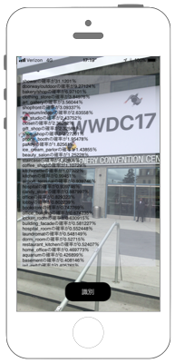
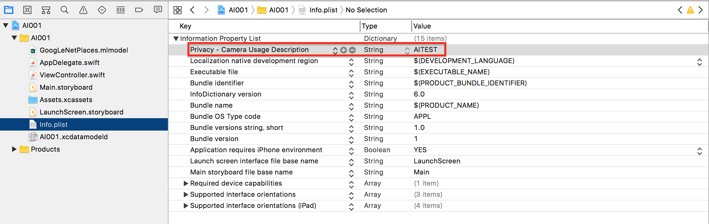
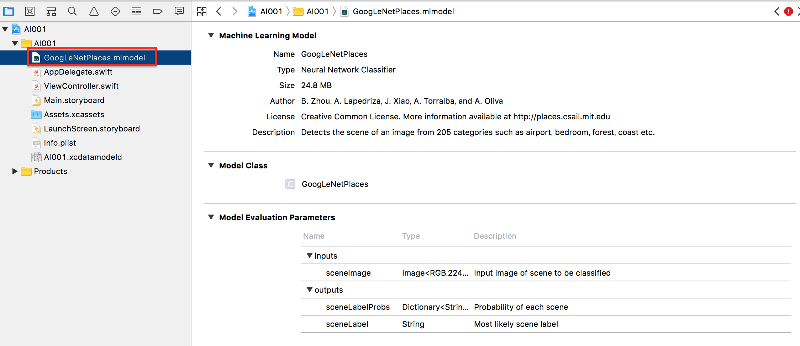

# Places205-GoogLeNetで場所の判定



## Model

[Places205-GoogLeNet](https://docs-assets.developer.apple.com/coreml/models/GoogLeNetPlaces.mlmodel)

## 事前準備

* iOS11
* XCode9
* `Privacy - Camera Usage Description` をInfo.plistに追加する





## Swift 4.0

```swift
//
//  ViewController.swift
//  AI001
//
//  Copyright © 2017年 FaBo, Inc. All rights reserved.
//

import UIKit
import AVFoundation
import Vision

class ViewController: UIViewController {
    
    // セッション.
    var mySession : AVCaptureSession!
    // デバイス.
    var myDevice : AVCaptureDevice!
    // 画像のアウトプット.
    var myImageOutput: AVCaptureStillImageOutput!
    // 認識結果を反映するUILabel.
    var myAiTextView: UITextView!
    
    override func viewDidLoad() {
        super.viewDidLoad()
        
        // セッションの作成.
        mySession = AVCaptureSession()
        
        // デバイス一覧の取得.
        let devices = AVCaptureDevice.devices()
        
        // バックカメラをmyDeviceに格納.
        for device in devices {
            if(device.position == AVCaptureDevice.Position.back){
                myDevice = device as! AVCaptureDevice
            }
        }
        
        // バックカメラからVideoInputを取得.
        let videoInput = try! AVCaptureDeviceInput.init(device: myDevice)
        // セッションに追加.
        mySession.addInput(videoInput)
        
        // 出力先を生成.
        myImageOutput = AVCaptureStillImageOutput()
        
        // セッションに追加.
        mySession.addOutput(myImageOutput)
        
        // 画像を表示するレイヤーを生成.
        let myVideoLayer = AVCaptureVideoPreviewLayer.init(session: mySession)
        myVideoLayer.frame = self.view.bounds
        myVideoLayer.videoGravity = AVLayerVideoGravity.resizeAspectFill
        
        // Viewに追加.
        self.view.layer.addSublayer(myVideoLayer)
        
        // セッション開始.
        mySession.startRunning()
        
        // UIボタンを作成.
        let myButton = UIButton(frame: CGRect(x: 0, y: 0, width: 120, height: 50))
        myButton.backgroundColor = UIColor.black
        myButton.layer.masksToBounds = true
        myButton.setTitle("識別", for: .normal)
        myButton.layer.cornerRadius = 20.0
        myButton.layer.position = CGPoint(x: self.view.bounds.width/2, y:self.view.bounds.height-50)
        myButton.addTarget(self, action: #selector(onClickMyButton), for: .touchUpInside)
        
        // UIボタンをViewに追加.
        self.view.addSubview(myButton);
        
        // AIの結果を表示.
        // TextView生成する.
        myAiTextView = UITextView(frame: CGRect(x:10, y:50, width:self.view.frame.width - 20, height:500))
        // TextViewの背景を黃色に設定する.
        myAiTextView.backgroundColor = UIColor(red: 0.9, green: 0.9, blue: 1, alpha: 0.3)
        // 表示させるテキストを設定する.
        myAiTextView.text = ""
        
        // UIボタンをTextViewに追加.
        self.view.addSubview(myAiTextView);
    }
    
    // ボタンイベント.
    @objc func onClickMyButton(sender: UIButton){
        
        // ビデオ出力に接続.
        // let myVideoConnection = myImageOutput.connectionWithMediaType(AVMediaTypeVideo)
        let myVideoConnection = myImageOutput.connection(with: AVMediaType.video)
        
        // 接続から画像を取得.
        self.myImageOutput.captureStillImageAsynchronously(from: myVideoConnection!, completionHandler:
            {(imageDataBuffer, error) in
            if let e = error {
                print(e.localizedDescription)
                return
            }
            // 取得したImageのDataBufferをJpegに変換.
            let myImageData = AVCapturePhotoOutput.jpegPhotoDataRepresentation(forJPEGSampleBuffer: imageDataBuffer!, previewPhotoSampleBuffer: nil)
                
            // JpegからUIIMageを作成.
            let myImage = UIImage(data: myImageData!)
                
            // 認識.
            self.recognition(image: myImage!)
        })
    }
    
    // CoreMLで認識.
    func recognition(image: UIImage) {
        
        let model = try! VNCoreMLModel(for: GoogLeNetPlaces().model)
        let request = VNCoreMLRequest(model: model, completionHandler: self.myAIResult)
        let handler = VNImageRequestHandler(cgImage:image.cgImage!)
        
        guard (try? handler.perform([request])) != nil else {
            fatalError("Error on model")
        }
    }
    
    // CoreMLの認識結果
    func myAIResult(request: VNRequest, error: Error?) {
        guard let results = request.results as? [VNClassificationObservation] else {
            fatalError("Results Error")
        }
        
        var result = ""
        for classification in results {
            result += "\(classification.identifier)の確率が\(classification.confidence * 100)％\n"
        }
        myAiTextView.text = result
    }
}
```
## Reference

* Machine Learning
    * https://developer.apple.com/machine-learning/
