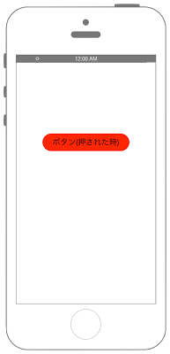

# UIButtonでボタンを表示

 


```swift fct_label="Swift 5.x/4.x"
//
//  ViewController.swift
//  UIKit002
//
//  Copyright © 2018年 FaBo, Inc. All rights reserved.
//

import UIKit

class ViewController: UIViewController {

    private var myButton: UIButton!

    override func viewDidLoad() {
        super.viewDidLoad()

        // Buttonを生成する.
        myButton = UIButton()

        // ボタンのサイズ.
        let bWidth: CGFloat = 200
        let bHeight: CGFloat = 50

        // ボタンのX,Y座標.
        let posX: CGFloat = self.view.frame.width/2 - bWidth/2
        let posY: CGFloat = self.view.frame.height/2 - bHeight/2

        // ボタンの設置座標とサイズを設定する.
        myButton.frame = CGRect(x: posX, y: posY, width: bWidth, height: bHeight)

        // ボタンの背景色を設定.
        myButton.backgroundColor = UIColor.red

        // ボタンの枠を丸くする.
        myButton.layer.masksToBounds = true

        // コーナーの半径を設定する.
        myButton.layer.cornerRadius = 20.0

        // タイトルを設定する(通常時).
        myButton.setTitle("ボタン(通常)", for: .normal)
        myButton.setTitleColor(UIColor.white, for: .normal)

        // タイトルを設定する(ボタンがハイライトされた時).
        myButton.setTitle("ボタン(押された時)", for: .highlighted)
        myButton.setTitleColor(UIColor.black, for: .highlighted)

        // ボタンにタグをつける.
        myButton.tag = 1

        // イベントを追加する
        myButton.addTarget(self, action: #selector(ViewController.onClickMyButton(sender:)),        for: .touchUpInside)

        // ボタンをViewに追加.
        self.view.addSubview(myButton)

    }

    override func didReceiveMemoryWarning() {
        super.didReceiveMemoryWarning()
        // Dispose of any resources that can be recreated.
    }

    /*
    ボタンのイベント.
    */
    @objc internal func onClickMyButton(sender: UIButton) {
        print("onClickMyButton:");
        print("sender.currentTitle: \(sender.currentTitle)")
        print("sender.tag: \(sender.tag)")
    }

}


```

```swift fct_label="SwiftUI"
//
//  ContentView.swift
//
//  Copyright © 2021年 FaBo, Inc. All rights reserved.
//

import SwiftUI

struct ContentView: View {
    @State private var buttonText = "ボタン(通常)"
    @State private var buttonTextColor: Color = .white
    @State private var buttonBGColor: Color = .red

    var body: some View {
        ZStack {
            Color.init(UIColor.white).edgesIgnoringSafeArea(.all)
             
            let bWidth: CGFloat = 200
            let bHeight: CGFloat = 50
            
            Button(action: {
                onClick()
            }, label: {
                Text(buttonText)
            })
            .frame(maxWidth: bWidth, maxHeight: bHeight, alignment: .center)
            .background(buttonBGColor)
            .foregroundColor(buttonTextColor)
            .cornerRadius(16)
            .accentColor(.green)
            .font(Font.body.bold())
            .contentShape(Rectangle())
            .onLongPressGesture(minimumDuration: 2.5, maximumDistance: .infinity, pressing: { pressing in
                                withAnimation(.easeInOut(duration: 0.5)) {}
                                if pressing {
                                    buttonText = "ボタン(押された時)"
                                    buttonTextColor = Color.black
                                    buttonBGColor = Color.blue
                                } else {
                                    buttonText  = "ボタン(通常)"
                                    buttonTextColor = Color.white
                                    buttonBGColor = Color.red
                                }
                            }, perform: { })
        }
    }
    
    func onClick() -> Void {
        print("onClickMyButton:");
       
    }
}

```

## Reference

* UIColor
	* [https://developer.apple.com/reference/uikit/uicolor](https://developer.apple.com/reference/uikit/uicolor)
* UIButton
	* [https://developer.apple.com/reference/uikit/uibutton](https://developer.apple.com/reference/uikit/uibutton)
