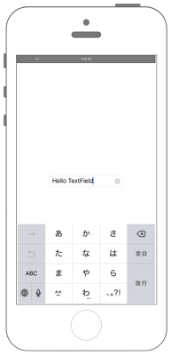

# UIButtonでいろいろなボタンを表示




## Swift 3.0

```swift
//
//  ViewController.swift
//  UIKit004
//
//  Copyright © 2016年 FaBo, Inc. All rights reserved.
//

import UIKit

class ViewController: UIViewController, UITextFieldDelegate {
    
    private var myTextField: UITextField!
    
    override func viewDidLoad() {
        super.viewDidLoad()
        
        // UITextFieldの配置するx,yと幅と高さを設定.
        let tWidth: CGFloat = 200
        let tHeight: CGFloat = 30
        let posX: CGFloat = (self.view.bounds.width - tWidth)/2
        let posY: CGFloat = (self.view.bounds.height - tHeight)/2
        
        // UITextFieldを作成する.
        myTextField = UITextField(frame: CGRect(x: posX, y: posY, width: tWidth, height: tHeight))
        
        // 表示する文字を代入する.
        myTextField.text = "Hello TextField"
        
        // Delegateを自身に設定する
        myTextField.delegate = self
        
        // 枠を表示する.
        myTextField.borderStyle = .roundedRect

        // クリアボタンを追加.
        myTextField.clearButtonMode = .whileEditing
        
        // Viewに追加する
        self.view.addSubview(myTextField)
        
    }
    
    override func didReceiveMemoryWarning() {
        super.didReceiveMemoryWarning()
    }
    
    /*
     UITextFieldが編集された直前に呼ばれる
     */
    func textFieldDidBeginEditing(_ textField: UITextField) {
        print("textFieldDidBeginEditing: \(textField.text!)")
    }
    
    /*
     UITextFieldが編集された直後に呼ばれる
     */
    func textFieldDidEndEditing(_ textField: UITextField) {
        print("textFieldDidEndEditing: \(textField.text!)")
    }
    
    /*
     改行ボタンが押された際に呼ばれる
     */
    func textFieldShouldReturn(_ textField: UITextField) -> Bool {
        print("textFieldShouldReturn \(textField.text!)")
        
        // 改行ボタンが押されたらKeyboardを閉じる処理.
        textField.resignFirstResponder()
        
        return true
    }
    
}

```

## Swift 2.3

```swift
//
//  ViewController.swift
//  UIKit004
//
//  Copyright © 2016年 FaBo, Inc. All rights reserved.
//

import UIKit

class ViewController: UIViewController, UITextFieldDelegate {

    private var myTextField: UITextField!
    
    override func viewDidLoad() {
        super.viewDidLoad()
        
        // UITextFieldの配置するx,yと幅と高さを設定.
        let tWidth: CGFloat = 200
        let tHeight: CGFloat = 30
        let posX: CGFloat = (self.view.bounds.width - tWidth)/2
        let posY: CGFloat = (self.view.bounds.height - tHeight)/2
        
        // UITextFieldを作成する.
        myTextField = UITextField(frame: CGRectMake(posX, posY, tWidth, tHeight))
        
        // 表示する文字を代入する.
        myTextField.text = "Hello TextField"
        
        // Delegateを自身に設定する
        myTextField.delegate = self
        
        // 枠を表示する.
        myTextField.borderStyle = .RoundedRect

        // クリアボタンを追加.
        myTextField.clearButtonMode = .WhileEditing
        
        // Viewに追加する
        self.view.addSubview(myTextField)
        
    }

    override func didReceiveMemoryWarning() {
        super.didReceiveMemoryWarning()
    }
    
    /*
     UITextFieldが編集された直前に呼ばれる
     */
    func textFieldDidBeginEditing(textField: UITextField) {
        print("textFieldDidBeginEditing: \(textField.text!)")
    }
    
    /*
     UITextFieldが編集された直後に呼ばれる
     */
    func textFieldDidEndEditing(textField: UITextField) {
        print("textFieldDidEndEditing: \(textField.text!)")
    }
    
    /*
     改行ボタンが押された際に呼ばれる
    */
    func textFieldShouldReturn(textField: UITextField) -> Bool {
        print("textFieldShouldReturn \(textField.text!)")
        
        // 改行ボタンが押されたらKeyboardを閉じる処理.
        textField.resignFirstResponder()
        
        return true
    }

}
```

## 2.3と3.0の差分

* textFieldDidBeginEditing(textField: UITextField)がtextFieldDidBeginEditing(_ textField: UITextField)に変更
* textFieldDidEndEditing(textField: UITextField)が、textFieldDidEndEditing(_ textField: UITextField)に変更
* textFieldShouldReturn(textField: UITextField)が、textFieldShouldReturn(_ textField: UITextField)に変更
* UITextBorderStyle.RoundedRectがUITextBorderStyle.rundedRectに変更


## Reference

* UITextField
	* [https://developer.apple.com/reference/uikit/uitextfield](https://developer.apple.com/reference/uikit/uitextfield)
