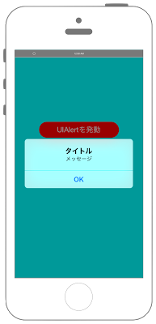

# UIAlertControllerでアラートを表示




```swift fct_label="Swift 4.x"
//
//  ViewController.swift
//  UIKit010
//

import UIKit

class ViewController: UIViewController {
    
    override func viewDidLoad() {
        super.viewDidLoad()
        
        // Viewの背景をCyanに設定する.
        self.view.backgroundColor = UIColor.cyan
        
        // Buttonの定義する.
        let myButton: UIButton = UIButton()
        let buttonWidth: CGFloat = 200
        let buttonHeight: CGFloat = 40
        let posX: CGFloat = (self.view.bounds.width - buttonWidth)/2
        let posY: CGFloat = 200
        myButton.frame = CGRect(x: posX, y: posY, width: buttonWidth, height: buttonHeight)
        myButton.backgroundColor = UIColor.red
        myButton.layer.masksToBounds = true
        myButton.layer.cornerRadius = 20.0
        myButton.setTitle("UIAlertを発動", for: .normal)
        myButton.setTitleColor(UIColor.white, for: .normal)
        myButton.addTarget(self, action: #selector(onClickMyButton(sender:)), for: .touchDown)
        
        // ボタンをViewに追加する
        self.view.addSubview(myButton)
    }
    
    /*
     ボタンイベント
     */
    @objc internal func onClickMyButton(sender: UIButton){
        
        // UIAlertControllerを作成する.
        let myAlert: UIAlertController = UIAlertController(title: "タイトル", message: "メッセージ", preferredStyle: .alert)
        
        // OKのアクションを作成する.
        let myOkAction = UIAlertAction(title: "OK", style: .default) { action in
            print("Action OK!!")
        }
        
        // OKのActionを追加する.
        myAlert.addAction(myOkAction)
        
        // UIAlertを発動する.
        present(myAlert, animated: true, completion: nil)
    }
    
    override func didReceiveMemoryWarning() {
        super.didReceiveMemoryWarning()
    }
}

```

```swift fct_label="Swift 3.x"
//
//  ViewController.swift
//  UIKit010
//

import UIKit

class ViewController: UIViewController {
    
    override func viewDidLoad() {
        super.viewDidLoad()
        
        // Viewの背景をCyanに設定する.
        self.view.backgroundColor = UIColor.cyan
        
        // Buttonの定義する.
        let myButton: UIButton = UIButton()
        let buttonWidth: CGFloat = 200
        let buttonHeight: CGFloat = 40
        let posX: CGFloat = (self.view.bounds.width - buttonWidth)/2
        let posY: CGFloat = 200
        myButton.frame = CGRect(x: posX, y: posY, width: buttonWidth, height: buttonHeight)
        myButton.backgroundColor = UIColor.red
        myButton.layer.masksToBounds = true
        myButton.layer.cornerRadius = 20.0
        myButton.setTitle("UIAlertを発動", for: .normal)
        myButton.setTitleColor(UIColor.white, for: .normal)
        myButton.addTarget(self, action: #selector(onClickMyButton(sender:)), for: .touchDown)
        
        // ボタンをViewに追加する
        self.view.addSubview(myButton)
    }
    
    /*
     ボタンイベント
     */
    internal func onClickMyButton(sender: UIButton){
        
        // UIAlertControllerを作成する.
        let myAlert: UIAlertController = UIAlertController(title: "タイトル", message: "メッセージ", preferredStyle: .alert)
        
        // OKのアクションを作成する.
        let myOkAction = UIAlertAction(title: "OK", style: .default) { action in
            print("Action OK!!")
        }
        
        // OKのActionを追加する.
        myAlert.addAction(myOkAction)
        
        // UIAlertを発動する.
        present(myAlert, animated: true, completion: nil)
    }
    
    override func didReceiveMemoryWarning() {
        super.didReceiveMemoryWarning()
    }
}

```

```swift fct_label="Swift 2.3"
//
//  ViewController.swift
//  UIKit010
//

import UIKit

class ViewController: UIViewController {
    
    override func viewDidLoad() {
        super.viewDidLoad()
        
        // Viewの背景をCyanに設定する.
        self.view.backgroundColor = UIColor.cyanColor()
        
        // Buttonの定義する.
        let myButton: UIButton = UIButton()
        let buttonWidth: CGFloat = 200
        let buttonHeight: CGFloat = 40
        let posX: CGFloat = (self.view.bounds.width - buttonWidth)/2
        let posY: CGFloat = 200
        myButton.frame = CGRectMake(posX, posY, buttonWidth, buttonHeight)
        myButton.backgroundColor = UIColor.redColor()
        myButton.layer.masksToBounds = true
        myButton.layer.cornerRadius = 20.0
        myButton.setTitle("UIAlertを発動", forState: .Normal)
        myButton.setTitleColor(UIColor.whiteColor(), forState: .Normal)
        myButton.addTarget(self, action: #selector(onClickMyButton(_:)), forControlEvents: .TouchDown)
        
        // ボタンをViewに追加する
        self.view.addSubview(myButton)
    }
    
    /*
     ボタンイベント
     */
    internal func onClickMyButton(sender: UIButton){
        
        // UIAlertControllerを作成する.
        let myAlert: UIAlertController = UIAlertController(title: "タイトル", message: "メッセージ", preferredStyle: .Alert)
        
        // OKのアクションを作成する.
        let myOkAction = UIAlertAction(title: "OK", style: .Default) { action in
            print("Action OK!!")
        }
        
        // OKのActionを追加する.
        myAlert.addAction(myOkAction)
        
        // UIAlertを発動する.
        presentViewController(myAlert, animated: true, completion: nil)
    }
    
    override func didReceiveMemoryWarning() {
        super.didReceiveMemoryWarning()
    }
}


```

## 3.0と4.0の差分

* ```internal func onClickMyButton(sender: UIButton)``` に ```@objc``` を追加

## 2.3と3.0の差分

* presentViewController()がpresent()に変更.


## Reference

* UserNotifications
	* [https://developer.apple.com/reference/uikit/uialertcontroller](https://developer.apple.com/reference/uikit/uialertcontroller)