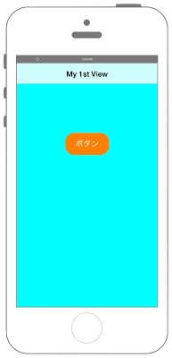
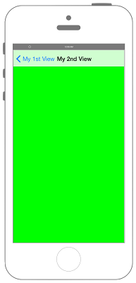

# UINavigationControllerの表示




### AppDelegate.swift
```swift fct_label="Swift 5.x/4.x"
//
//  AppDelegate.swift
//  UIKit012
//
//  Copyright © 2018年 FaBo, Inc. All rights reserved.
//

import UIKit

@UIApplicationMain
class AppDelegate: UIResponder, UIApplicationDelegate {

    var window: UIWindow?

    func application(_ application: UIApplication, didFinishLaunchingWithOptions launchOptions: [UIApplication.LaunchOptionsKey : Any]? = nil) -> Bool {

        // ViewControllerを生成する.
        let myFirstViewController: FirstViewController = FirstViewController()
        
        // myFirstViewControllerをrootviewに設定し、Navication Controllerを生成する.
        let myNavigationController: UINavigationController = UINavigationController(rootViewController: myFirstViewController)
        
        // rootViewControllerにNavigationControllerを設定する.
        self.window?.rootViewController = myNavigationController
        
        // NavigationControllerを表示する.
        self.window?.makeKeyAndVisible()
        
        return true
    }

    func applicationWillResignActive(_ application: UIApplication) {
        // Sent when the application is about to move from active to inactive state. This can occur for certain types of temporary interruptions (such as an incoming phone call or SMS message) or when the user quits the application and it begins the transition to the background state.
        // Use this method to pause ongoing tasks, disable timers, and invalidate graphics rendering callbacks. Games should use this method to pause the game.
    }

    func applicationDidEnterBackground(_ application: UIApplication) {
        // Use this method to release shared resources, save user data, invalidate timers, and store enough application state information to restore your application to its current state in case it is terminated later.
        // If your application supports background execution, this method is called instead of applicationWillTerminate: when the user quits.
    }

    func applicationWillEnterForeground(_ application: UIApplication) {
        // Called as part of the transition from the background to the active state; here you can undo many of the changes made on entering the background.
    }

    func applicationDidBecomeActive(_ application: UIApplication) {
        // Restart any tasks that were paused (or not yet started) while the application was inactive. If the application was previously in the background, optionally refresh the user interface.
    }

    func applicationWillTerminate(_ application: UIApplication) {
        // Called when the application is about to terminate. Save data if appropriate. See also applicationDidEnterBackground:.
    }


}
```

```swift fct_label="Swift 3.x"
//
//  AppDelegate.swift
//  UIKit012
//
//  Copyright © 2016年 FaBo, Inc. All rights reserved.
//

import UIKit

@UIApplicationMain
class AppDelegate: UIResponder, UIApplicationDelegate {

    var window: UIWindow?

    func application(_ application: UIApplication, didFinishLaunchingWithOptions launchOptions: [NSObject: AnyObject]?) -> Bool {

        // ViewControllerを生成する.
        let myFirstViewController: FirstViewController = FirstViewController()
        
        // myFirstViewControllerをrootviewに設定し、Navication Controllerを生成する.
        let myNavigationController: UINavigationController = UINavigationController(rootViewController: myFirstViewController)
        
        // rootViewControllerにNavigationControllerを設定する.
        self.window?.rootViewController = myNavigationController
        
        // NavigationControllerを表示する.
        self.window?.makeKeyAndVisible()
        
        return true
    }

    func applicationWillResignActive(_ application: UIApplication) {
        // Sent when the application is about to move from active to inactive state. This can occur for certain types of temporary interruptions (such as an incoming phone call or SMS message) or when the user quits the application and it begins the transition to the background state.
        // Use this method to pause ongoing tasks, disable timers, and invalidate graphics rendering callbacks. Games should use this method to pause the game.
    }

    func applicationDidEnterBackground(_ application: UIApplication) {
        // Use this method to release shared resources, save user data, invalidate timers, and store enough application state information to restore your application to its current state in case it is terminated later.
        // If your application supports background execution, this method is called instead of applicationWillTerminate: when the user quits.
    }

    func applicationWillEnterForeground(_ application: UIApplication) {
        // Called as part of the transition from the background to the active state; here you can undo many of the changes made on entering the background.
    }

    func applicationDidBecomeActive(_ application: UIApplication) {
        // Restart any tasks that were paused (or not yet started) while the application was inactive. If the application was previously in the background, optionally refresh the user interface.
    }

    func applicationWillTerminate(_ application: UIApplication) {
        // Called when the application is about to terminate. Save data if appropriate. See also applicationDidEnterBackground:.
    }


}
```

```swift fct_label="Swift 2.3"
//
//  AppDelegate.swift
//  UIKit012
//
//  Copyright © 2016年 FaBo, Inc. All rights reserved.
//

import UIKit

@UIApplicationMain
class AppDelegate: UIResponder, UIApplicationDelegate {

    var window: UIWindow?

    func application(application: UIApplication, didFinishLaunchingWithOptions launchOptions: [NSObject: AnyObject]?) -> Bool {

        // ViewControllerを生成する.
        let myFirstViewController: FirstViewController = FirstViewController()
        
        // myFirstViewControllerをrootviewに設定し、Navication Controllerを生成する.
        var myNavigationController: UINavigationController = UINavigationController(rootViewController: myFirstViewController)
         
        // rootViewControllerにNavigationControllerを設定する.
        self.window?.rootViewController = myNavigationController
    
        // NavigationControllerを表示する.
        self.window?.makeKeyAndVisible()
        
        return true
    }

    func applicationWillResignActive(application: UIApplication) {
        // Sent when the application is about to move from active to inactive state. This can occur for certain types of temporary interruptions (such as an incoming phone call or SMS message) or when the user quits the application and it begins the transition to the background state.
        // Use this method to pause ongoing tasks, disable timers, and throttle down OpenGL ES frame rates. Games should use this method to pause the game.
    }

    func applicationDidEnterBackground(application: UIApplication) {
        // Use this method to release shared resources, save user data, invalidate timers, and store enough application state information to restore your application to its current state in case it is terminated later.
        // If your application supports background execution, this method is called instead of applicationWillTerminate: when the user quits.
    }

    func applicationWillEnterForeground(application: UIApplication) {
        // Called as part of the transition from the background to the inactive state; here you can undo many of the changes made on entering the background.
    }

    func applicationDidBecomeActive(application: UIApplication) {
        // Restart any tasks that were paused (or not yet started) while the application was inactive. If the application was previously in the background, optionally refresh the user interface.
    }

    func applicationWillTerminate(application: UIApplication) {
        // Called when the application is about to terminate. Save data if appropriate. See also applicationDidEnterBackground:.
    }


}
```

### FirstViewController.swift
```swift fct_label="Swift 4.x"
//
//  FirstViewController.swift
//  UIKit012
//
//  Copyright © 2018年 FaBo, Inc. All rights reserved.
//

import UIKit

class FirstViewController: UIViewController {
    
    override func viewDidLoad() {
        super.viewDidLoad()
        
        // Controllerのタイトルを設定する.
        self.title = "My First View"
        
        // Viewの背景色をCyanに設定する.
        self.view.backgroundColor = UIColor.cyan
        
        // ボタンの定義をおこなう.
        let buttonWidth: CGFloat = 100
        let buttonHeight: CGFloat = 50
        let posX: CGFloat = (self.view.bounds.width - buttonWidth)/2
        let posY: CGFloat = 200
        let myButton = UIButton(frame: CGRect(x: posX, y: posY, width: buttonWidth, height: buttonHeight))
        myButton.backgroundColor = UIColor.orange
        myButton.layer.masksToBounds = true
        myButton.layer.cornerRadius = 20.0
        myButton.setTitle("ボタン", for: .normal)
        myButton.addTarget(self, action: #selector(onClickMyButton(sender:)), for: .touchUpInside)
        
        // ボタンをViewに追加する.
        self.view.addSubview(myButton);
    }
    
    /*
     ボタンイベント
     */
    @objc internal func onClickMyButton(sender: UIButton){
        
        // 移動先のViewを定義する.
        let secondViewController = SecondViewController()
        
        // SecondViewに移動する.
        self.navigationController?.pushViewController(secondViewController, animated: true)
    }
    
    override func didReceiveMemoryWarning() {
        super.didReceiveMemoryWarning()
        // Dispose of any resources that can be recreated.
    }
}
```

```swift fct_label="Swift 3.x"
//
//  FirstViewController.swift
//  UIKit012
//
//  Copyright © 2016年 FaBo, Inc. All rights reserved.
//

import UIKit

class FirstViewController: UIViewController {
    
    override func viewDidLoad() {
        super.viewDidLoad()
        
        // Controllerのタイトルを設定する.
        self.title = "My First View"
        
        // Viewの背景色をCyanに設定する.
        self.view.backgroundColor = UIColor.cyan
        
        // ボタンの定義をおこなう.
        let buttonWidth: CGFloat = 100
        let buttonHeight: CGFloat = 50
        let posX: CGFloat = (self.view.bounds.width - buttonWidth)/2
        let posY: CGFloat = 200
        let myButton = UIButton(frame: CGRect(x: posX, y: posY, width: buttonWidth, height: buttonHeight))
        myButton.backgroundColor = UIColor.orange
        myButton.layer.masksToBounds = true
        myButton.layer.cornerRadius = 20.0
        myButton.setTitle("ボタン", for: .normal)
        myButton.addTarget(self, action: #selector(onClickMyButton(sender:)), for: .touchUpInside)
        
        // ボタンをViewに追加する.
        self.view.addSubview(myButton);
    }
    
    /*
     ボタンイベント
     */
    internal func onClickMyButton(sender: UIButton){
        
        // 移動先のViewを定義する.
        let secondViewController = SecondViewController()
        
        // SecondViewに移動する.
        self.navigationController?.pushViewController(secondViewController, animated: true)
    }
    
    override func didReceiveMemoryWarning() {
        super.didReceiveMemoryWarning()
        // Dispose of any resources that can be recreated.
    }
}
```

```swift fct_label="Swift 2.3"
//
//  FirstViewController.swift
//  UIKit012
//
//  Copyright © 2016年 FaBo, Inc. All rights reserved.
//

import UIKit

class FirstViewController: UIViewController {
    
    override func viewDidLoad() {
        super.viewDidLoad()
        
        // Controllerのタイトルを設定する.
        self.title = "My First View"
        
        // Viewの背景色をCyanに設定する.
        self.view.backgroundColor = UIColor.cyanColor()
        
        // ボタンの定義をおこなう.
        let buttonWidth: CGFloat = 100
        let buttonHeight: CGFloat = 50
        let posX: CGFloat = (self.view.bounds.width - buttonWidth)/2
        let posY: CGFloat = 200
        let myButton = UIButton(frame: CGRectMake(posX, posY, buttonWidth, buttonHeight))
        myButton.backgroundColor = UIColor.orangeColor()
        myButton.layer.masksToBounds = true
        myButton.layer.cornerRadius = 20.0
        myButton.setTitle("ボタン", forState: .Normal)
        myButton.addTarget(self, action: #selector(onClickMyButton(_:)), forControlEvents: .TouchUpInside)
        
        // ボタンをViewに追加する.
        self.view.addSubview(myButton);
    }
    
    /*
     ボタンイベント
     */
    internal func onClickMyButton(sender: UIButton){
        
        // 移動先のViewを定義する.
        let secondViewController = SecondViewController()
        
        // SecondViewに移動する.
        self.navigationController?.pushViewController(secondViewController, animated: true)
    }
    
    override func didReceiveMemoryWarning() {
        super.didReceiveMemoryWarning()
        // Dispose of any resources that can be recreated.
    }
}
```

### SecondViewController.swift
```swift fct_label="Swift 4.x/3.x"
//
//  SecondViewController.swift
//  UIKit012
//
//  Copyright © 2018年 FaBo, Inc. All rights reserved.
//

import UIKit

class SecondViewController: UIViewController {
    
    override func viewDidLoad() {
        super.viewDidLoad()
        
        // Controllerのタイトルを設定する.
        self.title = "My Second View"
        
        // Viewの背景色を定義する.
        self.view.backgroundColor = UIColor.green
        
    }
    
    
    override func didReceiveMemoryWarning() {
        super.didReceiveMemoryWarning()
        // Dispose of any resources that can be recreated.
    }
    
}
```

```swift fct_label="Swift 2.3"

//
//  SecondViewController.swift
//  UIKit012
//
//  Copyright © 2016年 FaBo, Inc. All rights reserved.
//

import UIKit

class SecondViewController: UIViewController {
    
    override func viewDidLoad() {
        super.viewDidLoad()
        
        // Controllerのタイトルを設定する.
        self.title = "My Second View"
        
        // Viewの背景色を定義する.
        self.view.backgroundColor = UIColor.greenColor()
        
    }
    
    
    override func didReceiveMemoryWarning() {
        super.didReceiveMemoryWarning()
        // Dispose of any resources that can be recreated.
    }
    
}
```

## 3.0と4.0の差分
* ```[NSObject: AnyObject]?``` が、 ```[UIApplication.LaunchOptionsKey : Any]? = nil``` に変更
* ```internal func onClickMyButton(sender: UIButton)``` に ```@objc``` を追加

## 2.3と3.0の差分

* UIScreen.mainScreen()がUIScreen.mainに変更.


## Reference

* UINavigationController
	* [https://developer.apple.com/reference/uikit/uinavigationcontroller](https://developer.apple.com/reference/uikit/uinavigationcontroller)