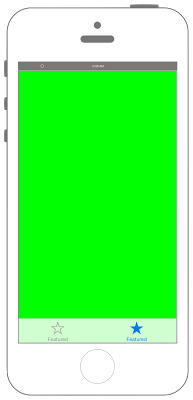
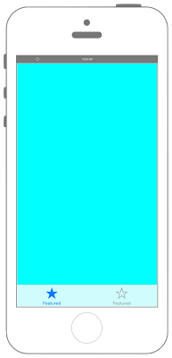

# 013 UITabBarControllerでタブの表示





### AppDelegate.swift
```swift fct_label="Swift 4.x"
//
//  AppDelegate.swift
//  UIKit013_3.0
//
//  Created by akira on 2016/08/13.
//  Copyright © 2016年 FaBo, Inc. All rights reserved.
//

import UIKit

@UIApplicationMain
class AppDelegate: UIResponder, UIApplicationDelegate {

    var window: UIWindow?


    func application(_ application: UIApplication, didFinishLaunchingWithOptions launchOptions: [UIApplication.LaunchOptionsKey : Any]? = nil) -> Bool {
        
        // Tabに設定するViewControllerのインスタンスを生成.
        let myFirstTab: UIViewController = FirstViewController()
        let mySecondTab: UIViewController = SecondViewController()
        
        // タブを要素に持つArrayの.を作成する.
        let myTabs = NSArray(objects: myFirstTab, mySecondTab)
        
        // UITabControllerの作成する.
        let myTabBarController: UITabBarController = UITabBarController()
        
        // ViewControllerを設定する.
        myTabBarController.setViewControllers(myTabs as? [UIViewController], animated: false)
        
        // RootViewControllerに設定する.
        self.window!.rootViewController = myTabBarController
        
        // Windowを表示する.
        self.window!.makeKeyAndVisible()
        
        return true
    }

    func applicationWillResignActive(_ application: UIApplication) {
        // Sent when the application is about to move from active to inactive state. This can occur for certain types of temporary interruptions (such as an incoming phone call or SMS message) or when the user quits the application and it begins the transition to the background state.
        // Use this method to pause ongoing tasks, disable timers, and invalidate graphics rendering callbacks. Games should use this method to pause the game.
    }

    func applicationDidEnterBackground(_ application: UIApplication) {
        // Use this method to release shared resources, save user data, invalidate timers, and store enough application state information to restore your application to its current state in case it is terminated later.
        // If your application supports background execution, this method is called instead of applicationWillTerminate: when the user quits.
    }

    func applicationWillEnterForeground(_ application: UIApplication) {
        // Called as part of the transition from the background to the active state; here you can undo many of the changes made on entering the background.
    }

    func applicationDidBecomeActive(_ application: UIApplication) {
        // Restart any tasks that were paused (or not yet started) while the application was inactive. If the application was previously in the background, optionally refresh the user interface.
    }

    func applicationWillTerminate(_ application: UIApplication) {
        // Called when the application is about to terminate. Save data if appropriate. See also applicationDidEnterBackground:.
    }


}
```

```swift fct_label="Swift 3.x"
//
//  AppDelegate.swift
//  UIKit013_3.0
//
//  Created by akira on 2016/08/13.
//  Copyright © 2016年 FaBo, Inc. All rights reserved.
//

import UIKit

@UIApplicationMain
class AppDelegate: UIResponder, UIApplicationDelegate {

    var window: UIWindow?


    func application(_ application: UIApplication, didFinishLaunchingWithOptions launchOptions: [NSObject: AnyObject]?) -> Bool {
        
        // Tabに設定するViewControllerのインスタンスを生成.
        let myFirstTab: UIViewController = FirstViewController()
        let mySecondTab: UIViewController = SecondViewController()
        
        // タブを要素に持つArrayの.を作成する.
        let myTabs = NSArray(objects: myFirstTab, mySecondTab)
        
        // UITabControllerの作成する.
        let myTabBarController: UITabBarController = UITabBarController()
        
        // ViewControllerを設定する.
        myTabBarController.setViewControllers(myTabs as? [UIViewController], animated: false)
        
        // RootViewControllerに設定する.
        self.window!.rootViewController = myTabBarController
        
        // Windowを表示する.
        self.window!.makeKeyAndVisible()
        
        return true
    }

    func applicationWillResignActive(_ application: UIApplication) {
        // Sent when the application is about to move from active to inactive state. This can occur for certain types of temporary interruptions (such as an incoming phone call or SMS message) or when the user quits the application and it begins the transition to the background state.
        // Use this method to pause ongoing tasks, disable timers, and invalidate graphics rendering callbacks. Games should use this method to pause the game.
    }

    func applicationDidEnterBackground(_ application: UIApplication) {
        // Use this method to release shared resources, save user data, invalidate timers, and store enough application state information to restore your application to its current state in case it is terminated later.
        // If your application supports background execution, this method is called instead of applicationWillTerminate: when the user quits.
    }

    func applicationWillEnterForeground(_ application: UIApplication) {
        // Called as part of the transition from the background to the active state; here you can undo many of the changes made on entering the background.
    }

    func applicationDidBecomeActive(_ application: UIApplication) {
        // Restart any tasks that were paused (or not yet started) while the application was inactive. If the application was previously in the background, optionally refresh the user interface.
    }

    func applicationWillTerminate(_ application: UIApplication) {
        // Called when the application is about to terminate. Save data if appropriate. See also applicationDidEnterBackground:.
    }


}
```

```swift fct_label="Swift 2.3"
//
//  AppDelegate.swift
//  UIKit013
//
//  Copyright © 2016年 FaBo, Inc. All rights reserved.
//

import UIKit

@UIApplicationMain
class AppDelegate: UIResponder, UIApplicationDelegate {

    var window: UIWindow?


    func application(application: UIApplication, didFinishLaunchingWithOptions launchOptions: [NSObject: AnyObject]?) -> Bool {
        
        // Tabに設定するViewControllerのインスタンスを生成.
        let myFirstTab: UIViewController = FirstViewController()
        let mySecondTab: UIViewController = SecondViewController()
        
        // タブを要素に持つArrayの.を作成する.
        let myTabs = NSArray(objects: myFirstTab, mySecondTab)
        
        // UITabControllerの作成する.
        let myTabBarController: UITabBarController = UITabBarController()
        
        // ViewControllerを設定する.
        myTabBarController.setViewControllers(myTabs as? [UIViewController], animated: false)
        
        // RootViewControllerに設定する.
        self.window!.rootViewController = myTabBarController
        
        // Windowを表示する.
        self.window!.makeKeyAndVisible()
        
        return true
    }

    func applicationWillResignActive(application: UIApplication) {
        // Sent when the application is about to move from active to inactive state. This can occur for certain types of temporary interruptions (such as an incoming phone call or SMS message) or when the user quits the application and it begins the transition to the background state.
        // Use this method to pause ongoing tasks, disable timers, and throttle down OpenGL ES frame rates. Games should use this method to pause the game.
    }

    func applicationDidEnterBackground(application: UIApplication) {
        // Use this method to release shared resources, save user data, invalidate timers, and store enough application state information to restore your application to its current state in case it is terminated later.
        // If your application supports background execution, this method is called instead of applicationWillTerminate: when the user quits.
    }

    func applicationWillEnterForeground(application: UIApplication) {
        // Called as part of the transition from the background to the inactive state; here you can undo many of the changes made on entering the background.
    }

    func applicationDidBecomeActive(application: UIApplication) {
        // Restart any tasks that were paused (or not yet started) while the application was inactive. If the application was previously in the background, optionally refresh the user interface.
    }

    func applicationWillTerminate(application: UIApplication) {
        // Called when the application is about to terminate. Save data if appropriate. See also applicationDidEnterBackground:.
    }


}
```
### FirstViewController.swift

```swift fct_label="Swift 4.x/Swift 3.x"
//
//  FirstViewController.swift
//  UIKit013
//
//  Copyright © 2016年 FaBo, Inc. All rights reserved.
//

import UIKit

class FirstViewController: UIViewController {
    
    init() {
        super.init(nibName: nil, bundle: nil)
        
        // Viewの背景色をCyanに設定する.
        self.view.backgroundColor = UIColor.cyan
        
        //tabBarItemのアイコンをFeaturedに、タグを1と定義する.
        self.tabBarItem = UITabBarItem(tabBarSystemItem: .featured, tag: 1)
    }
    
    required init?(coder aDecoder: NSCoder) {
        super.init(coder: aDecoder)
    }
    
    required override init(nibName nibNameOrNil: String!, bundle nibBundleOrNil: Bundle!) {
        super.init(nibName: nibNameOrNil, bundle: nibBundleOrNil)
    }
    
    override func viewDidLoad() {
        super.viewDidLoad()
    }
    
    override func didReceiveMemoryWarning() {
        super.didReceiveMemoryWarning()
    }
}
```

```swift fct_label="Swift 2.3"
//
//  FirstViewController.swift
//  UIKit013
//
//  Copyright © 2016年 FaBo, Inc. All rights reserved.
//

import UIKit

class FirstViewController: UIViewController {
    
    init() {
        super.init(nibName: nil, bundle: nil)
        
        // Viewの背景色をCyanに設定する.
        self.view.backgroundColor = UIColor.cyanColor()
        
        //tabBarItemのアイコンをFeaturedに、タグを1と定義する.
        self.tabBarItem = UITabBarItem(tabBarSystemItem: UITabBarSystemItem.Featured, tag: 1)
    }
    
    required init?(coder aDecoder: NSCoder) {
        super.init(coder: aDecoder)
    }
    
    required override init(nibName nibNameOrNil: String!, bundle nibBundleOrNil: NSBundle!) {
        super.init(nibName: nibNameOrNil, bundle: nibBundleOrNil)
    }
    
    override func viewDidLoad() {
        super.viewDidLoad()
    }
    
    override func didReceiveMemoryWarning() {
        super.didReceiveMemoryWarning()
    }
}
```

### SecondViewController.swift

```swift fct_label="Swift 4.x/Swift 3.x"
//
//  SecondViewController.swift
//  UIKit013
//
//  Copyright © 2016年 FaBo, Inc. All rights reserved.
//

import UIKit

class SecondViewController: UIViewController {
    
    init() {
        super.init(nibName: nil, bundle: nil)
        
        // Viewの背景色をGreenに設定する.
        self.view.backgroundColor = UIColor.green
        
        // tabBarItemのアイコンをFeaturedに、タグを2と定義する.
        self.tabBarItem = UITabBarItem(tabBarSystemItem: .featured, tag: 2)
    }
    
    required init?(coder aDecoder: NSCoder) {
        super.init(coder: aDecoder)
    }
    
    required override init(nibName nibNameOrNil: String!, bundle nibBundleOrNil: Bundle!) {
        super.init(nibName: nibNameOrNil, bundle: nibBundleOrNil)
    }
    
    override func viewDidLoad() {
        super.viewDidLoad()
    }
    
    override func didReceiveMemoryWarning() {
        super.didReceiveMemoryWarning()
    }
    
    
}
```

```swift fct_label="Swift 2.3"
///
//  SecondViewController.swift
//  UIKit013
//
//  Copyright © 2016年 FaBo, Inc. All rights reserved.
//

import UIKit

class SecondViewController: UIViewController {
    
    init() {
        super.init(nibName: nil, bundle: nil)
        
        // Viewの背景色をGreenに設定する.
        self.view.backgroundColor = UIColor.greenColor()
        
        // tabBarItemのアイコンをFeaturedに、タグを2と定義する.
        self.tabBarItem = UITabBarItem(tabBarSystemItem: UITabBarSystemItem.Featured, tag: 2)
    }
    
    required init?(coder aDecoder: NSCoder) {
        super.init(coder: aDecoder)
    }
    
    required override init(nibName nibNameOrNil: String!, bundle nibBundleOrNil: NSBundle!) {
        super.init(nibName: nibNameOrNil, bundle: nibBundleOrNil)
    }
    
    override func viewDidLoad() {
        super.viewDidLoad()
    }
    
    override func didReceiveMemoryWarning() {
        super.didReceiveMemoryWarning()
    }
    
    
}
```

## 3.0と4.0の差分
* application(_ application: UIApplication, didFinishLaunchingWithOptions launchOptions: [NSObject: AnyObject]?) -> Boolが、  
application(_ application: UIApplication, didFinishLaunchingWithOptions launchOptions: [UIApplication.LaunchOptionsKey : Any]? = nil) -> Boolに変更

## 2.3と3.0の差分

* UIScreen.mainScreen()がUIScreen.mainに変更.


## Reference

* UITabBarController
	* [https://developer.apple.com/reference/uikit/uitabbarcontroller](https://developer.apple.com/reference/uikit/uitabbarcontroller)