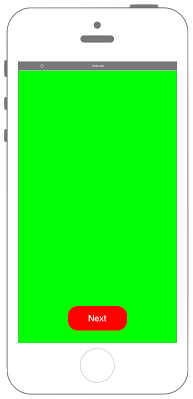

# UIViewControllerで画面遷移する




### ViewController.swift

```swift fct_label="Swift 4.x"
//
//  ViewController.swift
//  UIKit015_4.0
//
//  Created by akira on 2016/08/13.
//  Copyright © 2018年 FaBo, Inc. All rights reserved.
//

import UIKit

class ViewController: UIViewController {
    
    override func viewDidLoad() {
        super.viewDidLoad()
        // 背景色をGreenに設定する.
        self.view.backgroundColor = UIColor.green
        
        // ボタンを生成する.
        let nextButton: UIButton = UIButton(frame: CGRect(x: 0,y: 0, width: 120, height: 50))
        nextButton.backgroundColor = UIColor.red
        nextButton.layer.masksToBounds = true
        nextButton.setTitle("Next", for: .normal)
        nextButton.layer.cornerRadius = 20.0
        nextButton.layer.position = CGPoint(x: self.view.bounds.width/2 , y:self.view.bounds.height-50)
        nextButton.addTarget(self, action: #selector(onClickMyButton(sender:)), for: .touchUpInside)
        
        // ボタンを追加する.
        self.view.addSubview(nextButton);
    }
    
    /*
     ボタンイベント.
     */
    @objc internal func onClickMyButton(sender: UIButton){
        
        // 遷移するViewを定義する.
        let mySecondViewController: UIViewController = SecondViewController()
        
        // アニメーションを設定する.
        mySecondViewController.modalTransitionStyle = .partialCurl
        
        // Viewの移動する.
        self.present(mySecondViewController, animated: true, completion: nil)
    }
    
    
    override func didReceiveMemoryWarning() {
        super.didReceiveMemoryWarning()
        // Dispose of any resources that can be recreated.
    }
    
    
}
```

```swift fct_label="Swift 3.x"
//
//  ViewController.swift
//  UIKit015_3.0
//
//  Created by akira on 2016/08/13.
//  Copyright © 2016年 FaBo, Inc. All rights reserved.
//

import UIKit

class ViewController: UIViewController {
    
    override func viewDidLoad() {
        super.viewDidLoad()
        // 背景色をGreenに設定する.
        self.view.backgroundColor = UIColor.green
        
        // ボタンを生成する.
        let nextButton: UIButton = UIButton(frame: CGRect(x: 0,y: 0, width: 120, height: 50))
        nextButton.backgroundColor = UIColor.red
        nextButton.layer.masksToBounds = true
        nextButton.setTitle("Next", for: .normal)
        nextButton.layer.cornerRadius = 20.0
        nextButton.layer.position = CGPoint(x: self.view.bounds.width/2 , y:self.view.bounds.height-50)
        nextButton.addTarget(self, action: #selector(onClickMyButton(sender:)), for: .touchUpInside)
        
        // ボタンを追加する.
        self.view.addSubview(nextButton);
    }
    
    /*
     ボタンイベント.
     */
    internal func onClickMyButton(sender: UIButton){
        
        // 遷移するViewを定義する.
        let mySecondViewController: UIViewController = SecondViewController()
        
        // アニメーションを設定する.
        mySecondViewController.modalTransitionStyle = .partialCurl
        
        // Viewの移動する.
        self.present(mySecondViewController, animated: true, completion: nil)
    }
    
    
    override func didReceiveMemoryWarning() {
        super.didReceiveMemoryWarning()
        // Dispose of any resources that can be recreated.
    }
    
    
}
```

```swift fct_label="Swift 2.3"
///
//  ViewController.swift
//  UIKit015
//
//  Copyright © 2016年 FaBo, Inc. All rights reserved.
//

import UIKit

class ViewController: UIViewController {

    override func viewDidLoad() {
        super.viewDidLoad()
        // 背景色をGreenに設定する.
        self.view.backgroundColor = UIColor.greenColor()
        
        // ボタンを生成する.
        let nextButton: UIButton = UIButton(frame: CGRectMake(0,0,120,50))
        nextButton.backgroundColor = UIColor.redColor();
        nextButton.layer.masksToBounds = true
        nextButton.setTitle("Next", forState: .Normal)
        nextButton.layer.cornerRadius = 20.0
        nextButton.layer.position = CGPoint(x: self.view.bounds.width/2 , y:self.view.bounds.height-50)
        nextButton.addTarget(self, action: #selector(onClickMyButton(_:)), forControlEvents: .TouchUpInside)
        
        // ボタンを追加する.
        self.view.addSubview(nextButton);
    }
    
    /*
     ボタンイベント.
     */
    internal func onClickMyButton(sender: UIButton){
        
        // 遷移するViewを定義する.
        let mySecondViewController: UIViewController = SecondViewController()
        
        // アニメーションを設定する.
        mySecondViewController.modalTransitionStyle = UIModalTransitionStyle.PartialCurl
        
        // Viewの移動する.
        self.presentViewController(mySecondViewController, animated: true, completion: nil)
    }
    

    override func didReceiveMemoryWarning() {
        super.didReceiveMemoryWarning()
        // Dispose of any resources that can be recreated.
    }


}
```

### SecondViewController.swift

```swift fct_label="Swift 4.x"
//
//  SecondViewController.swift
//  UIKit015
//
//  Copyright © 2018年 FaBo, Inc. All rights reserved.
//

import UIKit

class SecondViewController: UIViewController {
    
    override func viewDidLoad() {
        super.viewDidLoad()
        
        // 背景色を設定.
        self.view.backgroundColor = UIColor.blue
        
        // ボタンを作成.
        let backButton: UIButton = UIButton(frame: CGRect(x: 0, y: 0, width: 120, height: 50))
        backButton.backgroundColor = UIColor.red
        backButton.layer.masksToBounds = true
        backButton.setTitle("Back", for: .normal)
        backButton.layer.cornerRadius = 20.0
        backButton.layer.position = CGPoint(x: self.view.bounds.width/2 , y:self.view.bounds.height-50)
        backButton.addTarget(self, action: #selector(onClickMyButton(sender:)), for: .touchUpInside)
        self.view.addSubview(backButton);
    }
    
    /*
     ボタンイベント.
     */
    @objc internal func onClickMyButton(sender: UIButton){
        
        // 遷移するViewを定義.
        let myViewController: UIViewController = ViewController()
        
        // アニメーションを設定.
        myViewController.modalTransitionStyle = UIModalTransitionStyle.flipHorizontal
        
        // Viewの移動.
        self.present(myViewController, animated: true, completion: nil)
    }
    
    override func didReceiveMemoryWarning() {
        super.didReceiveMemoryWarning()
        // Dispose of any resources that can be recreated.
    }
}

```

```swift fct_label="Swift 3.x"
//
//  SecondViewController.swift
//  UIKit015
//
//  Copyright © 2016年 FaBo, Inc. All rights reserved.
//

import UIKit

class SecondViewController: UIViewController {
    
    override func viewDidLoad() {
        super.viewDidLoad()
        
        // 背景色を設定.
        self.view.backgroundColor = UIColor.blueColor()
        
        // ボタンを作成.
        let backButton: UIButton = UIButton(frame: CGRectMake(0,0,120,50))
        backButton.backgroundColor = UIColor.redColor();
        backButton.layer.masksToBounds = true
        backButton.setTitle("Back", forState: .Normal)
        backButton.layer.cornerRadius = 20.0
        backButton.layer.position = CGPoint(x: self.view.bounds.width/2 , y:self.view.bounds.height-50)
        backButton.addTarget(self, action: #selector(onClickMyButton(_:)), forControlEvents: .TouchUpInside)
        self.view.addSubview(backButton);
    }
    
    /*
     ボタンイベント.
     */
    internal func onClickMyButton(sender: UIButton){
        
        // 遷移するViewを定義.
        let myViewController: UIViewController = ViewController()
        
        // アニメーションを設定.
        myViewController.modalTransitionStyle = UIModalTransitionStyle.FlipHorizontal
        
        // Viewの移動.
        self.presentViewController(myViewController, animated: true, completion: nil)
    }
    
    override func didReceiveMemoryWarning() {
        super.didReceiveMemoryWarning()
        // Dispose of any resources that can be recreated.
    }
}
```

```swift fct_label="Swift 2.3"
//
//  SecondViewController.swift
//  UIKit015
//
//  Copyright © 2016年 FaBo, Inc. All rights reserved.
//

import UIKit

class SecondViewController: UIViewController {
    
    override func viewDidLoad() {
        super.viewDidLoad()
        
        // 背景色を設定.
        self.view.backgroundColor = UIColor.blueColor()
        
        // ボタンを作成.
        let backButton: UIButton = UIButton(frame: CGRectMake(0,0,120,50))
        backButton.backgroundColor = UIColor.redColor();
        backButton.layer.masksToBounds = true
        backButton.setTitle("Back", forState: .Normal)
        backButton.layer.cornerRadius = 20.0
        backButton.layer.position = CGPoint(x: self.view.bounds.width/2 , y:self.view.bounds.height-50)
        backButton.addTarget(self, action: #selector(onClickMyButton(_:)), forControlEvents: .TouchUpInside)
        self.view.addSubview(backButton);
    }
    
    /*
     ボタンイベント.
     */
    internal func onClickMyButton(sender: UIButton){
        
        // 遷移するViewを定義.
        let myViewController: UIViewController = ViewController()
        
        // アニメーションを設定.
        myViewController.modalTransitionStyle = UIModalTransitionStyle.FlipHorizontal
        
        // Viewの移動.
        self.presentViewController(myViewController, animated: true, completion: nil)
    }
    
    override func didReceiveMemoryWarning() {
        super.didReceiveMemoryWarning()
        // Dispose of any resources that can be recreated.
    }
}

```

## 3.xと4.xの差分
* ```internal func onClickMyButton(sender: UIButton)``` に ```@objc``` を追加
* ```UIColor.blueColor()``` が ```UIColor.blue``` に変更
* ```UIButton(frame: CGRectMake(0,0,120,50))``` が、 ```UIButton(frame: CGRect(x: 0, y: 0, width: 120, height: 50))```に変更
* ```UIColor.redColor()``` が ```UIColor.red``` に変更
* ```setTitle("Back", forState: .Normal)``` が、 ```setTitle("Back", for: .normal)``` に変更
* ```backButton.addTarget(self, action: #selector(onClickMyButton(_:)), forControlEvents: .TouchUpInside)``` が、 ```backButton.addTarget(self, action: #selector(onClickMyButton(sender:)), for: .touchUpInside)``` に変更
* ```UIModalTransitionStyle.FlipHorizontal``` が、 ```UIModalTransitionStyle.flipHorizontal``` に変更
* ```self.presentViewController(myViewController, animated: true, completion: nil)``` が、 ```self.present(myViewController, animated: true, completion: nil)``` に変更

## 2.3と3.0の差分

* presentViewController()がpresent()に変更.


## Reference

* UserNotifications
	* [https://developer.apple.com/reference/uikit/uialertcontroller](https://developer.apple.com/reference/uikit/uialertcontroller)