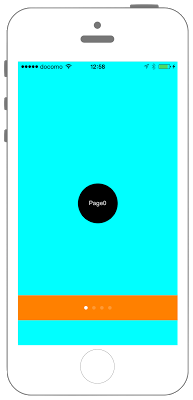
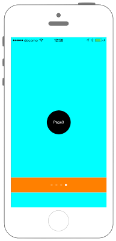

# UIPageControlの表示




``` swift fct_label="Swift 4.x"
//
//  ViewController.swift
//  UIKit018_4.0
//
//  Created by KimikoWatanabe on 2016/08/13.
//  Copyright © 2016年 FaBo, Inc. All rights reserved.
//

import UIKit

class ViewController: UIViewController, UIScrollViewDelegate{
    
    private var pageControl: UIPageControl!
    private var scrollView: UIScrollView!
    
    override func viewDidLoad() {
        
        // ビューの縦、横のサイズを取得する.
        let width = self.view.frame.maxX, height = self.view.frame.maxY
        
        // 背景の色をCyanに設定する.
        self.view.backgroundColor = UIColor.cyan
        
        // ScrollViewを取得する.
        scrollView = UIScrollView(frame: self.view.frame)
        
        // ページ数を定義する.
        let pageSize = 4
        
        // 縦方向と、横方向のインディケータを非表示にする.
        scrollView.showsHorizontalScrollIndicator = false;
        scrollView.showsVerticalScrollIndicator = false
        
        // ページングを許可する.
        scrollView.isPagingEnabled = true
        
        // ScrollViewのデリゲートを設定する.
        scrollView.delegate = self
        
        // スクロールの画面サイズを指定する.
        
        scrollView.contentSize = CGSize(width: CGFloat(pageSize) * width, height: 0)
        
        // ScrollViewをViewに追加する.
        self.view.addSubview(scrollView)
        
        // ページ数分ボタンを生成する.
        for i in 0 ..< pageSize {
            
            // ページごとに異なるラベルを生成する.
            
            let myLabel:UILabel = UILabel(frame: CGRect(x: CGFloat(i) * width + width/2 - 40, y: height/2 - 40, width: 80, height: 80))
            myLabel.backgroundColor = UIColor.black
            myLabel.textColor = UIColor.white
            myLabel.textAlignment = NSTextAlignment.center
            myLabel.layer.masksToBounds = true
            myLabel.text = "Page\(i)"
            
            myLabel.font = UIFont.systemFont(ofSize: UIFont.smallSystemFontSize)
            myLabel.layer.cornerRadius = 40.0
            
            scrollView.addSubview(myLabel)
        }
        
        // PageControlを作成する.
        pageControl = UIPageControl(frame: CGRect(x:0, y:self.view.frame.maxY - 100, width:width, height:50))
        pageControl.backgroundColor = UIColor.orange
        
        // PageControlするページ数を設定する.
        pageControl.numberOfPages = pageSize
        
        // 現在ページを設定する.
        pageControl.currentPage = 0
        pageControl.isUserInteractionEnabled = false
        
        self.view.addSubview(pageControl)
    }
    
    
    func scrollViewDidEndDecelerating(_ scrollView: UIScrollView) {
        
        // スクロール数が1ページ分になったら時.
        if fmod(scrollView.contentOffset.x, scrollView.frame.maxX) == 0 {
            // ページの場所を切り替える.
            pageControl.currentPage = Int(scrollView.contentOffset.x / scrollView.frame.maxX)
        }
    }
    
}

```

```swift fct_label="Swift 3.x"
//
//  ViewController.swift
//  UIKit018_3.0
//
//  Created by KimikoWatanabe on 2016/08/13.
//  Copyright © 2016年 FaBo, Inc. All rights reserved.
//

import UIKit

class ViewController: UIViewController, UIScrollViewDelegate{

    private var pageControl: UIPageControl!
    private var scrollView: UIScrollView!

    override func viewDidLoad() {

        // ビューの縦、横のサイズを取得する.
        let width = self.view.frame.maxX, height = self.view.frame.maxY

        // 背景の色をCyanに設定する.
        self.view.backgroundColor = UIColor.cyan

        // ScrollViewを取得する.
        scrollView = UIScrollView(frame: self.view.frame)

        // ページ数を定義する.
        let pageSize = 4

        // 縦方向と、横方向のインディケータを非表示にする.
        scrollView.showsHorizontalScrollIndicator = false;
        scrollView.showsVerticalScrollIndicator = false

        // ページングを許可する.
        scrollView.isPagingEnabled = true

        // ScrollViewのデリゲートを設定する.
        scrollView.delegate = self

        // スクロールの画面サイズを指定する.

        scrollView.contentSize = CGSize(width: CGFloat(pageSize) * width, height: 0)

        // ScrollViewをViewに追加する.
        self.view.addSubview(scrollView)

        // ページ数分ボタンを生成する.
        for i in 0 ..< pageSize {

            // ページごとに異なるラベルを生成する.

            let myLabel:UILabel = UILabel(frame: CGRect(x: CGFloat(i) * width + width/2 - 40, y: height/2 - 40, width: 80, height: 80))
            myLabel.backgroundColor = UIColor.black
            myLabel.textColor = UIColor.white
            myLabel.textAlignment = NSTextAlignment.center
            myLabel.layer.masksToBounds = true
            myLabel.text = "Page\(i)"

            myLabel.font = UIFont.systemFont(ofSize: UIFont.smallSystemFontSize)
            myLabel.layer.cornerRadius = 40.0

            scrollView.addSubview(myLabel)
        }

        // PageControlを作成する.
        pageControl = UIPageControl(frame: CGRect(x:0, y:self.view.frame.maxY - 100, width:width, height:50))
        pageControl.backgroundColor = UIColor.orange

        // PageControlするページ数を設定する.
        pageControl.numberOfPages = pageSize

        // 現在ページを設定する.
        pageControl.currentPage = 0
        pageControl.isUserInteractionEnabled = false

        self.view.addSubview(pageControl)
    }


    func scrollViewDidEndDecelerating(scrollView: UIScrollView) {

        // スクロール数が1ページ分になったら時.
        if fmod(scrollView.contentOffset.x, scrollView.frame.maxX) == 0 {
            // ページの場所を切り替える.
            pageControl.currentPage = Int(scrollView.contentOffset.x / scrollView.frame.maxX)
        }
    }

}
```


```swift fct_label="Swift 2.3"
//
//  ViewController.swift
//  UIKit018_2.3
//
//  Created by KimikoWatanabe on 2016/08/16.
//  Copyright © 2016年 FaBo, Inc. All rights reserved.
//

import UIKit

class ViewController: UIViewController, UIScrollViewDelegate{

    private var pageControl: UIPageControl!
    private var scrollView: UIScrollView!

    override func viewDidLoad() {

        // ビューの縦、横のサイズを取得する.
        let width = self.view.frame.maxX, height = self.view.frame.maxY

        // 背景の色をCyanに設定する.
        self.view.backgroundColor = UIColor.cyanColor()

        // ScrollViewを取得する.
        scrollView = UIScrollView(frame: self.view.frame)

        // ページ数を定義する.
        let pageSize = 4

        // 縦方向と、横方向のインディケータを非表示にする.
        scrollView.showsHorizontalScrollIndicator = false;
        scrollView.showsVerticalScrollIndicator = false

        // ページングを許可する.
        scrollView.pagingEnabled = true

        // ScrollViewのデリゲートを設定する.
        scrollView.delegate = self

        // スクロールの画面サイズを指定する.
        scrollView.contentSize = CGSizeMake(CGFloat(pageSize) * width, 0)

        // ScrollViewをViewに追加する.
        self.view.addSubview(scrollView)

        // ページ数分ボタンを生成する.
        for var i = 0; i < pageSize; i++ {

            // ページごとに異なるラベルを生成する.
            let myLabel:UILabel = UILabel(frame: CGRectMake(CGFloat(i) * width + width/2 - 40, height/2 - 40, 80, 80))
            myLabel.backgroundColor = UIColor.blackColor()
            myLabel.textColor = UIColor.whiteColor()
            myLabel.textAlignment = NSTextAlignment.Center
            myLabel.layer.masksToBounds = true
            myLabel.text = "Page\(i)"
            myLabel.font = UIFont.systemFontOfSize(UIFont.smallSystemFontSize())
            myLabel.layer.cornerRadius = 40.0

            scrollView.addSubview(myLabel)
        }

        // PageControlを作成する.
        pageControl = UIPageControl(frame: CGRectMake(0, self.view.frame.maxY - 100, width, 50))
        pageControl.backgroundColor = UIColor.orangeColor()

        // PageControlするページ数を設定する.
        pageControl.numberOfPages = pageSize

        // 現在ページを設定する.
        pageControl.currentPage = 0
        pageControl.userInteractionEnabled = false

        self.view.addSubview(pageControl)
    }


    func scrollViewDidEndDecelerating(scrollView: UIScrollView) {

        // スクロール数が1ページ分になったら時.
        if fmod(scrollView.contentOffset.x, scrollView.frame.maxX) == 0 {
            // ページの場所を切り替える.
            pageControl.currentPage = Int(scrollView.contentOffset.x / scrollView.frame.maxX)
        }
    }

}


```

## 3.0と4.0の差分
* scrollViewDidEndDecelerating(scrollView: UIScrollView)が、
scrollViewDidEndDecelerating(_ scrollView: UIScrollView)に変更

## 2.3と3.0の差分
* UIColorの指定が変更  
* UIScrollViewとUIPageControlのプロパティ名が変更
* CGSize,CGRectの生成方法が変更(CGSizeMake,CGRectMakeメソッドが廃止)


## Reference
* UIPageControl Class
 * [https://developer.apple.com/reference/uikit/uipagecontrol](https://developer.apple.com/reference/uikit/uipagecontrol)
