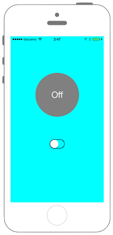

# UISwitchの表示




```swift fct_label="Swift 4.x"
//
//  ViewController.swift
//  UIKit022_4.0
//
//  Created by KimikoWatanabe on 2016/08/17.
//  Copyright © 2016年 FaBo, Inc. All rights reserved.
//

import UIKit

class ViewController: UIViewController {
    
    private var myLabel: UILabel!
    
    override func viewDidLoad() {
        super.viewDidLoad()
        
        // 背景色をCyanに設定する.
        self.view.backgroundColor = UIColor.cyan
        
        // Swicthを作成する.
        let mySwicth: UISwitch = UISwitch()
        mySwicth.layer.position = CGPoint(x: self.view.frame.width/2, y: self.view.frame.height - 200)
        
        // Swicthの枠線を表示する.
        mySwicth.tintColor = UIColor.black
        
        // SwitchをOnに設定する.
        mySwicth.isOn = true
        
        // SwitchのOn/Off切り替わりの際に、呼ばれるイベントを設定する.
        mySwicth.addTarget(self, action: #selector(ViewController.onClickMySwicth(sender:)), for: UIControl.Event.valueChanged)

        
        // SwitchをViewに追加する.
        self.view.addSubview(mySwicth)
        
        // On/Offを表示するラベルを作成する.
        myLabel = UILabel(frame: CGRect(x:0,y:0,width:150,height:150))
        myLabel.backgroundColor = UIColor.orange
        myLabel.layer.masksToBounds = true
        myLabel.layer.cornerRadius = 75.0
        myLabel.textColor = UIColor.white
        myLabel.shadowColor = UIColor.gray
        myLabel.font = UIFont.systemFont(ofSize: 30.0)
        myLabel.textAlignment = NSTextAlignment.center
        myLabel.layer.position = CGPoint(x: self.view.bounds.width/2,y: 200)
        myLabel.text = "On"
        
        // ラベルをviewに追加
        self.view.addSubview(myLabel)
    }
    
    @objc internal func onClickMySwicth(sender: UISwitch){
        
        if sender.isOn {
            myLabel.text = "On"
            myLabel.backgroundColor = UIColor.orange
        }
        else {
            myLabel.text = "Off"
            myLabel.backgroundColor = UIColor.gray
        }
    }
    
    override func didReceiveMemoryWarning() {
        super.didReceiveMemoryWarning()
    }
}

```
```swift fct_label="Swift 3.x"
//
//  ViewController.swift
//  UIKit022_3.0
//
//  Created by KimikoWatanabe on 2016/08/17.
//  Copyright © 2016年 FaBo, Inc. All rights reserved.
//

import UIKit

class ViewController: UIViewController {

    private var myLabel: UILabel!

    override func viewDidLoad() {
        super.viewDidLoad()

        // 背景色をCyanに設定する.
        self.view.backgroundColor = UIColor.cyan

        // Swicthを作成する.
        let mySwicth: UISwitch = UISwitch()
        mySwicth.layer.position = CGPoint(x: self.view.frame.width/2, y: self.view.frame.height - 200)

        // Swicthの枠線を表示する.
        mySwicth.tintColor = UIColor.black

        // SwitchをOnに設定する.
        mySwicth.isOn = true

        // SwitchのOn/Off切り替わりの際に、呼ばれるイベントを設定する.
        mySwicth.addTarget(self, action: #selector(ViewController.onClickMySwicth(sender:)), for: UIControlEvents.valueChanged)

        // SwitchをViewに追加する.
        self.view.addSubview(mySwicth)

        // On/Offを表示するラベルを作成する.
        myLabel = UILabel(frame: CGRect(x:0,y:0,width:150,height:150))
        myLabel.backgroundColor = UIColor.orange
        myLabel.layer.masksToBounds = true
        myLabel.layer.cornerRadius = 75.0
        myLabel.textColor = UIColor.white
        myLabel.shadowColor = UIColor.gray
        myLabel.font = UIFont.systemFont(ofSize: 30.0)
        myLabel.textAlignment = NSTextAlignment.center
        myLabel.layer.position = CGPoint(x: self.view.bounds.width/2,y: 200)
        myLabel.text = "On"

        // ラベルをviewに追加
        self.view.addSubview(myLabel)
    }

    internal func onClickMySwicth(sender: UISwitch){

        if sender.isOn {
            myLabel.text = "On"
            myLabel.backgroundColor = UIColor.orange
        }
        else {
            myLabel.text = "Off"
            myLabel.backgroundColor = UIColor.gray
        }
    }

    override func didReceiveMemoryWarning() {
        super.didReceiveMemoryWarning()
    }
}

```

```swift fct_label="Swift 2.3"
//
//  ViewController.swift
//  UIKit022_2.3
//
//  Created by KimikoWatanabe on 2016/08/17.
//  Copyright © 2016年 FaBo, Inc. All rights reserved.
//

import UIKit

class ViewController: UIViewController {

    private var myLabel: UILabel!

    override func viewDidLoad() {
        super.viewDidLoad()

        // 背景色をCyanに設定する.
        self.view.backgroundColor = UIColor.cyanColor()

        // Swicthを作成する.
        let mySwicth: UISwitch = UISwitch()
        mySwicth.layer.position = CGPoint(x: self.view.frame.width/2, y: self.view.frame.height - 200)

        // Swicthの枠線を表示する.
        mySwicth.tintColor = UIColor.blackColor()

        // SwitchをOnに設定する.
        mySwicth.on = true

        // SwitchのOn/Off切り替わりの際に、呼ばれるイベントを設定する.
        mySwicth.addTarget(self, action: #selector(ViewController.onClickMySwicth(_:)), forControlEvents: UIControlEvents.ValueChanged)

        // SwitchをViewに追加する.
        self.view.addSubview(mySwicth)

        // On/Offを表示するラベルを作成する.
        myLabel = UILabel(frame: CGRectMake(0,0,150,150))
        myLabel.backgroundColor = UIColor.orangeColor()
        myLabel.layer.masksToBounds = true
        myLabel.layer.cornerRadius = 75.0
        myLabel.textColor = UIColor.whiteColor()
        myLabel.shadowColor = UIColor.grayColor()
        myLabel.font = UIFont.systemFontOfSize(CGFloat(30))
        myLabel.textAlignment = NSTextAlignment.Center
        myLabel.layer.position = CGPoint(x: self.view.bounds.width/2,y: 200)
        myLabel.text = "On"

        // ラベルをviewに追加
        self.view.addSubview(myLabel)
    }

    internal func onClickMySwicth(sender: UISwitch){

        if sender.on {
            myLabel.text = "On"
            myLabel.backgroundColor = UIColor.orangeColor()
        }
        else {
            myLabel.text = "Off"
            myLabel.backgroundColor = UIColor.grayColor()
        }
    }

    override func didReceiveMemoryWarning() {
        super.didReceiveMemoryWarning()
    }
}

```

## 3.0と4.0の差分
* mySwicth.addTarget(self, action: #selector(ViewController.onClickMySwicth(sender:)), for: UIControlEvents.valueChanged)が、
mySwicth.addTarget(self, action: #selector(ViewController.onClickMySwicth(sender:)), for: UIControl.Event.valueChanged)に変更
* internal func onClickMySwicth(sender: UISwitch)が、
@objc internal func onClickMySwicth(sender: UISwitch)に変更

## 2.3と3.0の差分
* UIColorの参照方法の変更(UIColor.cyanColor() -> UIColor.cyan)
* CGRectの初期化方法の変更(CGRectMakeメソッドの廃止)
* UISwitchの一部プロパティ名の変更(on -> isOn)

## Reference
* UISwitch Class
 * [https://developer.apple.com/reference/uikit/uiswitch](https://developer.apple.com/reference/uikit/uiswitch)
