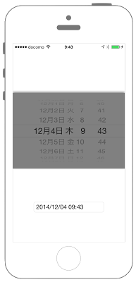

# UIDatePickerの表示



```swift fct_label="Swift 4.x"
//
//  ViewController.swift
//  UIKit023_4.0
//
//  Created by KimikoWatanabe on 2016/08/17.
//  Copyright © 2016年 FaBo, Inc. All rights reserved.
//

import UIKit

class ViewController: UIViewController, UIPickerViewDelegate {
    
    private var myTextField: UITextField!
    
    override func viewDidLoad() {
        super.viewDidLoad()
        
        self.view.backgroundColor = UIColor.white
        
        // DatePickerを生成する.
        let myDatePicker: UIDatePicker = UIDatePicker()
        
        // datePickerを設定（デフォルトでは位置は画面上部）する.
        myDatePicker.frame = CGRect(x:0, y:50, width:self.view.frame.width, height:200)
        myDatePicker.timeZone = NSTimeZone.local
        myDatePicker.backgroundColor = UIColor.white
        myDatePicker.layer.cornerRadius = 5.0
        myDatePicker.layer.shadowOpacity = 0.5
        
        // 値が変わった際のイベントを登録する.
        myDatePicker.addTarget(self, action: #selector(ViewController.onDidChangeDate(sender:)), for: .valueChanged)
        
        // DataPickerをViewに追加する.
        self.view.addSubview(myDatePicker)
        
        // UITextFieldを作成する.
        myTextField = UITextField(frame: CGRect(x:0,y:0,width:200,height:30))
        myTextField.text = ""
        myTextField.borderStyle = UITextField.BorderStyle.roundedRect
        myTextField.layer.position = CGPoint(x: self.view.bounds.width/2,y: self.view.bounds.height - 100);
        
        // UITextFieldをViewに追加する.
        self.view.addSubview(myTextField)
    }
    
    /*
     DatePickerが選ばれた際に呼ばれる.
     */
    @objc internal func onDidChangeDate(sender: UIDatePicker){
        
        // フォーマットを生成.
        let myDateFormatter: DateFormatter = DateFormatter()
        myDateFormatter.dateFormat = "yyyy/MM/dd hh:mm"
        
        // 日付をフォーマットに則って取得.
        let mySelectedDate: NSString = myDateFormatter.string(from: sender.date) as NSString
        myTextField.text = mySelectedDate as String
    }
    
    override func didReceiveMemoryWarning() {
        super.didReceiveMemoryWarning()
    }
}

```

```swift fct_label="Swift 3.x"
//
//  ViewController.swift
//  UIKit023_3.0
//
//  Created by KimikoWatanabe on 2016/08/17.
//  Copyright © 2016年 FaBo, Inc. All rights reserved.
//

import UIKit

class ViewController: UIViewController, UIPickerViewDelegate {

    private var myTextField: UITextField!

    override func viewDidLoad() {
        super.viewDidLoad()

        self.view.backgroundColor = UIColor.white

        // DatePickerを生成する.
        let myDatePicker: UIDatePicker = UIDatePicker()

        // datePickerを設定（デフォルトでは位置は画面上部）する.
        myDatePicker.frame = CGRect(x:0, y:50, width:self.view.frame.width, height:200)
        myDatePicker.timeZone = NSTimeZone.local
        myDatePicker.backgroundColor = UIColor.white
        myDatePicker.layer.cornerRadius = 5.0
        myDatePicker.layer.shadowOpacity = 0.5

        // 値が変わった際のイベントを登録する.
        myDatePicker.addTarget(self, action: #selector(ViewController.onDidChangeDate(sender:)), for: .valueChanged)

        // DataPickerをViewに追加する.
        self.view.addSubview(myDatePicker)

        // UITextFieldを作成する.
        myTextField = UITextField(frame: CGRect(x:0,y:0,width:200,height:30))
        myTextField.text = ""
        myTextField.borderStyle = UITextBorderStyle.roundedRect
        myTextField.layer.position = CGPoint(x: self.view.bounds.width/2,y: self.view.bounds.height - 100);

        // UITextFieldをViewに追加する.
        self.view.addSubview(myTextField)
    }

    /*
     DatePickerが選ばれた際に呼ばれる.
     */
    internal func onDidChangeDate(sender: UIDatePicker){

        // フォーマットを生成.
        let myDateFormatter: DateFormatter = DateFormatter()
        myDateFormatter.dateFormat = "yyyy/MM/dd hh:mm"

        // 日付をフォーマットに則って取得.
        let mySelectedDate: NSString = myDateFormatter.string(from: sender.date)
        myTextField.text = mySelectedDate as String
    }

    override func didReceiveMemoryWarning() {
        super.didReceiveMemoryWarning()
    }
}


```

```swift fct_label="2.3"
//
//  ViewController.swift
//  UIKit023_2.3
//
//  Created by KimikoWatanabe on 2016/08/17.
//  Copyright © 2016年 FaBo, Inc. All rights reserved.
//

import UIKit

class ViewController: UIViewController, UIPickerViewDelegate {

    private var myTextField: UITextField!

    override func viewDidLoad() {
        super.viewDidLoad()

        self.view.backgroundColor = UIColor.whiteColor()

        // DatePickerを生成する.
        let myDatePicker: UIDatePicker = UIDatePicker()

        // datePickerを設定（デフォルトでは位置は画面上部）する.
        myDatePicker.frame = CGRectMake(0, 50, self.view.frame.width, 200)
        myDatePicker.timeZone = NSTimeZone.localTimeZone()
        myDatePicker.backgroundColor = UIColor.whiteColor()
        myDatePicker.layer.cornerRadius = 5.0
        myDatePicker.layer.shadowOpacity = 0.5

        // 値が変わった際のイベントを登録する.
        myDatePicker.addTarget(self, action: #selector(ViewController.onDidChangeDate(_:)), forControlEvents: .ValueChanged)

        // DataPickerをViewに追加する.
        self.view.addSubview(myDatePicker)

        // UITextFieldを作成する.
        myTextField = UITextField(frame: CGRectMake(0,0,200,30))
        myTextField.text = ""
        myTextField.borderStyle = UITextBorderStyle.RoundedRect
        myTextField.layer.position = CGPoint(x: self.view.bounds.width/2,y: self.view.bounds.height - 100);

        // UITextFieldをViewに追加する.
        self.view.addSubview(myTextField)
    }

    /*
     DatePickerが選ばれた際に呼ばれる.
     */
    internal func onDidChangeDate(sender: UIDatePicker){

        // フォーマットを生成.
        let myDateFormatter: NSDateFormatter = NSDateFormatter()
        myDateFormatter.dateFormat = "yyyy/MM/dd hh:mm"

        // 日付をフォーマットに則って取得.
        let mySelectedDate: NSString = myDateFormatter.stringFromDate(sender.date)
        myTextField.text = mySelectedDate as String
    }

    override func didReceiveMemoryWarning() {
        super.didReceiveMemoryWarning()
    }
}

```

## 3.0と4.0の差分
* UITextBorderStyle.roundedRectが、UITextField.BorderStyle.roundedRectに変更
* internal func onDidChangeDate(sender: UIDatePicker)が、
@objc internal func onDidChangeDate(sender: UIDatePicker)に変更
* myDateFormatter.string(from: sender.date)が、
myDateFormatter.string(from: sender.date) as NSStringに変更


## 2.3と3.0の差分
* NSDateFormatterの廃止、DateFormatterに変更
* localのNSTimeZoneの取得方法の変更

## Reference
* UIDatePicker Class
 * [https://developer.apple.com/reference/uikit/uidatepicker](https://developer.apple.com/reference/uikit/uidatepicker)
