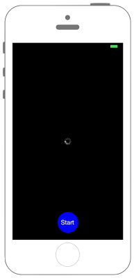

# UIActivityIndicatorの表示




```swift fct_label="Swift 5.x/4.x"
//
//  ViewController.swift
//  UIKit024_4.0
//
//  Created by KimikoWatanabe on 2016/08/17.
//  Copyright © 2016年 FaBo, Inc. All rights reserved.
//

import UIKit

class ViewController: UIViewController {
    
    private var myActivityIndicator: UIActivityIndicatorView!
    private var myButton: UIButton!
    
    override func viewDidLoad() {
        super.viewDidLoad()
        
        // 背景色を黒に設定する.
        self.view.backgroundColor = UIColor.black
        
        // インジケータを作成する.
        myActivityIndicator = UIActivityIndicatorView()
        myActivityIndicator.frame = CGRect(x:0, y:0, width:50, height:50)
        myActivityIndicator.center = self.view.center
        
        // アニメーションが停止している時もインジケータを表示させる.
        myActivityIndicator.hidesWhenStopped = false
        myActivityIndicator.style = UIActivityIndicatorView.Style.white

        // アニメーションを開始する.
        myActivityIndicator.startAnimating()
        
        // インジケータをViewに追加する.
        self.view.addSubview(myActivityIndicator)
        
        // ボタンを生成する.
        myButton = UIButton(frame: CGRect(x:0, y:0, width:60, height:60))
        myButton.backgroundColor = UIColor.red
        myButton.layer.masksToBounds = true
        myButton.layer.cornerRadius = 30.0
        myButton.setTitle("Stop", for: .normal)
        myButton.layer.position = CGPoint(x: self.view.bounds.width/2, y: self.view.bounds.height-50)
        myButton.addTarget(self, action: #selector(ViewController.onClickMyButton(sender:)), for: .touchUpInside)
        
        // ボタンをViewに追加する.
        self.view.addSubview(myButton)
    }
    
    /*
     ボタンイベント.
     */
    @objc internal func onClickMyButton(sender: UIButton){
        
        if myActivityIndicator.isAnimating {
            myActivityIndicator.stopAnimating()
            myButton.setTitle("Start", for: .normal)
            myButton.backgroundColor = UIColor.blue
        }
        else {
            myActivityIndicator.startAnimating()
            myButton.setTitle("Stop", for: .normal)
            myButton.backgroundColor = UIColor.red
        }
    }
    
    override func didReceiveMemoryWarning() {
        super.didReceiveMemoryWarning()
    }
}

```

```swift fct_label="Swift 3.x"
//
//  ViewController.swift
//  UIKit024_3.0
//
//  Created by KimikoWatanabe on 2016/08/17.
//  Copyright © 2016年 FaBo, Inc. All rights reserved.
//

import UIKit

class ViewController: UIViewController {

    private var myActivityIndicator: UIActivityIndicatorView!
    private var myButton: UIButton!

    override func viewDidLoad() {
        super.viewDidLoad()

        // 背景色を黒に設定する.
        self.view.backgroundColor = UIColor.black

        // インジケータを作成する.
        myActivityIndicator = UIActivityIndicatorView()
        myActivityIndicator.frame = CGRect(x:0, y:0, width:50, height:50)
        myActivityIndicator.center = self.view.center

        // アニメーションが停止している時もインジケータを表示させる.
        myActivityIndicator.hidesWhenStopped = false
        myActivityIndicator.activityIndicatorViewStyle = UIActivityIndicatorViewStyle.white

        // アニメーションを開始する.
        myActivityIndicator.startAnimating()

        // インジケータをViewに追加する.
        self.view.addSubview(myActivityIndicator)

        // ボタンを生成する.
        myButton = UIButton(frame: CGRect(x:0, y:0, width:60, height:60))
        myButton.backgroundColor = UIColor.red
        myButton.layer.masksToBounds = true
        myButton.layer.cornerRadius = 30.0
        myButton.setTitle("Stop", for: .normal)
        myButton.layer.position = CGPoint(x: self.view.bounds.width/2, y: self.view.bounds.height-50)
        myButton.addTarget(self, action: #selector(ViewController.onClickMyButton(sender:)), for: .touchUpInside)

        // ボタンをViewに追加する.
        self.view.addSubview(myButton)
    }

    /*
     ボタンイベント.
     */
    internal func onClickMyButton(sender: UIButton){

        if myActivityIndicator.isAnimating {
            myActivityIndicator.stopAnimating()
            myButton.setTitle("Start", for: .normal)
            myButton.backgroundColor = UIColor.blue
        }
        else {
            myActivityIndicator.startAnimating()
            myButton.setTitle("Stop", for: .normal)
            myButton.backgroundColor = UIColor.red
        }
    }

    override func didReceiveMemoryWarning() {
        super.didReceiveMemoryWarning()
    }
}

```

```swift fct_label="Swift 2.3"
//
//  ViewController.swift
//  UIKit024_2.3
//
//  Created by KimikoWatanabe on 2016/08/17.
//  Copyright © 2016年 FaBo, Inc. All rights reserved.
//

import UIKit

class ViewController: UIViewController {

    private var myActivityIndicator: UIActivityIndicatorView!
    private var myButton: UIButton!

    override func viewDidLoad() {
        super.viewDidLoad()

        // 背景色を黒に設定する.
        self.view.backgroundColor = UIColor.blackColor()

        // インジケータを作成する.
        myActivityIndicator = UIActivityIndicatorView()
        myActivityIndicator.frame = CGRectMake(0, 0, 50, 50)
        myActivityIndicator.center = self.view.center

        // アニメーションが停止している時もインジケータを表示させる.
        myActivityIndicator.hidesWhenStopped = false
        myActivityIndicator.activityIndicatorViewStyle = UIActivityIndicatorViewStyle.White

        // アニメーションを開始する.
        myActivityIndicator.startAnimating()

        // インジケータをViewに追加する.
        self.view.addSubview(myActivityIndicator)

        // ボタンを生成する.
        myButton = UIButton(frame: CGRectMake(0, 0, 60, 60))
        myButton.backgroundColor = UIColor.redColor()
        myButton.layer.masksToBounds = true
        myButton.layer.cornerRadius = 30.0
        myButton.setTitle("Stop", forState: .Normal)
        myButton.layer.position = CGPoint(x: self.view.bounds.width/2, y: self.view.bounds.height-50)
        myButton.addTarget(self, action: #selector(ViewController.onClickMyButton(_:)), forControlEvents: .TouchUpInside)

        // ボタンをViewに追加する.
        self.view.addSubview(myButton)
    }

    /*
     ボタンイベント.
     */
    internal func onClickMyButton(sender: UIButton){

        if myActivityIndicator.isAnimating() {
            myActivityIndicator.stopAnimating()
            myButton.setTitle("Start", forState: .Normal)
            myButton.backgroundColor = UIColor.blueColor()
        }
        else {
            myActivityIndicator.startAnimating()
            myButton.setTitle("Stop", forState: .Normal)
            myButton.backgroundColor = UIColor.redColor()
        }
    }

    override func didReceiveMemoryWarning() {
        super.didReceiveMemoryWarning()
    }
}

```

## 3.0と4.0の差分
* ```activityIndicatorViewStyle``` が ```style``` に変更
* ```UIActivityIndicatorViewStyle``` が ```UIActivityIndicatorView.Style``` に変更
* ```internal func onClickMyButton(sender: UIButton)``` に ```@objc``` を追加


## 2.3と3.0の差分
* myActivityIndicator.isAnimatingがメソッドからプロパティに変更

## Reference
* UIActivityIndicatorView Class
 * [https://developer.apple.com/reference/uikit/uiactivityindicatorview](https://developer.apple.com/reference/uikit/uiactivityindicatorview)
