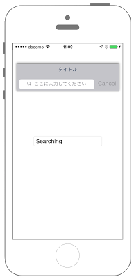

# UISearchBarの表示




```swift　fct_label="Swift 4.x"
//
//  ViewController.swift
//  UIKit025_4.0
//
//  Created by KimikoWatanabe on 2016/08/17.
//  Copyright © 2016年 FaBo, Inc. All rights reserved.
//

import UIKit

class ViewController: UIViewController, UISearchBarDelegate {
    
    private var mySearchBar: UISearchBar!
    private var myLabel : UILabel!
    
    override func viewDidLoad() {
        super.viewDidLoad()
        
        // 背景を白に設定する.
        self.view.backgroundColor = UIColor.white
        
        // 検索バーを作成する.
        mySearchBar = UISearchBar()
        mySearchBar.delegate = self
        mySearchBar.frame = CGRect(x:0, y:0, width:300, height:80)
        mySearchBar.layer.position = CGPoint(x: self.view.bounds.width/2, y: 100)
        
        // 影をつける.
        mySearchBar.layer.shadowColor = UIColor.black.cgColor
        mySearchBar.layer.shadowOpacity = 0.5
        mySearchBar.layer.masksToBounds = false
        
        // キャンセルボタンを有効にする.
        mySearchBar.showsCancelButton = true
        
        // ブックマークボタンを無効にする.
        mySearchBar.showsBookmarkButton = false
        
        // バースタイルをDefaultに設定する.
        mySearchBar.searchBarStyle = UISearchBar.Style.default
        
        // タイトルを設定する.
        mySearchBar.prompt = "タイトル"
        
        // 説明文を設定する.
        mySearchBar.placeholder = "ここに入力してください"
        
        // カーソル、キャンセルボタンの色を設定する.
        mySearchBar.tintColor = UIColor.red
        
        // 検索結果表示ボタンは非表示にする.
        mySearchBar.showsSearchResultsButton = false
        
        // 検索バーをViewに追加する.
        self.view.addSubview(mySearchBar)
        
        // UITextFieldを作成する.
        myLabel = UILabel(frame: CGRect(x:0,y:0,width:200,height:30))
        myLabel.center = CGPoint(x: self.view.frame.width/2, y: self.view.frame.height/2)
        myLabel.text = ""
        myLabel.layer.borderWidth = 1.0
        myLabel.layer.borderColor = UIColor.gray.cgColor
        myLabel.layer.cornerRadius = 10.0
        
        // Viewに追加する.
        self.view.addSubview(myLabel)
    }
    
    /*
     テキストが変更される毎に呼ばれる
     */
    func searchBar(_ searchBar: UISearchBar, textDidChange searchText: String) {
        myLabel.text = searchText
    }
    
    /*
     Cancelボタンが押された時に呼ばれる
     */
    func searchBarCancelButtonClicked(_ searchBar: UISearchBar) {
        myLabel.text = ""
        mySearchBar.text = ""
    }
    
    /*
     Searchボタンが押された時に呼ばれる
     */
    func searchBarSearchButtonClicked(_ searchBar: UISearchBar) {
        myLabel.text = "Searching"
        mySearchBar.text = ""
        self.view.endEditing(true)
    }
}

```
```swift fct_label="Swift3.x"
//
//  ViewController.swift
//  UIKit025_3.0
//
//  Created by KimikoWatanabe on 2016/08/17.
//  Copyright © 2016年 FaBo, Inc. All rights reserved.
//

import UIKit

class ViewController: UIViewController, UISearchBarDelegate {

    private var mySearchBar: UISearchBar!
    private var myLabel : UILabel!

    override func viewDidLoad() {
        super.viewDidLoad()

        // 背景を白に設定する.
        self.view.backgroundColor = UIColor.white

        // 検索バーを作成する.
        mySearchBar = UISearchBar()
        mySearchBar.delegate = self
        mySearchBar.frame = CGRect(x:0, y:0, width:300, height:80)
        mySearchBar.layer.position = CGPoint(x: self.view.bounds.width/2, y: 100)

        // 影をつける.
        mySearchBar.layer.shadowColor = UIColor.black.cgColor
        mySearchBar.layer.shadowOpacity = 0.5
        mySearchBar.layer.masksToBounds = false

        // キャンセルボタンを有効にする.
        mySearchBar.showsCancelButton = true

        // ブックマークボタンを無効にする.
        mySearchBar.showsBookmarkButton = false

        // バースタイルをDefaultに設定する.
        mySearchBar.searchBarStyle = UISearchBarStyle.default

        // タイトルを設定する.
        mySearchBar.prompt = "タイトル"

        // 説明文を設定する.
        mySearchBar.placeholder = "ここに入力してください"

        // カーソル、キャンセルボタンの色を設定する.
        mySearchBar.tintColor = UIColor.red

        // 検索結果表示ボタンは非表示にする.
        mySearchBar.showsSearchResultsButton = false

        // 検索バーをViewに追加する.
        self.view.addSubview(mySearchBar)

        // UITextFieldを作成する.
        myLabel = UILabel(frame: CGRect(x:0,y:0,width:200,height:30))
        myLabel.center = CGPoint(x: self.view.frame.width/2, y: self.view.frame.height/2)
        myLabel.text = ""
        myLabel.layer.borderWidth = 1.0
        myLabel.layer.borderColor = UIColor.gray.cgColor
        myLabel.layer.cornerRadius = 10.0

        // Viewに追加する.
        self.view.addSubview(myLabel)
    }

    /*
     テキストが変更される毎に呼ばれる
     */
    func searchBar(_ searchBar: UISearchBar, textDidChange searchText: String) {
        myLabel.text = searchText
    }

    /*
     Cancelボタンが押された時に呼ばれる
     */
    func searchBarCancelButtonClicked(_ searchBar: UISearchBar) {
        myLabel.text = ""
        mySearchBar.text = ""
    }

    /*
     Searchボタンが押された時に呼ばれる
     */
    func searchBarSearchButtonClicked(_ searchBar: UISearchBar) {
        myLabel.text = "Searching"
        mySearchBar.text = ""
        self.view.endEditing(true)
    }
}

```

```swift fct_label="Swift 2.3"
//
//  ViewController.swift
//  UIKit025_2.3
//
//  Created by KimikoWatanabe on 2016/08/17.
//  Copyright © 2016年 FaBo, Inc. All rights reserved.
//

import UIKit

class ViewController: UIViewController, UISearchBarDelegate {

    private var mySearchBar: UISearchBar!
    private var myLabel : UILabel!

    override func viewDidLoad() {
        super.viewDidLoad()

        // 背景を白に設定する.
        self.view.backgroundColor = UIColor.whiteColor()

        // 検索バーを作成する.
        mySearchBar = UISearchBar()
        mySearchBar.delegate = self
        mySearchBar.frame = CGRectMake(0, 0, 300, 80)
        mySearchBar.layer.position = CGPoint(x: self.view.bounds.width/2, y: 100)

        // 影をつける.
        mySearchBar.layer.shadowColor = UIColor.blackColor().CGColor
        mySearchBar.layer.shadowOpacity = 0.5
        mySearchBar.layer.masksToBounds = false

        // キャンセルボタンを有効にする.
        mySearchBar.showsCancelButton = true

        // ブックマークボタンを無効にする.
        mySearchBar.showsBookmarkButton = false

        // バースタイルをDefaultに設定する.
        mySearchBar.searchBarStyle = UISearchBarStyle.Default

        // タイトルを設定する.
        mySearchBar.prompt = "タイトル"

        // 説明文を設定する.
        mySearchBar.placeholder = "ここに入力してください"

        // カーソル、キャンセルボタンの色を設定する.
        mySearchBar.tintColor = UIColor.redColor()

        // 検索結果表示ボタンは非表示にする.
        mySearchBar.showsSearchResultsButton = false

        // 検索バーをViewに追加する.
        self.view.addSubview(mySearchBar)

        // UITextFieldを作成する.
        myLabel = UILabel(frame: CGRectMake(0,0,200,30))
        myLabel.center = CGPoint(x: self.view.frame.width/2, y: self.view.frame.height/2)
        myLabel.text = ""
        myLabel.layer.borderWidth = 1.0
        myLabel.layer.borderColor = UIColor.grayColor().CGColor
        myLabel.layer.cornerRadius = 10.0

        // Viewに追加する.
        self.view.addSubview(myLabel)
    }

    /*
     テキストが変更される毎に呼ばれる
     */
    func searchBar(searchBar: UISearchBar, textDidChange searchText: String) {
        myLabel.text = searchText
    }

    /*
     Cancelボタンが押された時に呼ばれる
     */
    func searchBarCancelButtonClicked(searchBar: UISearchBar) {
        myLabel.text = ""
        mySearchBar.text = ""
    }

    /*
     Searchボタンが押された時に呼ばれる
     */
    func searchBarSearchButtonClicked(searchBar: UISearchBar) {
        myLabel.text = "Searching"
        mySearchBar.text = ""
        self.view.endEditing(true)
    }
}


```

## 3.0と4.0の差分
* ```UISearchBarStyle.default``` が、 ```UISearchBar.Style.default``` に変更

## 2.3と3.0の差分
* UIColorの参照名が変更(UIColor.blackColor() -> UIColor.black)
* CGRectの初期化方法が変更(CGRectMakeメソッドの廃止)
* UISearchBarDelegateのメソッドの引数が変更

## Reference
* UISearchBar Class
 * [https://developer.apple.com/reference/uikit/uisearchbar](https://developer.apple.com/reference/uikit/uisearchbar)
