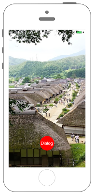

# UIWindowの表示




```swift fct_label="Swift 4.x"
//
//  ViewController.swift
//  UIKit026_4.0
//
//  Created by KimikoWatanabe on 2016/08/17.
//  Copyright © 2016年 FaBo, Inc. All rights reserved.
//

import UIKit

class ViewController: UIViewController {

    private var myWindow: UIWindow!
    private var myWindowButton: UIButton!
    private var myButton: UIButton!

    override func viewDidLoad() {
        super.viewDidLoad()

        myWindow = UIWindow()
        myWindowButton = UIButton()
        myButton = UIButton()

        // 背景に画像を設定する.
        let myImage: UIImage = UIImage(named: "oouchi.jpg")!
        let myImageView: UIImageView = UIImageView()
        myImageView.image = myImage

        // 画像のscaleを計算.
        let scale = self.view.frame.width/myImage.size.width
        myImageView.frame = CGRect(x:0, y:0, width:myImage.size.width*scale, height:myImage.size.height*scale)
        self.view.addSubview(myImageView)

        // ボタンを生成する.
        myButton.frame = CGRect(x:0, y:0, width:60, height:60)
        myButton.backgroundColor = UIColor.red
        myButton.setTitle("Dialog", for: .normal)
        myButton.setTitleColor(UIColor.white, for: .normal)
        myButton.layer.masksToBounds = true
        myButton.layer.cornerRadius = 30.0
            myButton.layer.position = CGPoint(x:self.view.frame.width/2, y:self.view.frame.height-100)
        myButton.addTarget(self, action: #selector(ViewController.onClickMyButton(sender:)), for: .touchUpInside)

        // ボタンを追加する.
        self.view.addSubview(myButton)
    }

    /*
     自作Windowを生成する
     */
    internal func makeMyWindow(){

        // 背景を白に設定する.
        myWindow.backgroundColor = UIColor.white
        myWindow.frame = CGRect(x:0, y:0, width:200, height:250)
        myWindow.layer.position = CGPoint(x:self.view.frame.width/2, y:self.view.frame.height/2)
        myWindow.alpha = 0.8
        myWindow.layer.cornerRadius = 20

        // myWindowをkeyWindowにする.
        myWindow.makeKey()

        // windowを表示する.
        self.myWindow.makeKeyAndVisible()

        // ボタンを作成する.
        myWindowButton.frame = CGRect(x:0, y:0, width:100, height:60)
        myWindowButton.backgroundColor = UIColor.orange
        myWindowButton.setTitle("Close", for: .normal)
        myWindowButton.setTitleColor(UIColor.white, for: .normal)
        myWindowButton.layer.masksToBounds = true
        myWindowButton.layer.cornerRadius = 20.0
        myWindowButton.layer.position = CGPoint(x:self.myWindow.frame.width/2, y:self.myWindow.frame.height-50)
        myWindowButton.addTarget(self, action: #selector(ViewController.onClickMyButton(sender:)), for: .touchUpInside)
        self.myWindow.addSubview(myWindowButton)

        // TextViewを作成する.
        let myTextView: UITextView = UITextView(frame: CGRect(x:10, y:10, width:self.myWindow.frame.width - 20, height:150))
        myTextView.backgroundColor = UIColor.clear
        myTextView.text = "大内宿は、会津城下と下野の国（日光今市）を結ぶ32里の区間の中で会津から2番目の宿駅として1640年ごろに整備された宿場町です。"
        myTextView.font = UIFont.systemFont(ofSize: 15.0)
        myTextView.textColor = UIColor.black
        myTextView.textAlignment = NSTextAlignment.left
        myTextView.isEditable = false

        self.myWindow.addSubview(myTextView)
    }

    /*
     ボタンイベント
     */
    @objc internal func onClickMyButton(sender: UIButton) {

        if sender == myWindowButton {
            myWindow.isHidden = true
        }
        else if sender == myButton {
            makeMyWindow()
        }
    }

    override func didReceiveMemoryWarning() {
        super.didReceiveMemoryWarning()
    }
}

```

```swift fct_label="Swift 3.x"
//
//  ViewController.swift
//  UIKit026_3.0
//
//  Created by KimikoWatanabe on 2016/08/17.
//  Copyright © 2016年 FaBo, Inc. All rights reserved.
//

import UIKit

class ViewController: UIViewController {

    private var myWindow: UIWindow!
    private var myWindowButton: UIButton!
    private var myButton: UIButton!

    override func viewDidLoad() {
        super.viewDidLoad()

        myWindow = UIWindow()
        myWindowButton = UIButton()
        myButton = UIButton()

        // 背景に画像を設定する.
        let myImage: UIImage = UIImage(named: "oouchi.jpg")!
        let myImageView: UIImageView = UIImageView()
        myImageView.image = myImage

        // 画像のscaleを計算.
        let scale = self.view.frame.width/myImage.size.width
        myImageView.frame = CGRect(x:0, y:0, width:myImage.size.width*scale, height:myImage.size.height*scale)
        self.view.addSubview(myImageView)

        // ボタンを生成する.
        myButton.frame = CGRect(x:0, y:0, width:60, height:60)
        myButton.backgroundColor = UIColor.red
        myButton.setTitle("Dialog", for: .normal)
        myButton.setTitleColor(UIColor.white, for: .normal)
        myButton.layer.masksToBounds = true
        myButton.layer.cornerRadius = 30.0
            myButton.layer.position = CGPoint(x:self.view.frame.width/2, y:self.view.frame.height-100)
        myButton.addTarget(self, action: #selector(ViewController.onClickMyButton(sender:)), for: .touchUpInside)

        // ボタンを追加する.
        self.view.addSubview(myButton)
    }

    /*
     自作Windowを生成する
     */
    internal func makeMyWindow(){

        // 背景を白に設定する.
        myWindow.backgroundColor = UIColor.white
        myWindow.frame = CGRect(x:0, y:0, width:200, height:250)
        myWindow.layer.position = CGPoint(x:self.view.frame.width/2, y:self.view.frame.height/2)
        myWindow.alpha = 0.8
        myWindow.layer.cornerRadius = 20

        // myWindowをkeyWindowにする.
        myWindow.makeKey()

        // windowを表示する.
        self.myWindow.makeKeyAndVisible()

        // ボタンを作成する.
        myWindowButton.frame = CGRect(x:0, y:0, width:100, height:60)
        myWindowButton.backgroundColor = UIColor.orange
        myWindowButton.setTitle("Close", for: .normal)
        myWindowButton.setTitleColor(UIColor.white, for: .normal)
        myWindowButton.layer.masksToBounds = true
        myWindowButton.layer.cornerRadius = 20.0
        myWindowButton.layer.position = CGPoint(x:self.myWindow.frame.width/2, y:self.myWindow.frame.height-50)
        myWindowButton.addTarget(self, action: #selector(ViewController.onClickMyButton(sender:)), for: .touchUpInside)
        self.myWindow.addSubview(myWindowButton)

        // TextViewを作成する.
        let myTextView: UITextView = UITextView(frame: CGRect(x:10, y:10, width:self.myWindow.frame.width - 20, height:150))
        myTextView.backgroundColor = UIColor.clear
        myTextView.text = "大内宿は、会津城下と下野の国（日光今市）を結ぶ32里の区間の中で会津から2番目の宿駅として1640年ごろに整備された宿場町です。"
        myTextView.font = UIFont.systemFont(ofSize: 15.0)
        myTextView.textColor = UIColor.black
        myTextView.textAlignment = NSTextAlignment.left
        myTextView.isEditable = false

        self.myWindow.addSubview(myTextView)
    }

    /*
     ボタンイベント
     */
    internal func onClickMyButton(sender: UIButton) {

        if sender == myWindowButton {
            myWindow.isHidden = true
        }
        else if sender == myButton {
            makeMyWindow()
        }
    }

    override func didReceiveMemoryWarning() {
        super.didReceiveMemoryWarning()
    }
}

```

```swift fct_label="Swift 2.3"
//
//  ViewController.swift
//  UIKit026_2.3
//
//  Created by KimikoWatanabe on 2016/08/17.
//  Copyright © 2016年 FaBo, Inc. All rights reserved.
//

import UIKit

class ViewController: UIViewController {

    private var myWindow: UIWindow!
    private var myWindowButton: UIButton!
    private var myButton: UIButton!

    override func viewDidLoad() {
        super.viewDidLoad()

        myWindow = UIWindow()
        myWindowButton = UIButton()
        myButton = UIButton()

        // 背景に画像を設定する.
        let myImage: UIImage = UIImage(named: "oouchi.jpg")!
        let myImageView: UIImageView = UIImageView()
        myImageView.image = myImage

        // 画像のscaleを計算.
        let scale = self.view.frame.width/myImage.size.width
        myImageView.frame = CGRectMake(0, 0, myImage.size.width*scale, myImage.size.height*scale)
        self.view.addSubview(myImageView)

        // ボタンを生成する.
        myButton.frame = CGRectMake(0, 0, 60, 60)
        myButton.backgroundColor = UIColor.redColor()
        myButton.setTitle("Dialog", forState: .Normal)
        myButton.setTitleColor(UIColor.whiteColor(), forState: .Normal)
        myButton.layer.masksToBounds = true
        myButton.layer.cornerRadius = 30.0
        myButton.layer.position = CGPointMake(self.view.frame.width/2, self.view.frame.height-100)
        myButton.addTarget(self, action: #selector(ViewController.onClickMyButton(_:)), forControlEvents: .TouchUpInside)

        // ボタンを追加する.
        self.view.addSubview(myButton)
    }

    /*
     自作Windowを生成する
     */
    internal func makeMyWindow(){

        // 背景を白に設定する.
        myWindow.backgroundColor = UIColor.whiteColor()
        myWindow.frame = CGRectMake(0, 0, 200, 250)
        myWindow.layer.position = CGPointMake(self.view.frame.width/2, self.view.frame.height/2)
        myWindow.alpha = 0.8
        myWindow.layer.cornerRadius = 20

        // myWindowをkeyWindowにする.
        myWindow.makeKeyWindow()

        // windowを表示する.
        self.myWindow.makeKeyAndVisible()

        // ボタンを作成する.
        myWindowButton.frame = CGRectMake(0, 0, 100, 60)
        myWindowButton.backgroundColor = UIColor.orangeColor()
        myWindowButton.setTitle("Close", forState: .Normal)
        myWindowButton.setTitleColor(UIColor.whiteColor(), forState: .Normal)
        myWindowButton.layer.masksToBounds = true
        myWindowButton.layer.cornerRadius = 20.0
        myWindowButton.layer.position = CGPointMake(self.myWindow.frame.width/2, self.myWindow.frame.height-50)
        myWindowButton.addTarget(self, action: #selector(ViewController.onClickMyButton(_:)), forControlEvents: .TouchUpInside)
        self.myWindow.addSubview(myWindowButton)

        // TextViewを作成する.
        let myTextView: UITextView = UITextView(frame: CGRectMake(10, 10, self.myWindow.frame.width - 20, 150))
        myTextView.backgroundColor = UIColor.clearColor()
        myTextView.text = "大内宿は、会津城下と下野の国（日光今市）を結ぶ32里の区間の中で会津から2番目の宿駅として1640年ごろに整備された宿場町です。"
        myTextView.font = UIFont.systemFontOfSize(CGFloat(15))
        myTextView.textColor = UIColor.blackColor()
        myTextView.textAlignment = NSTextAlignment.Left
        myTextView.editable = false

        self.myWindow.addSubview(myTextView)
    }

    /*
     ボタンイベント
     */
    internal func onClickMyButton(sender: UIButton) {

        if sender == myWindowButton {
            myWindow.hidden = true
        }
        else if sender == myButton {
            makeMyWindow()
        }
    }

    override func didReceiveMemoryWarning() {
        super.didReceiveMemoryWarning()
    }
}


```

## 3.0と4.0の差分
* ```internal func onClickMyButton(sender: UIButton)``` に ```@objc``` を追加

## 2.3と3.0の差分
* CGRect,CGPointの初期化方法の変更(CGRectMake,CGPointMakeメソッドの廃止)
* UIColorの呼び出し方法の変更(UIColor.whiteColor() -> UIColor.white)
* UIWindowの一部プロパティ名の変更(hidden->isHidden)

## Reference
* UIWindow Class
 * [https://developer.apple.com/reference/uikit/uiwindow](https://developer.apple.com/reference/uikit/uiwindow)
