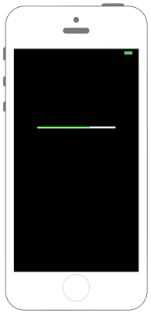

# UIProgressViewで進捗の具合の確認



```swift fct_label="Swift 4.x/Swift 3.x"
//
//  ViewController.swift
//  UIKit028_3.0
//
//  Created by KimikoWatanabe on 2016/08/13.
//  Copyright © 2016年 FaBo, Inc. All rights reserved.
//

import UIKit

class ViewController: UIViewController {

    override func viewDidLoad() {
        super.viewDidLoad()

        // 背景色を黒色にする.
        self.view.backgroundColor = UIColor.black

        // ProgressViewを作成する.
        let myProgressView: UIProgressView = UIProgressView(frame: CGRect(x:0, y:0, width:200, height:10))
        myProgressView.progressTintColor = UIColor.green
        myProgressView.trackTintColor = UIColor.white

        // 座標を設定する.
        myProgressView.layer.position = CGPoint(x: self.view.frame.width/2, y: 200)

        // バーの高さを設定する(横に1.0倍,縦に2.0倍).
        myProgressView.transform = CGAffineTransform(scaleX: 1.0, y: 2.0)

        // 進捗具合を設定する(0.0~1.0).
        myProgressView.progress = 0.3

        // アニメーションを付ける.
        myProgressView.setProgress(1.0, animated: true)

        // Viewに追加する.
        self.view.addSubview(myProgressView)
    }

    override func didReceiveMemoryWarning() {
        super.didReceiveMemoryWarning()

    }
}

```

```swift fct_label="Swift 2.3"
//
//  ViewController.swift
//  UIKit028_2.3
//
//  Created by KimikoWatanabe on 2016/08/16.
//  Copyright © 2016年 FaBo, Inc. All rights reserved.
//

import UIKit

class ViewController: UIViewController {

    override func viewDidLoad() {
        super.viewDidLoad()

        // 背景色を黒色にする.
        self.view.backgroundColor = UIColor.blackColor()

        // ProgressViewを作成する.
        let myProgressView: UIProgressView = UIProgressView(frame: CGRectMake(0, 0, 200, 10))
        myProgressView.progressTintColor = UIColor.greenColor()
        myProgressView.trackTintColor = UIColor.whiteColor()

        // 座標を設定する.
        myProgressView.layer.position = CGPoint(x: self.view.frame.width/2, y: 200)

        // バーの高さを設定する(横に1.0倍,縦に2.0倍).
        myProgressView.transform = CGAffineTransformMakeScale(1.0, 2.0)

        // 進捗具合を設定する(0.0~1.0).
        myProgressView.progress = 0.3

        // アニメーションを付ける.
        myProgressView.setProgress(1.0, animated: true)

        // Viewに追加する.
        self.view.addSubview(myProgressView)
    }

    override func didReceiveMemoryWarning() {
        super.didReceiveMemoryWarning()

    }
}


```

## 2.3と3.0の差分
* CGPointの初期化の変更(CGPointMakeの廃止)
* CGAffineTransformの初期化方法の変更(CGAffineTransformMakeScaleの廃止)

## Reference
* UIProgressView
 * [https://developer.apple.com/reference/uikit/uiprogressview](https://developer.apple.com/reference/uikit/uiprogressview)
