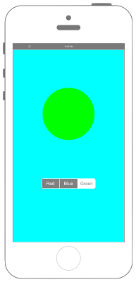

# UISegmentedControlの表示



```swift fct_label="Swift 4.x"
//
//  ViewController.swift
//  UIKit029_4.0
//
//  Created by KimikoWatanabe on 2016/08/17.
//  Copyright © 2016年 FaBo, Inc. All rights reserved.
//

import UIKit

class ViewController: UIViewController {
    
    private let mySegLabel: UILabel = UILabel(frame: CGRect(x:0,y:0,width:150,height:150))
    
    override func viewDidLoad() {
        super.viewDidLoad()
        
        // 表示する配列を作成する.
        let myArray: NSArray = ["Red","Blue","Green"]
        
        // SegmentedControlを作成する.
        let mySegcon: UISegmentedControl = UISegmentedControl(items: myArray as [AnyObject])
        mySegcon.center = CGPoint(x: self.view.frame.width/2, y: 400)
        mySegcon.backgroundColor = UIColor.gray
        mySegcon.tintColor = UIColor.white
        
        // イベントを追加する.
        mySegcon.addTarget(self, action: #selector(ViewController.segconChanged(segcon:)), for: UIControl.Event.valueChanged)
        
        // Viewに追加する.
        self.view.addSubview(mySegcon)
        
        // Labelを作成する.
        mySegLabel.backgroundColor = UIColor.white
        mySegLabel.layer.masksToBounds = true
        mySegLabel.layer.cornerRadius = 75.0
        mySegLabel.textColor = UIColor.white
        mySegLabel.shadowColor = UIColor.gray
        mySegLabel.font = UIFont.systemFont(ofSize: 30.0)
        mySegLabel.textAlignment = NSTextAlignment.center
        mySegLabel.layer.position = CGPoint(x: self.view.bounds.width/2,y: 200)
        
        // Viewの背景色をCyanにする.
        self.view.backgroundColor = UIColor.cyan
        
        // Viewに追加する.
        self.view.addSubview(mySegLabel);
    }
    
    /*
     SwgmentedControlの値が変わったときに呼び出される.
     */
    @objc internal func segconChanged(segcon: UISegmentedControl){
        
        switch segcon.selectedSegmentIndex {
        case 0:
            mySegLabel.backgroundColor = UIColor.red
            
        case 1:
            mySegLabel.backgroundColor = UIColor.blue
            
        case 2:
            mySegLabel.backgroundColor = UIColor.green
            
        default:
            print("Error")
        }
    }
    
    override func didReceiveMemoryWarning() {
        super.didReceiveMemoryWarning()
    }
}


```
```swift fct_label="Swift 3.x"
//
//  ViewController.swift
//  UIKit029_3.0
//
//  Created by KimikoWatanabe on 2016/08/17.
//  Copyright © 2016年 FaBo, Inc. All rights reserved.
//

import UIKit

class ViewController: UIViewController {

    private let mySegLabel: UILabel = UILabel(frame: CGRect(x:0,y:0,width:150,height:150))

    override func viewDidLoad() {
        super.viewDidLoad()

        // 表示する配列を作成する.
        let myArray: NSArray = ["Red","Blue","Green"]

        // SegmentedControlを作成する.
        let mySegcon: UISegmentedControl = UISegmentedControl(items: myArray as [AnyObject])
        mySegcon.center = CGPoint(x: self.view.frame.width/2, y: 400)
        mySegcon.backgroundColor = UIColor.gray
        mySegcon.tintColor = UIColor.white

        // イベントを追加する.
        mySegcon.addTarget(self, action: #selector(ViewController.segconChanged(segcon:)), for: UIControlEvents.valueChanged)

        // Viewに追加する.
        self.view.addSubview(mySegcon)

        // Labelを作成する.
        mySegLabel.backgroundColor = UIColor.white
        mySegLabel.layer.masksToBounds = true
        mySegLabel.layer.cornerRadius = 75.0
        mySegLabel.textColor = UIColor.white
        mySegLabel.shadowColor = UIColor.gray
        mySegLabel.font = UIFont.systemFont(ofSize: 30.0)
        mySegLabel.textAlignment = NSTextAlignment.center
        mySegLabel.layer.position = CGPoint(x: self.view.bounds.width/2,y: 200)

        // Viewの背景色をCyanにする.
        self.view.backgroundColor = UIColor.cyan

        // Viewに追加する.
        self.view.addSubview(mySegLabel);
    }

    /*
     SwgmentedControlの値が変わったときに呼び出される.
     */
    internal func segconChanged(segcon: UISegmentedControl){

        switch segcon.selectedSegmentIndex {
        case 0:
            mySegLabel.backgroundColor = UIColor.red

        case 1:
            mySegLabel.backgroundColor = UIColor.blue

        case 2:
            mySegLabel.backgroundColor = UIColor.green

        default:
            print("Error")
        }
    }

    override func didReceiveMemoryWarning() {
        super.didReceiveMemoryWarning()
    }
}


```

```swift fct_label="Swift 2.3"
//
//  ViewController.swift
//  UIKit029_2.3
//
//  Created by KimikoWatanabe on 2016/08/17.
//  Copyright © 2016年 FaBo, Inc. All rights reserved.
//

import UIKit

class ViewController: UIViewController {

    private let mySegLabel: UILabel = UILabel(frame: CGRectMake(0,0,150,150))

    override func viewDidLoad() {
        super.viewDidLoad()

        // 表示する配列を作成する.
        let myArray: NSArray = ["Red","Blue","Green"]

        // SegmentedControlを作成する.
        let mySegcon: UISegmentedControl = UISegmentedControl(items: myArray as [AnyObject])
        mySegcon.center = CGPoint(x: self.view.frame.width/2, y: 400)
        mySegcon.backgroundColor = UIColor.grayColor()
        mySegcon.tintColor = UIColor.whiteColor()

        // イベントを追加する.
        mySegcon.addTarget(self, action: #selector(ViewController.segconChanged(_:)), forControlEvents: UIControlEvents.ValueChanged)

        // Viewに追加する.
        self.view.addSubview(mySegcon)

        // Labelを作成する.
        mySegLabel.backgroundColor = UIColor.whiteColor()
        mySegLabel.layer.masksToBounds = true
        mySegLabel.layer.cornerRadius = 75.0
        mySegLabel.textColor = UIColor.whiteColor()
        mySegLabel.shadowColor = UIColor.grayColor()
        mySegLabel.font = UIFont.systemFontOfSize(CGFloat(30))
        mySegLabel.textAlignment = NSTextAlignment.Center
        mySegLabel.layer.position = CGPoint(x: self.view.bounds.width/2,y: 200)

        // Viewの背景色をCyanにする.
        self.view.backgroundColor = UIColor.cyanColor()

        // Viewに追加する.
        self.view.addSubview(mySegLabel);
    }

    /*
     SwgmentedControlの値が変わったときに呼び出される.
     */
    internal func segconChanged(segcon: UISegmentedControl){

        switch segcon.selectedSegmentIndex {
        case 0:
            mySegLabel.backgroundColor = UIColor.redColor()

        case 1:
            mySegLabel.backgroundColor = UIColor.blueColor()

        case 2:
            mySegLabel.backgroundColor = UIColor.greenColor()

        default:
            print("Error")
        }
    }

    override func didReceiveMemoryWarning() {
        super.didReceiveMemoryWarning()
    }
}

```

## 3.0と4.0の差分
* UIControlEvents.valueChangedが、UIControl.Event.valueChangedに変更
* internal func segconChanged(segcon: UISegmentedControl)が、
@objc internal func segconChanged(segcon: UISegmentedControl)に変更

## 2.3と3.0の差分
* UIColorの参照方法が変更(UIColor.grayColor()->UIColor.gray)
* CGPointの初期化方法の変更(CGPointMakeの廃止)

## Reference
* UISegmentedControl Class
 * [https://developer.apple.com/reference/uikit/uisegmentedcontrol](https://developer.apple.com/reference/uikit/uisegmentedcontrol)
