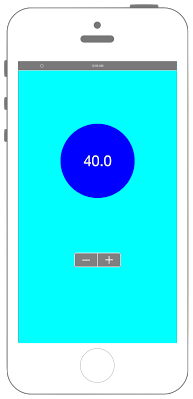

# UIStepperの表示



```swift fct_label="Swift 5.x/4.x"
//
//  ViewController.swift
//  UIKit030_4.0
//
//  Created by KimikoWatanabe on 2016/08/17.
//  Copyright © 2016年 FaBo, Inc. All rights reserved.
//

import UIKit

class ViewController: UIViewController {
    
    private let myStepLabel: UILabel = UILabel(frame: CGRect(x:0,y:0,width:150,height:150))
    
    override func viewDidLoad() {
        super.viewDidLoad()
        
        // Stepperの作成する.
        let myStepper: UIStepper = UIStepper()
        myStepper.center = CGPoint(x:self.view.frame.width/2, y:400)
        myStepper.backgroundColor = UIColor.gray
        myStepper.tintColor = UIColor.white
        myStepper.addTarget(self, action: #selector(ViewController.stepperOneChanged(stepper:)), for: UIControl.Event.valueChanged)
        
        // 最小値, 最大値, 規定値の設定をする.
        myStepper.minimumValue = 0
        myStepper.maximumValue = 100
        myStepper.value = 50
        
        // ボタンを押した際に動く値の.を設定する.
        myStepper.stepValue = 10
        
        // Viewに追加する.
        self.view.addSubview(myStepper)
        
        // Labelを作成する.
        myStepLabel.backgroundColor = UIColor.blue
        myStepLabel.layer.masksToBounds = true
        myStepLabel.layer.cornerRadius = 75.0
        myStepLabel.textColor = UIColor.white
        myStepLabel.shadowColor = UIColor.gray
        myStepLabel.font = UIFont.systemFont(ofSize: 30.0)
        myStepLabel.textAlignment = NSTextAlignment.center
        myStepLabel.layer.position = CGPoint(x: self.view.bounds.width/2,y: 200)
        myStepLabel.text = "\(myStepper.value)"
        
        // Viewの背景色を青にする.
        self.view.backgroundColor = UIColor.cyan
        
        // viewにLabelを追加.
        self.view.addSubview(myStepLabel)
    }
    
    /*
     Stepperの値が変わったときに呼び出される.
     */
    @objc internal func stepperOneChanged(stepper: UIStepper){
        myStepLabel.text = "\(stepper.value)"
    }
    
    override func didReceiveMemoryWarning() {
        super.didReceiveMemoryWarning()
        
    }
}

```

```swift fct_label="Swift 3.x"
//
//  ViewController.swift
//  UIKit030_3.0
//
//  Created by KimikoWatanabe on 2016/08/17.
//  Copyright © 2016年 FaBo, Inc. All rights reserved.
//

import UIKit

class ViewController: UIViewController {

    private let myStepLabel: UILabel = UILabel(frame: CGRect(x:0,y:0,width:150,height:150))

    override func viewDidLoad() {
        super.viewDidLoad()

        // Stepperの作成する.
        let myStepper: UIStepper = UIStepper()
        myStepper.center = CGPoint(x:self.view.frame.width/2, y:400)
        myStepper.backgroundColor = UIColor.gray
        myStepper.tintColor = UIColor.white
        myStepper.addTarget(self, action: #selector(ViewController.stepperOneChanged(stepper:)), for: UIControlEvents.valueChanged)

        // 最小値, 最大値, 規定値の設定をする.
        myStepper.minimumValue = 0
        myStepper.maximumValue = 100
        myStepper.value = 50

        // ボタンを押した際に動く値の.を設定する.
        myStepper.stepValue = 10

        // Viewに追加する.
        self.view.addSubview(myStepper)

        // Labelを作成する.
        myStepLabel.backgroundColor = UIColor.blue
        myStepLabel.layer.masksToBounds = true
        myStepLabel.layer.cornerRadius = 75.0
        myStepLabel.textColor = UIColor.white
        myStepLabel.shadowColor = UIColor.gray
        myStepLabel.font = UIFont.systemFont(ofSize: 30.0)
        myStepLabel.textAlignment = NSTextAlignment.center
        myStepLabel.layer.position = CGPoint(x: self.view.bounds.width/2,y: 200)
        myStepLabel.text = "\(myStepper.value)"

        // Viewの背景色を青にする.
        self.view.backgroundColor = UIColor.cyan

        // viewにLabelを追加.
        self.view.addSubview(myStepLabel)
    }

    /*
     Stepperの値が変わったときに呼び出される.
     */
    internal func stepperOneChanged(stepper: UIStepper){
        myStepLabel.text = "\(stepper.value)"
    }

    override func didReceiveMemoryWarning() {
        super.didReceiveMemoryWarning()

    }
}

```

```swift fct_label="Swift 2.3"
//
//  ViewController.swift
//  UIKit030_2.3
//
//  Created by KimikoWatanabe on 2016/08/17.
//  Copyright © 2016年 FaBo, Inc. All rights reserved.
//

import UIKit

class ViewController: UIViewController {

    private let myStepLabel: UILabel = UILabel(frame: CGRectMake(0,0,150,150))

    override func viewDidLoad() {
        super.viewDidLoad()

        // Stepperの作成する.
        let myStepper: UIStepper = UIStepper()
        myStepper.center = CGPointMake(self.view.frame.width/2, 400)
        myStepper.backgroundColor = UIColor.grayColor()
        myStepper.tintColor = UIColor.whiteColor()
        myStepper.addTarget(self, action: #selector(ViewController.stepperOneChanged(_:)), forControlEvents: UIControlEvents.ValueChanged)

        // 最小値, 最大値, 規定値の設定をする.
        myStepper.minimumValue = 0
        myStepper.maximumValue = 100
        myStepper.value = 50

        // ボタンを押した際に動く値の.を設定する.
        myStepper.stepValue = 10

        // Viewに追加する.
        self.view.addSubview(myStepper)

        // Labelを作成する.
        myStepLabel.backgroundColor = UIColor.blueColor()
        myStepLabel.layer.masksToBounds = true
        myStepLabel.layer.cornerRadius = 75.0
        myStepLabel.textColor = UIColor.whiteColor()
        myStepLabel.shadowColor = UIColor.grayColor()
        myStepLabel.font = UIFont.systemFontOfSize(CGFloat(30))
        myStepLabel.textAlignment = NSTextAlignment.Center
        myStepLabel.layer.position = CGPoint(x: self.view.bounds.width/2,y: 200)
        myStepLabel.text = "\(myStepper.value)"

        // Viewの背景色を青にする.
        self.view.backgroundColor = UIColor.cyanColor()

        // viewにLabelを追加.
        self.view.addSubview(myStepLabel)
    }

    /*
     Stepperの値が変わったときに呼び出される.
     */
    internal func stepperOneChanged(stepper: UIStepper){
        myStepLabel.text = "\(stepper.value)"
    }

    override func didReceiveMemoryWarning() {
        super.didReceiveMemoryWarning()

    }
}


```

## 3.0と4.0の差分
* ```UIControlEvents.valueChanged``` が、 ```UIControl.Event.valueChanged``` に変更
* ```internal func stepperOneChanged(stepper: UIStepper)``` に ```@objc``` を追加

## 2.3と3.0の差分
* UIColorの参照方法が変更(UIColor.grayColor()->UIColor.gray)
* CGRect,CGPointの初期化方法の変更(CGRectMake,CGPointMakeの廃止)

## Reference
* UIStepper Class
 * [https://developer.apple.com/reference/uikit/uistepper](https://developer.apple.com/reference/uikit/uistepper)
