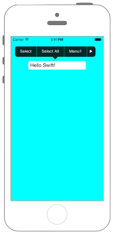
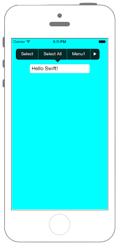

# UIMenuControllerにMenuItemを追加




```swift fct_label="Swift 4.x"
//
//  ViewController.swift
//  UIKit033_4.0
//
//  Created by KimikoWatanabe on 2016/08/18.
//  Copyright © 2016年 FaBo, Inc. All rights reserved.
//

import UIKit

class ViewController: UIViewController, UITextFieldDelegate {
    
    override func viewDidLoad() {
        super.viewDidLoad()
        
        // 背景を青色に設定.
        self.view.backgroundColor = UIColor.cyan
        
        // TextField作成.
        let myTextField: UITextField = UITextField(frame: CGRect(x:0, y:0, width:200, height:30))
        myTextField.text = "Hello Swift!"
        myTextField.delegate = self
        myTextField.borderStyle = UITextField.BorderStyle.roundedRect
        myTextField.layer.position = CGPoint(x:self.view.frame.width/2, y:100)
        
        // TextFieldをviewに追加.
        self.view.addSubview(myTextField)
        
        // MenuController生成.
        let myMenuController: UIMenuController = UIMenuController.shared
        
        // MenuControllerを表示.
        myMenuController.isMenuVisible = true
        
        // 矢印の向きを下に設定.
        myMenuController.arrowDirection = UIMenuController.ArrowDirection.down
        
        
        // rect、viewを設定.
        myMenuController.setTargetRect(CGRect.zero, in: self.view)
        
        
        // MenuItem生成.
        let myMenuItem_1: UIMenuItem = UIMenuItem(title: "Menu1", action: #selector(ViewController.onMenu1(sender:)))
        let myMenuItem_2: UIMenuItem = UIMenuItem(title: "Menu2", action: #selector(ViewController.onMenu2(sender:)))
        let myMenuItem_3: UIMenuItem = UIMenuItem(title: "Menu3", action: #selector(ViewController.onMenu3(sender:)))
        
        // MenuItemを配列に格納.
        let myMenuItems: NSArray = [myMenuItem_1, myMenuItem_2, myMenuItem_3]
        
        // MenuControllerにMenuItemを追加.
        myMenuController.menuItems = myMenuItems as? [UIMenuItem]
    }
    
    /*
     UITextFieldが編集開始された直後に呼ばれる.
     */
    func textFieldDidBeginEditing(_ textField: UITextField) {
        print("textFieldDidBeginEditing:" + textField.text!)
    }
    
    /*
     UITextFieldが編集終了する直前に呼ばれる.
     */
    func textFieldShouldEndEditing(_ textField: UITextField) -> Bool {
        print("textFieldShouldEndEditing:" + textField.text!)
        return true
    }
    
    /*
     作成したMenuItemが表示されるようにする.
     */
    override func canPerformAction(_ action: Selector, withSender sender: Any?) -> Bool {
        if action == #selector(ViewController.onMenu1(sender:)) || action == #selector(ViewController.onMenu2(sender:)) || action == #selector(ViewController.onMenu3(sender:))  {
            return true
        }
        return false
    }
    
    /*
     作成したMenuItemが押された際に呼び出される.
     */
    
    @objc internal func onMenu1(sender: UIMenuItem) {
        print("onMenu1")
    }
    
    @objc internal func onMenu2(sender: UIMenuItem) {
        print("onMenu2")
    }
    
    @objc internal func onMenu3(sender: UIMenuItem) {
        print("onMenu3")
    }
    
    override func didReceiveMemoryWarning() {
        super.didReceiveMemoryWarning()
    }
}

```

```swift fct_label="Swift 3.x"
//
//  ViewController.swift
//  UIKit033_3.0
//
//  Created by KimikoWatanabe on 2016/08/18.
//  Copyright © 2016年 FaBo, Inc. All rights reserved.
//

import UIKit

class ViewController: UIViewController, UITextFieldDelegate {

    override func viewDidLoad() {
        super.viewDidLoad()

        // 背景を青色に設定.
        self.view.backgroundColor = UIColor.cyan

        // TextField作成.
        let myTextField: UITextField = UITextField(frame: CGRect(x:0, y:0, width:200, height:30))
        myTextField.text = "Hello Swift!"
        myTextField.delegate = self
        myTextField.borderStyle = UITextBorderStyle.roundedRect
        myTextField.layer.position = CGPoint(x:self.view.frame.width/2, y:100)

        // TextFieldをviewに追加.
        self.view.addSubview(myTextField)

        // MenuController生成.
        let myMenuController: UIMenuController = UIMenuController.shared

        // MenuControllerを表示.
        myMenuController.isMenuVisible = true

        // 矢印の向きを下に設定.
        myMenuController.arrowDirection = UIMenuControllerArrowDirection.down


        // rect、viewを設定.
        myMenuController.setTargetRect(CGRect.zero, in: self.view)


        // MenuItem生成.
        let myMenuItem_1: UIMenuItem = UIMenuItem(title: "Menu1", action: #selector(ViewController.onMenu1(sender:)))
        let myMenuItem_2: UIMenuItem = UIMenuItem(title: "Menu2", action: #selector(ViewController.onMenu2(sender:)))
        let myMenuItem_3: UIMenuItem = UIMenuItem(title: "Menu3", action: #selector(ViewController.onMenu3(sender:)))

        // MenuItemを配列に格納.
        let myMenuItems: NSArray = [myMenuItem_1, myMenuItem_2, myMenuItem_3]

        // MenuControllerにMenuItemを追加.
        myMenuController.menuItems = myMenuItems as? [UIMenuItem]
    }

    /*
     UITextFieldが編集開始された直後に呼ばれる.
     */
    func textFieldDidBeginEditing(_ textField: UITextField) {
        print("textFieldDidBeginEditing:" + textField.text!)
    }

    /*
     UITextFieldが編集終了する直前に呼ばれる.
     */
    func textFieldShouldEndEditing(_ textField: UITextField) -> Bool {
        print("textFieldShouldEndEditing:" + textField.text!)
        return true
    }

    /*
     作成したMenuItemが表示されるようにする.
     */
    override func canPerformAction(_ action: Selector, withSender sender: AnyObject!) -> Bool {
        if action == #selector(ViewController.onMenu1(sender:)) || action == #selector(ViewController.onMenu2(sender:)) || action == #selector(ViewController.onMenu3(sender:))  {
            return true
        }
        return false
    }

    /*
     作成したMenuItemが押された際に呼び出される.
     */
    internal func onMenu1(sender: UIMenuItem) {
        print("onMenu1")
    }

    internal func onMenu2(sender: UIMenuItem) {
        print("onMenu2")
    }

    internal func onMenu3(sender: UIMenuItem) {
        print("onMenu3")
    }

    override func didReceiveMemoryWarning() {
        super.didReceiveMemoryWarning()
    }
}
```

```swift fct_label="Swift 2.3"
//
//  ViewController.swift
//  UIKit033_2.3
//
//  Created by KimikoWatanabe on 2016/08/18.
//  Copyright © 2016年 FaBo, Inc. All rights reserved.
//

import UIKit

class ViewController: UIViewController, UITextFieldDelegate {

    override func viewDidLoad() {
        super.viewDidLoad()

        // 背景を青色に設定.
        self.view.backgroundColor = UIColor.cyanColor()

        // TextField作成.
        let myTextField: UITextField = UITextField(frame: CGRectMake(0, 0, 200, 30))
        myTextField.text = "Hello Swift!"
        myTextField.delegate = self
        myTextField.borderStyle = UITextBorderStyle.RoundedRect
        myTextField.layer.position = CGPointMake(self.view.frame.width/2, 100)

        // TextFieldをviewに追加.
        self.view.addSubview(myTextField)

        // MenuController生成.
        let myMenuController: UIMenuController = UIMenuController.sharedMenuController()

        // MenuControllerを表示.
        myMenuController.menuVisible = true

        // 矢印の向きを下に設定.
        myMenuController.arrowDirection = UIMenuControllerArrowDirection.Down

        // rect、viewを設定.
        myMenuController.setTargetRect(CGRectZero, inView: self.view)


        // MenuItem生成.
        let myMenuItem_1: UIMenuItem = UIMenuItem(title: "Menu1", action: #selector(ViewController.onMenu1(_:)))
        let myMenuItem_2: UIMenuItem = UIMenuItem(title: "Menu2", action: #selector(ViewController.onMenu2(_:)))
        let myMenuItem_3: UIMenuItem = UIMenuItem(title: "Menu3", action: #selector(ViewController.onMenu3(_:)))

        // MenuItemを配列に格納.
        let myMenuItems: NSArray = [myMenuItem_1, myMenuItem_2, myMenuItem_3]

        // MenuControllerにMenuItemを追加.
        myMenuController.menuItems = myMenuItems as? [UIMenuItem]
    }

    /*
     UITextFieldが編集開始された直後に呼ばれる.
     */
    func textFieldDidBeginEditing(textField: UITextField) {
        print("textFieldDidBeginEditing:" + textField.text!)
    }

    /*
     UITextFieldが編集終了する直前に呼ばれる.
     */
    func textFieldShouldEndEditing(textField: UITextField) -> Bool {
        print("textFieldShouldEndEditing:" + textField.text!)
        return true
    }

    /*
     作成したMenuItemが表示されるようにする.
     */
    override func canPerformAction(action: Selector, withSender sender: AnyObject!) -> Bool {
        if action == #selector(ViewController.onMenu1(_:)) || action == #selector(ViewController.onMenu2(_:)) || action == #selector(ViewController.onMenu3(_:))  {
            return true
        }
        return false
    }

    /*
     作成したMenuItemが押された際に呼び出される.
     */
    internal func onMenu1(sender: UIMenuItem) {
        print("onMenu1")
    }

    internal func onMenu2(sender: UIMenuItem) {
        print("onMenu2")
    }

    internal func onMenu3(sender: UIMenuItem) {
        print("onMenu3")
    }

    override func didReceiveMemoryWarning() {
        super.didReceiveMemoryWarning()
    }
}
```

## 3.xと4.xの差分
* ```UITextBorderStyle``` が ```UITextField.BorderStyle``` に変更
* ```UIMenuControllerArrowDirection``` が ```UIMenuController.ArrowDirection``` に変更
* ```internal func onMenu``` の ```1~3``` に ```@objc``` を追加

## 2.3と3.0の差分
* UIColorの参照方法が変更(UIColor.grayColor()->UIColor.gray)
* CGRect,CGPointの初期化方法の変更(CGRectMake,CGPointMakeの廃止)
* UIMenuControllerのプロパティ名、メソッド名が一部変更(```sharedMenuController()```->```shared```)
* UITextFieldDelegateのデリゲートメソッドの引数が変化
* ```CGRectZero```が```CGRect.zero```に変更

## Reference
* UIMenuController Class
 * [https://developer.apple.com/reference/uikit/uimenucontroller](https://developer.apple.com/reference/uikit/uimenucontroller)
* UIMenuItem Class
 * [https://developer.apple.com/reference/uikit/uimenuitem](https://developer.apple.com/reference/uikit/uimenuitem)
