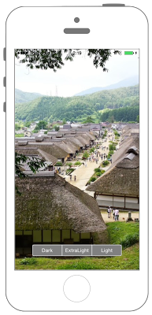
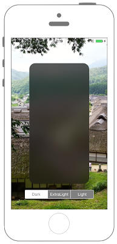
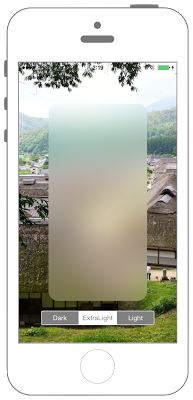
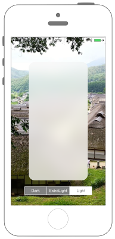

# UIViewにBlurエフェクトを適用させる






```swift fct_label="Swift 4.x"
//
//  ViewController.swift
//  UIKit035_4.0
//
//  Created by KimikoWatanabe on 2016/08/18.
//  Copyright © 2016年 FaBo, Inc. All rights reserved.
//

import UIKit

class ViewController: UIViewController {
    
    private var effectView : UIVisualEffectView!
    private var mySegcon : UISegmentedControl!
    
    override func viewDidLoad() {
        
        super.viewDidLoad()
        
        // 背景画像を生成.
        let image = UIImage(named: "ci005")
        let imageView = UIImageView(frame: self.view.bounds)
        imageView.image = image
        self.view.addSubview(imageView)
        
        // SegmentedControlを生成.
        mySegcon = UISegmentedControl(items: ["Dark", "ExtraLight", "Light"])
        mySegcon.center = CGPoint(x:self.view.center.x, y:self.view.bounds.maxY - 50)
        mySegcon.backgroundColor = UIColor.gray
        mySegcon.tintColor = UIColor.white
        mySegcon.addTarget(self, action: #selector(ViewController.onClickMySegmentedControl(sender:)), for: UIControl.Event.valueChanged)
        self.view.addSubview(mySegcon)
    }
    
    /*
     エフェクトを適用する.
     */
    internal func addVirtualEffectView(effect : UIBlurEffect!){
        
        if effectView != nil {
            effectView.removeFromSuperview()
        }
        
        // Blurエフェクトを適用するEffectViewを作成.
        effectView = UIVisualEffectView(effect: effect)
        effectView.frame = CGRect(x:0, y:0, width:200, height:400)
        effectView.layer.position = CGPoint(x:mySegcon.bounds.midX, y:-(effectView.frame.midY + 20) )
        effectView.layer.masksToBounds = true
        effectView.layer.cornerRadius = 20.0
        mySegcon.addSubview(effectView)
    }
    
    /*
     SegmentedControlの値が変わった時に呼び出されるメソッド.
     */
    @objc internal func onClickMySegmentedControl(sender : UISegmentedControl){
        
        var effect : UIBlurEffect!
        
        switch sender.selectedSegmentIndex {
            
        case 0:
            // LightなBlurエフェクトを作る.
            effect = UIBlurEffect(style: UIBlurEffect.Style.dark)
            
        case 1:
            // DarkなBlurエフェクトを作る.
            effect = UIBlurEffect(style: UIBlurEffect.Style.light)
            
        case 2:
            // ExtraLightなBlurエフェクトを作る.
            effect = UIBlurEffect(style: UIBlurEffect.Style.extraLight)
            
        default:
            print("Error")
        }
        
        self.addVirtualEffectView(effect: effect)
    }
}

```

```swift fct_label="Swift 3.x"
//
//  ViewController.swift
//  UIKit035_3.0
//
//  Created by KimikoWatanabe on 2016/08/18.
//  Copyright © 2016年 FaBo, Inc. All rights reserved.
//

import UIKit

class ViewController: UIViewController {

    private var effectView : UIVisualEffectView!
    private var mySegcon : UISegmentedControl!

    override func viewDidLoad() {

        super.viewDidLoad()

        // 背景画像を生成.
        let image = UIImage(named: "ci005")
        let imageView = UIImageView(frame: self.view.bounds)
        imageView.image = image
        self.view.addSubview(imageView)

        // SegmentedControlを生成.
        mySegcon = UISegmentedControl(items: ["Dark", "ExtraLight", "Light"])
        mySegcon.center = CGPoint(x:self.view.center.x, y:self.view.bounds.maxY - 50)
        mySegcon.backgroundColor = UIColor.gray
        mySegcon.tintColor = UIColor.white
        mySegcon.addTarget(self, action: #selector(ViewController.onClickMySegmentedControl(sender:)), for: UIControlEvents.valueChanged)
        self.view.addSubview(mySegcon)
    }

    /*
     エフェクトを適用する.
     */
    internal func addVirtualEffectView(effect : UIBlurEffect!){

        if effectView != nil {
            effectView.removeFromSuperview()
        }

        // Blurエフェクトを適用するEffectViewを作成.
        effectView = UIVisualEffectView(effect: effect)
        effectView.frame = CGRect(x:0, y:0, width:200, height:400)
        effectView.layer.position = CGPoint(x:mySegcon.bounds.midX, y:-(effectView.frame.midY + 20) )
        effectView.layer.masksToBounds = true
        effectView.layer.cornerRadius = 20.0
        mySegcon.addSubview(effectView)
    }

    /*
     SegmentedControlの値が変わった時に呼び出されるメソッド.
     */
    internal func onClickMySegmentedControl(sender : UISegmentedControl){

        var effect : UIBlurEffect!

        switch sender.selectedSegmentIndex {

        case 0:
            // LightなBlurエフェクトを作る.
            effect = UIBlurEffect(style: UIBlurEffectStyle.dark)

        case 1:
            // DarkなBlurエフェクトを作る.
            effect = UIBlurEffect(style: UIBlurEffectStyle.light)

        case 2:
            // ExtraLightなBlurエフェクトを作る.
            effect = UIBlurEffect(style: UIBlurEffectStyle.extraLight)

        default:
            print("Error")
        }

        self.addVirtualEffectView(effect: effect)
    }
}

```

```swift fct_label="Swift 2.3"
//
//  ViewController.swift
//  UIKit035_2.3
//
//  Created by KimikoWatanabe on 2016/08/18.
//  Copyright © 2016年 FaBo, Inc. All rights reserved.
//

import UIKit

class ViewController: UIViewController {

    private var effectView : UIVisualEffectView!
    private var mySegcon : UISegmentedControl!

    override func viewDidLoad() {

        super.viewDidLoad()

        // 背景画像を生成.
        let image = UIImage(named: "ci005")
        let imageView = UIImageView(frame: self.view.bounds)
        imageView.image = image
        self.view.addSubview(imageView)

        // SegmentedControlを生成.
        mySegcon = UISegmentedControl(items: ["Dark", "ExtraLight", "Light"])
        mySegcon.center = CGPointMake(self.view.center.x, self.view.bounds.maxY - 50)
        mySegcon.backgroundColor = UIColor.grayColor()
        mySegcon.tintColor = UIColor.whiteColor()
        mySegcon.addTarget(self, action: #selector(ViewController.onClickMySegmentedControl(_:)), forControlEvents: UIControlEvents.ValueChanged)
        self.view.addSubview(mySegcon)
    }

    /*
     エフェクトを適用する.
     */
    internal func addVirtualEffectView(effect : UIBlurEffect!){

        if effectView != nil {
            effectView.removeFromSuperview()
        }

        // Blurエフェクトを適用するEffectViewを作成.
        effectView = UIVisualEffectView(effect: effect)
        effectView.frame = CGRectMake(0, 0, 200, 400)
        effectView.layer.position = CGPointMake(mySegcon.bounds.midX, -(effectView.frame.midY + 20) )
        effectView.layer.masksToBounds = true
        effectView.layer.cornerRadius = 20.0
        mySegcon.addSubview(effectView)
    }

    /*
     SegmentedControlの値が変わった時に呼び出されるメソッド.
     */
    internal func onClickMySegmentedControl(sender : UISegmentedControl){

        var effect : UIBlurEffect!

        switch sender.selectedSegmentIndex {

        case 0:
            // LightなBlurエフェクトを作る.
            effect = UIBlurEffect(style: UIBlurEffectStyle.Dark)

        case 1:
            // DarkなBlurエフェクトを作る.
            effect = UIBlurEffect(style: UIBlurEffectStyle.Light)

        case 2:
            // ExtraLightなBlurエフェクトを作る.
            effect = UIBlurEffect(style: UIBlurEffectStyle.ExtraLight)

        default:
            print("Error")
        }

        self.addVirtualEffectView(effect)
    }
}
```

## 3.xと4.xの差分
* ```UIControlEvents``` が ```UIControl.Event``` に変更
* ```internal func addVirtualEffectView(effect : UIBlurEffect!)``` に ```@objc``` を追加
* ```UIBlurEffectStyle``` が ```UIBlurEffect.Style``` に変更

## 2.3と3.0の差分
* UIColorの参照方法が変更(UIColor.grayColor()->UIColor.gray)
* CGRect,CGPointの初期化方法の変更(CGRectMake,CGPointMakeの廃止)

## Reference
* UIVisualEffectView Class
 * [https://developer.apple.com/reference/uikit/uivisualeffectview](https://developer.apple.com/reference/uikit/uivisualeffectview)
* UISegmentedControl Class
 * [https://developer.apple.com/reference/uikit/uisegmentedcontrol](https://developer.apple.com/reference/uikit/uisegmentedcontrol)
* UIBlurEffect Class
 * [https://developer.apple.com/reference/uikit/uiblureffect](https://developer.apple.com/reference/uikit/uiblureffect)
* UIVisualEffectView Class
 * [https://developer.apple.com/reference/uikit/uivisualeffectview](https://developer.apple.com/reference/uikit/uivisualeffectview)
