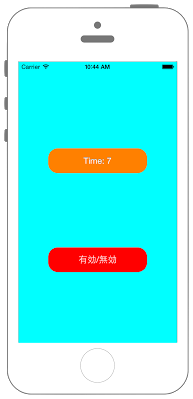

# タッチイベントの有効/無効を切り替える



```swift fct_label="Swift 4.x"
//
//  ViewController.swift
//  UIKit037_4.0
//
//  Created by KimikoWatanabe on 2016/08/18.
//  Copyright © 2016年 FaBo, Inc. All rights reserved.
//

import UIKit

class ViewController: UIViewController {
    
    private var cnt : Float = 0
    private var myLabel : UILabel!
    private var ButtonCnt: Int = 0
    private var TimerMergin: Float = 0
    private var ignoreBegineTime: Float = 0
    
    override func viewDidLoad() {
        super.viewDidLoad()
        
        // 背景を青色に設定.
        self.view.backgroundColor = UIColor.cyan
        
        // UIButtonを作る.
        let myButton: UIButton = UIButton()
        myButton.frame = CGRect(x:0, y:0, width:200, height:50)
        myButton.layer.cornerRadius = 20.0
        myButton.layer.position = CGPoint(x:self.view.frame.width/2, y:400)
        myButton.backgroundColor = UIColor.red
        myButton.setTitle("有効/無効", for: .normal)
        myButton.addTarget(self, action: #selector(ViewController.onClickMyButton(sender:)), for: .touchUpInside)
        self.view.addSubview(myButton)
        
        // タイマー用ラベルを作る.
        myLabel = UILabel(frame: CGRect(x:0,y:0,width:200,height:50))
        myLabel.backgroundColor = UIColor.orange
        myLabel.layer.masksToBounds = true
        myLabel.layer.cornerRadius = 20.0
        myLabel.text = "Time:\(Int(cnt))"
        myLabel.textColor = UIColor.white
        myLabel.shadowColor = UIColor.gray
        myLabel.textAlignment = NSTextAlignment.center
        myLabel.layer.position = CGPoint(x: self.view.bounds.width/2,y: 200)
        self.view.addSubview(myLabel)
        self.view.backgroundColor = UIColor.cyan
    }
    
    //NSTimerIntervalで指定された秒数毎に呼び出されるメソッド.
    @objc internal func onUpdate(timer : Timer){
        
        cnt += 0.1
        
        //桁数を指定して文字列を作る.
        let str = "Time: \(Int(cnt))"
        myLabel.text = str
        
        // 現在のタイマー時間から無効が始まった時間の差.
        TimerMergin = cnt - ignoreBegineTime
        
        // タッチイベントが無効のとき.
        if UIApplication.shared.isIgnoringInteractionEvents {
            
            // 無効になってから5秒経った時.
            if Int(TimerMergin) == 5 {
                
                print("タッチイベントが無効です")
                self.view.backgroundColor = UIColor.cyan
                
                // タッチイベントを有効にする.
                UIApplication.shared.endIgnoringInteractionEvents()
                print("タッチイベントを有効にしました")
            }
        }
    }
    
    @objc internal func onClickMyButton(sender: UIButton) {
        
        // ボタンを押した回数.
        ButtonCnt += 1
        
        // タッチイベントが有効のとき.
        if UIApplication.shared.isIgnoringInteractionEvents == false {
            
            print("タッチイベントが有効です")
            self.view.backgroundColor = UIColor.green
            
            // タッチイベントを無効にする.
            UIApplication.shared.beginIgnoringInteractionEvents()
            
            // 無効が始まった時間を取得.
            ignoreBegineTime = cnt
            
            print("タッチイベントを無効にしました")
            print("5秒後に有効になります")
            
            // 最初にボタンを押したときだけタイマーを作る.
            if ButtonCnt == 1 {
                
                // タイマーを作る.
                // 更新のインターバル(0.1秒).
                Timer.scheduledTimer(timeInterval: 0.1,
                                     
                                     // そのクラスのメソッドか.
                    target: self,
                    
                    // メソッド.
                    selector: #selector(ViewController.onUpdate(timer:)),
                    userInfo: nil,
                    
                    // 何回も呼び出すかどうか.
                    repeats: true)
            }
        }
    }
}

```

```swift fct_label="Swift 3.x"
//
//  ViewController.swift
//  UIKit037_3.0
//
//  Created by KimikoWatanabe on 2016/08/18.
//  Copyright © 2016年 FaBo, Inc. All rights reserved.
//

import UIKit

class ViewController: UIViewController {

    private var cnt : Float = 0
    private var myLabel : UILabel!
    private var ButtonCnt: Int = 0
    private var TimerMergin: Float = 0
    private var ignoreBegineTime: Float = 0

    override func viewDidLoad() {
        super.viewDidLoad()

        // 背景を青色に設定.
        self.view.backgroundColor = UIColor.cyan

        // UIButtonを作る.
        let myButton: UIButton = UIButton()
        myButton.frame = CGRect(x:0, y:0, width:200, height:50)
        myButton.layer.cornerRadius = 20.0
        myButton.layer.position = CGPoint(x:self.view.frame.width/2, y:400)
        myButton.backgroundColor = UIColor.red
        myButton.setTitle("有効/無効", for: .normal)
        myButton.addTarget(self, action: #selector(ViewController.onClickMyButton(sender:)), for: .touchUpInside)
        self.view.addSubview(myButton)

        // タイマー用ラベルを作る.
        myLabel = UILabel(frame: CGRect(x:0,y:0,width:200,height:50))
        myLabel.backgroundColor = UIColor.orange
        myLabel.layer.masksToBounds = true
        myLabel.layer.cornerRadius = 20.0
        myLabel.text = "Time:\(Int(cnt))"
        myLabel.textColor = UIColor.white
        myLabel.shadowColor = UIColor.gray
        myLabel.textAlignment = NSTextAlignment.center
        myLabel.layer.position = CGPoint(x: self.view.bounds.width/2,y: 200)
        self.view.addSubview(myLabel)
        self.view.backgroundColor = UIColor.cyan
    }

    //NSTimerIntervalで指定された秒数毎に呼び出されるメソッド.
    internal func onUpdate(timer : Timer){

        cnt += 0.1

        //桁数を指定して文字列を作る.
        let str = "Time: \(Int(cnt))"
        myLabel.text = str

        // 現在のタイマー時間から無効が始まった時間の差.
        TimerMergin = cnt - ignoreBegineTime

        // タッチイベントが無効のとき.
        if UIApplication.shared.isIgnoringInteractionEvents {

            // 無効になってから5秒経った時.
            if Int(TimerMergin) == 5 {

                print("タッチイベントが無効です")
                self.view.backgroundColor = UIColor.cyan

                // タッチイベントを有効にする.
                UIApplication.shared.endIgnoringInteractionEvents()
                print("タッチイベントを有効にしました")
            }
        }
    }

    internal func onClickMyButton(sender: UIButton) {

        // ボタンを押した回数.
        ButtonCnt += 1

        // タッチイベントが有効のとき.
        if UIApplication.shared.isIgnoringInteractionEvents == false {

            print("タッチイベントが有効です")
            self.view.backgroundColor = UIColor.green

            // タッチイベントを無効にする.
            UIApplication.shared.beginIgnoringInteractionEvents()

            // 無効が始まった時間を取得.
            ignoreBegineTime = cnt

            print("タッチイベントを無効にしました")
            print("5秒後に有効になります")

            // 最初にボタンを押したときだけタイマーを作る.
            if ButtonCnt == 1 {

                // タイマーを作る.
                // 更新のインターバル(0.1秒).
                Timer.scheduledTimer(timeInterval: 0.1,

                                                       // そのクラスのメソッドか.
                    target: self,

                    // メソッド.
                    selector: #selector(ViewController.onUpdate(timer:)),
                    userInfo: nil,

                    // 何回も呼び出すかどうか.
                    repeats: true)
            }
        }
    }
}
```

```swift fct_label="Swift 2.3"
//
//  ViewController.swift
//  UIKit037_2.3
//
//  Created by KimikoWatanabe on 2016/08/18.
//  Copyright © 2016年 FaBo, Inc. All rights reserved.
//

import UIKit

class ViewController: UIViewController {

    private var cnt : Float = 0
    private var myLabel : UILabel!
    private var ButtonCnt: Int = 0
    private var TimerMergin: Float = 0
    private var ignoreBegineTime: Float = 0

    override func viewDidLoad() {
        super.viewDidLoad()

        // 背景を青色に設定.
        self.view.backgroundColor = UIColor.cyanColor()

        // UIButtonを作る.
        let myButton: UIButton = UIButton()
        myButton.frame = CGRectMake(0, 0, 200, 50)
        myButton.layer.cornerRadius = 20.0
        myButton.layer.position = CGPointMake(self.view.frame.width/2, 400)
        myButton.backgroundColor = UIColor.redColor()
        myButton.setTitle("有効/無効", forState: .Normal)
        myButton.addTarget(self, action: #selector(ViewController.onClickMyButton(_:)), forControlEvents: .TouchUpInside)

        // タイマー用ラベルを作る.
        myLabel = UILabel(frame: CGRectMake(0,0,200,50))
        myLabel.backgroundColor = UIColor.orangeColor()
        myLabel.layer.masksToBounds = true
        myLabel.layer.cornerRadius = 20.0
        myLabel.text = "Time:\(Int(cnt))"
        myLabel.textColor = UIColor.whiteColor()
        myLabel.shadowColor = UIColor.grayColor()
        myLabel.textAlignment = NSTextAlignment.Center
        myLabel.layer.position = CGPoint(x: self.view.bounds.width/2,y: 200)
        self.view.backgroundColor = UIColor.cyanColor()

        // viewにラベルとボタンを追加.
        self.view.addSubview(myLabel)
        self.view.addSubview(myButton)
    }

    //NSTimerIntervalで指定された秒数毎に呼び出されるメソッド.
    internal func onUpdate(timer : NSTimer){

        cnt += 0.1

        //桁数を指定して文字列を作る.
        let str = "Time: \(Int(cnt))"
        myLabel.text = str

        // 現在のタイマー時間から無効が始まった時間の差.
        TimerMergin = cnt - ignoreBegineTime

        // タッチイベントが無効のとき.
        if UIApplication.sharedApplication().isIgnoringInteractionEvents() {

            // 無効になってから5秒経った時.
            if Int(TimerMergin) == 5 {

                print("タッチイベントが無効です")
                self.view.backgroundColor = UIColor.cyanColor()

                // タッチイベントを有効にする.
                UIApplication.sharedApplication().endIgnoringInteractionEvents()
                print("タッチイベントを有効にしました")
            }
        }
    }

    internal func onClickMyButton(sender: UIButton) {

        // ボタンを押した回数.
        ButtonCnt += 1

        // タッチイベントが有効のとき.
        if UIApplication.sharedApplication().isIgnoringInteractionEvents() == false {

            print("タッチイベントが有効です")
            self.view.backgroundColor = UIColor.greenColor()

            // タッチイベントを無効にする.
            UIApplication.sharedApplication().beginIgnoringInteractionEvents()
            // 無効が始まった時間を取得.
            ignoreBegineTime = cnt

            print("タッチイベントを無効にしました")
            print("5秒後に有効になります")

            // 最初にボタンを押したときだけタイマーを作る.
            if ButtonCnt == 1 {

                // タイマーを作る.
                // 更新のインターバル(0.1秒).
                NSTimer.scheduledTimerWithTimeInterval(0.1,

                                                       // そのクラスのメソッドか.
                    target: self,

                    // メソッド.
                    selector: #selector(ViewController.onUpdate(_:)),
                    userInfo: nil,

                    // 何回も呼び出すかどうか.
                    repeats: true)
            }
        }
    }
}

```

## 3.xと4.xの差分
* internal func onUpdate(timer : Timer)に@objcを追加
* internal func onClickMyButton(sender: UIButton)に@objcを追加

## 2.3と3.0の差分
* UIColorの参照方法が変更(UIColor.grayColor()->UIColor.gray)
* CGRect,CGPointの初期化方法の変更(CGRectMake,CGPointMakeの廃止)
* ```UIApplication.sharedApplication()```が```UIApplication.shared```また、UIApplication.sharedの各メソッド。プロパティの名前が変更
* NSTimerの廃止、Timerへ変更.

## Reference
* Timer Class
 * [https://developer.apple.com/reference/foundation/timer](https://developer.apple.com/reference/foundation/timer)
* beginIgnoringInteractionEvents Tasks
 * [https://developer.apple.com/reference/uikit/uiapplication/1623047-beginignoringinteractionevents](https://developer.apple.com/reference/uikit/uiapplication/1623047-beginignoringinteractionevents)
