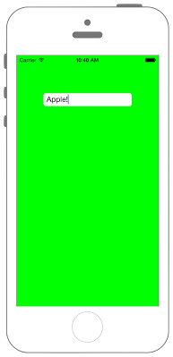

# UITextFieldに文字数制限を設ける



```swift fct_label="Swift 5.x"
//
//  ViewController.swift
//  UIKit038_4.0
//
//  Created by KimikoWatanabe on 2016/08/18.
//  Copyright © 2016年 FaBo, Inc. All rights reserved.
//

import UIKit

class ViewController: UIViewController, UITextFieldDelegate {

    override func viewDidLoad() {
        super.viewDidLoad()

        // 背景を緑色に設定.
        self.view.backgroundColor = UIColor.green

        //  UITextFieldを生成.
        let myTextField: UITextField = UITextField(frame: CGRect(x:0, y:0, width:200, height:30))

        // 最初に表示する文字.
        myTextField.text = "Hi"

        // Delegateを設定.
        myTextField.delegate = self

        // 枠の線を表示.
        myTextField.borderStyle = UITextField.BorderStyle.roundedRect

        // UITextFieldの表示する位置.
        myTextField.layer.position = CGPoint(x:self.view.bounds.width/2, y:100)

        // TextViewをviewに追加する.
        self.view.addSubview(myTextField)
    }

    override func didReceiveMemoryWarning() {
        super.didReceiveMemoryWarning()
    }
    /*
     テキストが編集された際に呼ばれる.
     */
    func textField(_ textField: UITextField, shouldChangeCharactersIn range: NSRange, replacementString string: String) -> Bool {

        // 文字数最大を決める.
        let maxLength: Int = 6

        // 入力済みの文字と入力された文字を合わせて取得.
        let str = textField.text! + string

        // 文字数がmaxLength以下ならtrueを返す.
        if str.count <= maxLength {
            return true
        }
        print("6文字を超えています")
        return false
    }
}

```

```swift fct_label="Swift 4.x"
//
//  ViewController.swift
//  UIKit038_4.0
//
//  Created by KimikoWatanabe on 2016/08/18.
//  Copyright © 2016年 FaBo, Inc. All rights reserved.
//

import UIKit

class ViewController: UIViewController, UITextFieldDelegate {
    
    override func viewDidLoad() {
        super.viewDidLoad()
        
        // 背景を緑色に設定.
        self.view.backgroundColor = UIColor.green
        
        //  UITextFieldを生成.
        let myTextField: UITextField = UITextField(frame: CGRect(x:0, y:0, width:200, height:30))
        
        // 最初に表示する文字.
        myTextField.text = "Hi"
        
        // Delegateを設定.
        myTextField.delegate = self
        
        // 枠の線を表示.
        myTextField.borderStyle = UITextField.BorderStyle.roundedRect
        
        // UITextFieldの表示する位置.
        myTextField.layer.position = CGPoint(x:self.view.bounds.width/2, y:100)
        
        // TextViewをviewに追加する.
        self.view.addSubview(myTextField)
    }
    
    override func didReceiveMemoryWarning() {
        super.didReceiveMemoryWarning()
    }
    /*
     テキストが編集された際に呼ばれる.
     */
    func textField(_ textField: UITextField, shouldChangeCharactersIn range: NSRange, replacementString string: String) -> Bool {
        
        // 文字数最大を決める.
        let maxLength: Int = 6
        
        // 入力済みの文字と入力された文字を合わせて取得.
        let str = textField.text! + string
        
        // 文字数がmaxLength以下ならtrueを返す.
        if str.characters.count <= maxLength {
            return true
        }
        print("6文字を超えています")
        return false
    }
}
```

```swift fct_label="Swift 3.x"
//
//  ViewController.swift
//  UIKit038_3.0
//
//  Created by KimikoWatanabe on 2016/08/18.
//  Copyright © 2016年 FaBo, Inc. All rights reserved.
//

import UIKit

class ViewController: UIViewController, UITextFieldDelegate {

    override func viewDidLoad() {
        super.viewDidLoad()

        // 背景を緑色に設定.
        self.view.backgroundColor = UIColor.green

        //  UITextFieldを生成.
        let myTextField: UITextField = UITextField(frame: CGRect(x:0, y:0, width:200, height:30))

        // 最初に表示する文字.
        myTextField.text = "Hi"

        // Delegateを設定.
        myTextField.delegate = self

        // 枠の線を表示.
        myTextField.borderStyle = UITextBorderStyle.roundedRect

        // UITextFieldの表示する位置.
        myTextField.layer.position = CGPoint(x:self.view.bounds.width/2, y:100)

        // TextViewをviewに追加する.
        self.view.addSubview(myTextField)
    }

    override func didReceiveMemoryWarning() {
        super.didReceiveMemoryWarning()
    }
    /*
     テキストが編集された際に呼ばれる.
     */
    func textField(_ textField: UITextField, shouldChangeCharactersIn range: NSRange, replacementString string: String) -> Bool {

        // 文字数最大を決める.
        let maxLength: Int = 6

        // 入力済みの文字と入力された文字を合わせて取得.
        let str = textField.text! + string

        // 文字数がmaxLength以下ならtrueを返す.
        if str.characters.count < maxLength {
            return true
        }
        print("6文字を超えています")
        return false
    }
}


```

```swift fct_label="Swift 2.3"
//
//  ViewController.swift
//  UIKit038_2.3
//
//  Created by KimikoWatanabe on 2016/08/18.
//  Copyright © 2016年 FaBo, Inc. All rights reserved.
//

import UIKit

class ViewController: UIViewController, UITextFieldDelegate {

    override func viewDidLoad() {
        super.viewDidLoad()

        // 背景を緑色に設定.
        self.view.backgroundColor = UIColor.greenColor()

        //  UITextFieldを生成.
        let myTextField: UITextField = UITextField(frame: CGRectMake(0, 0, 200, 30))

        // 最初に表示する文字.
        myTextField.text = "Hi"

        // Delegateを設定.
        myTextField.delegate = self

        // 枠の線を表示.
        myTextField.borderStyle = UITextBorderStyle.RoundedRect

        // UITextFieldの表示する位置.
        myTextField.layer.position = CGPointMake(self.view.bounds.width/2, 100)

        // TextViewをviewに追加する.
        self.view.addSubview(myTextField)
    }

    override func didReceiveMemoryWarning() {
        super.didReceiveMemoryWarning()
    }

    /*
     テキストが編集された際に呼ばれる.
     */
    func textField(textField: UITextField, shouldChangeCharactersInRange range: NSRange, replacementString string: String) -> Bool {

        // 文字数最大を決める.
        let maxLength: Int = 6

        // 入力済みの文字と入力された文字を合わせて取得.
        let str = textField.text! + string

        // 文字数がmaxLength以下ならtrueを返す.
        if str.characters.count < maxLength {
            return true
        }
        print("6文字を超えています")
        return false
    }
}
```

## 4.xと5.xの差分
* `String.characters` が廃止のため、文字数は `String.count` から取得するように変更

## 3.xと4.xの差分
* `UITextBorderStyle` が `UITextField.BorderStyle` に変更
* `String.characters` は非推奨

## 2.3と3.0の差分
* `UIColor` の参照方法が変更 (`UIColor.grayColor()` -> `UIColor.gray`)
* `CGRect`, `CGPoint` の初期化方法の変更 (`CGRectMake`, `CGPointMake` の廃止)
* `UITextFieldDelegate` のデリゲートメソッドの引数が変更
* `UITextBorderStyle` のプロパティ名が一部変更 (`RoundedRect`-> `roundedRect`)

## Reference
* shouldChangeCharactersIn Tasks
 * [https://developer.apple.com/reference/uikit/uitextfielddelegate/1619599-textfield](https://developer.apple.com/reference/uikit/uitextfielddelegate/1619599-textfield)
