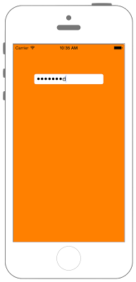

# UITextFieldの入力をパスワード形式にする



```swift fct_label="Swift 4.x"
//
//  ViewController.swift
//  UIKit039_4.0
//
//  Created by KimikoWatanabe on 2016/08/18.
//  Copyright © 2016年 FaBo, Inc. All rights reserved.
//

import UIKit

class ViewController: UIViewController, UITextFieldDelegate {
    
    override func viewDidLoad() {
        super.viewDidLoad()
        
        // 背景をオレンジ色に設定.
        self.view.backgroundColor = UIColor.orange
        
        //  UITextFieldを生成.
        let myTextField: UITextField = UITextField(frame: CGRect(x:0, y:0, width:200, height:30))
        
        // Delegateを設定.
        myTextField.delegate = self
        
        // 枠の線を表示.
        myTextField.borderStyle = UITextField.BorderStyle.roundedRect
        
        // UITextFieldの表示する位置.
        myTextField.layer.position = CGPoint(x:self.view.bounds.width/2, y:100)
        
        // 入力された文字を非表示モードにする.
        myTextField.isSecureTextEntry = true
        
        // TextViewをviewに追加する.
        self.view.addSubview(myTextField)
    }
    
    override func didReceiveMemoryWarning() {
        super.didReceiveMemoryWarning()
    }
}

```

```swift fct_label="Swift 3.x"
//
//  ViewController.swift
//  UIKit039_3.0
//
//  Created by KimikoWatanabe on 2016/08/18.
//  Copyright © 2016年 FaBo, Inc. All rights reserved.
//

import UIKit

class ViewController: UIViewController, UITextFieldDelegate {

    override func viewDidLoad() {
        super.viewDidLoad()

        // 背景をオレンジ色に設定.
        self.view.backgroundColor = UIColor.orange

        //  UITextFieldを生成.
        let myTextField: UITextField = UITextField(frame: CGRect(x:0, y:0, width:200, height:30))

        // Delegateを設定.
        myTextField.delegate = self

        // 枠の線を表示.
        myTextField.borderStyle = UITextBorderStyle.roundedRect

        // UITextFieldの表示する位置.
        myTextField.layer.position = CGPoint(x:self.view.bounds.width/2, y:100)

        // 入力された文字を非表示モードにする.
        myTextField.isSecureTextEntry = true

        // TextViewをviewに追加する.
        self.view.addSubview(myTextField)
    }

    override func didReceiveMemoryWarning() {
        super.didReceiveMemoryWarning()
    }
}
```

```swift fct_label="Swift 2.3"
//
//  ViewController.swift
//  UIKit039_2.3
//
//  Created by KimikoWatanabe on 2016/08/18.
//  Copyright © 2016年 FaBo, Inc. All rights reserved.
//

import UIKit

class ViewController: UIViewController, UITextFieldDelegate {

    override func viewDidLoad() {
        super.viewDidLoad()

        // 背景をオレンジ色に設定.
        self.view.backgroundColor = UIColor.orangeColor()

        //  UITextFieldを生成.
        let myTextField: UITextField = UITextField(frame: CGRectMake(0, 0, 200, 30))

        // Delegateを設定.
        myTextField.delegate = self

        // 枠の線を表示.
        myTextField.borderStyle = UITextBorderStyle.RoundedRect

        // UITextFieldの表示する位置.
        myTextField.layer.position = CGPointMake(self.view.bounds.width/2, 100)

        // 入力された文字を非表示モードにする.
        myTextField.secureTextEntry = true

        // TextViewをviewに追加する.
        self.view.addSubview(myTextField)
    }

    override func didReceiveMemoryWarning() {
        super.didReceiveMemoryWarning()
    }
}
```

## 3.xと4.xの差分
* ```UITextBorderStyle``` が ```UITextField.BorderStyle``` に変更

## 2.3と3.0の差分
* UIColorの参照方法が変更(UIColor.grayColor()->UIColor.gray)
* CGRect,CGPointの初期化方法の変更(CGRectMake,CGPointMakeの廃止)
* UITextFieldのプロパティ名が一部変更(secureTextEntry->isSecureTextEntry)

## Reference
* UITextField Class
 * [https://developer.apple.com/reference/uikit/uitextfield](https://developer.apple.com/reference/uikit/uitextfield)
