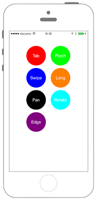

# GestureRecognizerのイベント取得



```swift fct_label="Swift 4.x"
//
//  ViewController.swift
//  UIKit040_4.0
//
//  Created by KimikoWatanabe on 2016/08/18.
//  Copyright © 2016年 FaBo, Inc. All rights reserved.
//

import UIKit

class ViewController: UIViewController {
    
    private var tapLabel: UILabel!
    private var pinchGestureLabel: UILabel!
    private var swipeLabel: UILabel!
    private var longPressLabel: UILabel!
    private var panLabel: UILabel!
    private var rotateLabel: UILabel!
    private var edgeLabel: UILabel!
    
    override func viewDidLoad() {
        super.viewDidLoad()
        
        // 背景を赤色に.
        self.view.backgroundColor = UIColor.white
        
        // タップを認識.
        let myTap = UITapGestureRecognizer(target: self, action: #selector(ViewController.tapGesture(sender:)))
        
        // ピンチを認識.
        let myPinchGesture = UIPinchGestureRecognizer(target: self, action: #selector(ViewController.pinchGesture(sender:)))
        
        // スワイプ認識.
        let mySwipe = UISwipeGestureRecognizer(target: self, action: #selector(ViewController.swipeGesture(sender:)))
        
        // スワイプ認識-2本指でスワイプ.
        mySwipe.numberOfTouchesRequired = 2
        
        // 長押しを認識.
        let myLongPressGesture = UILongPressGestureRecognizer(target: self, action: #selector(ViewController.longPressGesture(sender:)))
        
        // 長押し-最低2秒間は長押しする.
        myLongPressGesture.minimumPressDuration = 2.0
        
        // 長押し-指のズレは15pxまで.
        myLongPressGesture.allowableMovement = 150
        
        // パン認識.
        let myPan = UIPanGestureRecognizer(target: self, action: #selector(ViewController.panGesture(sender:)))
        
        // パン認識-3本指でパン.
        myPan.minimumNumberOfTouches = 3
        
        // 回転を認識.
        let myRotate = UIRotationGestureRecognizer(target: self, action: #selector(ViewController.rotateGesture(sender:)))
        
        // エッジを認識.
        let mySEdghePan = UIScreenEdgePanGestureRecognizer(target: self, action: #selector(ViewController.edgeGesture(sender:)))
        
        // エッジを認識-最低指3本で反応.
        mySEdghePan.minimumNumberOfTouches = 4
        
        // エッジを認識-左側.
        mySEdghePan.edges = UIRectEdge.left
        
        // Viewに追加.
        self.view.addGestureRecognizer(myTap)
        self.view.addGestureRecognizer(myPinchGesture)
        self.view.addGestureRecognizer(mySwipe)
        self.view.addGestureRecognizer(myLongPressGesture)
        self.view.addGestureRecognizer(myPan)
        self.view.addGestureRecognizer(myRotate)
        self.view.addGestureRecognizer(mySEdghePan)
        
        let centerOfX = self.view.bounds.width / 2
        
        // Labelを作成.
        tapLabel = makeMyLabel(title: "Tap", color: UIColor.red, myX: centerOfX - 50 , myY: 100)
        pinchGestureLabel = makeMyLabel(title: "Pinch", color: UIColor.green, myX: centerOfX + 50, myY: 100)
        swipeLabel = makeMyLabel(title: "Swipe", color: UIColor.blue, myX: centerOfX - 50, myY: 190)
        longPressLabel = makeMyLabel(title: "Long", color: UIColor.orange, myX: centerOfX + 50, myY: 190)
        panLabel = makeMyLabel(title: "Pan", color: UIColor.black, myX: centerOfX - 50, myY: 280)
        rotateLabel = makeMyLabel(title: "Rotate", color: UIColor.cyan, myX: centerOfX + 50, myY: 280)
        edgeLabel = makeMyLabel(title: "Edge", color: UIColor.purple, myX: centerOfX - 50, myY: 370)
        
        // Viewに貼付ける.
        self.view.addSubview(tapLabel)
        self.view.addSubview(pinchGestureLabel)
        self.view.addSubview(swipeLabel)
        self.view.addSubview(longPressLabel)
        self.view.addSubview(panLabel)
        self.view.addSubview(rotateLabel)
        self.view.addSubview(edgeLabel)
    }
    
    override func didReceiveMemoryWarning() {
        super.didReceiveMemoryWarning()
    }
    
    /*
     タップイベント.
     */
    @objc internal func tapGesture(sender: UITapGestureRecognizer){
        tapLabel.text = "\(sender.numberOfTouches)"
    }
    
    /*
     ピンチイベントの実装.
     */
    @objc internal func pinchGesture(sender: UIPinchGestureRecognizer){
        let firstPoint = sender.scale
        let secondPoint = sender.velocity
        pinchGestureLabel.text = "\(Double(Int(firstPoint*100))/100)\n\(Double(Int(secondPoint*100))/100)"
    }
    
    /*
     スワイプイベント
     */
    @objc internal func swipeGesture(sender: UISwipeGestureRecognizer){
        let touches = sender.numberOfTouches
        swipeLabel.text = "\(touches)"
    }
    
    /*
     長押しイベント.
     */
    @objc internal func longPressGesture(sender: UILongPressGestureRecognizer){
        // 指が離れたことを検知
        if(sender.state == UIGestureRecognizer.State.ended){
            longPressLabel.text = "On"
        }
    }
    
    /*
     パン.
     */
    @objc internal func panGesture(sender: UIPanGestureRecognizer){
        panLabel.text = "\(sender.numberOfTouches)"
    }
    
    /*
     回転.
     */
    @objc internal func rotateGesture(sender: UIRotationGestureRecognizer){
        
        let firstPoint = sender.rotation
        let secondPoint = sender.velocity
        rotateLabel.text = "\(Double(Int(firstPoint*100))/100)\n\(Double(Int(secondPoint*100))/100)"
    }
    
    /*
     エッジ.
     */
    @objc internal func edgeGesture(sender: UIScreenEdgePanGestureRecognizer){
        let touches = sender.numberOfTouches
        swipeLabel.text = "\(touches)"
    }
    
    internal func makeMyLabel(title: NSString, color: UIColor, myX: CGFloat, myY: CGFloat) -> UILabel{
        let myLabel: UILabel = UILabel()
        myLabel.frame = CGRect(x:0,y:0,width:80,height:80)
        myLabel.backgroundColor = color
        myLabel.textColor = UIColor.white
        myLabel.layer.masksToBounds = true
        myLabel.text = title as String
        myLabel.textAlignment = NSTextAlignment.center
        myLabel.layer.cornerRadius = 40.0
        myLabel.layer.position = CGPoint(x: myX, y: myY)
        myLabel.numberOfLines = 2
        return myLabel
    }
    
}
```

```swift fct_label="Swift 3.x"
//
//  ViewController.swift
//  UIKit040_3.0
//
//  Created by KimikoWatanabe on 2016/08/18.
//  Copyright © 2016年 FaBo, Inc. All rights reserved.
//

import UIKit

class ViewController: UIViewController {

    private var tapLabel: UILabel!
    private var pinchGestureLabel: UILabel!
    private var swipeLabel: UILabel!
    private var longPressLabel: UILabel!
    private var panLabel: UILabel!
    private var rotateLabel: UILabel!
    private var edgeLabel: UILabel!

    override func viewDidLoad() {
        super.viewDidLoad()

        // 背景を赤色に.
        self.view.backgroundColor = UIColor.white

        // タップを認識.
        let myTap = UITapGestureRecognizer(target: self, action: #selector(ViewController.tapGesture(sender:)))

        // ピンチを認識.
        let myPinchGesture = UIPinchGestureRecognizer(target: self, action: #selector(ViewController.pinchGesture(sender:)))

        // スワイプ認識.
        let mySwipe = UISwipeGestureRecognizer(target: self, action: #selector(ViewController.swipeGesture(sender:)))

        // スワイプ認識-2本指でスワイプ.
        mySwipe.numberOfTouchesRequired = 2

        // 長押しを認識.
        let myLongPressGesture = UILongPressGestureRecognizer(target: self, action: #selector(ViewController.longPressGesture(sender:)))

        // 長押し-最低2秒間は長押しする.
        myLongPressGesture.minimumPressDuration = 2.0

        // 長押し-指のズレは15pxまで.
        myLongPressGesture.allowableMovement = 150

        // パン認識.
        let myPan = UIPanGestureRecognizer(target: self, action: #selector(ViewController.panGesture(sender:)))

        // パン認識-3本指でパン.
        myPan.minimumNumberOfTouches = 3

        // 回転を認識.
        let myRotate = UIRotationGestureRecognizer(target: self, action: #selector(ViewController.rotateGesture(sender:)))

        // エッジを認識.
        let mySEdghePan = UIScreenEdgePanGestureRecognizer(target: self, action: #selector(ViewController.edgeGesture(sender:)))

        // エッジを認識-最低指3本で反応.
        mySEdghePan.minimumNumberOfTouches = 4

        // エッジを認識-左側.
        mySEdghePan.edges = UIRectEdge.left

        // Viewに追加.
        self.view.addGestureRecognizer(myTap)
        self.view.addGestureRecognizer(myPinchGesture)
        self.view.addGestureRecognizer(mySwipe)
        self.view.addGestureRecognizer(myLongPressGesture)
        self.view.addGestureRecognizer(myPan)
        self.view.addGestureRecognizer(myRotate)
        self.view.addGestureRecognizer(mySEdghePan)

        let centerOfX = self.view.bounds.width / 2

        // Labelを作成.
        tapLabel = makeMyLabel(title: "Tap", color: UIColor.red, myX: centerOfX - 50 , myY: 100)
        pinchGestureLabel = makeMyLabel(title: "Pinch", color: UIColor.green, myX: centerOfX + 50, myY: 100)
        swipeLabel = makeMyLabel(title: "Swipe", color: UIColor.blue, myX: centerOfX - 50, myY: 190)
        longPressLabel = makeMyLabel(title: "Long", color: UIColor.orange, myX: centerOfX + 50, myY: 190)
        panLabel = makeMyLabel(title: "Pan", color: UIColor.black, myX: centerOfX - 50, myY: 280)
        rotateLabel = makeMyLabel(title: "Rotate", color: UIColor.cyan, myX: centerOfX + 50, myY: 280)
        edgeLabel = makeMyLabel(title: "Edge", color: UIColor.purple, myX: centerOfX - 50, myY: 370)

        // Viewに貼付ける.
        self.view.addSubview(tapLabel)
        self.view.addSubview(pinchGestureLabel)
        self.view.addSubview(swipeLabel)
        self.view.addSubview(longPressLabel)
        self.view.addSubview(panLabel)
        self.view.addSubview(rotateLabel)
        self.view.addSubview(edgeLabel)
    }

    override func didReceiveMemoryWarning() {
        super.didReceiveMemoryWarning()
    }

    /*
     タップイベント.
     */
    internal func tapGesture(sender: UITapGestureRecognizer){
        tapLabel.text = "\(sender.numberOfTouches)"
    }

    /*
     ピンチイベントの実装.
     */
    internal func pinchGesture(sender: UIPinchGestureRecognizer){
        let firstPoint = sender.scale
        let secondPoint = sender.velocity
        pinchGestureLabel.text = "\(Double(Int(firstPoint*100))/100)\n\(Double(Int(secondPoint*100))/100)"
    }

    /*
     スワイプイベント
     */
    internal func swipeGesture(sender: UISwipeGestureRecognizer){
        let touches = sender.numberOfTouches
        swipeLabel.text = "\(touches)"
    }

    /*
     長押しイベント.
     */
    internal func longPressGesture(sender: UILongPressGestureRecognizer){
        // 指が離れたことを検知
        if(sender.state == UIGestureRecognizerState.ended){
            longPressLabel.text = "On"
        }
    }

    /*
     パン.
     */
    internal func panGesture(sender: UIPanGestureRecognizer){
        panLabel.text = "\(sender.numberOfTouches)"
    }

    /*
     回転.
     */
    internal func rotateGesture(sender: UIRotationGestureRecognizer){

        let firstPoint = sender.rotation
        let secondPoint = sender.velocity
        rotateLabel.text = "\(Double(Int(firstPoint*100))/100)\n\(Double(Int(secondPoint*100))/100)"
    }

    /*
     エッジ.
     */
    internal func edgeGesture(sender: UIScreenEdgePanGestureRecognizer){
        let touches = sender.numberOfTouches
        swipeLabel.text = "\(touches)"
    }

    internal func makeMyLabel(title: NSString, color: UIColor, myX: CGFloat, myY: CGFloat) -> UILabel{
        let myLabel: UILabel = UILabel()
        myLabel.frame = CGRect(x:0,y:0,width:80,height:80)
        myLabel.backgroundColor = color
        myLabel.textColor = UIColor.white
        myLabel.layer.masksToBounds = true
        myLabel.text = title as String
        myLabel.textAlignment = NSTextAlignment.center
        myLabel.layer.cornerRadius = 40.0
        myLabel.layer.position = CGPoint(x: myX, y: myY)
        myLabel.numberOfLines = 2
        return myLabel
    }

}
```

```swift fct_label="Swift 2.3"
//
//  ViewController.swift
//  UIKit040_2.3
//
//  Created by KimikoWatanabe on 2016/08/18.
//  Copyright © 2016年 FaBo, Inc. All rights reserved.
//

import UIKit

class ViewController: UIViewController {

    private var tapLabel: UILabel!
    private var pinchGestureLabel: UILabel!
    private var swipeLabel: UILabel!
    private var longPressLabel: UILabel!
    private var panLabel: UILabel!
    private var rotateLabel: UILabel!
    private var edgeLabel: UILabel!

    override func viewDidLoad() {
        super.viewDidLoad()

        // 背景を赤色に.
        self.view.backgroundColor = UIColor.whiteColor()

        // タップを認識.
        let myTap = UITapGestureRecognizer(target: self, action: #selector(ViewController.tapGesture(_:)))

        // ピンチを認識.
        let myPinchGesture = UIPinchGestureRecognizer(target: self, action: #selector(ViewController.pinchGesture(_:)))

        // スワイプ認識.
        let mySwipe = UISwipeGestureRecognizer(target: self, action: #selector(ViewController.swipeGesture(_:)))

        // スワイプ認識-2本指でスワイプ.
        mySwipe.numberOfTouchesRequired = 2

        // 長押しを認識.
        let myLongPressGesture = UILongPressGestureRecognizer(target: self, action: #selector(ViewController.longPressGesture(_:)))

        // 長押し-最低2秒間は長押しする.
        myLongPressGesture.minimumPressDuration = 2.0

        // 長押し-指のズレは15pxまで.
        myLongPressGesture.allowableMovement = 150

        // パン認識.
        let myPan = UIPanGestureRecognizer(target: self, action: #selector(ViewController.panGesture(_:)))

        // パン認識-3本指でパン.
        myPan.minimumNumberOfTouches = 3

        // 回転を認識.
        let myRotate = UIRotationGestureRecognizer(target: self, action: #selector(ViewController.rotateGesture(_:)))

        // エッジを認識.
        let mySEdghePan = UIScreenEdgePanGestureRecognizer(target: self, action: #selector(ViewController.edgeGesture(_:)))

        // エッジを認識-最低指3本で反応.
        mySEdghePan.minimumNumberOfTouches = 4

        // エッジを認識-左側.
        mySEdghePan.edges = UIRectEdge.Left

        // Viewに追加.
        self.view.addGestureRecognizer(myTap)
        self.view.addGestureRecognizer(myPinchGesture)
        self.view.addGestureRecognizer(mySwipe)
        self.view.addGestureRecognizer(myLongPressGesture)
        self.view.addGestureRecognizer(myPan)
        self.view.addGestureRecognizer(myRotate)
        self.view.addGestureRecognizer(mySEdghePan)

        let centerOfX = self.view.bounds.width / 2

        // Labelを作成.
        tapLabel = makeMyLabel("Tap", color: UIColor.redColor(), myX: centerOfX - 50 , myY: 100)
        pinchGestureLabel = makeMyLabel("Pinch", color: UIColor.greenColor(), myX: centerOfX + 50, myY: 100)
        swipeLabel = makeMyLabel("Swipe", color: UIColor.blueColor(), myX: centerOfX - 50, myY: 190)
        longPressLabel = makeMyLabel("Long", color: UIColor.orangeColor(), myX: centerOfX + 50, myY: 190)
        panLabel = makeMyLabel("Pan", color: UIColor.blackColor(), myX: centerOfX - 50, myY: 280)
        rotateLabel = makeMyLabel("Rotate", color: UIColor.cyanColor(), myX: centerOfX + 50, myY: 280)
        edgeLabel = makeMyLabel("Edge", color: UIColor.purpleColor(), myX: centerOfX - 50, myY: 370)

        // Viewに貼付ける.
        self.view.addSubview(tapLabel)
        self.view.addSubview(pinchGestureLabel)
        self.view.addSubview(swipeLabel)
        self.view.addSubview(longPressLabel)
        self.view.addSubview(panLabel)
        self.view.addSubview(rotateLabel)
        self.view.addSubview(edgeLabel)
    }

    override func didReceiveMemoryWarning() {
        super.didReceiveMemoryWarning()
    }

    /*
     タップイベント.
     */
    internal func tapGesture(sender: UITapGestureRecognizer){
        tapLabel.text = "\(sender.numberOfTouches())"
    }

    /*
     ピンチイベントの実装.
     */
    internal func pinchGesture(sender: UIPinchGestureRecognizer){
        let firstPoint = sender.scale
        let secondPoint = sender.velocity
        pinchGestureLabel.text = "\(Double(Int(firstPoint*100))/100)\n\(Double(Int(secondPoint*100))/100)"
    }

    /*
     スワイプイベント
     */
    internal func swipeGesture(sender: UISwipeGestureRecognizer){
        let touches = sender.numberOfTouches()
        swipeLabel.text = "\(touches)"
    }

    /*
     長押しイベント.
     */
    internal func longPressGesture(sender: UILongPressGestureRecognizer){
        // 指が離れたことを検知
        if(sender.state == UIGestureRecognizerState.Ended){
            longPressLabel.text = "On"
        }
    }

    /*
     パン.
     */
    internal func panGesture(sender: UIPanGestureRecognizer){
        panLabel.text = "\(sender.numberOfTouches())"
    }

    /*
     回転.
     */
    internal func rotateGesture(sender: UIRotationGestureRecognizer){

        let firstPoint = sender.rotation
        let secondPoint = sender.velocity
        rotateLabel.text = "\(Double(Int(firstPoint*100))/100)\n\(Double(Int(secondPoint*100))/100)"
    }

    /*
     エッジ.
     */
    internal func edgeGesture(sender: UIScreenEdgePanGestureRecognizer){
        let touches = sender.numberOfTouches()
        swipeLabel.text = "\(touches)"
    }

    internal func makeMyLabel(title: NSString, color: UIColor, myX: CGFloat, myY: CGFloat) -> UILabel{
        let myLabel: UILabel = UILabel()
        myLabel.frame = CGRectMake(0,0,80,80)
        myLabel.backgroundColor = color
        myLabel.textColor = UIColor.whiteColor()
        myLabel.layer.masksToBounds = true
        myLabel.text = title as String
        myLabel.textAlignment = NSTextAlignment.Center
        myLabel.layer.cornerRadius = 40.0
        myLabel.layer.position = CGPoint(x: myX, y: myY)
        myLabel.numberOfLines = 2
        return myLabel
    }

}
```

## 3.xと4.xの差分
* UIGestureRecognizerStateがUIGestureRecognizer.Stateに変更
* internal func tapGestureに@objcを追加
* internal func pinchGestureに@objcを追加
* internal func swipeGestureに@objcを追加
* internal func longPressGestureに@objcを追加
* internal func panGestureに@objcを追加
* internal func rotateGestureに@objcを追加
* internal func edgeGestureに@objcを追加

## 2.3と3.0の差分
* UIColorの参照方法が変更(UIColor.grayColor()->UIColor.gray)
* CGRect,CGPointの初期化方法の変更(CGRectMake,CGPointMakeの廃止)
* selectorの指定方法の変更(ViewController.tapGesture(_:)->ViewController.tapGesture(sender:))
* UISwipeGestureRecognizerの一部関数がプロパティに変更(numberOfTouches()->numberOfTouches)

## Reference
* UISwipeGestureRecognizer Class
 * [https://developer.apple.com/reference/uikit/uiswipegesturerecognizer](https://developer.apple.com/reference/uikit/uiswipegesturerecognizer)
