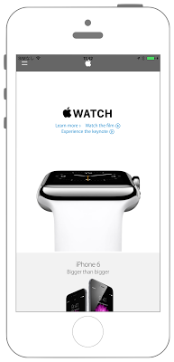
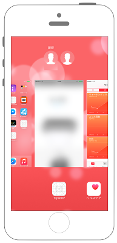

# プレビュー画面にエフェクト処理




### AppDelegate.swift
```swift fct_label="Swift 4.x"
//
//  AppDelegate.swift
//  UIKit043_4.0
//
//  Created by KimikoWatanabe on 2016/08/21.
//  Copyright © 2016年 FaBo, Inc. All rights reserved.
//

import UIKit

@UIApplicationMain
class AppDelegate: UIResponder, UIApplicationDelegate {
    
    var window: UIWindow?
    var myEffectView: UIView!
    
    /*
     アプリ起動時に呼ばれる.
     */
    func application(_ application: UIApplication, didFinishLaunchingWithOptions launchOptions: [NSObject: AnyObject]?) -> Bool {
        print("didFinishLaunchingWithOptions")
        
        return true
    }
    
    /*
     アプリがバックグラウンドになる直前に呼ばれる.
     */
    func applicationWillResignActive(_ application: UIApplication) {
        print("applicationWillResignActive")
        
        let effect: UIBlurEffect = UIBlurEffect(style: UIBlurEffect.Style.light)
        myEffectView = UIVisualEffectView(effect: effect)
        myEffectView.frame = CGRect(x:0, y:0, width:UIScreen.main.bounds.size.width, height:UIScreen.main.bounds.size.height)
        self.window?.addSubview(myEffectView)
        
    }
    
    /*
     アプリがバックグラウンドになった時に呼ばれる.
     */
    func applicationDidEnterBackground(_ application: UIApplication) {
        print("viewDidDisappear")
        
    }
    
    /*
     アプリがフォアグラウンドになった時に呼ばれる.
     */
    func applicationWillEnterForeground(_ application: UIApplication) {
        print("applicationWillEnterForeground")
    }
    
    /*
     アプリがアクティブになった時に呼ばれる.
     */
    func applicationDidBecomeActive(_ application: UIApplication) {
        print("applicationDidBecomeActive")
        
        if myEffectView != nil {
            self.myEffectView.removeFromSuperview()
        }
    }
    
    /*
     アプリが終了する直前に呼ばれる.
     */
    func applicationWillTerminate(_ application: UIApplication) {
        print("applicationWillTerminate")
    }
}

```

```swift fct_label="Swift 3.x"
//
//  AppDelegate.swift
//  UIKit043_3.0
//
//  Created by KimikoWatanabe on 2016/08/21.
//  Copyright © 2016年 FaBo, Inc. All rights reserved.
//

import UIKit
n
@UIApplicationMain
class AppDelegate: UIResponder, UIApplicationDelegate {

    var window: UIWindow?
    var myEffectView: UIView!

    /*
     アプリ起動時に呼ばれる.
     */
    func application(_ application: UIApplication, didFinishLaunchingWithOptions launchOptions: [NSObject: AnyObject]?) -> Bool {
        print("didFinishLaunchingWithOptions")

        return true
    }

    /*
     アプリがバックグラウンドになる直前に呼ばれる.
     */
    func applicationWillResignActive(_ application: UIApplication) {
        print("applicationWillResignActive")

        let effect: UIBlurEffect = UIBlurEffect(style: UIBlurEffectStyle.light)
        myEffectView = UIVisualEffectView(effect: effect)
        myEffectView.frame = CGRect(x:0, y:0, width:UIScreen.main.bounds.size.width, height:UIScreen.main.bounds.size.height)
        self.window?.addSubview(myEffectView)

    }

    /*
     アプリがバックグラウンドになった時に呼ばれる.
     */
    func applicationDidEnterBackground(_ application: UIApplication) {
        print("viewDidDisappear")

    }

    /*
     アプリがフォアグラウンドになった時に呼ばれる.
     */
    func applicationWillEnterForeground(_ application: UIApplication) {
        print("applicationWillEnterForeground")
    }

    /*
     アプリがアクティブになった時に呼ばれる.
     */
    func applicationDidBecomeActive(_ application: UIApplication) {
        print("applicationDidBecomeActive")

        if myEffectView != nil {
            self.myEffectView.removeFromSuperview()
        }
    }

    /*
     アプリが終了する直前に呼ばれる.
     */
    func applicationWillTerminate(_ application: UIApplication) {
        print("applicationWillTerminate")
    }   
}
```

```swift fct_label="Swift 2.3"
//
//  AppDelegate.swift
//  UIKit043_2.3
//
//  Created by KimikoWatanabe on 2016/08/21.
//  Copyright © 2016年 FaBo, Inc. All rights reserved.
//

import UIKit

@UIApplicationMain
class AppDelegate: UIResponder, UIApplicationDelegate {

    var window: UIWindow?
    var myEffectView: UIView!

    /*
     アプリ起動時に呼ばれる.
     */
    func application(application: UIApplication, didFinishLaunchingWithOptions launchOptions: [NSObject: AnyObject]?) -> Bool {
        print("didFinishLaunchingWithOptions")

        return true
    }

    /*
     アプリがバックグラウンドになる直前に呼ばれる.
     */
    func applicationWillResignActive(application: UIApplication) {
        print("applicationWillResignActive")

        let effect: UIBlurEffect = UIBlurEffect(style: UIBlurEffectStyle.Light)
        myEffectView = UIVisualEffectView(effect: effect)
        myEffectView.frame = CGRectMake(0, 0, UIScreen.mainScreen().bounds.size.width, UIScreen.mainScreen().bounds.size.height)
        self.window?.addSubview(myEffectView)

    }

    /*
     アプリがバックグラウンドになった時に呼ばれる.
     */
    func applicationDidEnterBackground(application: UIApplication) {
        print("viewDidDisappear")

    }

    /*
     アプリがフォアグラウンドになった時に呼ばれる.
     */
    func applicationWillEnterForeground(application: UIApplication) {
        print("applicationWillEnterForeground")
    }

    /*
     アプリがアクティブになった時に呼ばれる.
     */
    func applicationDidBecomeActive(application: UIApplication) {
        print("applicationDidBecomeActive")

        if myEffectView != nil {
            self.myEffectView.removeFromSuperview()
        }
    }

    /*
     アプリが終了する直前に呼ばれる.
     */
    func applicationWillTerminate(application: UIApplication) {
        print("applicationWillTerminate")
    }   
}
```

### ViewController.swift
```swift fct_label="Swift 4.x"
//
//  ViewController.swift
//  UIKit043_4.0
//
//  Created by KimikoWatanabe on 2016/08/21.
//  Copyright © 2016年 FaBo, Inc. All rights reserved.
//

import UIKit

class ViewController: UIViewController, UIWebViewDelegate {
    
    var myWebView : UIWebView!
    
    override func viewDidLoad() {
        super.viewDidLoad()
        
        // WebViewを開く.
        myWebView = UIWebView()
        myWebView.delegate = self
        myWebView.frame = self.view.bounds
        self.view.addSubview(myWebView)
        
        let url: URL! = URL(string: "http://www.apple.com")
        let request: NSURLRequest = NSURLRequest(url: url)
        
        // ロード開始.
        myWebView.loadRequest(request as URLRequest)
    }
    
    /*
     Webがすべて読み込み終わった時呼ばれる.
     */
    func webViewDidFinishLoad(_ webView: UIWebView) {
        print("webViewDidFinishLoad")
    }
    
    /*
     Webがloadされ始めた時、呼ばれる.
     */
    func webViewDidStartLoad(_ webView: UIWebView) {
        print("webViewDidStartLoad")
    }
    
    override func didReceiveMemoryWarning() {
        super.didReceiveMemoryWarning()
    }
}
```

```swift fct_label="Swift 3.x"
//
//  ViewController.swift
//  UIKit043_3.0
//
//  Created by KimikoWatanabe on 2016/08/21.
//  Copyright © 2016年 FaBo, Inc. All rights reserved.
//

import UIKit

class ViewController: UIViewController, UIWebViewDelegate {

    var myWebView : UIWebView!

    override func viewDidLoad() {
        super.viewDidLoad()

        // WebViewを開く.
        myWebView = UIWebView()
        myWebView.delegate = self
        myWebView.frame = self.view.bounds
        self.view.addSubview(myWebView)

        let url: URL! = URL(string: "http://www.apple.com")
        let request: NSURLRequest = NSURLRequest(url: url)

        // ロード開始.
        myWebView.loadRequest(request as URLRequest)
    }

    /*
     Webがすべて読み込み終わった時呼ばれる.
     */
    func webViewDidFinishLoad(_ webView: UIWebView) {
        print("webViewDidFinishLoad")
    }

    /*
     Webがloadされ始めた時、呼ばれる.
     */
    func webViewDidStartLoad(_ webView: UIWebView) {
        print("webViewDidStartLoad")
    }

    override func didReceiveMemoryWarning() {
        super.didReceiveMemoryWarning()
    }
}

```

```swift fct_label="Swift 2.3"
//
//  ViewController.swift
//  UIKit043_2.3
//
//  Created by KimikoWatanabe on 2016/08/21.
//  Copyright © 2016年 FaBo, Inc. All rights reserved.
//

import UIKit

class ViewController: UIViewController, UIWebViewDelegate {

    var myWebView : UIWebView!

    override func viewDidLoad() {
        super.viewDidLoad()

        // WebViewを開く.
        myWebView = UIWebView()
        myWebView.delegate = self
        myWebView.frame = self.view.bounds
        self.view.addSubview(myWebView)

        let url: NSURL! = NSURL(string: "http://www.apple.com")
        let request: NSURLRequest = NSURLRequest(URL: url)

        // ロード開始.
        myWebView.loadRequest(request)
    }

    /*
     Webがすべて読み込み終わった時呼ばれる.
     */
    func webViewDidFinishLoad(webView: UIWebView) {
        print("webViewDidFinishLoad")
    }

    /*
     Webがloadされ始めた時、呼ばれる.
     */
    func webViewDidStartLoad(webView: UIWebView) {
        print("webViewDidStartLoad")
    }

    override func didReceiveMemoryWarning() {
        super.didReceiveMemoryWarning()
    }
}
```

## 3.xと4.xの差分
* UIBlurEffectStyleがUIBlurEffect.Style
* UIWebViewはiOS 12.0から非推奨

## 2.3と3.0の差分
* UIColorの参照方法が変更(UIColor.grayColor()->UIColor.gray)
* CGRect,CGPointの初期化方法の変更(CGRectMake,CGPointMakeの廃止)
* AppDelegateの関数の引数が変更.
* (UIScreen.mainScreen()->UIScreen.main)
* NSURLの廃止、URLに変更

## Reference
* UIApplication Class
 * [https://developer.apple.com/reference/uikit/uiapplication](https://developer.apple.com/reference/uikit/uiapplication)
