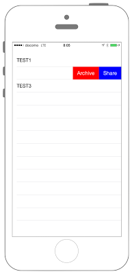

# TableViewのボタンの拡張



```swift fct_label="Swift 5.x/4.x"
//
//  ViewController.swift
//  UIKit045_4.0
//
//  Created by KimikoWatanabe on 2016/08/21.
//  Copyright © 2016年 FaBo, Inc. All rights reserved.
//

import UIKit

class ViewController: UIViewController, UITableViewDelegate, UITableViewDataSource{
    
    // Tabelで使用する配列.
    var myItems: [String] = ["TEST1", "TEST2", "TEST3"]
    var myTableView: UITableView = UITableView()
    override func viewDidLoad() {
        super.viewDidLoad()
        
        // Status Barの高さを取得.
        let barHeight: CGFloat = UIApplication.shared.statusBarFrame.size.height
        
        // Viewの高さと幅を取得.
        let displayWidth: CGFloat = self.view.frame.width
        let displayHeight: CGFloat = self.view.frame.height
        
        // TableViewの生成( status barの高さ分ずらして表示 ).
        myTableView.frame = CGRect(x: 0, y: barHeight, width: displayWidth, height: displayHeight - barHeight)
        
        // Cellの登録.
        myTableView.register(UITableViewCell.self, forCellReuseIdentifier: "MyCell")
        
        // DataSourceの設定.
        myTableView.dataSource = self
        
        // Delegateを設定.
        myTableView.delegate = self
        
        // Viewに追加する.
        self.view.addSubview(myTableView)
        
        
    }
    
    override func didReceiveMemoryWarning() {
        super.didReceiveMemoryWarning()
    }
    
    /*
     Cellが選択された際に呼び出される.
     */
    func tableView(_ tableView: UITableView, didSelectRowAt indexPath: IndexPath) {
        print("Num: \(indexPath.row)")
        print("Value: \(myItems[indexPath.row])")
    }
    
    /*
     Cellの総数を返す.
     */
    func tableView(_ tableView: UITableView, numberOfRowsInSection section: Int) -> Int {
        print("numberOfRowsInSection")
        return myItems.count
    }
    
    /*
     Editableの状態にする.
     */
    func tableView(_ tableView: UITableView, canEditRowAt indexPath: IndexPath) -> Bool {
        print("canEditRowAtIndexPath")
        
        return true
    }
    
    /*
     特定の行のボタン操作を有効にする.
     */
    func tableView(_ tableView: UITableView, commit editingStyle: UITableViewCell.EditingStyle, forRowAt indexPath: IndexPath) {
        print("commitEdittingStyle:\(editingStyle)")
    }
    
    /*
     Cellに値を設定する.
     */
    func tableView(_ tableView: UITableView, cellForRowAt indexPath: IndexPath) -> UITableViewCell {
        print("cellForRowAtIndexPath")
        
        let cell: UITableViewCell = tableView.dequeueReusableCell(withIdentifier: "MyCell", for: indexPath as IndexPath)
        //tableView.dequeueReusableCellWithIdentifier("MyCell", forIndexPath: indexPath as IndexPath)
        
        cell.textLabel?.text = "\(myItems[indexPath.row])"
        
        return cell
    }
    
    /*
     Buttonを拡張する.
     */
    func tableView(_ tableView: UITableView, editActionsForRowAt indexPath: IndexPath) -> [UITableViewRowAction]? {
        
        // Shareボタン.
        let myShareButton: UITableViewRowAction = UITableViewRowAction(style: .normal, title: "Share") { (action, index) -> Void in
            
            tableView.isEditing = false
            print("share")
            
        }
        myShareButton.backgroundColor = UIColor.blue
        
        // Archiveボタン.
        let myArchiveButton: UITableViewRowAction = UITableViewRowAction(style: .normal, title: "Archive") { (action, index) -> Void in
            
            tableView.isEditing = false
            print("archive")
            
        }
        myArchiveButton.backgroundColor = UIColor.red
        
        return [myShareButton, myArchiveButton]
    }
    
}
```

```swift fct_label="Swift 3.x"
//
//  ViewController.swift
//  UIKit045_3.0
//
//  Created by KimikoWatanabe on 2016/08/21.
//  Copyright © 2016年 FaBo, Inc. All rights reserved.
//

import UIKit

class ViewController: UIViewController, UITableViewDelegate, UITableViewDataSource{

    // Tabelで使用する配列.
    var myItems: [String] = ["TEST1", "TEST2", "TEST3"]
    var myTableView: UITableView = UITableView()
    override func viewDidLoad() {
        super.viewDidLoad()

        // Status Barの高さを取得.
        let barHeight: CGFloat = UIApplication.shared.statusBarFrame.size.height

        // Viewの高さと幅を取得.
        let displayWidth: CGFloat = self.view.frame.width
        let displayHeight: CGFloat = self.view.frame.height

        // TableViewの生成( status barの高さ分ずらして表示 ).
        myTableView.frame = CGRect(x: 0, y: barHeight, width: displayWidth, height: displayHeight - barHeight)

        // Cellの登録.
        myTableView.register(UITableViewCell.self, forCellReuseIdentifier: "MyCell")

        // DataSourceの設定.
        myTableView.dataSource = self

        // Delegateを設定.
        myTableView.delegate = self

        // Viewに追加する.
        self.view.addSubview(myTableView)


    }

    override func didReceiveMemoryWarning() {
        super.didReceiveMemoryWarning()
    }

    /*
     Cellが選択された際に呼び出される.
     */
    func tableView(_ tableView: UITableView, didSelectRowAt indexPath: IndexPath) {
        print("Num: \(indexPath.row)")
        print("Value: \(myItems[indexPath.row])")
    }

    /*
     Cellの総数を返す.
     */
    func tableView(_ tableView: UITableView, numberOfRowsInSection section: Int) -> Int {
        print("numberOfRowsInSection")
        return myItems.count
    }

    /*
     Editableの状態にする.
     */
    func tableView(_ tableView: UITableView, canEditRowAt indexPath: IndexPath) -> Bool {
        print("canEditRowAtIndexPath")

        return true
    }

    /*
     特定の行のボタン操作を有効にする.
     */
    func tableView(_ tableView: UITableView, commit editingStyle: UITableViewCellEditingStyle, forRowAt indexPath: IndexPath) {
        print("commitEdittingStyle:\(editingStyle)")
    }

    /*
     Cellに値を設定する.
     */
    func tableView(_ tableView: UITableView, cellForRowAt indexPath: IndexPath) -> UITableViewCell {
        print("cellForRowAtIndexPath")

        let cell: UITableViewCell = tableView.dequeueReusableCell(withIdentifier: "MyCell", for: indexPath as IndexPath)
        //tableView.dequeueReusableCellWithIdentifier("MyCell", forIndexPath: indexPath as IndexPath)

        cell.textLabel?.text = "\(myItems[indexPath.row])"

        return cell
    }

    /*
     Buttonを拡張する.
     */
    func tableView(_ tableView: UITableView, editActionsForRowAt indexPath: IndexPath) -> [UITableViewRowAction]? {

        // Shareボタン.
        let myShareButton: UITableViewRowAction = UITableViewRowAction(style: .normal, title: "Share") { (action, index) -> Void in

            tableView.isEditing = false
            print("share")

        }
        myShareButton.backgroundColor = UIColor.blue

        // Archiveボタン.
        let myArchiveButton: UITableViewRowAction = UITableViewRowAction(style: .normal, title: "Archive") { (action, index) -> Void in

            tableView.isEditing = false
            print("archive")

        }
        myArchiveButton.backgroundColor = UIColor.red

        return [myShareButton, myArchiveButton]
    }

}
```

```swift fct_label="Swift 2.3"
//
//  ViewController.swift
//  UIKit045_2.3
//
//  Created by KimikoWatanabe on 2016/08/21.
//  Copyright © 2016年 FaBo, Inc. All rights reserved.
//

import UIKit

class ViewController: UIViewController, UITableViewDelegate, UITableViewDataSource{

    // Tabelで使用する配列.
    var myItems: [String] = ["TEST1", "TEST2", "TEST3"]
    var myTableView: UITableView = UITableView()
    override func viewDidLoad() {
        super.viewDidLoad()

        // Status Barの高さを取得.
        let barHeight: CGFloat = UIApplication.sharedApplication().statusBarFrame.size.height

        // Viewの高さと幅を取得.
        let displayWidth: CGFloat = self.view.frame.width
        let displayHeight: CGFloat = self.view.frame.height

        // TableViewの生成( status barの高さ分ずらして表示 ).
        myTableView.frame = CGRect(x: 0, y: barHeight, width: displayWidth, height: displayHeight - barHeight)

        // Cellの登録.
        myTableView.registerClass(UITableViewCell.self, forCellReuseIdentifier: "MyCell")

        // DataSourceの設定.
        myTableView.dataSource = self

        // Delegateを設定.
        myTableView.delegate = self

        // Viewに追加する.
        self.view.addSubview(myTableView)


    }

    override func didReceiveMemoryWarning() {
        super.didReceiveMemoryWarning()
    }

    /*
     Cellが選択された際に呼び出される.
     */
    func tableView(tableView: UITableView, didSelectRowAtIndexPath indexPath: NSIndexPath) {
        print("Num: \(indexPath.row)")
        print("Value: \(myItems[indexPath.row])")
    }

    /*
     Cellの総数を返す.
     */
    func tableView(tableView: UITableView, numberOfRowsInSection section: Int) -> Int {
        print("numberOfRowsInSection")
        return myItems.count
    }

    /*
     Editableの状態にする.
     */
    func tableView(tableView: UITableView, canEditRowAtIndexPath indexPath: NSIndexPath) -> Bool {
        print("canEditRowAtIndexPath")

        return true
    }

    /*
     特定の行のボタン操作を有効にする.
     */
    func tableView(tableView: UITableView, commitEditingStyle editingStyle: UITableViewCellEditingStyle, forRowAtIndexPath indexPath: NSIndexPath) {
        print("commitEdittingStyle:\(editingStyle)")
    }

    /*
     Cellに値を設定する.
     */
    func tableView(tableView: UITableView, cellForRowAtIndexPath indexPath: NSIndexPath) -> UITableViewCell {
        print("cellForRowAtIndexPath")

        let cell: UITableViewCell = tableView.dequeueReusableCellWithIdentifier("MyCell", forIndexPath: indexPath)

        cell.textLabel?.text = "\(myItems[indexPath.row])"

        return cell
    }

    /*
     Buttonを拡張する.
     */
    func tableView(tableView: UITableView, editActionsForRowAtIndexPath indexPath: NSIndexPath) -> [UITableViewRowAction]? {

        // Shareボタン.
        let myShareButton: UITableViewRowAction = UITableViewRowAction(style: .Normal, title: "Share") { (action, index) -> Void in

            tableView.editing = false
            print("share")

        }
        myShareButton.backgroundColor = UIColor.blueColor()

        // Archiveボタン.
        let myArchiveButton: UITableViewRowAction = UITableViewRowAction(style: .Normal, title: "Archive") { (action, index) -> Void in

            tableView.editing = false
            print("archive")

        }
        myArchiveButton.backgroundColor = UIColor.redColor()

        return [myShareButton, myArchiveButton]
    }

}
```

## 3.xと4.xの差分
* ```UITableViewCellEditingStyle``` が ```UITableViewCell.EditingStyle``` に変更

## 2.3と3.0の差分
* UIColorの参照方法が変更(UIColor.grayColor()->UIColor.gray)
* CGRect,CGPointの初期化方法の変更(CGRectMake,CGPointMakeの廃止)
* NSIndexPathの廃止、IndexPathに変更.

## Reference
* UITableView Class
 * [https://developer.apple.com/reference/uikit/uitableview](https://developer.apple.com/reference/uikit/uitableview)
