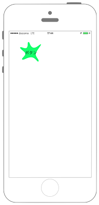

# カスタマイズButton



```swift fct_label="Swift 4.x"
//
//  ViewController.swift
//  UIKit049_4.0
//
//  Created by KimikoWatanabe on 2016/08/21.
//  Copyright © 2016年 FaBo, Inc. All rights reserved.
//

import UIKit

class ViewController: UIViewController {
    
    override func viewDidLoad() {
        super.viewDidLoad()
        
        let myButton = MyButton(frame: CGRect(x:50, y:50, width:100, height:100))
        myButton.setTitle("ボタン", for: UIControl.State.normal)
        myButton.setTitleColor(UIColor.black, for: UIControl.State.normal)
        myButton.addTarget(self, action: #selector(ViewController.onClickMyButton(sender:)), for: .touchUpInside)
        
        self.view.addSubview(myButton)
        
    }
    
    override func didReceiveMemoryWarning() {
        super.didReceiveMemoryWarning()
        // Dispose of any resources that can be recreated.
    }
    
    /*
     ボタンイベント.
     */
    @objc func onClickMyButton(sender: UIButton){
        print("onClickMyButton:")
        print("sender.currentTitile: \(sender.currentTitle!)")
    }
    
}
```

```swift fct_label="Swift 3.x"
//
//  ViewController.swift
//  UIKit049_3.0
//
//  Created by KimikoWatanabe on 2016/08/21.
//  Copyright © 2016年 FaBo, Inc. All rights reserved.
//

import UIKit

class ViewController: UIViewController {

    override func viewDidLoad() {
        super.viewDidLoad()

        let myButton = MyButton(frame: CGRect(x:50, y:50, width:100, height:100))
        myButton.setTitle("ボタン", for: UIControlState.normal)
        myButton.setTitleColor(UIColor.black, for: UIControlState.normal)
        myButton.addTarget(self, action: #selector(ViewController.onClickMyButton(sender:)), for: .touchUpInside)

        self.view.addSubview(myButton)

    }

    override func didReceiveMemoryWarning() {
        super.didReceiveMemoryWarning()
        // Dispose of any resources that can be recreated.
    }

    /*
     ボタンイベント.
     */
    func onClickMyButton(sender: UIButton){
        print("onClickMyButton:")
        print("sender.currentTitile: \(sender.currentTitle!)")
    }

}
```

```swift fct_label="Swift 2.3"
//
//  ViewController.swift
//  UIKit049_2.3
//
//  Created by KimikoWatanabe on 2016/08/21.
//  Copyright © 2016年 FaBo, Inc. All rights reserved.
//

import UIKit

class ViewController: UIViewController {

    override func viewDidLoad() {
        super.viewDidLoad()

        let myButton = MyButton(frame: CGRectMake(50, 50, 100, 100))
        myButton.setTitle("ボタン", forState: UIControlState.Normal)
        myButton.setTitleColor(UIColor.blackColor(), forState: UIControlState.Normal)
        myButton.addTarget(self, action: #selector(ViewController.onClickMyButton(_:)), forControlEvents: .TouchUpInside)

        self.view.addSubview(myButton)

    }

    override func didReceiveMemoryWarning() {
        super.didReceiveMemoryWarning()
        // Dispose of any resources that can be recreated.
    }

    /*
     ボタンイベント.
     */
    func onClickMyButton(sender: UIButton){
        print("onClickMyButton:")
        print("sender.currentTitile: \(sender.currentTitle!)")
    }

}
```

### MyButton.swift
```swift fct_label="Swift 4.x/Swift 3.x"
//
//  MyButton.swift
//  UIKit049_4.0
//
//  Created by KimikoWatanabe on 2016/08/21.
//  Copyright © 2016年 FaBo, Inc. All rights reserved.
//

import Foundation
import UIKit

class MyButton: UIButton {

    var myStatus: ButtonStatus!
    enum ButtonStatus {
        case Normal
        case TouchBegan
        case TouchEnded
    }

    required init(coder aDecoder: NSCoder) {
        super.init(coder: aDecoder)!
    }

    override init(frame: CGRect) {
        super.init(frame: frame)
        myStatus = .Normal
    }
    override func touchesBegan(_ touches: Set<UITouch>, with event: UIEvent?) {
        super.touchesBegan(touches, with: event)

        myStatus = .TouchBegan
        self.setNeedsDisplay()
    }

    override func touchesEnded(_ touches: Set<UITouch>, with event: UIEvent?) {
        super.touchesEnded(touches, with: event)

        myStatus = .TouchEnded
        self.setNeedsDisplay()
    }

    override func draw(_ rect: CGRect) {

        let width = rect.width, height = rect.height

        if myStatus == .Normal || myStatus == .TouchEnded {
            // 色の定義.
            let color = UIColor(red: 0.081, green: 1.000, blue: 0.421, alpha: 1.000)

            // ボタンの形状を定義.
            let path = makeNormalPath(width: width, height: height)
            color.setFill()
            path.fill()
            path.lineWidth = 0
            path.stroke()

        } else if myStatus == .TouchBegan {
            // 色の定義.
            let color = UIColor(red: 1.000, green: 1.000, blue: 0.421, alpha: 1.000)

            // ボタンの形状を定義.
            let path = makeNormalPath(width: width, height: height)
            color.setFill()
            path.fill()
            path.lineWidth = 0
            path.stroke()
        }

        super.draw(rect)
    }

    /*
     ボタンの形状を作成.
     */
    private func makeNormalPath(width: CGFloat, height: CGFloat) -> UIBezierPath{
        let bezierPath = UIBezierPath()
        bezierPath.move(to: CGPoint(x:46.33/120 * width, y:0.5/120 * height))
        bezierPath.addCurve(to: CGPoint(x:37.47/120 * width, y:30.41/120 * height),
                            controlPoint1: CGPoint(x:38.21/120 * width, y:0.5/120 * height),
                            controlPoint2: CGPoint(x:45.96/120 * width, y:18.21/120 * height))
        //
        bezierPath.addCurve(to: CGPoint(x:0.54/120 * width, y:30.41/120 * height),
                                   controlPoint1: CGPoint(x:28.97/120 * width, y:42.61/120 * height),
                                   controlPoint2: CGPoint(x:2.75/120 * width, y:21.75/120 * height))
        bezierPath.addCurve(to: CGPoint(x:28.61/120 * width, y:65.04/120 * height),
                                   controlPoint1: CGPoint(x:-1.68/120 * width, y:39.06/120 * height),
                                   controlPoint2: CGPoint(x:28.61/120 * width, y:53.23/120 * height))
        bezierPath.addCurve(to: CGPoint(x:12.36/120 * width, y:96.52/120 * height),
                                   controlPoint1: CGPoint(x:28.61/120 * width, y:76.84/120 * height),
                                   controlPoint2: CGPoint(x:4.23/120 * width, y:91.79/120 * height))
        bezierPath.addCurve(to: CGPoint(x:61.1/120 * width, y:83.92/120 * height),
                                   controlPoint1: CGPoint(x:20.48/120 * width, y:101.24/120 * height),
                                   controlPoint2: CGPoint(x:38.21/120 * width, y:83.92/120 * height))
        bezierPath.addCurve(to: CGPoint(x:100.99/120 * width, y:105.96/120 * height),
                                   controlPoint1: CGPoint(x:84/120 * width, y:83.92/120 * height),
                                   controlPoint2: CGPoint(x:95.82/120 * width, y:114.62/120 * height))
        bezierPath.addCurve(to: CGPoint(x:86.22/120 * width, y:65.04/120 * height),
                                   controlPoint1: CGPoint(x:106.16/120 * width, y:97.3/120 * height),
                                   controlPoint2: CGPoint(x:83.63/120 * width, y:81.56/120 * height))
        bezierPath.addCurve(to: CGPoint(x:114.29/120 * width, y:13.09/120 * height),
                                   controlPoint1: CGPoint(x:88.8/120 * width, y:48.51/120 * height),
                                   controlPoint2: CGPoint(x:117.24/120 * width, y:17.81/120 * height))
        bezierPath.addCurve(to: CGPoint(x:69.97/120 * width, y:30.41/120 * height),
                                   controlPoint1: CGPoint(x:111.33/120 * width, y:8.37/120 * height),
                                   controlPoint2: CGPoint(x:86.96/120 * width, y:37.88/120 * height))
        bezierPath.addCurve(to: CGPoint(x:46.33/120 * width, y:0.5/120 * height),
                                   controlPoint1: CGPoint(x:52.98/120 * width, y:22.93/120 * height),
                                   controlPoint2: CGPoint(x:54.46/120 * width, y:0.5/120 * height))
        bezierPath.close()

        return bezierPath
    }
}
```

```swift fct_label="Swift 2.3"
//
//  MyButton.swift
//  UIKit049_2.3
//
//  Created by KimikoWatanabe on 2016/08/21.
//  Copyright © 2016年 FaBo, Inc. All rights reserved.
//

import Foundation
import UIKit

class MyButton: UIButton {

    var myStatus: ButtonStatus!
    enum ButtonStatus {
        case Normal
        case TouchBegan
        case TouchEnded
    }

    required init(coder aDecoder: NSCoder) {
        super.init(coder: aDecoder)!
    }

    override init(frame: CGRect) {
        super.init(frame: frame)
        myStatus = .Normal
    }
    override func touchesBegan(touches: Set<UITouch>, withEvent event: UIEvent?) {
        super.touchesBegan(touches, withEvent: event)

        myStatus = .TouchBegan
        self.setNeedsDisplay()
    }

    override func touchesEnded(touches: Set<UITouch>, withEvent event: UIEvent?) {
        super.touchesEnded(touches, withEvent: event)

        myStatus = .TouchEnded
        self.setNeedsDisplay()
    }

    override func drawRect(rect: CGRect) {

        let width = rect.width, height = rect.height

        if myStatus == .Normal || myStatus == .TouchEnded {
            // 色の定義.
            let color = UIColor(red: 0.081, green: 1.000, blue: 0.421, alpha: 1.000)

            // ボタンの形状を定義.
            let path = makeNormalPath(width, height: height)
            color.setFill()
            path.fill()
            path.lineWidth = 0
            path.stroke()

        } else if myStatus == .TouchBegan {
            // 色の定義.
            let color = UIColor(red: 1.000, green: 1.000, blue: 0.421, alpha: 1.000)

            // ボタンの形状を定義.
            let path = makeNormalPath(width, height: height)
            color.setFill()
            path.fill()
            path.lineWidth = 0
            path.stroke()
        }

        super.drawRect(rect)
    }

    /*
     ボタンの形状を作成.
     */
    private func makeNormalPath(width: CGFloat, height: CGFloat) -> UIBezierPath{
        let bezierPath = UIBezierPath()
        bezierPath.moveToPoint(CGPointMake(46.33/120 * width, 0.5/120 * height))
        bezierPath.addCurveToPoint(CGPointMake(37.47/120 * width, 30.41/120 * height),
                                   controlPoint1: CGPointMake(38.21/120 * width, 0.5/120 * height),
                                   controlPoint2: CGPointMake(45.96/120 * width, 18.21/120 * height))
        bezierPath.addCurveToPoint(CGPointMake(0.54/120 * width, 30.41/120 * height),
                                   controlPoint1: CGPointMake(28.97/120 * width, 42.61/120 * height),
                                   controlPoint2: CGPointMake(2.75/120 * width, 21.75/120 * height))
        bezierPath.addCurveToPoint(CGPointMake(28.61/120 * width, 65.04/120 * height),
                                   controlPoint1: CGPointMake(-1.68/120 * width, 39.06/120 * height),
                                   controlPoint2: CGPointMake(28.61/120 * width, 53.23/120 * height))
        bezierPath.addCurveToPoint(CGPointMake(12.36/120 * width, 96.52/120 * height),
                                   controlPoint1: CGPointMake(28.61/120 * width, 76.84/120 * height),
                                   controlPoint2: CGPointMake(4.23/120 * width, 91.79/120 * height))
        bezierPath.addCurveToPoint(CGPointMake(61.1/120 * width, 83.92/120 * height),
                                   controlPoint1: CGPointMake(20.48/120 * width, 101.24/120 * height),
                                   controlPoint2: CGPointMake(38.21/120 * width, 83.92/120 * height))
        bezierPath.addCurveToPoint(CGPointMake(100.99/120 * width, 105.96/120 * height),
                                   controlPoint1: CGPointMake(84/120 * width, 83.92/120 * height),
                                   controlPoint2: CGPointMake(95.82/120 * width, 114.62/120 * height))
        bezierPath.addCurveToPoint(CGPointMake(86.22/120 * width, 65.04/120 * height),
                                   controlPoint1: CGPointMake(106.16/120 * width, 97.3/120 * height),
                                   controlPoint2: CGPointMake(83.63/120 * width, 81.56/120 * height))
        bezierPath.addCurveToPoint(CGPointMake(114.29/120 * width, 13.09/120 * height),
                                   controlPoint1: CGPointMake(88.8/120 * width, 48.51/120 * height),
                                   controlPoint2: CGPointMake(117.24/120 * width, 17.81/120 * height))
        bezierPath.addCurveToPoint(CGPointMake(69.97/120 * width, 30.41/120 * height),
                                   controlPoint1: CGPointMake(111.33/120 * width, 8.37/120 * height),
                                   controlPoint2: CGPointMake(86.96/120 * width, 37.88/120 * height))
        bezierPath.addCurveToPoint(CGPointMake(46.33/120 * width, 0.5/120 * height),
                                   controlPoint1: CGPointMake(52.98/120 * width, 22.93/120 * height),
                                   controlPoint2: CGPointMake(54.46/120 * width, 0.5/120 * height))
        bezierPath.closePath()

        return bezierPath
    }
}

```

## 3.xと4.xの差分
* UIControlStateがUIControl.Stateに変更
* func onClickMyButtonに@objcを追加

## 2.3と3.0の差分
* UIColorの参照方法が変更(UIColor.grayColor()->UIColor.gray)
* CGRect,CGPointの初期化方法の変更(CGRectMake,CGPointMakeの廃止)
* ```drawRect```が```draw```メソッドに変更
* ```bezierPath.addCurveToPoint```が```bezierPath.addCurve```に変更

## Reference
* UIButton Class
 * [https://developer.apple.com/reference/uikit/uibutton](https://developer.apple.com/reference/uikit/uibutton)
