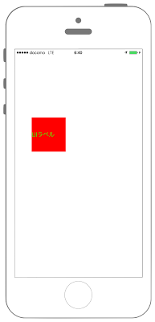

# UIパーツの削除



```swift fct_label="Swift 4.x"
//
//  ViewController.swift
//  UIKit050_4.0
//
//  Created by KimikoWatanabe on 2016/08/21.
//  Copyright © 2016年 FaBo, Inc. All rights reserved.
//

import UIKit

class ViewController: UIViewController {
    
    override func viewDidLoad() {
        super.viewDidLoad()
        
        let myButton = UIButton(frame: CGRect(x:50, y:50, width:100, height:100))
        myButton.setTitle("UIボタン", for: UIControl.State.normal)
        myButton.setTitleColor(UIColor.black, for: UIControl.State.normal)
        myButton.backgroundColor = UIColor.green
        
        let myLabel = UILabel(frame: CGRect(x:50, y:200, width:100, height:100))
        myLabel.text = "UIラベル"
        myLabel.textColor = UIColor.green
        myLabel.backgroundColor = UIColor.red
        
        self.view.addSubview(myButton)
        
        print("View:\(view.description)")
        
        let views = self.view.subviews
        for myView in views {
            print("View:\(myView.description)")
            
            if myView.isKind(of:UIButton.self) {
                myView.removeFromSuperview()
                self.view.addSubview(myLabel)
            }
        }
    }
    
    override func didReceiveMemoryWarning() {
        super.didReceiveMemoryWarning()
    }
}
```

```swift fct_label="Swift 3.x"
//
//  ViewController.swift
//  UIKit050_3.0
//
//  Created by KimikoWatanabe on 2016/08/21.
//  Copyright © 2016年 FaBo, Inc. All rights reserved.
//

import UIKit

class ViewController: UIViewController {

    override func viewDidLoad() {
        super.viewDidLoad()

        let myButton = UIButton(frame: CGRect(x:50, y:50, width:100, height:100))
        myButton.setTitle("UIボタン", for: UIControlState.normal)
        myButton.setTitleColor(UIColor.black, for: UIControlState.normal)
        myButton.backgroundColor = UIColor.green

        let myLabel = UILabel(frame: CGRect(x:50, y:200, width:100, height:100))
        myLabel.text = "UIラベル"
        myLabel.textColor = UIColor.green
        myLabel.backgroundColor = UIColor.red

        self.view.addSubview(myButton)

        print("View:\(view.description)")

        let views = self.view.subviews
        for myView in views {
            print("View:\(myView.description)")

            if myView.isKind(of:UIButton.self) {
                myView.removeFromSuperview()
                self.view.addSubview(myLabel)
            }
        }
    }

    override func didReceiveMemoryWarning() {
        super.didReceiveMemoryWarning()
    }
}
```

```swift fct_label="Swift 2.3"
//
//  ViewController.swift
//  UIKit050_2.3
//
//  Created by KimikoWatanabe on 2016/08/21.
//  Copyright © 2016年 FaBo, Inc. All rights reserved.
//

import UIKit

class ViewController: UIViewController {

    override func viewDidLoad() {
        super.viewDidLoad()

        let myButton = UIButton(frame: CGRectMake(50, 50, 100, 100))
        myButton.setTitle("UIボタン", forState: UIControlState.Normal)
        myButton.setTitleColor(UIColor.blackColor(), forState: UIControlState.Normal)
        myButton.backgroundColor = UIColor.greenColor()

        let myLabel = UILabel(frame: CGRectMake(50, 200, 100, 100))
        myLabel.text = "UIラベル"
        myLabel.textColor = UIColor.greenColor()
        myLabel.backgroundColor = UIColor.redColor()

        self.view.addSubview(myButton)

        print("View:\(view.description)")

        let views = self.view.subviews
        for myView in views {
            print("View:\(myView.description)")

            if myView.isKindOfClass(UIButton) {
                myView.removeFromSuperview()
                self.view.addSubview(myLabel)
            }
        }
    }

    override func didReceiveMemoryWarning() {
        super.didReceiveMemoryWarning()
    }
}

```

## 3.xと4.xの差分
* UIControlStateがUIControl.Stateに変更

## 2.3と3.0の差分
* UIColorの参照方法が変更(UIColor.grayColor()->UIColor.gray)
* CGRect,CGPointの初期化方法の変更(CGRectMake,CGPointMakeの廃止)
* ```isKindOfClass(class)```が```isKind(of:class)```に変更

## Reference
* UIView Class
 * [https://developer.apple.com/reference/uikit/uiview](https://developer.apple.com/reference/uikit/uiview)
