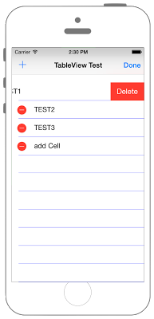
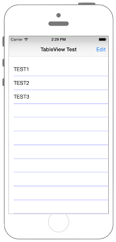

# UITableViewに追加・削除機能を追加




### AppDelegate.swift

```swift fct_label="Swift 5.x/4.x"
//
//  AppDelegate.swift
//  UIKit051_4.0
//
//  Created by KimikoWatanabe on 2016/08/21.
//  Copyright © 2016年 FaBo, Inc. All rights reserved.
//

import UIKit

@UIApplicationMain
class AppDelegate: UIResponder, UIApplicationDelegate {

    var window: UIWindow?
    var myNavigationController: UINavigationController?
    
    func application(_ application: UIApplication, willFinishLaunchingWithOptions launchOptions: [UIApplication.LaunchOptionsKey : Any]? = nil) -> Bool {
        
        // ViewControllerを生成.
        let myViewController: ViewController = ViewController()
        
        // Navication Controllerを生成.
        myNavigationController = UINavigationController(rootViewController: myViewController)
        
        // UIWindowを生成.
        self.window = UIWindow(frame: UIScreen.main.bounds)
        
        // rootViewControllerにNatigationControllerを設定.
        self.window?.rootViewController = myNavigationController
        
        self.window?.makeKeyAndVisible()
        
        return true

    }
}
```

```swift fct_label="Swift 3.x"
//
//  AppDelegate.swift
//  UIKit051_3.0
//
//  Created by KimikoWatanabe on 2016/08/21.
//  Copyright © 2016年 FaBo, Inc. All rights reserved.
//

import UIKit

@UIApplicationMain
class AppDelegate: UIResponder, UIApplicationDelegate {

    var window: UIWindow?
    var myNavigationController: UINavigationController?

    func application(_ application: UIApplication, didFinishLaunchingWithOptions launchOptions: [NSObject : AnyObject]?) -> Bool {

        // ViewControllerを生成.
        let myViewController: ViewController = ViewController()

        // Navication Controllerを生成.
        myNavigationController = UINavigationController(rootViewController: myViewController)

        // UIWindowを生成.
        self.window = UIWindow(frame: UIScreen.main.bounds)

        // rootViewControllerにNatigationControllerを設定.
        self.window?.rootViewController = myNavigationController

        self.window?.makeKeyAndVisible()

        return true
    }
}
```

```swift fct_label="Swift 2.3"
//
//  AppDelegate.swift
//  UIKit051_2.3
//
//  Created by KimikoWatanabe on 2016/08/21.
//  Copyright © 2016年 FaBo, Inc. All rights reserved.
//

import UIKit

@UIApplicationMain
class AppDelegate: UIResponder, UIApplicationDelegate {

    var window: UIWindow?
    var myNavigationController: UINavigationController?

    func application(application: UIApplication, didFinishLaunchingWithOptions launchOptions: [NSObject : AnyObject]?) -> Bool {

        // ViewControllerを生成.
        let myViewController: ViewController = ViewController()

        // Navication Controllerを生成.
        myNavigationController = UINavigationController(rootViewController: myViewController)

        // UIWindowを生成.
        self.window = UIWindow(frame: UIScreen.mainScreen().bounds)

        // rootViewControllerにNatigationControllerを設定.
        self.window?.rootViewController = myNavigationController

        self.window?.makeKeyAndVisible()

        return true
    }
}
```

### ViewController.swift

```swift fct_label="Swift 4.x"
//
//  ViewController.swift
//  UIKit051_3.0
//
//  Created by KimikoWatanabe on 2016/08/21.
//  Copyright © 2016年 FaBo, Inc. All rights reserved.
//

import UIKit

class ViewController: UIViewController, UITableViewDelegate, UITableViewDataSource {
    
    let myItems: NSMutableArray = ["TEST1", "TEST2", "TEST3"]
    var myTableView: UITableView!
    
    override func viewDidLoad() {
        super.viewDidLoad()
        
        // ナビゲーションバーに表示するタイトル.
        self.title = "TableView Test"
        
        // ナビゲーションバーを取得.
        self.navigationController?.navigationBar
        
        // ナビゲーションバーを表示.
        self.navigationController?.isNavigationBarHidden = false
        
        // ナビゲーションバーの右側に編集ボタンを追加.
        self.navigationItem.rightBarButtonItem = self.editButtonItem
        
        // Status Barの高さを取得.
        let barHeight: CGFloat = UIApplication.shared.statusBarFrame.size.height
        
        // Viewの高さと幅を取得.
        let displayWidth: CGFloat = self.view.frame.width
        let displayHeight: CGFloat = self.view.frame.height
        
        // TableViewの生成( status barの高さ分ずらして表示 ).
        myTableView = UITableView(frame: CGRect(x: 0, y: barHeight, width: displayWidth, height: displayHeight - barHeight))
        
        // Cellの登録.
        myTableView.register(UITableViewCell.self, forCellReuseIdentifier: "MyCell")
        
        // DataSourceの設定.
        myTableView.dataSource = self
        
        // Delegateを設定.
        myTableView.delegate = self
        
        // 罫線を青色に設定.
        myTableView.separatorColor = UIColor.blue
        
        // 編集中のセル選択を許可.
        myTableView.allowsSelectionDuringEditing = true
        
        // TableViewをViewに追加する.
        self.view.addSubview(myTableView)
    }
    /*
     Cellが選択された際に呼び出される.
     */
    func tableView(_ tableView: UITableView, didSelectRowAt indexPath: IndexPath) {
        
        // 選択中のセルが何番目か.
        print("Num: \(indexPath.row)")
        
        // 選択中のセルのvalue.
        print("Value: \(myItems[indexPath.row])")
        
        // 選択中のセルを編集できるか.
        print("Edeintg: \(tableView.isEditing)")
    }
    
    
    /*
     Cellの総数を返す
     (実装必須)
     */
    func tableView(_ tableView: UITableView, numberOfRowsInSection section: Int) -> Int {
        return myItems.count
    }
    
    /*
     Cellに値を設定する
     (実装必須)
     */
    func tableView(_ tableView: UITableView, cellForRowAt indexPath: IndexPath) -> UITableViewCell {
        
        let cell = tableView.dequeueReusableCell(withIdentifier: "MyCell", for: indexPath as IndexPath)
        
        // Cellに値を設定.
        cell.textLabel?.text = "\(myItems[indexPath.row])"
        
        return cell
    }
    
    /*
     編集ボタンが押された際に呼び出される
     */
    override func setEditing(_ editing: Bool, animated: Bool) {
        super.setEditing(editing, animated: animated)
        
        // TableViewを編集可能にする
        myTableView.setEditing(editing, animated: true)
        
        // 編集中のときのみaddButtonをナビゲーションバーの左に表示する
        if editing {
            print("編集中")
            let addButton = UIBarButtonItem(barButtonSystemItem: UIBarButtonItem.SystemItem.add, target: self, action: #selector(ViewController.addCell(sender:)))
            self.navigationItem.setLeftBarButton(addButton, animated: true)
        } else {
            print("通常モード")
            self.navigationItem.setLeftBarButton(nil, animated: true)
        }
    }
    
    /*
     addButtonが押された際呼び出される
     */
    @objc func addCell(sender: AnyObject) {
        print("追加")
        
        // myItemsに追加.
        myItems.add("add Cell")
        
        // TableViewを再読み込み.
        myTableView.reloadData()
    }
    
    /*
     Cellを挿入または削除しようとした際に呼び出される
     */
    func tableView(_ tableView: UITableView, commit editingStyle: UITableViewCell.EditingStyle, forRowAt indexPath: IndexPath) {
        
        // 削除のとき.
        if editingStyle == UITableViewCell.EditingStyle.delete {
            print("削除")
            
            // 指定されたセルのオブジェクトをmyItemsから削除する.
            myItems.removeObject(at: indexPath.row)
            
            // TableViewを再読み込み.
            myTableView.reloadData()
        }
    }
    
    
    override func didReceiveMemoryWarning() {
        super.didReceiveMemoryWarning()
    }
}

```

```swift fct_label="Swift 3.x"
//
//  ViewController.swift
//  UIKit051_3.0
//
//  Created by KimikoWatanabe on 2016/08/21.
//  Copyright © 2016年 FaBo, Inc. All rights reserved.
//

import UIKit

class ViewController: UIViewController, UITableViewDelegate, UITableViewDataSource {

    let myItems: NSMutableArray = ["TEST1", "TEST2", "TEST3"]
    var myTableView: UITableView!

    override func viewDidLoad() {
        super.viewDidLoad()

        // ナビゲーションバーに表示するタイトル.
        self.title = "TableView Test"

        // ナビゲーションバーを取得.
        self.navigationController?.navigationBar

        // ナビゲーションバーを表示.
        self.navigationController?.isNavigationBarHidden = false

        // ナビゲーションバーの右側に編集ボタンを追加.
        self.navigationItem.rightBarButtonItem = self.editButtonItem

        // Status Barの高さを取得.
        let barHeight: CGFloat = UIApplication.shared.statusBarFrame.size.height

        // Viewの高さと幅を取得.
        let displayWidth: CGFloat = self.view.frame.width
        let displayHeight: CGFloat = self.view.frame.height

        // TableViewの生成( status barの高さ分ずらして表示 ).
        myTableView = UITableView(frame: CGRect(x: 0, y: barHeight, width: displayWidth, height: displayHeight - barHeight))

        // Cellの登録.
        myTableView.register(UITableViewCell.self, forCellReuseIdentifier: "MyCell")

        // DataSourceの設定.
        myTableView.dataSource = self

        // Delegateを設定.
        myTableView.delegate = self

        // 罫線を青色に設定.
        myTableView.separatorColor = UIColor.blue

        // 編集中のセル選択を許可.
        myTableView.allowsSelectionDuringEditing = true

        // TableViewをViewに追加する.
        self.view.addSubview(myTableView)
    }
    /*
     Cellが選択された際に呼び出される.
     */
    func tableView(_ tableView: UITableView, didSelectRowAt indexPath: IndexPath) {

        // 選択中のセルが何番目か.
        print("Num: \(indexPath.row)")

        // 選択中のセルのvalue.
        print("Value: \(myItems[indexPath.row])")

        // 選択中のセルを編集できるか.
        print("Edeintg: \(tableView.isEditing)")
    }


    /*
     Cellの総数を返す
     (実装必須)
     */
    func tableView(_ tableView: UITableView, numberOfRowsInSection section: Int) -> Int {
        return myItems.count
    }

    /*
     Cellに値を設定する
     (実装必須)
     */
    func tableView(_ tableView: UITableView, cellForRowAt indexPath: IndexPath) -> UITableViewCell {

        let cell = tableView.dequeueReusableCell(withIdentifier: "MyCell", for: indexPath as IndexPath)

        // Cellに値を設定.
        cell.textLabel?.text = "\(myItems[indexPath.row])"

        return cell
    }

    /*
     編集ボタンが押された際に呼び出される
     */
    override func setEditing(_ editing: Bool, animated: Bool) {
        super.setEditing(editing, animated: animated)

        // TableViewを編集可能にする
        myTableView.setEditing(editing, animated: true)

        // 編集中のときのみaddButtonをナビゲーションバーの左に表示する
        if editing {
            print("編集中")
            let addButton = UIBarButtonItem(barButtonSystemItem: UIBarButtonSystemItem.add, target: self, action: #selector(ViewController.addCell(sender:)))
            self.navigationItem.setLeftBarButton(addButton, animated: true)
        } else {
            print("通常モード")
            self.navigationItem.setLeftBarButton(nil, animated: true)
        }
    }

    /*
     addButtonが押された際呼び出される
     */
    func addCell(sender: AnyObject) {
        print("追加")

        // myItemsに追加.
        myItems.add("add Cell")

        // TableViewを再読み込み.
        myTableView.reloadData()
    }

    /*
     Cellを挿入または削除しようとした際に呼び出される
     */
    func tableView(_ tableView: UITableView, commit editingStyle: UITableViewCellEditingStyle, forRowAt indexPath: IndexPath) {

        // 削除のとき.
        if editingStyle == UITableViewCellEditingStyle.delete {
            print("削除")

            // 指定されたセルのオブジェクトをmyItemsから削除する.
            myItems.removeObject(at: indexPath.row)

            // TableViewを再読み込み.
            myTableView.reloadData()
        }
    }


    override func didReceiveMemoryWarning() {
        super.didReceiveMemoryWarning()
    }
}

```

```swift fct_label="Swift 2.3"
//
//  ViewController.swift
//  UIKit051_2.3
//
//  Created by KimikoWatanabe on 2016/08/21.
//  Copyright © 2016年 FaBo, Inc. All rights reserved.
//

import UIKit

class ViewController: UIViewController, UITableViewDelegate, UITableViewDataSource {

    let myItems: NSMutableArray = ["TEST1", "TEST2", "TEST3"]
    var myTableView: UITableView!

    override func viewDidLoad() {
        super.viewDidLoad()

        // ナビゲーションバーに表示するタイトル.
        self.title = "TableView Test"

        // ナビゲーションバーを取得.
        self.navigationController?.navigationBar

        // ナビゲーションバーを表示.
        self.navigationController?.navigationBarHidden = false

        // ナビゲーションバーの右側に編集ボタンを追加.
        self.navigationItem.rightBarButtonItem = self.editButtonItem()

        // Status Barの高さを取得.
        let barHeight: CGFloat = UIApplication.sharedApplication().statusBarFrame.size.height

        // Viewの高さと幅を取得.
        let displayWidth: CGFloat = self.view.frame.width
        let displayHeight: CGFloat = self.view.frame.height

        // TableViewの生成( status barの高さ分ずらして表示 ).
        myTableView = UITableView(frame: CGRect(x: 0, y: barHeight, width: displayWidth, height: displayHeight - barHeight))

        // Cellの登録.
        myTableView.registerClass(UITableViewCell.self, forCellReuseIdentifier: "MyCell")

        // DataSourceの設定.
        myTableView.dataSource = self

        // Delegateを設定.
        myTableView.delegate = self

        // 罫線を青色に設定.
        myTableView.separatorColor = UIColor.blueColor()

        // 編集中のセル選択を許可.
        myTableView.allowsSelectionDuringEditing = true

        // TableViewをViewに追加する.
        self.view.addSubview(myTableView)
    }
    /*
     Cellが選択された際に呼び出される.
     */
    func tableView(tableView: UITableView, didSelectRowAtIndexPath indexPath: NSIndexPath) {

        // 選択中のセルが何番目か.
        print("Num: \(indexPath.row)")

        // 選択中のセルのvalue.
        print("Value: \(myItems[indexPath.row])")

        // 選択中のセルを編集できるか.
        print("Edeintg: \(tableView.editing)")
    }


    /*
     Cellの総数を返す
     (実装必須)
     */
    func tableView(tableView: UITableView, numberOfRowsInSection section: Int) -> Int {
        return myItems.count
    }

    /*
     Cellに値を設定する
     (実装必須)
     */
    func tableView(tableView: UITableView, cellForRowAtIndexPath indexPath: NSIndexPath) -> UITableViewCell {

        let cell = tableView.dequeueReusableCellWithIdentifier("MyCell", forIndexPath: indexPath)

        // Cellに値を設定.
        cell.textLabel?.text = "\(myItems[indexPath.row])"

        return cell
    }

    /*
     編集ボタンが押された際に呼び出される
     */
    override func setEditing(editing: Bool, animated: Bool) {
        super.setEditing(editing, animated: animated)

        // TableViewを編集可能にする
        myTableView.setEditing(editing, animated: true)

        // 編集中のときのみaddButtonをナビゲーションバーの左に表示する
        if editing {
            print("編集中")
            let addButton = UIBarButtonItem(barButtonSystemItem: UIBarButtonSystemItem.Add, target: self, action: #selector(ViewController.addCell(_:)))
            self.navigationItem.setLeftBarButtonItem(addButton, animated: true)
        } else {
            print("通常モード")
            self.navigationItem.setLeftBarButtonItem(nil, animated: true)
        }
    }

    /*
     addButtonが押された際呼び出される
     */
    func addCell(sender: AnyObject) {
        print("追加")

        // myItemsに追加.
        myItems.addObject("add Cell")

        // TableViewを再読み込み.
        myTableView.reloadData()
    }

    /*
     Cellを挿入または削除しようとした際に呼び出される
     */
    func tableView(tableView: UITableView, commitEditingStyle editingStyle: UITableViewCellEditingStyle, forRowAtIndexPath indexPath: NSIndexPath) {

        // 削除のとき.
        if editingStyle == UITableViewCellEditingStyle.Delete {
            print("削除")

            // 指定されたセルのオブジェクトをmyItemsから削除する.
            myItems.removeObjectAtIndex(indexPath.row)

            // TableViewを再読み込み.
            myTableView.reloadData()
        }
    }


    override func didReceiveMemoryWarning() {
        super.didReceiveMemoryWarning()
    }
}
```

## 3.xと4.xの差分
* func application(_ application: UIApplication, didFinishLaunchingWithOptions ```launchOptions: [NSObject : AnyObject]?```) -> Boolが、
func application(_ application: UIApplication, willFinishLaunchingWithOptions ```launchOptions: [UIApplication.LaunchOptionsKey : Any]? = nil```) -> Boolに変更
* ```UIBarButtonSystemItem``` が ```UIBarButtonItem.SystemItem``` に変更
* ```func addCell``` に ```@objc``` を追加
* ```UITableViewCellEditingStyle``` が ```UITableViewCell.EditingStyle``` に変更

## 2.3と3.0の差分
* UIColorの参照方法が変更(UIColor.grayColor()->UIColor.gray)
* CGRect,CGPointの初期化方法の変更(CGRectMake,CGPointMakeの廃止)
* UINavigationControllerの一部プロパティ名の変更(navigationBarHidden->isNavigationBarHidden)

## Reference
* UITableView Class
 * [https://developer.apple.com/reference/uikit/uitableview](https://developer.apple.com/reference/uikit/uitableview)
* UITableViewDelegate
 * [https://developer.apple.com/reference/uikit/uitableviewdelegate](https://developer.apple.com/reference/uikit/uitableviewdelegate)
* UITableViewDataSource
 * [https://developer.apple.com/reference/uikit/uitableviewdatasource](https://developer.apple.com/reference/uikit/uitableviewdatasource)
