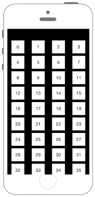

# UICollectionViewのCellをカスタマイズ



```swift fct_label="Swift 5.x/4.x"

//
//  ViewController.swift
//  UIKit054_4.0
//
//  Created by KimikoWatanabe on 2016/08/21.
//  Copyright © 2016年 FaBo, Inc. All rights reserved.
//

import UIKit

class ViewController: UIViewController, UICollectionViewDelegate, UICollectionViewDataSource {
    
    var myCollectionView : UICollectionView!
    
    override func viewDidLoad() {
        super.viewDidLoad()
        
        // CollectionViewのレイアウトを生成.
        let layout = UICollectionViewFlowLayout()
        
        
        // Cell一つ一つの大きさ.
        layout.itemSize = CGSize(width:50, height:50)
        
        // Cellのマージン.
        layout.sectionInset = UIEdgeInsets(top: 16, left: 16, bottom: 32, right: 16)
        
        // セクション毎のヘッダーサイズ.
        layout.headerReferenceSize = CGSize(width:100,height:30)
        
        // CollectionViewを生成.
        myCollectionView = UICollectionView(frame: self.view.frame, collectionViewLayout: layout)
        
        // Cellに使われるクラスを登録.
        myCollectionView.register(CustomUICollectionViewCell.self, forCellWithReuseIdentifier: "MyCell")
        
        myCollectionView.delegate = self
        myCollectionView.dataSource = self
        
        self.view.addSubview(myCollectionView)
        
    }
    
    /*
     Cellが選択された際に呼び出される
     */
    func collectionView(_ collectionView: UICollectionView, didSelectItemAt indexPath: IndexPath) {
        
        print("Num: \(indexPath.row)")
        
    }
    
    /*
     Cellの総数を返す
     */
    func collectionView(_ collectionView: UICollectionView, numberOfItemsInSection section: Int) -> Int {
        return 100
    }
    
    /*
     Cellに値を設定する
     */
    func collectionView(_ collectionView: UICollectionView, cellForItemAt indexPath: IndexPath) -> UICollectionViewCell {
        
        let cell : CustomUICollectionViewCell = collectionView.dequeueReusableCell(withReuseIdentifier: "MyCell", for: indexPath) as! CustomUICollectionViewCell
        cell.textLabel?.text = indexPath.row.description
        
        return cell
    }
    
}
```

```swift fct_label="Swift 3.x"
//
//  ViewController.swift
//  UIKit054_3.0
//
//  Created by KimikoWatanabe on 2016/08/21.
//  Copyright © 2016年 FaBo, Inc. All rights reserved.
//

import UIKit

class ViewController: UIViewController, UICollectionViewDelegate, UICollectionViewDataSource {

    var myCollectionView : UICollectionView!

    override func viewDidLoad() {
        super.viewDidLoad()

        // CollectionViewのレイアウトを生成.
        let layout = UICollectionViewFlowLayout()


        // Cell一つ一つの大きさ.
        layout.itemSize = CGSize(width:50, height:50)

        // Cellのマージン.
        layout.sectionInset = UIEdgeInsetsMake(16, 16, 32, 16)

        // セクション毎のヘッダーサイズ.
        layout.headerReferenceSize = CGSize(width:100,height:30)

        // CollectionViewを生成.
        myCollectionView = UICollectionView(frame: self.view.frame, collectionViewLayout: layout)

        // Cellに使われるクラスを登録.
        myCollectionView.register(CustomUICollectionViewCell.self, forCellWithReuseIdentifier: "MyCell")

        myCollectionView.delegate = self
        myCollectionView.dataSource = self

        self.view.addSubview(myCollectionView)

    }

    /*
     Cellが選択された際に呼び出される
     */
    func collectionView(_ collectionView: UICollectionView, didSelectItemAt indexPath: IndexPath) {

        print("Num: \(indexPath.row)")

    }

    /*
     Cellの総数を返す
     */
    func collectionView(_ collectionView: UICollectionView, numberOfItemsInSection section: Int) -> Int {
        return 100
    }

    /*
     Cellに値を設定する
     */
    func collectionView(_ collectionView: UICollectionView, cellForItemAt indexPath: IndexPath) -> UICollectionViewCell {

        let cell : CustomUICollectionViewCell = collectionView.dequeueReusableCell(withReuseIdentifier: "MyCell", for: indexPath) as! CustomUICollectionViewCell
        cell.textLabel?.text = indexPath.row.description

        return cell
    }

}

```

```swift fct_label="Swift 2.3"
//
//  ViewController.swift
//  UIKit054_2.3
//
//  Created by KimikoWatanabe on 2016/08/21.
//  Copyright © 2016年 FaBo, Inc. All rights reserved.
//


import UIKit

class ViewController: UIViewController, UICollectionViewDelegate, UICollectionViewDataSource {

    var myCollectionView : UICollectionView!

    override func viewDidLoad() {
        super.viewDidLoad()

        // CollectionViewのレイアウトを生成.
        let layout = UICollectionViewFlowLayout()


        // Cell一つ一つの大きさ.
        layout.itemSize = CGSizeMake(50, 50)

        // Cellのマージン.
        layout.sectionInset = UIEdgeInsetsMake(16, 16, 32, 16)

        // セクション毎のヘッダーサイズ.
        layout.headerReferenceSize = CGSizeMake(100,30)

        // CollectionViewを生成.
        myCollectionView = UICollectionView(frame: self.view.frame, collectionViewLayout: layout)

        // Cellに使われるクラスを登録.
        myCollectionView.registerClass(CustomUICollectionViewCell.self, forCellWithReuseIdentifier: "MyCell")

        myCollectionView.delegate = self
        myCollectionView.dataSource = self

        self.view.addSubview(myCollectionView)

    }

    /*
     Cellが選択された際に呼び出される
     */
    func collectionView(collectionView: UICollectionView, didSelectItemAtIndexPath indexPath: NSIndexPath) {

        print("Num: \(indexPath.row)")

    }

    /*
     Cellの総数を返す
     */
    func collectionView(collectionView: UICollectionView, numberOfItemsInSection section: Int) -> Int {
        return 100
    }

    /*
     Cellに値を設定する
     */
    func collectionView(collectionView: UICollectionView, cellForItemAtIndexPath indexPath: NSIndexPath) -> UICollectionViewCell {

        let cell : CustomUICollectionViewCell = collectionView.dequeueReusableCellWithReuseIdentifier("MyCell", forIndexPath: indexPath) as! CustomUICollectionViewCell
        cell.textLabel?.text = indexPath.row.description

        return cell
    }

}

```

### CustomUICollectionViewCell.swift
```swift fct_label="Swift 4.x/Swift 3.x"
//
//  CustomUICollectionViewCell.swift
//  UIKit054_4.0
//
//  Created by KimikoWatanabe on 2016/08/21.
//  Copyright © 2016年 FaBo, Inc. All rights reserved.
//

import UIKit

class CustomUICollectionViewCell : UICollectionViewCell{

    var textLabel : UILabel?

    required init(coder aDecoder: NSCoder) {
        super.init(coder: aDecoder)!
    }

    override init(frame: CGRect) {
        super.init(frame: frame)

        // UILabelを生成.
        textLabel = UILabel(frame: CGRect(x:0, y:0, width:frame.width, height:frame.height))
        textLabel?.text = "nil"
        textLabel?.backgroundColor = UIColor.white
        textLabel?.textAlignment = NSTextAlignment.center

        // Cellに追加.
        self.contentView.addSubview(textLabel!)
    }

}
```

```swift fct_label="Swift 2.3"
//
//  CustomUICollectionViewCell.swift
//  UIKit054_2.3
//
//  Created by KimikoWatanabe on 2016/08/21.
//  Copyright © 2016年 FaBo, Inc. All rights reserved.
//

import UIKit

class CustomUICollectionViewCell : UICollectionViewCell{

    var textLabel : UILabel?

    required init(coder aDecoder: NSCoder) {
        super.init(coder: aDecoder)!
    }

    override init(frame: CGRect) {
        super.init(frame: frame)

        // UILabelを生成.
        textLabel = UILabel(frame: CGRectMake(0, 0, frame.width, frame.height))
        textLabel?.text = "nil"
        textLabel?.backgroundColor = UIColor.whiteColor()
        textLabel?.textAlignment = NSTextAlignment.Center

        // Cellに追加.
        self.contentView.addSubview(textLabel!)
    }

}
```

## 3.xと4.xの差分
* ```UIEdgeInsetsMake(16, 16, 32, 16)``` が ```UIEdgeInsets(top: 16, left: 16, bottom: 32, right: 16)``` に変更

## 2.3と3.0の差分
* UIColorの参照方法が変更(UIColor.grayColor()->UIColor.gray)
* CGRect,CGPointの初期化方法の変更(CGRectMake,CGPointMakeの廃止)
* NSIndexPathの廃止、IndexPathに変更
* UICollectionViewDelegateのメソッドの引数が変更

## Reference
* UICollectionViewFlowLayout Class
 * [https://developer.apple.com/reference/uikit/uicollectionviewflowlayout](https://developer.apple.com/reference/uikit/uicollectionviewflowlayout)
* UICollectionView Class
 * [https://developer.apple.com/reference/uikit/uicollectionview](https://developer.apple.com/reference/uikit/uicollectionview)
* UIEdgeInsetsMake
 * [https://developer.apple.com/reference/uikit/1624475-uiedgeinsetsmake?language=objc](https://developer.apple.com/reference/uikit/1624475-uiedgeinsetsmake?language=objc)
* UICollectionDelegate
 * [https://developer.apple.com/reference/uikit/uicollectionviewdelegate](https://developer.apple.com/reference/uikit/uicollectionviewdelegate)
* UICollectionDataSource
 * [https://developer.apple.com/reference/uikit/uicollectionviewdatasource](https://developer.apple.com/reference/uikit/uicollectionviewdatasource)
* UILabel Class
 * [https://developer.apple.com/reference/uikit/uilabel](https://developer.apple.com/reference/uikit/uilabel)
