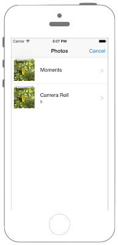

# UIImagePickerControllerでライブラリから画像を選択

 

### AppDelegate.swift

```swift fct_label="Swift 4.x"
//
//  AppDelegate.swift
//  UIKit051_4.0
//
//  Created by KimikoWatanabe on 2016/08/21.
//  Copyright © 2016年 FaBo, Inc. All rights reserved.
//

import UIKit

@UIApplicationMain
class AppDelegate: UIResponder, UIApplicationDelegate {

    var window: UIWindow?
    var myViewController: UIViewController?
    
    func application(_ application: UIApplication, didFinishLaunchingWithOptions launchOptions: [UIApplication.LaunchOptionsKey : Any]? = nil) -> Bool {
        //ViewControllerのインスタンス化
        myViewController = ViewController()
        
        //UINavigationControllerのインスタンス化とrootViewControllerの指定
        let myNavigationController = UINavigationController(rootViewController: myViewController!)
        
        //UIWindowのインスタンス化
        self.window = UIWindow(frame: UIScreen.main.bounds)
        
        //UIWindowのrootViewControllerにnavigationControllerを指定
        self.window?.rootViewController = myNavigationController
        
        //UIWindowの表示
        self.window?.makeKeyAndVisible()
        
        return true

    }
}
```

```swift fct_label="Swift 3.x"
//
//  AppDelegate.swift
//  UIKit056
//
//  Created by Misato Morino on 2016/08/15.
//  Copyright © 2016年 Misato Morino. All rights reserved.
//

import UIKit

@UIApplicationMain
class AppDelegate: UIResponder, UIApplicationDelegate {

    var window: UIWindow?
    var myViewController: UIViewController?
    
    func application(_ application: UIApplication, didFinishLaunchingWithOptions launchOptions: [NSObject: AnyObject]?) -> Bool {
        
        //ViewControllerのインスタンス化
        myViewController = ViewController()
        
        //UINavigationControllerのインスタンス化とrootViewControllerの指定
        let myNavigationController = UINavigationController(rootViewController: myViewController!)
        
        //UIWindowのインスタンス化
        self.window = UIWindow(frame: UIScreen.main.bounds)
        
        //UIWindowのrootViewControllerにnavigationControllerを指定
        self.window?.rootViewController = myNavigationController
        
        //UIWindowの表示
        self.window?.makeKeyAndVisible()
        
        return true
    }
} 
```

```swift fct_label="Swift 2.3"
//
//  AppDelegate.swift
//  UIKit056
//
//  Created by Misato Morino on 2016/08/15.
//  Copyright © 2016年 Misato Morino. All rights reserved.
//

import UIKit

@UIApplicationMain
class AppDelegate: UIResponder, UIApplicationDelegate {

    var window: UIWindow?
    var myViewController: UIViewController?

    func application(application: UIApplication, didFinishLaunchingWithOptions launchOptions: [NSObject: AnyObject]?) -> Bool {
        
        //ViewControllerのインスタンス化
        myViewController = ViewController()
        
        //UINavigationControllerのインスタンス化とrootViewControllerの指定
        let myNavigationController = UINavigationController(rootViewController: myViewController!)
        
        //UIWindowのインスタンス化
        self.window = UIWindow(frame: UIScreen.mainScreen().bounds)
        
        //UIWindowのrootViewControllerにnavigationControllerを指定
        self.window?.rootViewController = myNavigationController
        
        //UIWindowの表示
        self.window?.makeKeyAndVisible()
        
        return true
    } 
} 
```

### ViewController.swift
```swift fct_label="Swift 4.x"
//
//  ViewController.swift
//  UIKit056
//
//  Created by Misato Morino on 2016/08/15.
//  Copyright © 2016年 Misato Morino. All rights reserved.
//

import UIKit

class ViewController: UIViewController, UINavigationControllerDelegate, UIImagePickerControllerDelegate {
    
    var myImagePicker: UIImagePickerController!
    var myImageView: UIImageView!
    
    override func viewDidLoad() {
        super.viewDidLoad()
        
        self.title = "Select a Image"
        
        myImageView = UIImageView(frame: self.view.bounds)
        
        // インスタンス生成
        myImagePicker = UIImagePickerController()
        
        // デリゲート設定
        myImagePicker.delegate = self
        
        // 画像の取得先はフォトライブラリ
        myImagePicker.sourceType = UIImagePickerController.SourceType.photoLibrary
        
        // 画像取得後の編集を不可に
        myImagePicker.allowsEditing = false
    }
    
    override func viewDidAppear(_ animated: Bool) {
        self.present(myImagePicker, animated: true, completion: nil)
        
    }
    
    /**
     画像が選択された時に呼ばれる.
     */
    func imagePickerController(_ picker: UIImagePickerController, didFinishPickingMediaWithInfo info: [UIImagePickerController.InfoKey : Any]) {
        
        //選択された画像を取得.
        let myImage: AnyObject?  = info[UIImagePickerController.InfoKey.originalImage] as AnyObject
        
        //選択された画像を表示するViewControllerを生成.
        let secondViewController = SecondViewController()
        
        //選択された画像を表示するViewContorllerにセットする.
        secondViewController.mySelectedImage = myImage as? UIImage
        
        myImagePicker.pushViewController(secondViewController, animated: true)

    }
    
    /**
     画像選択がキャンセルされた時に呼ばれる.
     */
    func imagePickerControllerDidCancel(_ picker: UIImagePickerController) {
        
        // モーダルビューを閉じる
        self.dismiss(animated: true, completion: nil)
    }
    
}
```

```swift fct_label="Swift 3.x"
//
//  ViewController.swift
//  UIKit056
//
//  Created by Misato Morino on 2016/08/15.
//  Copyright © 2016年 Misato Morino. All rights reserved.
//

import UIKit

class ViewController: UIViewController, UINavigationControllerDelegate, UIImagePickerControllerDelegate {
    
    var myImagePicker: UIImagePickerController!
    var myImageView: UIImageView!
    
    override func viewDidLoad() {
        super.viewDidLoad()
        
        self.title = "Select a Image"
        
        myImageView = UIImageView(frame: self.view.bounds)
        
        // インスタンス生成
        myImagePicker = UIImagePickerController()
        
        // デリゲート設定
        myImagePicker.delegate = self
        
        // 画像の取得先はフォトライブラリ
        myImagePicker.sourceType = UIImagePickerControllerSourceType.photoLibrary
        
        // 画像取得後の編集を不可に
        myImagePicker.allowsEditing = false
    }
    
    override func viewDidAppear(_ animated: Bool) {
        self.present(myImagePicker, animated: true, completion: nil)
        
    }
    
    /**
     画像が選択された時に呼ばれる.
     */
    func imagePickerController(_ picker: UIImagePickerController, didFinishPickingMediaWithInfo info: [String : AnyObject]) {
        
        //選択された画像を取得.
        let myImage: AnyObject?  = info[UIImagePickerControllerOriginalImage]
        
        //選択された画像を表示するViewControllerを生成.
        let secondViewController = SecondViewController()
        
        //選択された画像を表示するViewContorllerにセットする.
        secondViewController.mySelectedImage = myImage as! UIImage
        
        myImagePicker.pushViewController(secondViewController, animated: true)
        
    }
    
    /**
     画像選択がキャンセルされた時に呼ばれる.
     */
    func imagePickerControllerDidCancel(_ picker: UIImagePickerController) {
        
        // モーダルビューを閉じる
        self.dismiss(animated: true, completion: nil)
    }
    
} 
```

```swift fct_label="Swift 2.3"
//
//  ViewController.swift
//  UIKit056
//
//  Created by Misato Morino on 2016/08/15.
//  Copyright © 2016年 Misato Morino. All rights reserved.
//

import UIKit

class ViewController: UIViewController, UINavigationControllerDelegate, UIImagePickerControllerDelegate {
    
    var myImagePicker: UIImagePickerController!
    var myImageView: UIImageView!
    
    override func viewDidLoad() {
        super.viewDidLoad()
        
        self.title = "Select a Image"
        
        myImageView = UIImageView(frame: self.view.bounds)
        
        // インスタンス生成
        myImagePicker = UIImagePickerController()
        
        // デリゲート設定
        myImagePicker.delegate = self
        
        // 画像の取得先はフォトライブラリ
        myImagePicker.sourceType = UIImagePickerControllerSourceType.PhotoLibrary
        
        // 画像取得後の編集を不可に
        myImagePicker.allowsEditing = false
    }
    
    override func viewDidAppear(animated: Bool) {
        self.presentViewController(myImagePicker, animated: true, completion: nil)
        
    }
    
    /**
     画像が選択された時に呼ばれる.
     */
    func imagePickerController(picker: UIImagePickerController, didFinishPickingMediaWithInfo info: [String : AnyObject]) {
        
        //選択された画像を取得.
        let myImage: AnyObject?  = info[UIImagePickerControllerOriginalImage]
        
        //選択された画像を表示するViewControllerを生成.
        let secondViewController = SecondViewController()
        
        //選択された画像を表示するViewContorllerにセットする.
        secondViewController.mySelectedImage = myImage as! UIImage
        
        myImagePicker.pushViewController(secondViewController, animated: true)
        
    }
    
    /**
     画像選択がキャンセルされた時に呼ばれる.
     */
    func imagePickerControllerDidCancel(picker: UIImagePickerController) {
        
        // モーダルビューを閉じる
        self.dismissViewControllerAnimated(true, completion: nil)
    }
    
}
```

### SecondViewController
```swift fct_label="Swift 4.x"
//
//  SecondViewController.swift
//  UIKit056
//
//  Created by Misato Morino on 2016/08/22.
//  Copyright © 2016年 Misato Morino. All rights reserved.
//

import Foundation
import UIKit

class SecondViewController: UIViewController {
    
    var mySelectedImage: UIImage!
    var mySelectedImageView: UIImageView!
    
    override func viewDidLoad() {
        
        self.edgesForExtendedLayout = []
        self.view.backgroundColor = UIColor.white
        
        setImage()
    }
    
    /**
     選択された画像をUIImageViewにセットする.
     */
    func setImage(){
        self.title = "Selected Image"
        
        mySelectedImageView = UIImageView(frame: self.view.bounds)
        mySelectedImageView.contentMode = UIView.ContentMode.scaleAspectFit
        mySelectedImageView.image = mySelectedImage
        self.view.addSubview(mySelectedImageView)
    }
    
}
```

```swift fct_label="Swift 3.x"
//
//  SecondViewController.swift
//  UIKit056
//
//  Created by Misato Morino on 2016/08/22.
//  Copyright © 2016年 Misato Morino. All rights reserved.
//

import Foundation
import UIKit

class SecondViewController: UIViewController {
    
    var mySelectedImage: UIImage!
    var mySelectedImageView: UIImageView!
    
    override func viewDidLoad() {
        
        self.edgesForExtendedLayout = []
        self.view.backgroundColor = UIColor.white
        
        setImage()
    }
    
    /**
     選択された画像をUIImageViewにセットする.
     */
    func setImage(){
        self.title = "Selected Image"
        
        mySelectedImageView = UIImageView(frame: self.view.bounds)
        mySelectedImageView.contentMode = UIViewContentMode.scaleAspectFit
        mySelectedImageView.image = mySelectedImage
        self.view.addSubview(mySelectedImageView)
    }
    
} 
```

```swift fct_label="Swift 2.3"
//
//  SecondViewController.swift
//  UIKit056
//
//  Created by Misato Morino on 2016/08/22.
//  Copyright © 2016年 Misato Morino. All rights reserved.
//

import Foundation
import UIKit

class SecondViewController: UIViewController {
    
    var mySelectedImage: UIImage!
    var mySelectedImageView: UIImageView!
    
    override func viewDidLoad() {
        
        self.edgesForExtendedLayout = UIRectEdge.None
        self.view.backgroundColor = UIColor.whiteColor()
        
        setImage()
    }
    
    /**
     選択された画像をUIImageViewにセットする.
     */
    func setImage(){
        self.title = "Selected Image"
        
        mySelectedImageView = UIImageView(frame: self.view.bounds)
        mySelectedImageView.contentMode = UIViewContentMode.ScaleAspectFit
        mySelectedImageView.image = mySelectedImage
        self.view.addSubview(mySelectedImageView)
    }
    
}
``` 

### Info,plist
```swift
<key>NSPhotoLibraryUsageDescription</key>
<string>YES</string>
<key>NSAppleMusicUsageDescription</key>
<string>YES</string>
```

Info.plistに上記を追加（2.3には必要ない）

## 3.xと4.xの差分
* ```func application(_ application: UIApplication, didFinishLaunchingWithOptions launchOptions: [NSObject: AnyObject]?) -> Bool```が、```func application(_ application: UIApplication, didFinishLaunchingWithOptions launchOptions: [UIApplication.LaunchOptionsKey : Any]? = nil) -> Bool ```に変更
* ```UIImagePickerControllerSourceType```が```UIImagePickerController.SourceType```に変更
* ```func imagePickerController(_ picker: UIImagePickerController, didFinishPickingMediaWithInfo info: [String : AnyObject])```が```func imagePickerController(_ picker: UIImagePickerController, didFinishPickingMediaWithInfo info: [UIImagePickerController.InfoKey : Any])```に変更
* ```info[UIImagePickerControllerOriginalImage]```が```info[UIImagePickerController.InfoKey.originalImage] as AnyObject```に変更
* ```myImage as! UIImage```が```myImage as? UIImage```に変更
* ```UIViewContentMode```が```UIView.ContentMode```に変更

## 2.3と3.0の差分

* ```func imagePickerController(_ picker: UIImagePickerController, didFinishPickingMediaWithInfo info: [String : AnyObject]) ``` から ```func imagePickerController(_ picker: UIImagePickerController, didFinishPickingMediaWithInfo info: [String : AnyObject]) ``` に変更
* ```func imagePickerControllerDidCancel(picker: UIImagePickerController)``` から ```func imagePickerControllerDidCancel(_ picker: UIImagePickerController)``` に変更
* ```presentViewController``` から ```present``` に変更
* ```dismissViewControllerAnimated``` から ```dismiss``` に変更

## Reference

* UIImagePickerController
    * [https://developer.apple.com/reference/uikit/uiimagepickercontroller](https://developer.apple.com/reference/uikit/uiimagepickercontroller)
