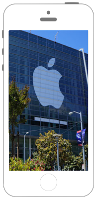
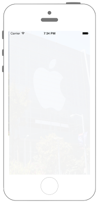

# UIImageで画像の透過

 

## Swift3.0
```swift
//
//  ViewController.swift
//  UIKit057
//
//  Created by Misato Morino on 2016/08/15.
//  Copyright © 2016年 Misato Morino. All rights reserved.
//

import UIKit

extension UIImage{
    
    // Resizeのクラスメソッドを作る.
    class func ResizeÜIImage(image : UIImage,width : CGFloat, height : CGFloat)-> UIImage!{
        
        // 指定された画像の大きさのコンテキストを用意.
        UIGraphicsBeginImageContext(CGSize(width: width, height: height))
        
        // コンテキストに画像を描画する.
        image.draw(in: CGRect(x: 0, y: 0, width: width, height: height))
        
        // コンテキストからUIImageを作る.
        let newImage = UIGraphicsGetImageFromCurrentImageContext()
        
        // コンテキストを閉じる.
        UIGraphicsEndImageContext()
        
        return newImage
    }
}

class ViewController: UIViewController {
    
    override func viewDidLoad() {
        super.viewDidLoad()
        
        // 画像の設定.
        let myImage:UIImage = UIImage(named:"sample1")!
        
        // リサイズされたUIImageを指定して、UIImageViewを作る.
        let myImageView = UIImageView(image: UIImage.ResizeÜIImage(image: myImage, width: self.view.frame.maxX, height: self.view.frame.maxY))
        
        // 透過する.
        myImageView.alpha = 0.05
        
        // viewにUIImageViewを追加.
        self.view.addSubview(myImageView)
    }
}
```

## Swift 2.3
```swift
//
//  ViewController.swift
//  UIKit057
//
//  Created by Misato Morino on 2016/08/15.
//  Copyright © 2016年 Misato Morino. All rights reserved.
//

import UIKit

extension UIImage{
    
    // Resizeのクラスメソッドを作る.
    class func ResizeÜIImage(image : UIImage,width : CGFloat, height : CGFloat)-> UIImage!{
        
        // 指定された画像の大きさのコンテキストを用意.
        UIGraphicsBeginImageContext(CGSizeMake(width, height))
        
        // コンテキストに画像を描画する.
        image.drawInRect(CGRectMake(0, 0, width, height))
        
        // コンテキストからUIImageを作る.
        let newImage = UIGraphicsGetImageFromCurrentImageContext()
        
        // コンテキストを閉じる.
        UIGraphicsEndImageContext()
        
        return newImage
    }
}

class ViewController: UIViewController {
    
    override func viewDidLoad() {
        super.viewDidLoad()
        
        // 画像の設定.
        let myImage:UIImage = UIImage(named:"sample1")!
        
        // リサイズされたUIImageを指定して、UIImageViewを作る.
        let myImageView = UIImageView(image: UIImage.ResizeÜIImage(myImage, width: self.view.frame.maxX, height: self.view.frame.maxY))
        
        // 透過する.
        myImageView.alpha = 0.05
        
        // viewにUIImageViewを追加.
        self.view.addSubview(myImageView)
    }
}
```

## 2.3と3.0の差分

* ```CGSizeMake```、```CGRectMake``` が廃止

## Reference

* UIImage
    * [https://developer.apple.com/reference/uikit/uiimage](https://developer.apple.com/reference/uikit/uiimage)
