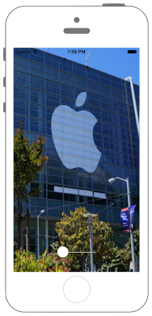
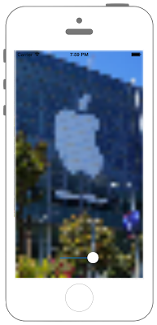

# UIImageをぼかす

 

```swift fct_label="Swift 4.x"

//
//  ViewController.swift
//  swiftdocs
//
//  Created by Misato Morino on 2016/08/15.
//  Copyright © 2016年 Misato Morino. All rights reserved.
//

import UIKit

extension UIImage{
    
    // 画像をResizeするクラスメソッド.
    class func ResizeÜIImage(image : UIImage, width : CGFloat, height : CGFloat)-> UIImage!{
        
        // 指定された画像の大きさのコンテキストを用意.
        UIGraphicsBeginImageContext(CGSize(width: width, height: height))
        
        // コンテキストに画像を描画する.
        image.draw(in: CGRect(x: 0, y: 0, width: width, height: height))
        
        // コンテキストからUIImageを作る.
        let newImage = UIGraphicsGetImageFromCurrentImageContext()
        
        // コンテキストを閉じる.
        UIGraphicsEndImageContext()
        
        return newImage
    }
}

class ViewController: UIViewController {
    
    var myImageView : UIImageView?
    
    override func viewDidLoad() {
        
        // ラスタライズ化の初期化値.
        let initRasterizeValue : CGFloat = 1.0
        
        // スライダーを用意.
        let rasterizeSlider = UISlider()
        rasterizeSlider.layer.position = CGPoint(x: self.view.frame.midX, y: self.view.frame.maxY - 50)
        rasterizeSlider.layer.zPosition = 1
        rasterizeSlider.minimumValue = 0.1
        rasterizeSlider.maximumValue = 1.0
        rasterizeSlider.value = Float(1.0 - initRasterizeValue)
        rasterizeSlider.addTarget(self, action: #selector(ViewController.onValueChanged(slider:)), for: UIControl.Event.valueChanged)
        self.view.addSubview(rasterizeSlider)
        
        // UIImageを作る.
        let myImage = UIImage(named: "temple.jpg")!
        
        // リサイズされたUIImageを指定して、UIImageViewを作る.
        myImageView = UIImageView(image: UIImage.ResizeÜIImage(image: myImage, width: self.view.frame.maxX, height: self.view.frame.maxY))
        
        if myImageView != nil {
            
            // ラスタライズ化する.
            myImageView!.layer.shouldRasterize = true
            
            // 値の初期化.
            myImageView!.layer.rasterizationScale = initRasterizeValue
            
            self.view.addSubview(myImageView!)
        }
    }
    
    /*
     Sliderの値が変わった時に呼ばれるメソッド.
     */
    @objc func onValueChanged(slider : UISlider){
        
        if myImageView != nil {
            
            // ラスタライズ化する.
            myImageView!.layer.rasterizationScale = CGFloat(1.1 - slider.value)
        }
    }
}
```

```swift fct_label="Swift3.x"
//
//  ViewController.swift
//  swiftdocs
//
//  Created by Misato Morino on 2016/08/15.
//  Copyright © 2016年 Misato Morino. All rights reserved.
//

import UIKit

extension UIImage{
    
    // 画像をResizeするクラスメソッド.
    class func ResizeÜIImage(image : UIImage, width : CGFloat, height : CGFloat)-> UIImage!{
        
        // 指定された画像の大きさのコンテキストを用意.
        UIGraphicsBeginImageContext(CGSize(width: width, height: height))
        
        // コンテキストに画像を描画する.
        image.draw(in: CGRect(x: 0, y: 0, width: width, height: height))
        
        // コンテキストからUIImageを作る.
        let newImage = UIGraphicsGetImageFromCurrentImageContext()
        
        // コンテキストを閉じる.
        UIGraphicsEndImageContext()
        
        return newImage
    }
}

class ViewController: UIViewController {
    
    var myImageView : UIImageView?
    
    override func viewDidLoad() {
        
        // ラスタライズ化の初期化値.
        let initRasterizeValue : CGFloat = 1.0
        
        // スライダーを用意.
        let rasterizeSlider = UISlider()
        rasterizeSlider.layer.position = CGPoint(x: self.view.frame.midX, y: self.view.frame.maxY - 50)
        rasterizeSlider.layer.zPosition = 1
        rasterizeSlider.minimumValue = 0.1
        rasterizeSlider.maximumValue = 1.0
        rasterizeSlider.value = Float(1.0 - initRasterizeValue)
        rasterizeSlider.addTarget(self, action: #selector(ViewController.onValueChanged(slider:)), for: UIControlEvents.valueChanged)
        self.view.addSubview(rasterizeSlider)
        
        // UIImageを作る.
        let myImage = UIImage(named: "sample2")!
        
        // リサイズされたUIImageを指定して、UIImageViewを作る.
        myImageView = UIImageView(image: UIImage.ResizeÜIImage(image: myImage, width: self.view.frame.maxX, height: self.view.frame.maxY))
        
        if myImageView != nil {
            
            // ラスタライズ化する.
            myImageView!.layer.shouldRasterize = true
            
            // 値の初期化.
            myImageView!.layer.rasterizationScale = initRasterizeValue
            
            self.view.addSubview(myImageView!)
        }
    }
    
    /*
     Sliderの値が変わった時に呼ばれるメソッド.
     */
    func onValueChanged(slider : UISlider){
        
        if myImageView != nil {
            
            // ラスタライズ化する.
            myImageView!.layer.rasterizationScale = CGFloat(1.1 - slider.value)
        }
    }
} 
```

```swift fct_label="Swift 2.3"
//
//  ViewController.swift
//  UIKit058
//
//  Created by Misato Morino on 2016/08/15.
//  Copyright © 2016年 Misato Morino. All rights reserved.
//

import UIKit

extension UIImage{
    
    // 画像をResizeするクラスメソッド.
    class func ResizeÜIImage(image : UIImage, width : CGFloat, height : CGFloat)-> UIImage!{
        
        // 指定された画像の大きさのコンテキストを用意.
        UIGraphicsBeginImageContext(CGSizeMake(width, height))
        
        // コンテキストに画像を描画する.
        image.drawInRect(CGRectMake(0, 0, width, height))
        
        // コンテキストからUIImageを作る.
        let newImage = UIGraphicsGetImageFromCurrentImageContext()
        
        // コンテキストを閉じる.
        UIGraphicsEndImageContext()
        
        return newImage
    }
}

class ViewController: UIViewController {
    
    var myImageView : UIImageView?
    
    override func viewDidLoad() {
        
        // ラスタライズ化の初期化値.
        let initRasterizeValue : CGFloat = 1.0
        
        // スライダーを用意.
        let rasterizeSlider = UISlider()
        rasterizeSlider.layer.position = CGPointMake(self.view.frame.midX, self.view.frame.maxY - 50)
        rasterizeSlider.layer.zPosition = 1
        rasterizeSlider.minimumValue = 0.1
        rasterizeSlider.maximumValue = 1.0
        rasterizeSlider.value = Float(1.0 - initRasterizeValue)
        rasterizeSlider.addTarget(self, action: #selector(ViewController.onValueChanged(_:)), forControlEvents: UIControlEvents.ValueChanged)
        self.view.addSubview(rasterizeSlider)
        
        // UIImageを作る.
        let myImage = UIImage(named: "sample2")!
        
        // リサイズされたUIImageを指定して、UIImageViewを作る.
        myImageView = UIImageView(image: UIImage.ResizeÜIImage(myImage, width: self.view.frame.maxX, height: self.view.frame.maxY))
        
        if myImageView != nil {
            
            // ラスタライズ化する.
            myImageView!.layer.shouldRasterize = true
            
            // 値の初期化.
            myImageView!.layer.rasterizationScale = initRasterizeValue
            
            self.view.addSubview(myImageView!)
        }
    }
    
    /*
     Sliderの値が変わった時に呼ばれるメソッド.
     */
    func onValueChanged(slider : UISlider){
        
        if myImageView != nil {
            
            // ラスタライズ化する.
            myImageView!.layer.rasterizationScale = CGFloat(1.1 - slider.value)
        }
    }
}
```

## 3.xと4.xの差分
* ```func onValueChanged(slider : UISlider)```に```@objc```を追加
* ```UIControlEvents.valueChanged```が```UIControl.Event.valueChanged```に変更

## 2.3と3.0の差分

* ```CGSizeMake```、```CGRectMake```、```CGPointMake``` が廃止

## Reference

* UIImage
    * [https://developer.apple.com/reference/uikit/uiimage](https://developer.apple.com/reference/uikit/uiimage)
