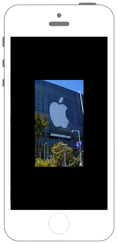

# UIImageをリサイズする

 

```swift fct_label="Swift 5.x/4.x/3.x"
//
//  ViewController.swift
//  UIKit059
//
//  Created by Misato Morino on 2016/08/15.
//  Copyright © 2016年 Misato Morino. All rights reserved.
//

import UIKit

extension UIImage{
    
    // Resizeするクラスメソッド.
    func ResizeÜIImage(width : CGFloat, height : CGFloat)-> UIImage!{
        
        // 指定された画像の大きさのコンテキストを用意.
        UIGraphicsBeginImageContext(CGSize(width: width, height: height))
        
        // コンテキストに自身に設定された画像を描画する.
        self.draw(in: CGRect(x: 0, y: 0, width: width, height: height))
        
        // コンテキストからUIImageを作る.
        let newImage = UIGraphicsGetImageFromCurrentImageContext()
        
        // コンテキストを閉じる.
        UIGraphicsEndImageContext()
        
        return newImage
    }
    
}

class ViewController: UIViewController {
    
    override func viewDidLoad() {
        
        // 背景を黒色に設定.
        self.view.backgroundColor = UIColor.black
        
        // リサイズ対象のUIImageを用意.
        let myImage = UIImage(named: "sample1.png")!
        
        // リサイズ後のUIImageを用意.
        let resize = myImage.ResizeÜIImage(width: self.view.frame.midX, height: self.view.frame.midY)
        
        // UIImageViewにリサイズ後のUIImageを設定.
        let myImageView = UIImageView(image: resize)
        
        myImageView.layer.position = CGPoint(x: self.view.frame.midX, y: self.view.frame.midY)
        
        self.view.addSubview(myImageView)
    }
    
}
``` 

```swift fct_label="Swift 2.3"
//
//  ViewController.swift
//  UIKit059
//
//  Created by Misato Morino on 2016/08/15.
//  Copyright © 2016年 Misato Morino. All rights reserved.
//

import UIKit

extension UIImage{
    
    // Resizeするクラスメソッド.
    func ResizeÜIImage(width : CGFloat, height : CGFloat)-> UIImage!{
        
        // 指定された画像の大きさのコンテキストを用意.
        UIGraphicsBeginImageContext(CGSizeMake(width, height))
        
        // コンテキストに自身に設定された画像を描画する.
        self.drawInRect(CGRectMake(0, 0, width, height))
        
        // コンテキストからUIImageを作る.
        let newImage = UIGraphicsGetImageFromCurrentImageContext()
        
        // コンテキストを閉じる.
        UIGraphicsEndImageContext()
        
        return newImage
    }
    
}

class ViewController: UIViewController {
    
    override func viewDidLoad() {
        
        // 背景を黒色に設定.
        self.view.backgroundColor = UIColor.blackColor()
        
        // リサイズ対象のUIImageを用意.
        let myImage = UIImage(named: "sample1.png")!
        
        // リサイズ後のUIImageを用意.
        let resize = myImage.ResizeÜIImage(self.view.frame.midX, height: self.view.frame.midY)
        
        // UIImageViewにリサイズ後のUIImageを設定.
        let myImageView = UIImageView(image: resize)
        
        myImageView.layer.position = CGPointMake(self.view.frame.midX, self.view.frame.midY)
        
        self.view.addSubview(myImageView)
    }
    
}
``` 

## 2.3と3.0の差分

* CGRectMakeが廃止
* ```drawInRect()``` ではなく ```draw(in:)``` を使う

## Reference

* UIImage
    * [https://developer.apple.com/reference/uiimage/uiimage](https://developer.apple.com/reference/uikit/uiimage)
