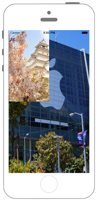

# UIImageを合成する

  

```swift fct_label="Swift 5.x/4.x/3.x"
//
//  ViewController.swift
//  UIKit060
//
//  Created by Misato Morino on 2016/08/15.
//  Copyright © 2016年 Misato Morino. All rights reserved.
//

import UIKit

extension UIImage {
    
    /*
     画像をResizeするクラスメソッド.
     */
    class func ResizeÜIImage(image : UIImage,width : CGFloat, height : CGFloat)-> UIImage!{
        
        // 指定された画像の大きさのコンテキストを用意.
        UIGraphicsBeginImageContext(CGSize(width: width, height: height))
        
        // コンテキストに画像を描画する.
        image.draw(in: CGRect(x: 0, y: 0, width: width, height: height))
        
        // コンテキストからUIImageを作る.
        let newImage = UIGraphicsGetImageFromCurrentImageContext()
        
        // コンテキストを閉じる.
        UIGraphicsEndImageContext()
        
        return newImage
    }
    
    /*
     画像を合成するクラスメソッド.
     */
    class func ComposeUIImage(UIImageArray : [UIImage], width: CGFloat, height : CGFloat)->UIImage!{
        
        // 指定された画像の大きさのコンテキストを用意.
        UIGraphicsBeginImageContext(CGSize(width: width, height: height))
        
        // UIImageのある分回す.
        for image : UIImage in UIImageArray {
            
            // コンテキストに画像を描画する.
            image.draw(in: CGRect(x: 0, y: 0, width: image.size.width, height: image.size.height))
        }
        
        // コンテキストからUIImageを作る.
        let newImage = UIGraphicsGetImageFromCurrentImageContext()
        
        // コンテキストを閉じる.
        UIGraphicsEndImageContext()
        
        return newImage
    }
}

class ViewController: UIViewController {
    
    override func viewDidLoad() {
        
        // 1つ目のUIImageを作る.
        var myImage1 = UIImage(named: "sample1")!
        
        // リサイズする.
        myImage1 = UIImage.ResizeÜIImage(image: myImage1,width: self.view.frame.maxX, height: self.view.frame.maxY)
        
        // 2つ目のUIImageを作る.
        var myImage2 = UIImage(named: "sample2")!
        
        // リサイズする.
        myImage2 = UIImage.ResizeÜIImage(image: myImage2,width: self.view.frame.midX, height: self.view.frame.midY)
        
        // 画像を合成する.
        let ComposedImage = UIImage.ComposeUIImage(UIImageArray: [myImage1, myImage2], width: self.view.frame.maxX, height: self.view.frame.maxY)
        
        // UIImageViewに合成されたUIImageを指定する.
        let myImageView = UIImageView(image: ComposedImage)
        
        self.view.addSubview(myImageView)
    }
}

``` 

```swift fct_label="Swift 2.3"
//
//  ViewController.swift
//  UIKit060
//
//  Created by Misato Morino on 2016/08/15.
//  Copyright © 2016年 Misato Morino. All rights reserved.
//

import UIKit

extension UIImage{
    
    /*
     画像をResizeするクラスメソッド.
     */
    class func ResizeÜIImage(image : UIImage,width : CGFloat, height : CGFloat)-> UIImage!{
        
        // 指定された画像の大きさのコンテキストを用意.
        UIGraphicsBeginImageContext(CGSizeMake(width, height))
        
        // コンテキストに画像を描画する.
        image.drawInRect(CGRectMake(0, 0, width, height))
        
        // コンテキストからUIImageを作る.
        let newImage = UIGraphicsGetImageFromCurrentImageContext()
        
        // コンテキストを閉じる.
        UIGraphicsEndImageContext()
        
        return newImage
    }
    
    /*
     画像を合成するクラスメソッド.
     */
    class func ComposeUIImage(UIImageArray : [UIImage], width: CGFloat, height : CGFloat)->UIImage!{
        
        // 指定された画像の大きさのコンテキストを用意.
        UIGraphicsBeginImageContext(CGSizeMake(width, height))
        
        // UIImageのある分回す.
        for image : UIImage in UIImageArray {
            
            // コンテキストに画像を描画する.
            image.drawInRect(CGRectMake(0, 0, image.size.width, image.size.height))
        }
        
        // コンテキストからUIImageを作る.
        let newImage = UIGraphicsGetImageFromCurrentImageContext()
        
        // コンテキストを閉じる.
        UIGraphicsEndImageContext()
        
        return newImage
    }
}

class ViewController: UIViewController {
    
    override func viewDidLoad() {
        
        // 1つ目のUIImageを作る.
        var myImage1 = UIImage(named: "sample1")!
        
        // リサイズする.
        myImage1 = UIImage.ResizeÜIImage(myImage1,width: self.view.frame.maxX, height: self.view.frame.maxY)
        
        // 2つ目のUIImageを作る.
        var myImage2 = UIImage(named: "sample2")!
        
        // リサイズする.
        myImage2 = UIImage.ResizeÜIImage(myImage2,width: self.view.frame.midX, height: self.view.frame.midY)
        
        // 画像を合成する.
        let ComposedImage = UIImage.ComposeUIImage([myImage1, myImage2], width: self.view.frame.maxX, height: self.view.frame.maxY)
        
        // UIImageViewに合成されたUIImageを指定する.
        let myImageView = UIImageView(image: ComposedImage)
        
        self.view.addSubview(myImageView)
    }
}
``` 

## 2.3と3.0の差分

* CGRectMakeが廃止
* ```drawInRect()``` ではなく ```draw(in:)``` を使う

## Reference

* UIImage
    * [https://developer.apple.com/reference/uiimage/uiimage](https://developer.apple.com/reference/uikit/uiimage)
