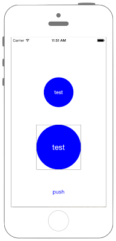

# UIViewからUIImageを取得する（スクリーンショット）



```swift fct_label="Swift 4.x"
//
//  ViewController.swift
//  UIKit061
//
//  Created by Misato Morino on 2016/08/15.
//  Copyright © 2016年 Misato Morino. All rights reserved.
//

import UIKit

extension UIView {
    
    func GetImage() -> UIImage{
        
        // キャプチャする範囲を取得.
        let rect = self.bounds
        
        // ビットマップ画像のcontextを作成.
        UIGraphicsBeginImageContextWithOptions(rect.size, false, 0.0)
        let context: CGContext = UIGraphicsGetCurrentContext()!
        
        // 対象のview内の描画をcontextに複写する.
        self.layer.render(in: context)
        
        // 現在のcontextのビットマップをUIImageとして取得.
        let capturedImage : UIImage = UIGraphicsGetImageFromCurrentImageContext()!
        
        // contextを閉じる.
        UIGraphicsEndImageContext()
        
        return capturedImage
    }
}

class ViewController: UIViewController {
    
    var myLabel: UILabel!
    var myImageView: UIImageView!
    
    override func viewDidLoad() {
        
        // Labelを生成.
        myLabel = UILabel(frame: CGRect(x: 0, y: 0, width: 100, height: 100))
        myLabel.text = "test"
        myLabel.textColor = UIColor.white
        myLabel.layer.cornerRadius = 50.0
        myLabel.layer.masksToBounds = true
        myLabel.backgroundColor = UIColor.blue
        myLabel.textAlignment = NSTextAlignment.center
        myLabel.layer.position = CGPoint(x: self.view.frame.width/2, y: self.view.frame.height/2 - 100)
        
        // ImageViewを生成.
        myImageView = UIImageView(frame: CGRect(x: 0, y: 0, width: 150, height: 150))
        myImageView.layer.borderColor = UIColor.black.cgColor
        myImageView.layer.position = CGPoint(x: self.view.frame.width/2, y: self.view.frame.height - 200)
        myImageView.layer.borderWidth = 0.5
        
        // Buttonを生成.
        let myButton = UIButton(frame: CGRect(x: 0, y: 0, width: 50, height: 20))
        myButton.setTitle("push", for: UIControl.State.normal)
        myButton.setTitleColor(UIColor.blue, for: UIControl.State.normal)
        myButton.addTarget(self, action: #selector(ViewController.onClickMyButton(sender:)), for: UIControl.Event.touchUpInside)
        myButton.layer.position = CGPoint(x: self.view.frame.width/2, y: self.view.frame.height - 50)
        
        // viewにそれぞれを追加.
        self.view.addSubview(myLabel)
        self.view.addSubview(myImageView)
        self.view.addSubview(myButton)
    }
    
    /*
     Buttonが押された時に呼ばれるメソッド.
     */
    @objc func onClickMyButton(sender: UIButton) {
        // キャプチャ画像を取得.
        let myImage = myLabel.GetImage() as UIImage
        
        // ImageViewのimageにセット.
        myImageView.image = myImage
        
        // 縦横比率を保ちつつ画像をUIImageViewの大きさに合わせる.
        myImageView.contentMode = UIView.ContentMode.scaleAspectFit
    }
}
```

```swift fct_label="Swift3.x"
//
//  ViewController.swift
//  UIKit061
//
//  Created by Misato Morino on 2016/08/15.
//  Copyright © 2016年 Misato Morino. All rights reserved.
//

import UIKit

extension UIView {
    
    func GetImage() -> UIImage{
        
        // キャプチャする範囲を取得.
        let rect = self.bounds
        
        // ビットマップ画像のcontextを作成.
        UIGraphicsBeginImageContextWithOptions(rect.size, false, 0.0)
        let context: CGContext = UIGraphicsGetCurrentContext()!
        
        // 対象のview内の描画をcontextに複写する.
        self.layer.render(in: context)
        
        // 現在のcontextのビットマップをUIImageとして取得.
        let capturedImage : UIImage = UIGraphicsGetImageFromCurrentImageContext()!
        
        // contextを閉じる.
        UIGraphicsEndImageContext()
        
        return capturedImage
    }
}

class ViewController: UIViewController {
    
    var myLabel: UILabel!
    var myImageView: UIImageView!
    
    override func viewDidLoad() {
        
        // Labelを生成.
        myLabel = UILabel(frame: CGRect(x: 0, y: 0, width: 100, height: 100))
        myLabel.text = "test"
        myLabel.textColor = UIColor.white
        myLabel.layer.cornerRadius = 50.0
        myLabel.layer.masksToBounds = true
        myLabel.backgroundColor = UIColor.blue
        myLabel.textAlignment = NSTextAlignment.center
        myLabel.layer.position = CGPoint(x: self.view.frame.width/2, y: self.view.frame.height/2 - 100)
        
        // ImageViewを生成.
        myImageView = UIImageView(frame: CGRect(x: 0, y: 0, width: 150, height: 150))
        myImageView.layer.borderColor = UIColor.black.cgColor
        myImageView.layer.position = CGPoint(x: self.view.frame.width/2, y: self.view.frame.height - 200)
        myImageView.layer.borderWidth = 0.5
        
        // Buttonを生成.
        let myButton = UIButton(frame: CGRect(x: 0, y: 0, width: 50, height: 20))
        myButton.setTitle("push", for: UIControlState.normal)
        myButton.setTitleColor(UIColor.blue, for: UIControlState.normal)
        myButton.addTarget(self, action: #selector(ViewController.onClickMyButton(sender:)), for: UIControlEvents.touchUpInside)
        myButton.layer.position = CGPoint(x: self.view.frame.width/2, y: self.view.frame.height - 50)
        
        // viewにそれぞれを追加.
        self.view.addSubview(myLabel)
        self.view.addSubview(myImageView)
        self.view.addSubview(myButton)
    }
    
    /*
     Buttonが押された時に呼ばれるメソッド.
     */
    func onClickMyButton(sender: UIButton) {
        // キャプチャ画像を取得.
        let myImage = myLabel.GetImage() as UIImage
        
        // ImageViewのimageにセット.
        myImageView.image = myImage
        
        // 縦横比率を保ちつつ画像をUIImageViewの大きさに合わせる.
        myImageView.contentMode = UIViewContentMode.scaleAspectFit
    }
}
``` 

```swift fct_label="Swift 2.3"
//
//  ViewController.swift
//  UIKit061
//
//  Created by Misato Morino on 2016/08/15.
//  Copyright © 2016年 Misato Morino. All rights reserved.
//

import UIKit

extension UIView {
    
    func GetImage() -> UIImage{
        
        // キャプチャする範囲を取得.
        let rect = self.bounds
        
        // ビットマップ画像のcontextを作成.
        UIGraphicsBeginImageContextWithOptions(rect.size, false, 0.0)
        let context: CGContextRef = UIGraphicsGetCurrentContext()!
        
        // 対象のview内の描画をcontextに複写する.
        self.layer.renderInContext(context)
        
        // 現在のcontextのビットマップをUIImageとして取得.
        let capturedImage : UIImage = UIGraphicsGetImageFromCurrentImageContext()
        
        // contextを閉じる.
        UIGraphicsEndImageContext()
        
        return capturedImage
    }
}

class ViewController: UIViewController {
    
    var myLabel: UILabel!
    var myImageView: UIImageView!
    
    override func viewDidLoad() {
        
        // Labelを生成.
        myLabel = UILabel(frame: CGRectMake(0, 0, 100, 100))
        myLabel.text = "test"
        myLabel.textColor = UIColor.whiteColor()
        myLabel.layer.cornerRadius = 50.0
        myLabel.layer.masksToBounds = true
        myLabel.backgroundColor = UIColor.blueColor()
        myLabel.textAlignment = NSTextAlignment.Center
        myLabel.layer.position = CGPointMake(self.view.frame.width/2, self.view.frame.height/2 - 100)
        
        // ImageViewを生成.
        myImageView = UIImageView(frame: CGRectMake(0, 0, 150, 150))
        myImageView.layer.borderColor = UIColor.blackColor().CGColor
        myImageView.layer.position = CGPointMake(self.view.frame.width/2, self.view.frame.height - 200)
        myImageView.layer.borderWidth = 0.5
        
        // Buttonを生成.
        let myButton = UIButton(frame: CGRectMake(0, 0, 50, 20))
        myButton.setTitle("push", forState: UIControlState.Normal)
        myButton.setTitleColor(UIColor.blueColor(), forState: UIControlState.Normal)
        myButton.addTarget(self, action: #selector(ViewController.onClickMyButton(_:)), forControlEvents: UIControlEvents.TouchUpInside)
        myButton.layer.position = CGPointMake(self.view.frame.width/2, self.view.frame.height - 50)
        
        // viewにそれぞれを追加.
        self.view.addSubview(myLabel)
        self.view.addSubview(myImageView)
        self.view.addSubview(myButton)
    }
    
    /*
     Buttonが押された時に呼ばれるメソッド.
     */
    func onClickMyButton(sender: UIButton) {
        // キャプチャ画像を取得.
        let myImage = myLabel.GetImage() as UIImage
        
        // ImageViewのimageにセット.
        myImageView.image = myImage
        
        // 縦横比率を保ちつつ画像をUIImageViewの大きさに合わせる.
        myImageView.contentMode = UIViewContentMode.ScaleAspectFit
    }
}
``` 

## 3.xと4.xの差分
* ```UIControlState``` が ```UIControl.State``` に変更
* ```func onClickMyButton(sender: UIButton)``` に ```@objc``` を追加
* ```UIControlEvents``` が ```UIControl.Event``` に変更
* ```UIViewContentMode``` が ```UIView.ContentMode``` に変更

## 2.3と3.0の差分

* CGRectMakeが廃止
* ```CGContextRef``` ではなく ```CGContext``` を使う

## Reference

* CGContextRef
    * [https://developer.apple.com/reference/coregraphics/cgcontextref](https://developer.apple.com/reference/coregraphics/cgcontextref)
* CGContext
    * [https://developer.apple.com/reference/coregraphics/cgcontext](https://developer.apple.com/reference/coregraphics/cgcontext)
