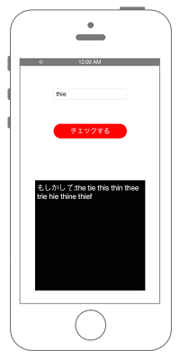

# UITextCheckerでスペルチェック




```swift fct_label="Swift 5.x"
//
//  ViewController.swift
//  UIKit063
//

import UIKit

class ViewController: UIViewController, UITextFieldDelegate {

    var myTextField: UITextField!
    var suggestTextField : UITextView!

    override func viewDidLoad() {
        super.viewDidLoad()

        // Buttonを生成.
        let myButton = UIButton()
        myButton.frame = CGRect(x: 0, y: 0, width: 200, height: 40)
        myButton.backgroundColor = UIColor.red
        myButton.layer.masksToBounds = true
        myButton.setTitle("チェックする", for: UIControl.State.normal)
        myButton.setTitleColor(UIColor.white, for: UIControl.State.normal)
        myButton.setTitleColor(UIColor.black, for: UIControl.State.highlighted)
        myButton.layer.cornerRadius = 20.0
        myButton.layer.position = CGPoint(x: self.view.frame.width/2, y:200)
        myButton.addTarget(self, action: #selector(ViewController.onClickMyButton(sender:)), for: .touchUpInside)
        self.view.addSubview(myButton)

        // 候補用TextFieldを生成.
        suggestTextField = UITextView(frame: CGRect(x: 0, y: 0, width: 300, height: 250))
        suggestTextField.layer.position = CGPoint(x: self.view.frame.midX, y: self.view.frame.midY + 150)
        suggestTextField.backgroundColor = UIColor.black
        suggestTextField.textColor = UIColor.white
        suggestTextField.textAlignment = NSTextAlignment.left
        suggestTextField.text = "もしかして: "
        suggestTextField.font = UIFont.systemFont(ofSize: CGFloat(20))
        suggestTextField.isEditable = false
        self.view.addSubview(suggestTextField!)

        // スペル入力用UITextFieldを作成.
        myTextField = UITextField(frame: CGRect(x: 0,y: 0, width: 200, height: 30))
        myTextField.borderStyle = UITextField.BorderStyle.roundedRect
        myTextField.layer.position = CGPoint(x:self.view.bounds.width/2, y:100)
        self.view.addSubview(myTextField)
    }

    /*
     Buttonが押されたときに呼ばれるメソッド.
     */
    @objc func onClickMyButton(sender : UIButton){

        // スペルチェックを行う.
        suggestUpdate()
    }

    /*
     スペルチェックするメソッド.
     */
    func suggestUpdate(){

        // UITextCheckerの宣言.
        let checker : UITextChecker = UITextChecker()

        // textの文字数を取得.
        let length = myTextField.text?.count

        // スペルチェックをする範囲(0~入力された文字数)を指定.
        let checkRange: NSRange = NSMakeRange(0, length!)

        // 範囲の中から間違ったスペルの物を探す.
        let misspelledRange: NSRange = checker.rangeOfMisspelledWord(

            // チェックする文字を指定.
            in: myTextField.text!,

            // チェックする範囲を指定.
            range:checkRange,

            // 開始位置を範囲の先頭に指定.
            startingAt: checkRange.location,

            // 指定された範囲内にミスが見つからなくてもrangeの開始位置から探し始める.(falseならミスが見つからなかった末尾の位置を保持する)
            wrap: true,

            // 言語を英語に指定.
            language: "en_US")

        // スペルミスが見つかった場合.
        if misspelledRange.location != NSNotFound {

            // 正しいスペルの候補を取得.
            let candidateArray: NSArray = checker.guesses(

                // スペルミスがある範囲.
                forWordRange: misspelledRange,

                // スペルミスを含む文字(range内).
                in: myTextField.text!,

                // 言語を指定.
                language: "en_US")! as NSArray

            var str = "もしかして:\n"

            // 候補を配列から1つずつ取り出す.
            for text in candidateArray {
                str += (text as AnyObject).description!
                str += ", "
            }
            suggestTextField?.text = str
        }
    }
}
```

```swift fct_label="Swift 4.x"
//
//  ViewController.swift
//  swiftdocs
//
//  Created by Misato Morino on 2016/08/15.
//  Copyright © 2016年 Misato Morino. All rights reserved.
//

import UIKit

class ViewController: UIViewController, UITextFieldDelegate {
    
    var myTextField: UITextField!
    var suggestTextField : UITextView!
    
    override func viewDidLoad() {
        super.viewDidLoad()
        
        // Buttonを生成.
        let myButton = UIButton()
        myButton.frame = CGRect(x: 0, y: 0, width: 200, height: 40)
        myButton.backgroundColor = UIColor.red
        myButton.layer.masksToBounds = true
        myButton.setTitle("チェックする", for: UIControl.State.normal)
        myButton.setTitleColor(UIColor.white, for: UIControl.State.normal)
        myButton.setTitleColor(UIColor.black, for: UIControl.State.highlighted)
        myButton.layer.cornerRadius = 20.0
        myButton.layer.position = CGPoint(x: self.view.frame.width/2, y:200)
        myButton.addTarget(self, action: #selector(ViewController.onClickMyButton(sender:)), for: .touchUpInside)
        self.view.addSubview(myButton)
        
        // 候補用TextFieldを生成.
        suggestTextField = UITextView(frame: CGRect(x: 0, y: 0, width: 300, height: 250))
        suggestTextField.layer.position = CGPoint(x: self.view.frame.midX, y: self.view.frame.midY + 150)
        suggestTextField.backgroundColor = UIColor.black
        suggestTextField.textColor = UIColor.white
        suggestTextField.textAlignment = NSTextAlignment.left
        suggestTextField.text = "もしかして: "
        suggestTextField.font = UIFont.systemFont(ofSize: CGFloat(20))
        suggestTextField.isEditable = false
        self.view.addSubview(suggestTextField!)
        
        // スペル入力用UITextFieldを作成.
        myTextField = UITextField(frame: CGRect(x: 0,y: 0, width: 200, height: 30))
        myTextField.borderStyle = UITextField.BorderStyle.roundedRect
        myTextField.layer.position = CGPoint(x:self.view.bounds.width/2, y:100)
        self.view.addSubview(myTextField)
    }
    
    /*
     Buttonが押されたときに呼ばれるメソッド.
     */
    @objc func onClickMyButton(sender : UIButton){
        
        // スペルチェックを行う.
        suggestUpdate()
    }
    
    /*
     スペルチェックするメソッド.
     */
    func suggestUpdate(){
        
        // UITextCheckerの宣言.
        let checker : UITextChecker = UITextChecker()
        
        // textの文字数を取得.
        let length = myTextField.text?.characters.count
        
        // スペルチェックをする範囲(0~入力された文字数)を指定.
        let checkRange: NSRange = NSMakeRange(0, length!)
        
        // 範囲の中から間違ったスペルの物を探す.
        let misspelledRange: NSRange = checker.rangeOfMisspelledWord(
            
            // チェックする文字を指定.
            in: myTextField.text!,
            
            // チェックする範囲を指定.
            range:checkRange,
            
            // 開始位置を範囲の先頭に指定.
            startingAt: checkRange.location,
            
            // 指定された範囲内にミスが見つからなくてもrangeの開始位置から探し始める.(falseならミスが見つからなかった末尾の位置を保持する)
            wrap: true,
            
            // 言語を英語に指定.
            language: "en_US")
        
        // スペルミスが見つかった場合.
        if misspelledRange.location != NSNotFound {
            
            // 正しいスペルの候補を取得.
            let candidateArray: NSArray = checker.guesses(
                
                // スペルミスがある範囲.
                forWordRange: misspelledRange,
                
                // スペルミスを含む文字(range内).
                in: myTextField.text!,
                
                // 言語を指定.
                language: "en_US")! as NSArray
            
            var str = "もしかして:\n"
            
            // 候補を配列から1つずつ取り出す.
            for text in candidateArray {
                str += (text as AnyObject).description!
                str += ", "
            }
            suggestTextField?.text = str
        }
    }
}
```

```swift fct_label="Swift 3.x"
//
//  ViewController.swift
//  swiftdocs
//
//  Created by Misato Morino on 2016/08/15.
//  Copyright © 2016年 Misato Morino. All rights reserved.
//

import UIKit

class ViewController: UIViewController, UITextFieldDelegate {
    
    var myTextField: UITextField!
    var suggestTextField : UITextView!
    
    override func viewDidLoad() {
        super.viewDidLoad()
        
        // Buttonを生成.
        let myButton = UIButton()
        myButton.frame = CGRect(x: 0, y: 0, width: 200, height: 40)
        myButton.backgroundColor = UIColor.red
        myButton.layer.masksToBounds = true
        myButton.setTitle("チェックする", for: UIControlState.normal)
        myButton.setTitleColor(UIColor.white, for: UIControlState.normal)
        myButton.setTitleColor(UIColor.black, for: UIControlState.highlighted)
        myButton.layer.cornerRadius = 20.0
        myButton.layer.position = CGPoint(x: self.view.frame.width/2, y:200)
        myButton.addTarget(self, action: #selector(ViewController.onClickMyButton(sender:)), for: .touchUpInside)
        self.view.addSubview(myButton)
        
        // 候補用TextFieldを生成.
        suggestTextField = UITextView(frame: CGRect(x: 0, y: 0, width: 300, height: 250))
        suggestTextField.layer.position = CGPoint(x: self.view.frame.midX, y: self.view.frame.midY + 150)
        suggestTextField.backgroundColor = UIColor.black
        suggestTextField.textColor = UIColor.white
        suggestTextField.textAlignment = NSTextAlignment.left
        suggestTextField.text = "もしかして: "
        suggestTextField.font = UIFont.systemFont(ofSize: CGFloat(20))
        suggestTextField.isEditable = false
        self.view.addSubview(suggestTextField!)
        
        // スペル入力用UITextFieldを作成.
        myTextField = UITextField(frame: CGRect(x: 0,y: 0, width: 200, height: 30))
        myTextField.borderStyle = UITextBorderStyle.roundedRect
        myTextField.layer.position = CGPoint(x:self.view.bounds.width/2, y:100)
        self.view.addSubview(myTextField)
    }
    
    /*
     Buttonが押されたときに呼ばれるメソッド.
     */
    func onClickMyButton(sender : UIButton){
        
        // スペルチェックを行う.
        suggestUpdate()
    }
    
    /*
     スペルチェックするメソッド.
     */
    func suggestUpdate(){
        
        // UITextCheckerの宣言.
        let checker : UITextChecker = UITextChecker()
        
        // textの文字数を取得.
        let length = myTextField.text?.characters.count
        
        // スペルチェックをする範囲(0~入力された文字数)を指定.
        let checkRange: NSRange = NSMakeRange(0, length!)
        
        // 範囲の中から間違ったスペルの物を探す.
        let misspelledRange: NSRange = checker.rangeOfMisspelledWord(
            
            // チェックする文字を指定.
            in: myTextField.text!,
            
            // チェックする範囲を指定.
            range:checkRange,
            
            // 開始位置を範囲の先頭に指定.
            startingAt: checkRange.location,
            
            // 指定された範囲内にミスが見つからなくてもrangeの開始位置から探し始める.(falseならミスが見つからなかった末尾の位置を保持する)
            wrap: true,
            
            // 言語を英語に指定.
            language: "en_US")
        
        // スペルミスが見つかった場合.
        if misspelledRange.location != NSNotFound {
            
            // 正しいスペルの候補を取得.
            let candidateArray: NSArray = checker.guesses(
                
                // スペルミスがある範囲.
                forWordRange: misspelledRange,
                
                // スペルミスを含む文字(range内).
                in: myTextField.text!,
                
                // 言語を指定.
                language: "en_US")!
            
            var str = "もしかして:\n"
            
            // 候補を配列から1つずつ取り出す.
            for text in candidateArray {
                str += text.description!
                str += ", "
            }
            suggestTextField?.text = str
        }
    }
}
```

```swift fct_label="Swift 2.3"
//
//  ViewController.swift
//  swiftdocs
//
//  Created by Misato Morino on 2016/08/15.
//  Copyright © 2016年 Misato Morino. All rights reserved.
//

import UIKit

class ViewController: UIViewController, UITextFieldDelegate {
    
    var myTextField: UITextField!
    var suggestTextField : UITextView!
    
    override func viewDidLoad() {
        super.viewDidLoad()
        
        // Buttonを生成.
        let myButton = UIButton()
        myButton.frame = CGRectMake(0,0,200,40)
        myButton.backgroundColor = UIColor.redColor()
        myButton.layer.masksToBounds = true
        myButton.setTitle("チェックする", forState: UIControlState.Normal)
        myButton.setTitleColor(UIColor.whiteColor(), forState: UIControlState.Normal)
        myButton.setTitleColor(UIColor.blackColor(), forState: UIControlState.Highlighted)
        myButton.layer.cornerRadius = 20.0
        myButton.layer.position = CGPoint(x: self.view.frame.width/2, y:200)
        myButton.addTarget(self, action: #selector(ViewController.onClickMyButton(_:)), forControlEvents: .TouchUpInside)
        self.view.addSubview(myButton)
        
        // 候補用TextFieldを生成.
        suggestTextField = UITextView(frame: CGRectMake(0, 0, 300, 250))
        suggestTextField.layer.position = CGPointMake(self.view.frame.midX, self.view.frame.midY + 150)
        suggestTextField.backgroundColor = UIColor.blackColor()
        suggestTextField.textColor = UIColor.whiteColor()
        suggestTextField.textAlignment = NSTextAlignment.Left
        suggestTextField.text = "もしかして: "
        suggestTextField.font = UIFont.systemFontOfSize(CGFloat(20))
        suggestTextField.editable = false
        self.view.addSubview(suggestTextField!)
        
        // スペル入力用UITextFieldを作成.
        myTextField = UITextField(frame: CGRectMake(0,0,200,30))
        myTextField.borderStyle = UITextBorderStyle.RoundedRect
        myTextField.layer.position = CGPoint(x:self.view.bounds.width/2,y:100)
        self.view.addSubview(myTextField)
    }
    
    /*
     Buttonが押されたときに呼ばれるメソッド.
     */
    func onClickMyButton(sender : UIButton){
        
        // スペルチェックを行う.
        suggestUpdate()
    }
    
    /*
     スペルチェックするメソッド.
     */
    func suggestUpdate(){
        
        // UITextCheckerの宣言.
        let checker : UITextChecker = UITextChecker()
        
        // textの文字数を取得.
        let length = myTextField.text?.characters.count
        
        // スペルチェックをする範囲(0~入力された文字数)を指定.
        let checkRange: NSRange = NSMakeRange(0, length!)
        
        // 範囲の中から間違ったスペルの物を探す.
        let misspelledRange: NSRange = checker.rangeOfMisspelledWordInString(
            
            // チェックする文字を指定.
            myTextField.text!,
            
            // チェックする範囲を指定.
            range:checkRange,
            
            // 開始位置を範囲の先頭に指定.
            startingAt: checkRange.location,
            
            // 指定された範囲内にミスが見つからなくてもrangeの開始位置から探し始める.(falseならミスが見つからなかった末尾の位置を保持する)
            wrap: true,
            
            // 言語を英語に指定.
            language: "en_US")
        
        // スペルミスが見つかった場合.
        if misspelledRange.location != NSNotFound {
            
            // 正しいスペルの候補を取得.
            let candidateArray: NSArray = checker.guessesForWordRange(
                
                // スペルミスがある範囲.
                misspelledRange,
                
                // スペルミスを含む文字(range内).
                inString: myTextField.text!,
                
                // 言語を指定.
                language: "en_US")!
            
            var str = "もしかして:\n"
            
            // 候補を配列から1つずつ取り出す.
            for text in candidateArray {
                str += text.description!
                str += ", "
            }
            suggestTextField?.text = str
        }
    }
}
```

## 4.xと5.xの差分
* `String.characters` が廃止のため、文字数は `String.count` から取得するように変更

## 3.xと4.xの差分
* `UIControlState` が `UIControl.State` に変更
* `func onClickMyButton(sender : UIButton)` に `@objc` を追加
* `UITextBorderStyle` が `UITextField.BorderStyle` に変更
* `let candidateArray: NSArray = checker.guesses(forWordRange: misspelledRange, in: myTextField.text!, language: "en_US")!` が `let candidateArray: NSArray = checker.guesses(forWordRange: misspelledRange, in: myTextField.text!, language: "en_US")! as NSArray` に変更
* `text.description!` を `(text as AnyObject).description!` に変更

## 2.3と3.0の差分

* `rangeOfMisspelledWordInString` から `rangeOfMisspelledWord` に変更
* `guessesForWordRange` から `guesses` に変更

| 言語 | 言語コード | 
|:--|:--|
| 英語 / アメリカ | en_US |
| 英語 / カナダ | en_CA |
| デンマーク語 / デンマーク | da_DK |
| 英語 / インド | en_IN |
| オランダ語 / オランダ | nl_NL |
| 英語 / オーストラリア | en_AU |
| フランス語 / フランス | fr_FR |
| ポルトガル語 / ポルトガル | pt_PT |
| 英語 / イギリス | en_GB |
| カタロニア語 / スペイン | es_ES |
| スウェーデン語 / スウェーデン | sv_SE |
| ロシア語 / ロシア | ru_RU |
| ドイツ語 / ドイツ | de_DE |
| トルコ語 / トルコ | tr_TR |
| イタリア語 / イタリア | it_IT |
| ポルトガル語 / ブラジル | pt_BR |

## Reference

* UITextChecker
    * [https://developer.apple.com/reference/uikit/uitextchecker](https://developer.apple.com/reference/uikit/uitextchecker)
* UITextField
    * [https://developer.apple.com/reference/uikit/uitextfield](https://developer.apple.com/reference/uikit/uitextfield)
