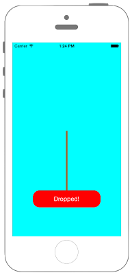

# UIViewにアタッチメントを適用させる



```swift fct_label="Swift 4.x"
//
//  ViewController.swift
//  UIKit064
//
//  Created by Misato Morino on 2016/08/15.
//  Copyright © 2016年 Misato Morino. All rights reserved.
//

import UIKit

class ViewController: UIViewController {
    
    // UIDynamicAnimatorのインスタンスを保存しなければアニメーションが実行されない.
    var animator : UIDynamicAnimator!
    
    var gravity : UIGravityBehavior!
    
    override func viewDidLoad() {
        
        super.viewDidLoad()
        
        self.view.backgroundColor = UIColor.cyan
        
        // Buttonを作成.
        let myButton = UIButton(frame: CGRect(x: 0, y: 0, width: 200, height: 50))
        myButton.layer.position = self.view.center
        myButton.layer.masksToBounds = true
        myButton.layer.cornerRadius = 20.0
        myButton.setTitleColor(UIColor.white, for: UIControl.State.normal)
        myButton.setTitleColor(UIColor.black, for: UIControl.State.highlighted)
        myButton.backgroundColor = UIColor.red
        myButton.setTitle("Dropped!", for: UIControl.State.normal)
        myButton.addTarget(self, action: #selector(ViewController.onClickMyButton(sender:)), for: UIControl.Event.touchUpInside)
        self.view.addSubview(myButton)
        
        // myButtonを繋ぐスプリングを作成.
        let springView = UIView(frame: CGRect(x: 0, y: 0, width: 5, height: 50))
        springView.layer.position = self.view.center
        springView.backgroundColor = UIColor.brown
        self.view.addSubview(springView)
        
        // UIDynamicAnimatorの生成とインスタンスの保存.
        animator = UIDynamicAnimator(referenceView: self.view)
        
        // 重力を生成してButtonに付随させる.
        gravity = UIGravityBehavior(items: [myButton])
        
        // アタッチを生成.
        let attach = UIAttachmentBehavior(item: myButton, attachedToAnchor: self.view.center)
        
        // 減衰値.
        attach.damping = 0.01
        
        // 振幅.
        attach.frequency = 1.0
        
        // ヒモの長さ.
        attach.length = 100
        
        // アニメーションが動いてる際に呼ばれるブロック文を設定.
        attach.action = {
            var rect = springView.frame
            rect.size.height = myButton.frame.origin.y - rect.origin.y
            springView.frame = rect
        }
        
        // UIDynamicAnimatorにアタッチを追加.
        animator.addBehavior(attach)
    }
    
    /*
     Buttonを押した時に呼ばれるメソッド.
     */
    @objc func onClickMyButton(sender : UIButton){
        
        // UIDynamicAnimatorに重力を追加.
        animator.addBehavior(gravity)
    }
    
}
```

```swift fct_label="Swift 3.x"
//
//  ViewController.swift
//  UIKit064
//
//  Created by Misato Morino on 2016/08/15.
//  Copyright © 2016年 Misato Morino. All rights reserved.
//

import UIKit

class ViewController: UIViewController {
    
    // UIDynamicAnimatorのインスタンスを保存しなければアニメーションが実行されない.
    var animator : UIDynamicAnimator!
    
    var gravity : UIGravityBehavior!
    
    override func viewDidLoad() {
        
        super.viewDidLoad()
        
        self.view.backgroundColor = UIColor.cyan
        
        // Buttonを作成.
        let myButton = UIButton(frame: CGRect(x: 0, y: 0, width: 200, height: 50))
        myButton.layer.position = self.view.center
        myButton.layer.masksToBounds = true
        myButton.layer.cornerRadius = 20.0
        myButton.setTitleColor(UIColor.white, for: UIControlState.normal)
        myButton.setTitleColor(UIColor.black, for: UIControlState.highlighted)
        myButton.backgroundColor = UIColor.red
        myButton.setTitle("Dropped!", for: UIControlState.normal)
        myButton.addTarget(self, action: #selector(ViewController.onClickMyButton(sender:)), for: UIControlEvents.touchUpInside)
        self.view.addSubview(myButton)
        
        // myButtonを繋ぐスプリングを作成.
        let springView = UIView(frame: CGRect(x: 0, y: 0, width: 5, height: 50))
        springView.layer.position = self.view.center
        springView.backgroundColor = UIColor.brown
        self.view.addSubview(springView)
        
        // UIDynamicAnimatorの生成とインスタンスの保存.
        animator = UIDynamicAnimator(referenceView: self.view)
        
        // 重力を生成してButtonに付随させる.
        gravity = UIGravityBehavior(items: [myButton])
        
        // アタッチを生成.
        let attach = UIAttachmentBehavior(item: myButton, attachedToAnchor: self.view.center)
        
        // 減衰値.
        attach.damping = 0.01
        
        // 振幅.
        attach.frequency = 1.0
        
        // ヒモの長さ.
        attach.length = 100
        
        // アニメーションが動いてる際に呼ばれるブロック文を設定.
        attach.action = {
            var rect = springView.frame
            rect.size.height = myButton.frame.origin.y - rect.origin.y
            springView.frame = rect
        }
        
        // UIDynamicAnimatorにアタッチを追加.
        animator.addBehavior(attach)
    }
    
    /*
     Buttonを押した時に呼ばれるメソッド.
     */
    func onClickMyButton(sender : UIButton){
        
        // UIDynamicAnimatorに重力を追加.
        animator.addBehavior(gravity)
    }
    
}

```

```swift fct_label="Swift 2.3"
//
//  ViewController.swift
//  UIKit064
//
//  Created by Misato Morino on 2016/08/15.
//  Copyright © 2016年 Misato Morino. All rights reserved.
//

import UIKit

class ViewController: UIViewController {
    
    // UIDynamicAnimatorのインスタンスを保存しなければアニメーションが実行されない.
    var animator : UIDynamicAnimator!
    
    var gravity : UIGravityBehavior!
    
    override func viewDidLoad() {
        
        super.viewDidLoad()
        
        self.view.backgroundColor = UIColor.cyanColor()
        
        // Buttonを作成.
        let myButton = UIButton(frame: CGRectMake(0, 0, 200, 50))
        myButton.layer.position = self.view.center
        myButton.layer.masksToBounds = true
        myButton.layer.cornerRadius = 20.0
        myButton.setTitleColor(UIColor.whiteColor(), forState: UIControlState.Normal)
        myButton.setTitleColor(UIColor.blackColor(), forState: UIControlState.Highlighted)
        myButton.backgroundColor = UIColor.redColor()
        myButton.setTitle("Dropped!", forState: UIControlState.Normal)
        myButton.addTarget(self, action: #selector(ViewController.onClickMyButton(_:)), forControlEvents: UIControlEvents.TouchUpInside)
        self.view.addSubview(myButton)
        
        // myButtonを繋ぐスプリングを作成.
        let springView = UIView(frame: CGRectMake(0, 0, 5, 50))
        springView.layer.position = self.view.center
        springView.backgroundColor = UIColor.brownColor()
        self.view.addSubview(springView)
        
        // UIDynamicAnimatorの生成とインスタンスの保存.
        animator = UIDynamicAnimator(referenceView: self.view)
        
        // 重力を生成してButtonに付随させる.
        gravity = UIGravityBehavior(items: [myButton])
        
        // アタッチを生成.
        let attach = UIAttachmentBehavior(item: myButton, attachedToAnchor: self.view.center)
        
        // 減衰値.
        attach.damping = 0.01
        
        // 振幅.
        attach.frequency = 1.0
        
        // ヒモの長さ.
        attach.length = 100
        
        // アニメーションが動いてる際に呼ばれるブロック文を設定.
        attach.action = {
            var rect = springView.frame
            rect.size.height = myButton.frame.origin.y - rect.origin.y
            springView.frame = rect
        }
        
        // UIDynamicAnimatorにアタッチを追加.
        animator.addBehavior(attach)
    }
    
    /*
     Buttonを押した時に呼ばれるメソッド.
     */
    func onClickMyButton(sender : UIButton){
        
        // UIDynamicAnimatorに重力を追加.
        animator.addBehavior(gravity)
    }
    
}
```

## 3.xと4.xの差分
* UIControlStateがUIControl.Stateに変更
* UIControlEventsがUIControl.Eventに変更
* func onClickMyButton(sender : UIButton)に@objcを追加

## 2.3と3.0の差分

* CGRectMakeが廃止

## Reference

* UIView
    * [https://developer.apple.com/reference/uikit/uiview](https://developer.apple.com/reference/uikit/uiview)
* UIGravityBehavior
    * [https://developer.apple.com/reference/uikit/uigravitybehavior](https://developer.apple.com/reference/uikit/uigravitybehavior)
* UIAttachmentBehavior
    * [https://developer.apple.com/reference/uikit/uiattachmentbehavior](https://developer.apple.com/reference/uikit/uiattachmentbehavior)
* UIDynamicAnimator
    * [https://developer.apple.com/reference/uikit/UIDynamicAnimator](https://developer.apple.com/reference/uikit/uidynamicanimator)
